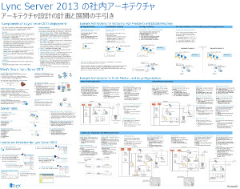
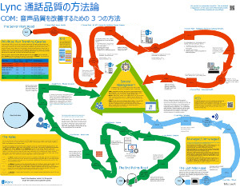
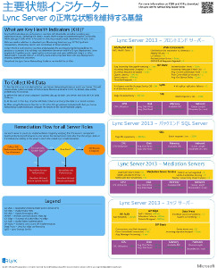
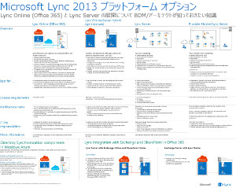
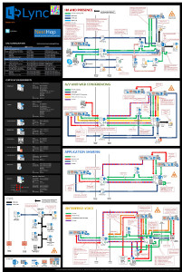

---
title: Lync Server 2013 の技術図面
TOCTitle: 技術図面
ms:assetid: 7b6da49b-ac72-4ab0-8957-166e330b38fa
ms:mtpsurl: https://technet.microsoft.com/ja-jp/library/Dn594589(v=OCS.15)
ms:contentKeyID: 61170920
ms.date: 12/10/2016
mtps_version: v=OCS.15
ms.translationtype: HT
---

# Lync Server 2013 の技術図面

 

_**トピックの最終更新日:** 2016-12-08_

**概要:** 次に示す各図は、Lync 2013 の推奨ソリューションを表します。

これらの図は Visio (.vsd) 形式 (Visio 2010 または Visio 2013) と PDF 形式で表示できます。印刷方法の詳細については、「ポスター印刷のヒント」を参照してください。

これらのファイルを表示するために、他のソフトウェアが必要になることがあります。詳細については、次の表を参照してください。

<table>
<colgroup>
<col style="width: 50%" />
<col style="width: 50%" />
</colgroup>
<thead>
<tr class="header">
<th>ファイルの種類</th>
<th>ソフトウェア</th>
</tr>
</thead>
<tbody>
<tr class="odd">
<td>
.vsd
</td>
<td>
Visio 2010、Visio 2013、または<a href="http://go.microsoft.com/fwlink/?linkid=393676">無料の Visio viewer</a>

Visio viewer を使用する場合は、VSD リンクを右クリックし、[<strong>対象をファイルに保存</strong>] をクリックしてファイルをコンピューターに保存し、コンピューター上でそのファイルを開きます。
</td>
</tr>
<tr class="even">
<td>
.pdf
</td>
<td>
任意の PDF ビューアー (<a href="http://go.microsoft.com/fwlink/?linkid=393675">Adobe Reader</a> など)
</td>
</tr>
<tr class="odd">
<td>
.zip
</td>
<td>
任意のファイル圧縮ユーティリティ。Windows 7 および 8 の場合は、ネイティブにサポートされています。
</td>
</tr>
</tbody>
</table>

## ポスター

これらのポスターは、それぞれ固有の技術エリアの詳細を示していて、TechNet の対応する記事やダウンロード センターで提供されるコンテンツとともに使用することが想定されています。

<table>
<colgroup>
<col style="width: 50%" />
<col style="width: 50%" />
</colgroup>
<thead>
<tr class="header">
<th>タイトル</th>
<th>説明</th>
</tr>
</thead>
<tbody>
<tr class="odd">
<td>
<strong>Lync Server 2013 の内部アーキテクチャ</strong>

<a href="http://go.microsoft.com/fwlink/?linkid=392974">Microsoft の Zoom.it でポスターを拡大表示する</a> (デスクトップまたはラップトップ コンピューターに最適)

<a href="http://go.microsoft.com/fwlink/?linkid=392578">PDF 形式</a> (モバイル デバイスまたはタブレット コンピューターに最適)

<a href="http://go.microsoft.com/fwlink/?linkid=392579">Visio 形式</a> (Visio ユーザーに最適)
</td>
<td>
このポスターは、計画と展開のためのアーキテクチャ面のガイドです。Lync Server の共通コンポーネントの情報、展開を計画するときに使用する用語、新機能、サーバー ロール、およびインストール概要について示します。さらに、可用性と障害復旧を高めたり、小規模、中規模、大規模トポロジのアーキテクチャの例も含まれます。

サイズ: 86.36 x 111.76 cm

このポスターは、Visio 2013 で作成されました。特定の環境に対する変更は必要ありません。
</td>
</tr>
<tr class="even">
<td>
<strong>Lync Call Quality Methodology (通話の品質保証の方法論)</strong>

<a href="http://go.microsoft.com/fwlink/?linkid=392972">Microsoft の Zoom.it でポスターを拡大表示する</a> (デスクトップまたはラップトップ コンピューターに最適)

<a href="http://go.microsoft.com/fwlink/?linkid=391841">Visio 形式と PDF 形式が入った .zip ファイルをダウンロードする</a>
</td>
<td>
このポスターは、Lync システムのトラブルシューティング (特にエンタープライズ VoIP の品質に影響する問題) について説明しています。次の記事と併せて利用してください。

<ul>
<li>
<a href="http://go.microsoft.com/fwlink/p/?linkid=390677">Lync Server ネットワーク ガイド (Lync Server Networking Guide)</a>
</li>
<li>
<a href="lync-server-2013-poster-lync-call-quality-methodology.md">Lync Call Quality Methodology (通話の品質保証の方法論)</a> (アクセシビリティの記事)
</li>
<li>
<a href="lync-server-2013-poster-key-health-indicators.md">主要状態インジケーター</a> (アクセシビリティの記事)
</li>
</ul>

サイズ: 86.36 x 111.76 cm

このポスターは、Visio 2010 で作成されました。特定の環境に対する変更は必要ありません。
</td>
</tr>
<tr class="odd">
<td>
<strong>主要状態インジケーター</strong>

<a href="http://go.microsoft.com/fwlink/?linkid=392971">Microsoft の Zoom.it でポスターを拡大表示する</a> (デスクトップまたはラップトップ コンピューターに最適)

<a href="http://go.microsoft.com/fwlink/?linkid=391838">Visio 形式と PDF 形式が入った .zip ファイルをダウンロードする</a>
</td>
<td>
このポスターは、サーバーのトラブルシューティング メトリックス (基本的なサーバーの状態と Lync 実装に含まれた特定のサーバーの役割の両方) について説明しています。次の記事と併せて利用してください。

<ul>
<li>
<a href="http://go.microsoft.com/fwlink/p/?linkid=390677">Lync Server ネットワーク ガイド (Lync Server Networking Guide)</a>
</li>
<li>
<a href="lync-server-2013-poster-lync-call-quality-methodology.md">Lync Call Quality Methodology (通話の品質保証の方法論)</a> (アクセシビリティの記事)
</li>
<li>
<a href="lync-server-2013-poster-key-health-indicators.md">主要状態インジケーター</a> (アクセシビリティの記事)
</li>
</ul>

サイズ: 43.18 x 55.88 cm

このポスターは、Visio 2010 で作成されました。特定の環境に対する変更は必要ありません。
</td>
</tr>
<tr class="even">
<td>
<strong>Lync 2013 のプラットフォーム オプション</strong>

<a href="http://go.microsoft.com/fwlink/p/?linkid=391840">Microsoft の Zoom.it でポスターを拡大表示する</a>

<a href="http://go.microsoft.com/fwlink/?linkid=391837">PDF 形式</a> (モバイル デバイスまたはタブレット コンピューターに最適)

<a href="http://go.microsoft.com/fwlink/?linkid=391839">Visio 形式</a> (Visio ユーザーに最適)
</td>
<td>
このポスターは、BDM および設計担当者が利用できる Lync 2013 のプラットフォーム オプションについて説明しています。ユーザーは、Lync Online with Office 365、ハイブリッド Lync、社内 Lync Server、Hosted Lync のいずれかを選べます。ポスターには、それぞれのアーキテクチャに最適なシナリオ、ライセンス要件、IT 担当者の役割など、各オプションの詳しい説明も含まれています。

サイズ: 86.36 x 111.76 cm

このポスターは、Visio 2013 で作成されました。特定の環境に対する変更は必要ありません。
</td>
</tr>
<tr class="odd">
<td>
<strong>Microsoft Lync Server 2013 プロトコルの負荷</strong>

<a href="http://go.microsoft.com/fwlink/p/?linkid=392970">Microsoft の Zoom.it でポスターを拡大表示する</a>

<a href="http://go.microsoft.com/fwlink/?linkid=392512">PDF 形式</a> (モバイル デバイスまたはタブレット コンピューターに最適)

<a href="http://go.microsoft.com/fwlink/?linkid=392513">Visio 形式</a> (Visio ユーザーに最適)
</td>
<td>
このポスターをダウンロードすると、Lync 2013、Lync Phone、Lync Web App、Lync for Mac、Lync Mobile の機能と要件が説明されています。Lync Server によって、組織全体の通信が実現することになります。

サイズ: 60.96 x 91.44 cm

このポスターは、Visio 2013 で作成されました。特定の環境に対する変更は必要ありません。
</td>
</tr>
</tbody>
</table>

## ポスター印刷のヒント

プロッターがある場合は、そのプロッターを使用するとそのままのサイズで印刷できます。プロッターがない場合は、次の手順に従って小さい用紙に印刷します。

**小さい用紙にポスターを印刷するには**

1.  Visio でポスターを開きます。

2.  \[**ファイル**\] メニューの \[**ページ設定**\] をクリックします。

3.  \[**プリンターの設定**\] タブの \[**プリンターの用紙**\] セクションで、印刷する用紙のサイズを選びます。

4.  \[**プリンターの設定**\] タブの \[**拡大縮小印刷**\] セクションで \[**自動調整 横**\] をクリックして、\[**1 枚 縦 1 枚**\] と入力します。

5.  \[**用紙サイズ**\] タブで \[**図面内容に合わせる**\] をクリックして、\[**OK**\] をクリックします。

6.  \[**ファイル**\] メニューの \[**印刷**\] をクリックします。

