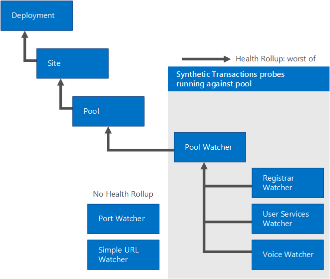

# SCOM 管理パックを使用して Skype for Business Server 2019 を管理する
 
**概要:** System Center Operations Manager と連携するように Skype for Business Server 2019 インフラストラクチャを構成する方法について説明します。
  
理想的な世界では、Skype for Business Server 2019 で問題が発生することはありませんでした。 ただし、Skype for Business Server は、ネットワーククラッシュやハードウェア障害などの外部要因によって影響を受ける可能性があります。 Skype for Business Server 2019 管理パックを使用すると、潜在的な問題を事前に特定して対処することができます。 このように、Skype for Business Server 2019 管理パックは System Center Operations Manager の機能を拡張します。
  
この情報は、Skype for Business Server 2019 通信ソフトウェアの監視パックのバージョン9319.0 に基づいて作成されています。
  
## 構成の概要

 System Center Operations Manager と連携するように Skype for Business Server 2019 インフラストラクチャを構成するには、次の3つの操作を行う必要があります。
  
プライマリ管理サーバーを識別し、[Configure the Primary Management Server](../../SfbServer/management-tools/use-scom-management-pack/configure-the-primary.md)。 これを行うには、System Center Operations Manager 2012 SP1 または R2 をインストールする必要があります。 
  
 [監視される Skype For Business Server コンピューターを](../../SfbServer/management-tools/use-scom-management-pack/configure-computers-to-monitor.md)特定して構成します。 System Center Operations Manager を使用して Skype for Business Server コンピューターを監視するには、System Center Operations Manager エージェントファイルをインストールし、各サーバーがプロキシとして動作するように構成する必要があります。 
  
 ウォッチャーノードを特定して、[インストールして構成](../../SfbServer/management-tools/use-scom-management-pack/watcher-nodes.md)します。 ウォッチャーノードは、Skype for Business Server の代理トランザクションを定期的に実行しているコンピューターです。 Windows PowerShell コマンドレットを使用すると、システムへのログオンやインスタント機能など、Skype for Business Server の主要なコンポーネントを確認することができます。メッセージは期待どおりに動作しています。 
  
## System Center Operations Manager ルート管理サーバーとエージェントのサポート

管理パックは、System Center Operations Manager 2007 R2 (64 ビット) (移行目的でのみサポートされます) または System Center Operations Manager 2012 SP1 &amp; R2 (64 ビット) と併用できます。 次の表は、Skype for Business Server 2019 の管理パックでサポートされている構成を示しています。 
  
|**構成**|**サポートされ?**|
|:-----|:-----|
|Windows Server 2008 R2 オペレーティング システム    Windows Server 2012 R2 オペレーティングシステム    |はい。 Skype for Business Server 2019 server と代理トランザクションウォッチャーノードの両方。    |
|クラスター化サーバー    |サポートされていません。    |
|エージェントレス監視    |サポートされていません。    |
|仮想環境    |あり。    |
|サーバーの役割「ドメインへの参加」    |すべての内部 Skype for Business Server 2019 サーバーの役割は、ドメインに参加している必要があります。    |
|サーバーの役割「スタンドアロン」    |Skype for Business Server 2019 Edge サーバーは、ドメインに参加する必要はありません。    |
|トポロジの制限事項    |展開のすべてのサーバーの役割は、同じ Operations Manager 管理グループから監視する必要があります。    |
|代理トランザクション監視ノード    |代理トランザクション監視ノードによる監視シナリオの可用性はサポートされています (追加の構成が必要です)。監視ノードは、ドメインへの参加である必要はありません。    |
   
次の表に、代理トランザクション監視ノードの容量とオペレーティング システムの要件を示します。
  
|**ハードウェア コンポーネント**|**最小要件**|
|:-----|:-----|
|CPU    |次のいずれかの要件:    2.33 GHz またはそれ以上の 64 ビット プロセッサ、クアッド コア    64 ビット 2 ウェイ プロセッサ、デュアル コア、2.33 GHz 以上    |
|メモリ    |8 GB    |
|オペレーティング システム    |Windows Server 2008 R2    Windows Server 2012 R2    |
|ネットワーク    |1 つのネットワーク アダプター (1 Gbps)    |
   
## 前提条件

代理トランザクション監視ノードを実行するには、まず、次をインストールする必要があります。
  
- System Center Operations Manager エージェント 
    
-  Microsoft .NET Framework 4.5
    
- Skype for Business Server core インストールファイル (OcsCore) と統合通信マネージ API (UCMA) (バージョンは Skype for Business Server WatcherNode バージョンと一致する必要があります)
    
## 監視パック内のファイル

Skype for Business Server 2019 の監視パックには、次のファイルが含まれています。
  
- Microsoft.LS.2019.Monitoring.ActiveMonitoring.mp
    
- Microsoft.LS.2019.Monitoring.ComponentAndUser.mp
    
- WatcherNode.msi
    
## 新機能

以下の機能は、Skype for Business Server 2019 管理パックの新機能です。

- **2019 年[9 月の更新プログラム](https://www.microsoft.com/download/details.aspx?id=57511)の変更点**一部の通知で特殊文字が削除されています。 特殊文字が SCOM コマンドチャネル通知機能に干渉している場合もあります。

- **クライアントサインインの自動検出**Skype for Business Server 2019 にサインインするクライアントアプリケーションは、サインインするために自動的にサーバーを検出します。 代理トランザクションは、自動検出が正しく構成されていることの確認をサポートするようになりました。
    
- カスタマイズされた**代理トランザクションの実行間隔**ウォッチャーノードのセットアッププロセスを簡単にするために、代理トランザクションはユーザーアカウントを共有できます。 これにより、テストがシリアル化されて競合を避けるためにテストが実行される頻度が遅くなります。 既定では、代理トランザクションは15分ごとに実行され、すべてのテストが実行されるようになります。 ユーザーごとに複数のユーザーを使用することを選択した場合、またはユーザーあたりのテスト数が少なくなると、実行の間隔も短縮されます。
    
- **ビデオ相互運用サービスの代理トランザクション**他のベンダーのソリューションから Skype for Business Server 2019 に移行しているお客様は、多くの場合、これらの他のベンダーからのビデオテレビ用デバイス (VTCs) を引き続き使用することを望んでいます。 ビデオ相互運用機能サーバーは、ユーザーがビデオ SIP トランク経由で Cisco CUCM に接続することにより、会議室で引き続き Cisco VTCs を使用できるようにする、新しい Skype for Business Server 2019 サーバーの役割です。 この機能は、ビデオ相互運用サーバーが起動していることを確認し、ビデオ SIP トランク経由の着信接続を処理できることを確認するための代理トランザクションも追加します。
    
- **アプリケーション共有会議代理トランザクション** アプリケーション共有会議のエンドツーエンド シナリオ検証がサポートされるようになりました。
    
## 監視シナリオ

Skype for Business Server 2019 管理パックは、問題を検出して診断するのに役立つさまざまな機能を利用します。 これらの機能により、Skype for Business Server 2019 環境の正常性をリアルタイムで確認できます。
  
|**監視シナリオ**|**説明**|
|:-----|:-----|
|代理トランザクション    | Windows PowerShell コマンドレットをテストして、サインイン、プレゼンス、IM、ユーザー用会議などのシナリオを高可用性で利用できるようにします。   代理トランザクションは、社内、社外、ブランチ オフィスなど、あらゆる地理的な場所から実行できます。    代理トランザクションが失敗したとき、失敗の正確な性質の特定に役立つ HTML ログが作成されます。これには、失敗したアクション、各アクションの待機時間、テストの実行に使用されたコマンド ライン、発生した具体的なエラーを把握することが含まれます。    |
|通話の信頼性のアラート    |Skype for Business Server 2019 サーバーによって書き込まれた通話の詳細レコード (CDRs) は、ユーザーが通話に接続できるかどうか、または通話が終了した理由を反映します。 通話の信頼性のアラートでは、CDR データベースに照会して、多数のユーザーでピアツーピア通話または基本的な会議機能に関して接続の問題が発生しているときに、それを示すアラートを作成します。    シナリオの対象範囲には、音声通話、ピアツーピア インスタント メッセージング (IM)、その他の会議機能が含まれます。    |
|メディア品質のアラート    |各通話の終了時に、Skype for Business Server 2019 クライアントによって公開された Quality of Experience (QoE) レポートを表示するデータベースクエリ。 これらのクエリは、通話中および電話会議中にメディア品質の低下が発生する可能性が非常に高い場合のシナリオに特化したアラートを作成します。 このデータは、パケットの待機時間や損失など、ユーザー エクスペリエンスの品質に直接影響する主要な指標に基づいて作成されます。    |
|コンポーネントの正常性のアラート    |個別のサーバー コンポーネントは、イベント ログやパフォーマンス カウンターを介してアラートを発生させて、ユーザー シナリオに重大な影響を与える可能性があるエラー状態を示します。これらのアラートは、サービスが実行されていない、エラー率が高い、メッセージの待機時間が大きい、接続性の問題など、さまざまな状態を示します。    |
|依存関係の正常性の監視    |Skype for Business Server は、さまざまな外部の理由で失敗する可能性があります。 管理パックでは、重大な問題になりうる重要な外部の依存関係について、データの監視と収集を行います。 これらの依存関係には、インターネットインフォメーションサービス (IIS) の可用性、および Skype for Business Server に使用されているサーバーの CPU が含まれます。    |
   
### アラートの優先度設定

アラートは、次のカテゴリに分類されます。 
  
 **優先度の高い警告:** これらのアラートは、大規模なユーザーグループのサービス停止の原因となっていて、すぐに対応する必要がある条件を示します。 代理トランザクションとオフラインサービス (Skype for Business Server の音声/ビデオ会議など) によって検出された停止は、優先度の高いアラートとして評価されます。 一方、1台のコンピューターでのコンポーネントの障害は、優先度の高いアラートではありません。 Skype for Business Server 2019 には、このような状況に対応する高可用性機能が組み込まれています。たとえば、複数のフロントエンドサーバーはロードバランサーの背後にあります。
  
 **中程度の優先度の警告:** このアラートは、ユーザーのサブセットに影響する条件、または通話品質の問題 (たとえば、コンポーネントの障害、通話の確立中の待ち時間、通話の音声品質の低下など) を示します。 このカテゴリの通知はステートフルです (つまり、ネットワーク接続の状態に応じてアラートの性質が変化します)。たとえば、発信時間を呼び出す場合は、待機時間を指定して、通常のしきい値に戻すと、System Center Operations Manager でこの Medium 優先度の警告が自動解決され、管理者がアクションを実行する必要はありません。 自動解決できないアラートは通常、その日のうちに管理者が対応します。
  
 **その他のアラート:** これらのアラートは、特定のユーザーまたは一部のユーザーに影響を与える可能性があるコンポーネントから生成されます。たとえば、よくあるアラートとしては、アドレス帳サービスがユーザー testuser@contoso.com の Active Directory® ドメイン サービス (AD DS) エントリを解析できない場合などです。管理者は、時間に余裕があるときにこれらのアラートに対応できます。
  
### 代理トランザクション

Skype for Business Server 2019 管理パックを使用すると、代理トランザクションを通じて通知の範囲を拡大できます。 代理トランザクションは、Operations Manager 管理パックに統合された Windows PowerShell コマンドレットであり、エンドツーエンドのユーザーシナリオをテストします。 合成トランザクションを実行するようにサーバーを指定すると、これらのコマンドレットは管理パックによって定期的にトリガーされます。 代理トランザクションによるエラーは、ステートフルアラートを生成します。 Skype for Business Server 2019 では、次のような代理トランザクションがサポートされています。
  
**登録、プレゼンス、連絡先に対してサポートされている代理トランザクション**

||||
|:-----|:-----|:-----|
|1    |登録 (ユーザー ログイン)    |利用可能な Lync Server 2010 以降    |
|両面    |アドレス帳サービス (ファイル ダウンロード)    |利用可能な Lync Server 2010 以降    |
|3    |アドレス帳 Web クエリ    |利用可能な Lync Server 2010 以降    |
|4    |プレゼンス    |利用可能な Lync Server 2010 以降    |
|5    |ユニファイド連絡先の保存    |利用可能な Lync Server 2013 以降    |
   
**ピアツーピア サービスに対してサポートされている代理トランザクション**

||||
|:-----|:-----|:-----|
|6    |ピアツーピア インスタント メッセージング    |Lync Server 2010 以降で利用可能    |
|7    |ピアツーピア音声/ビデオ    |Lync Server 2010 以降で利用可能    |
|個    |MCX ピアツーピア インスタント メッセージ (モバイル)    |Lync Server 2010 の2011年9月リリースの Skype for Business 2019 で利用可能    |
 
> [!NOTE]
> Skype for Business Server 2019 では、従来のモバイルクライアントに対する MCX (モバイルサービス) のサポートは利用できなくなりました。 現在のすべての Skype for Business のモバイルクライアントでは、インスタントメッセージング (IM)、プレゼンス、連絡先をサポートするために、既にユニファイドコミュニケーション Web API (UCWA) を使用しています。 MCX を使用するレガシクライアントを使っているユーザーは、現在のクライアントにアップグレードする必要があります。
  
**電話会議と常設チャットに対してサポートされている代理トランザクション**

||||
|:-----|:-----|:-----|
|ファイブ    |音声ビデオ会議    |Lync Server 2010 以降で利用可能    |
|常用    |データ会議    |Lync Server 2013 以降で利用可能    |
|折り    |インスタント メッセージ電話会議    |Lync Server 2010 以降で利用可能    |
|以内    | 常設チャット   |Lync Server 2013 以降で利用可能    |
|14    |Join Launcher (予定された会議)    |Lync Server 2013 以降で利用可能    |
|14    |ダイヤルイン会議    |Skype for Business Server 2015 以降で利用可能   |
|マート    |アプリケーション共有会議    |Skype for Business Server 2015 以降で利用可能   |
|16    |UCWA 会議 (Web 会議参加)    |Skype for Business Server 2015 以降で利用可能   |
   
**ネットワークとパートナーの依存関係に対してサポートされている代理トランザクション**

||||
|:-----|:-----|:-----|
|18    |音声ビデオ エッジ接続    |Lync Server 2013 以降で利用可能    |
|才    |音声ビデオ エッジ接続 Exchange ユニファイド メッセージング接続 (ボイスメール)    |Lync Server 2013 以降で利用可能    |
|#    |PSTN ピアツーピア通話    |Lync Server 2010 以降で利用可能    |
|超える    |XMPP インスタント メッセージング (フェデレーション)    |Lync Server 2013 以降で利用可能    |
|2004    |ビデオ相互運用サーバー    |Skype for Business Server 2015 以降で利用可能    |
   
## 正常性がまとめられる方法

次の表は、Skype for Business Server monitoring pack のオブジェクトの正常性状態を示しています。
  
|**管理パックのオブジェクト**|**説明**|
|:-----|:-----|
|Skype for Business Server の展開    |組織内の Skype for Business Server 2019 の展開を表します。    |
|Skype for Business Server サイト    |サービスが展開されるさまざまな地理的場所を表します。    |
|Skype for Business Server プール    |インスタント メッセージング、電話会議など、通信サービスをユーザーに提供する (サイト内の) プールです。特定のプールにマシンが 1 台しかない場合も、フロントエンド プール、エッジ プール、ディレクター プールに適用できます。    |
|Skype for Business Server の役割    |Skype for Business Server サービスをホストしているサーバーの役割。    |
|Skype for Business Server サービス    |特定のマシンに展開されている機能 (たとえば、fp01.contoso.com 上のユーザー サービスなど) を表します。    |
|Skype for Business Server コンポーネント    |サービスのコンポーネントです (たとえば、アドレス帳ダウンロード コンポーネントは Web サービスの一部です)。    |
|Skype for Business Server プールウォッチャー    |1 つのプールに対して実行されている代理トランザクションのインスタンスです。    |
|Skype for Business Server レジストラーウォッチャー    |1 つの Registrar プールに対して実行される代理トランザクションのインスタンスです。    |
|Skype for Business Server ユーザーサービスプールウォッチャー    |1 つの User Services プールに対して実行される代理トランザクションのインスタンスです。    |
|Skype for Business Server ボイスプールウォッチャー    |1 つの Voice プールに対して実行される代理トランザクションのインスタンスです。    |
|Skype for Business Server のポートウォッチャー    |1 つのプールに対して実行されているポート チェックのインスタンスです。    |
|簡易 URL ウォッチャー    |展開で構成されている簡易 URL の HTTPS 調査を実行します。    |
   

  
Skype for Business Server プールには、複数の個別の Skype for business Server システム (複数の Skype for Business Server の役割、Skype for business Server サービス、Skype for Business Server コンポーネントを含む) を含めることができます。 このため、同じプール内の他のサーバーがアプリケーションサービスをクライアントに提供できるため、個々のサーバーまたはコンポーネントの障害は、Skype for Business Server プールの全体的な正常性にとって重要ではありません。 正常性は、Skype for Business Server プールにパーセンテージレベルでロールアップされます。 
  
Skype for Business Server プールウォッチャーは、Skype for Business Server プールに対して代理トランザクションを実行します。 1 つ以上の代理トランザクション (連続ポーリング間隔として知られるプロセス) が連続して失敗すると、次の図に示すように、重要という正常性の状態をプール レベル (あらゆる代理トランザクションのうち、最悪のもの) までまとめられます。 
  

  
## ベスト プラクティス: カスタマイズ用の管理パックを作成する

既定では、Operations Manager は既定の管理パックへの上書きなど、すべてのカスタマイズを保存します。ベスト プラクティスとして、カスタマイズする封印された管理パックごとに別個の管理パックを作成することをお勧めします。 
  
封印された管理パックのカスタマイズされた設定を保存するための管理パックを作成する場合は、「Skype for Business Server 2019 のカスタマイズ」などの新しい管理パックに適切な名前を付けることをお勧めします。
  
封印された各管理パックのカスタマイズを格納するための新しい管理パックを作成すると、テスト環境からカスタマイズを運用環境にエクスポートすることが容易になります。これにより、管理パックを削除することも容易になります。管理パックを削除するには、依存関係を削除する必要があるためです。すべての管理パックのカスタマイズが既定の管理パックに保存され、1 つの管理パックを削除する必要がある場合は、まず、既定の管理パックを削除する必要があります。この操作により、他の管理パックへのカスタマイズも削除されます。 
  
## リンク

次のリンクにより、System Center 2012 監視パックに関連する一般的な作業に関する情報に接続できます。
  
- [管理パックのライフサイクル](https://technet.microsoft.com/en-us/library/hh212732.aspx)
    
- [Operations Manager 2012 で管理パックをインポートする方法](https://technet.microsoft.com/en-us/library/hh212691.aspx)
    
- [ルールまたはモニターを上書きする方法](https://technet.microsoft.com/en-us/library/hh212869.aspx)
    
- [Operations Manager 2012 で実行アカウントを作成する方法](https://technet.microsoft.com/en-us/library/hh321655.aspx)
    
- [実行アカウントとプロファイルの管理](https://technet.microsoft.com/en-us/library/hh212714.aspx)
    
- [Operations Manager 管理パックをエクスポートする方法](https://technet.microsoft.com/en-us/library/hh320149.aspx)
    
- [Operations Manager 管理パックを削除する方法](https://technet.microsoft.com/en-us/library/hh230746.aspx)
    
次のリンクにより、System Center 2007 監視パックに関連する一般的な作業に関する情報に接続できます。
  
- [管理パックのライフサイクルを管理する](https://go.microsoft.com/fwlink/p/?LinkId=211463)
    
- [Operations Manager 2007 で管理パックをインポートする方法](https://go.microsoft.com/fwlink/p/?LinkID=142351)
    
- [上書きを使って監視する方法](https://go.microsoft.com/fwlink/p/?LinkID=117777)
    
- [Operations Manager 2007 で実行アカウントを作成する方法](https://go.microsoft.com/fwlink/p/?LinkID=165410)
    
- [既存の実行プロファイルを変更する方法](https://go.microsoft.com/fwlink/p/?LinkID=165412)
    
- [管理パックのカスタマイズをエクスポートする方法](https://go.microsoft.com/fwlink/p/?LinkId=209940)
    
- [管理パックを削除する方法](https://go.microsoft.com/fwlink/p/?LinkId=209941)
    
Operations Manager と監視パックに関する質問については、 [System Center Operations manager コミュニティフォーラム](https://go.microsoft.com/fwlink/p/?LinkID=179635)をご覧ください。
  
リソースとしては、 [System Center Operations Manager の Unleashed](https://opsmgrunleashed.wordpress.com/)ブログがあります。これには、特定の監視パックの "サンプル" の投稿が含まれています。
  
Operations Manager の追加情報については、次のブログを参照してください。 
  
- [Operations Manager チームブログ](https://blogs.technet.com/momteam/default.aspx)
    
- [加山 Holman の OpsMgr ブログ](https://blogs.technet.com/kevinholman/default.aspx)
    
- [OpsMgr でのご意見](https://thoughtsonopsmgr.blogspot.com/)
    
- [Raphael のギザギザのブログ](https://rburri.wordpress.com/)
    
- [BWren の管理スペース](https://blogs.technet.com/brianwren/default.aspx)
    
- [Ops マネージャー + +](https://blogs.msdn.com/boris_yanushpolsky/default.aspx)
    
> [!IMPORTANT]
> Microsoft 以外のサイトにあるすべての情報とコンテンツは、Web サイトの所有者またはユーザーによって提供されています。Microsoft は、この Web サイトの情報に関して明示的、暗黙的、法的な保証を一切行いません。 
  
## 関連項目

[Skype for Business Server 2019 管理ツール](../management-tools-2019.md)
