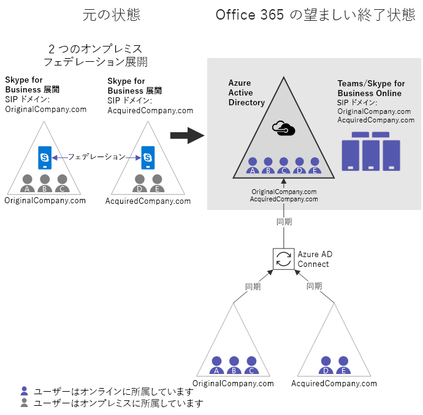

# Teams と Skype for Business のクラウド統合

多くの大企業では、複数のオンプレミスの AD フォレストを使用しており、場合によっては複数の Exchange または Skype for Business Server (または Lync Server) の展開があります。 また、社内フォレストが1つしかない組織でも、ビジネス合併や買収によって同じような状況で検索されることがあります。 これらのお客様はクラウドに移行する際に、特定の社内ワークロードの複数のインスタンスを1つの Office 365 テナントに統合することを希望しています。 この記事では、Skype for business (または Lync) の複数のオンプレミス展開があり、Microsoft Teams や Skype for Business Online などの Microsoft クラウドに UC ワークロードを移行する必要がある組織の統合を実現する方法について説明します。

従来、このような状況では、最初に展開を統合してからクラウドに移行するためのガイダンスがありました。 これは依然として選択肢ですが、この記事では、複数の Skype for Business 展開を使用する組織がオンプレミスではなく1つの Office 365 テナントに一度に1つの展開を移行できるようにする新機能に基づくソリューションについて説明します。統合. この新しい機能を使用しても、Skype for Business Online および Microsoft Teams では、1つの Office 365 テナントでハイブリッドモードで複数の Skype for business/Lync フォレストがサポートされていないことに注意してください。 

> [!Important]
> このガイドを構成に使用する前に、組織に影響を与える可能性がある[制限事項](#limitations)を確認し、理解しておいてください。

## クラウド統合の概要

次に示す主要な要件が満たされている場合は、複数の Skype for Business 展開がある組織では、オンプレミスのすべてのユーザーを1つの Office 365 テナントのクラウドに統合することができます。

- 少なくとも1つの Office 365 テナントが参加している必要があります。 複数の Office 365 テナントを使用するシナリオでの統合はサポートされていません。
- 任意の時点で、オンプレミスの Skype for Business フォレストは1つだけ、ハイブリッドモード (共有 SIP アドレススペース) にすることができます。 その他のオンプレミスの Skype for Business フォレストは、オンプレミスのままにしておく必要があります (場合によっては相互にフェデレーションが可能な場合があります)。 このような他のオンプレミスの組織では、2018年12月から利用可能な[オンライン SIP ドメインを無効にする新機能](https://docs.microsoft.com/en-us/powershell/module/skype/disable-csonlinesipdomain?view=skype-ps)が必要な場合に、AAD に同期する*ことができ*ます。

複数のフォレストに Skype for Business を展開しているお客様は、共有 SIP アドレススペース機能を使用して、単一のハイブリッド Skype for Business フォレストのすべてのユーザーを Office 365 テナントに完全に移行する必要があります。その場合は、それを使用してハイブリッドを無効にします。オンプレミス展開では、次のオンプレミスの Skype for Business 展開を移行する前に、に移動します。 クラウドに移行する前に、オンプレミスのユーザーは、同じユーザーのオンプレミスのディレクトリに表示されていないすべてのユーザーと共にフェデレーション状態のままになります。  

## クラウド統合の標準例

Microsoft Teams または Skype for Business Online でそれらをオンラインで統合するために、Skype for Business の2つの独立したフェデレーション展開を持つ組織を考えてみてください。

|元の状態の詳細 |目的の状態の詳細 |
|---------|---------|
|<ul><li>独立した AD フォレストにおける2つの独立した Skype for Business のオンプレミス展開<li>少なくとも1つのフォレストが Skype for Business Online とハイブリッドにある <li> Orgs は相互にフェデレーションされています。 <li>ユーザーがこれらのフォレスト間で同期されない<li> この組織には、Office 365 テナントがあり、ディレクトリを Azure AD に同期している可能性があります</ul>|<ul> <li>1 Office 365 テナント<li>オンプレミスの展開はないため、ハイブリッドは残されていません<li>オンプレミスのすべてのユーザーが Skype for Business Online に所属しており、必要に応じて Teams 専用ユーザーになる場合もあります。 <li>オンプレミスの Skype for Business anywhere の設置型なし <li>ユーザーがまだオンプレミス認証を行っている</ul> |

  

元の状態から目的の終了状態になる基本的な手順は次のとおりです。  組織によっては、これらの手順の途中で開始点が表示されている場合がありますのでご注意ください。 この記事の後半にある[その他の出発点](#other-starting-points)を参照してください。 最後に、必要に応じて順序を調整できる場合もあります。 [キー制約と制限](#limitations)については、後で説明します。

1.  まだ存在しない場合は、Office 365 テナントを取得します。
2.  両方のオンプレミス展開間のすべての関連する SIP ドメインが、検証された Office 365 ドメインであることを確認してください。
3.  Office 365 とハイブリッドになる Skype for Business の展開を1つ選びます。 この例では、OriginalCompany を使用します。com。
4.  最初にハイブリッドになる[フォレストに対して AAD Connect を有効に](configure-azure-ad-connect.md)します (originalcompany。com)。 
5.  組織に Teams を導入する場合は、テナント全体のポリシーを SfbwithteamsTeamsUpgradePolicy Ab に設定するか、または他の SfB モード (SfBOnly または SfBWithTeamsCollabAndMeetings) のいずれかに設定します。  これは、オンプレミスのユーザーにのみ Teams に移動するユーザーから通話とチャットをルーティングできるようにするために重要です。
6.  この時点で推奨されています (手順11まではまだ必要ではありません)。他のフォレスト (AcquiredCompany)[に対して AAD Connect を有効](cloud-consolidation-aad-connect.md)にします。com)。 両方のフォレストで AAD Connect が有効になっていると仮定すると、組織は**[図 A](#figure-a)** のように見えます。これは、一部のフォレストで共通の開始点となる場合があります。 
7.  他の社内展開によってホストされているすべての SIP ドメイン (この場合は AcquiredCompany。com) で、PowerShell で使用して`Disable-CsOnlineSipDomain` 、 [Skype for business Online でこれらの SIP ドメインを無効に](https://docs.microsoft.com/en-us/powershell/module/skype/disable-csonlinesipdomain)します。 (これは、2018年12月の新機能です。)
8.  OriginalCompany 用の[Skype For business ハイブリッドを構成](configure-federation-with-skype-for-business-online.md)します。com (オンライン SIP ドメインがまだ有効になっている1つの展開)。
9.  ハイブリッド展開 (OriginalCompany。com) を使用して、[社内の skype For business からクラウドへのユーザーの移動](move-users-between-on-premises-and-cloud.md)を開始します (Teams のみかどうかにかかわらず)。このアカウントが Skype For business Online に所属するようにします。 これで、組織は**[図 B](#figure-b)** のように見えます。図 A の主要な変更点は次のとおりです。
    - 両方のオンプレミスディレクトリのユーザーが AAD に含まれるようになりました。
    - AcquiredCompany.com は、無効にされたオンライン SIP ドメインです。
    - 一部のユーザーは、オンラインで Skype for Business Online または Teams に移動されています。 (紫色のユーザー A を参照)。
10. すべてのユーザーをクラウドに移動したら、[OriginalCompany] の[Skype For business オンプレミス展開でハイブリッドを無効](cloud-consolidation-disabling-hybrid.md)にします。Office 365 からの com:  
    - Office 365 テナントの分割ドメインを無効にします。
    - OriginalCompany で Office 365 と通信する機能を無効にします。オンプレミスの com。
    - OriginalCompany の DNS レコードを更新します。Office 365 を指す com。
11. まだ完了していない場合は、ハイブリッド (AcquiredCompany に移行する[次のフォレストに対して AAD Connect を有効](cloud-consolidation-aad-connect.md)にします。com)。 この時点では、組織は**[図 C](#figure-c)** のように見えます。組織によっては、これが別の一般的な開始点になることがあります。 
12. PowerShell で、ハイブリッド (AcquiredCompany) になる[次の社内展開の SIP ドメインを有効に](https://docs.microsoft.com/en-us/powershell/module/skype/enable-csonlinesipdomain?view=skype-ps)します。com。 これはを使用`Enable-CsOnlineSipDomain`して行われます。これは、2018年12月から利用可能な新機能です。
13. 閉じられたフェデレーションを使用している場合は、純粋なオンラインテナントのすべての SIP ドメイン (microsoftonline.com を除く) を**同じ**Office 365 の許可されたドメインとして追加する必要があります。 変更が反映されるまでには時間がかかることがあります。これを早い段階で実行することには害がありますので、手順14に進む前にこの点を確認することをお勧めします。
14. オンプレミスの環境を更新して、オンラインテナントからすべての SIP ドメインを受け入れ、それらが一致するようにします。
    - [すべてのエッジ証明書の SAN](cloud-consolidation-edge-certificates.md)を以前と同じ値に更新します。また、既存のオンライン SIP ドメイン (microsoftonline.com を除く) の値も指定します。この場合は、この例では sip-pstn を使用します。com。
    - OriginalCompany をご確認ください。com は、オンプレミス展開の AcquiredCompany で[許可さ](https://docs.microsoft.com/en-us/powershell/module/skype/new-csalloweddomain)れているドメインです。 許可されたドメインを追加します。
15. オンプレミスの AcquiredCompany 間で[Skype For business ハイブリッドを有効に](configure-federation-with-skype-for-business-online.md)します。com とクラウド。
16. 必要に応じて、[ユーザーをオンプレミスからクラウドに移行](move-users-between-on-premises-and-cloud.md)します。 ユーザーを直接[Teamsonly](/microsoftteams/teams-and-skypeforbusiness-coexistence-and-interoperability)モードに移行することも、初めて Skype For business Online に移行することもできます。 この状態では、組織は**[図 D](#figure-d)** のように見えます。
17. すべてのユーザーを移行したら、[オンプレミス環境でハイブリッドを無効](cloud-consolidation-disabling-hybrid.md)にして、*組織を純粋なクラウド*にします。

次の図は、このプロセスのさまざまな重要なポイントでの構成を示しています。

##### 図 A:

- 両方の組織が AAD Connect を使用して同期されるため、AAD は社内展開の両方からすべてのユーザーを持つようになります。
- オンプレミスに所属するすべてのユーザー。  
- Skype for Business ハイブリッドはまだ構成されて*いません*。
- いずれかの展開のユーザーが Teams を使用している場合は、互い (または組織) とのフェデレーションを行うことはできず、Skype for Business ユーザーとの相互運用性も得られません。 この段階では、チャネルのみに Teams を使用することをお勧めします。  
    

##### 図 B:

- AcquiredCompany.com は、[無効に](https://docs.microsoft.com/en-us/powershell/module/skype/disable-csonlinesipdomain)されたオンライン SIP ドメインです。 すべてのユーザーがオンプレミスになっています。 チームを使用している場合は、フェデレーションや相互運用性がありません。 この段階では、チャネルのみに Teams を使用することをお勧めします。
- オンプレミスの組織の1つで Skype for Business ハイブリッドが有効になっています。
- ハイブリッド組織の一部のユーザーがクラウドに移動されました (ユーザー A は紫色の網かけによって示されています)。 これらのユーザーは、Skype for Business Online ユーザーまたは Teams のみが完全な相互運用性とフェデレーションをサポートするユーザーになることができます。  
    

##### 図 C:

- OriginalCompany からのすべてのユーザー。現在、com はクラウド (Skype For business Online に所属) に配置されています。 また、チームのみにすることをお勧めします。
- OriginalCompany との Skype for Business のハイブリッド構成。com 展開は無効になっています。 オンプレミスの展開が失われました。
- AcquiredCompany の場合。以前は AAD との間で com を同期していなかったため、ここから続行するには、今すぐ同期する必要があります。 しかし、ハイブリッド (共有 SIP アドレス空間) ではなく、組織がハイブリッドに移行できるようになるまで、純粋な社内組織 (AcquiredCompany.com) のオンライン SIP ドメインは無効のままにし、オンライン Teams ユーザーが通信できるようにする必要があります。オンプレミスのユーザー。  
    

##### 図 D:

- AcquiredCompany.これで、com はオンライン SIP ドメインとして有効になりました。
- オンプレミスは、OriginalCompany を受け入れるように更新されます。com。 (許可されたドメインとエッジ証明書の両方が更新されます)。
- 共有 SIP アドレス空間が AcquiredCompany 間で有効になっている。Com および Office 365 テナント。
- ハイブリッド組織の一部のユーザーは、次のユーザー D (紫色の網かけで示される) などのクラウドに移動された可能性があります。  
    

## その他の開始点

上記の標準例の手順では、組織が Office 365 プレゼンスを持たない2つのフェデレーション社内展開で開始されると仮定しています。 ただし、組織によっては、既存の Office 365 のフットプリントが存在し、上記の順序に異なるエントリポイントが存在する場合があります。 次の4つの一般的な構成があります。

- Office 365 テナントを持たない複数のオンプレミスの組織。 この場合は、手順1から開始します。
- 複数の Skype for Business フォレストを1つの Azure AD テナントに既に同期している複数のオンプレミスの組織。 このような組織は、手順1-6 を完了し、手順7で開始する、図 A の仮想組織に似ています。
- 1つ以上の純粋な社内組織と対しされているハイブリッド組織で、AAD との同期は一切ありません。 このような組織は、次に示す**図 E**の架空の組織に似ています。
    - この組織は図 B と似ていますが、次の点を除き、手順1-9 を完了しています。
        - このハイブリッド Skype for Business 展開は、まだ Azure AD と同期し*ていません*。
        -  オンライン SIP ドメインはまだ無効になっていません。 
    - これらの組織は次のいずれかである必要があります。
        - 既存のハイブリッド組織の移行を完了し、手順10で上記の順序を入力します。  や
        - ハイブリッド組織の移行を完了する前に、他の Skype for Business フォレストを AAD に同期させる必要がある場合は、次の手順7を実行する必要があります (オンプレミスの Skype for Business 展開では、すべてのオンライン SIP ドメインを無効にする必要があります)。AAD に同期し、AAD 接続を有効にしてから、手順 10 (元のハイブリッド展開を使用停止) から続行します。       
                **図 E** 
                
- 純粋な Skype for Business Online 組織 (Teams を使用しているかもしれません) は、個別のオンプレミスの Skype for Business 組織と対ししています。 この組織がオンプレミスの組織のオンライン SIP ドメインを無効にして、オンプレミスの Skype for Business 組織の AAD 接続を有効にした場合、この組織は、完了した手順が含まれる、**[図 C](#figure-c)** に示されている仮想組織に似ています。1-11

## 制限事項

- 少なくとも1つの Office 365 テナントが参加している必要があります。 複数の Office 365 テナントを使用するシナリオでの統合はサポートされていません。
- 一度にハイブリッドモード (共有 SIP アドレススペース) にできるのは1つのオンプレミスの Skype for Business フォレストのみです。 他のすべてのオンプレミスの Skype for Business フォレストは、純粋にオンプレミスのままにしておく必要があり、Office 365 テナントと一緒にフェデレーションする必要があります。
- オンラインのすべてのユーザーがオンプレミスで表示されるわけではないため、クラウドに移行する前に、この展開のユーザーには非対称な環境があります。
    - この手順は、次のように合計できます。
        - ユーザーがハイブリッドであるかのように、オンラインになっているユーザーは、ハイブリッド環境でオンプレミスのユーザーと対話します。
        - ハイブリッド展開のオンプレミスのユーザーは、ハイブリッドであるかのようにオンプレミスのディレクトリに表示されているオンラインユーザーと対話します。 
        - ハイブリッド展開のオンプレミスのユーザーは、フェデレーションとしてオンプレミスの AD では表現されていないオンラインユーザーと対話します。
    - 上記の**[図 D](#figure-d)** では、ユーザー E は AcquiredCompany のオンプレミスです。com。  ユーザー E は、標準のハイブリッド操作を使用してユーザー D (ホームオンライン) と対話しますが、ユーザー E は社内ディレクトリに表示されないため、ユーザー E にはユーザー A、B、C とのフェデレーションの操作が行われます。 ただし、ユーザー A、B、および C は、ユーザーがハイブリッドであるかのように、ユーザー E と対話します。
    - ハイブリッドとフェデレーションの相互作用の影響:
        - ユーザーが連絡先としてマークされていない限り、フェデレーションユーザーに対してプレゼンスが自動的にサブスクライブされることはありません。
        - 着信の転送は、フェデレーションドメイン間では機能しません。
        - 通話転送のシナリオは、より制限されています。
        - フェデレーショントラフィックに調整を適用することができます。
- この非対称的な環境では、オンプレミスのユーザーとオンプレミスのディレクトリにないクラウドユーザーの間で、クロスプレミスのシナリオでの機能を公式にサポートすることはピアツーピアのみに制限されています。 
    - これらのユーザー間の通話転送、転送、通話キューなどはサポートされていません。
    - サポートされていない通話のシナリオは引き続き有効になっていますが、多くの場合、予期しない方法でエラーが発生します。 
    - 上記の**[図 D](#figure-d)** では、ユーザー E はオンプレミスで、ユーザー A、B、または C との通話はピアツーピアとしてのみサポートされます。 (ユーザー D を使用した通話では、サポートの制限はありません)。 ただし、オンプレミスのユーザー E をクラウドに移動した後は、この制限は適用されなくなります。
- ご使用の環境で Skype for Business Server 2019 の複数の展開を使用している場合は、その機能が Skype for Business Server のハイブリッド構成を必要とするため、組織の自動応答を使用するように構成できる展開は1つだけです。 
- 前の手順のいくつかは、順序を調整できます。 満たす必要のある主要な要件は、次のすべてに当てはまる場合です。
    - 1つの AAD テナントに同期する複数のオンプレミス Skype for Business フォレスト
    - 1つのオンプレミスフォレストで分割ドメインが有効になっている
    - ハイブリッド組織内の少なくとも1人のユーザーがクラウドに移行されている    その後、他のすべてのオンラインの SIP ドメインをその他のオンプレミスの Skype for Business フォレストから無効にする*必要があり*ます。 そうしないと、ハイブリッド組織のオンラインユーザーと他の組織のオンプレミスのユーザーとの間のフェデレーションは、一方向に中断されます。

## 関連

- 前述したように、高度な通話機能のサポートには制限があるため、組織では、**これらの非対称状態を移行の一部として一時的なものとして扱い、安定した状態とはしないようにする必要が**あります。  
- 複数のオンプレミスの Skype for Business 展開を行っている組織では、一般に、クラウドに完全に移行できる展開を開始する必要があります。これにより、統合を継続することができます。 場合によっては、Teams に移行することができない特定のユーザーグループの holdouts が存在する可能性があることを理解しています。 複数の Skype for Business フォレストに関連するシナリオでこのことを考慮する場合は、可能であれば、これらの制限がない別のフォレストとの移行を開始します。
- オンプレミスからクラウドに移行する場合、委任関係を持つ、または通常は着信転送シナリオに関係するユーザーは、1つの単位として一緒に移動する必要があります。

## TeamsOnly モードへの移行に関する考慮事項

オンプレミスからハイブリッド環境のクラウドにユーザーを移動する場合、そのユーザーを Skype for Business のみまたは TeamsOnly モードのいずれかに移動できます。 *ユーザーを TeamsOnly モードに移動することを計画している場合は、必ず最初にこのセクションをお読みください。*

- TeamsOnly モードをユーザーに割り当てると、他のユーザーからのすべてのチャットと通話が、そのユーザーの Teams クライアントに着陸されます。 
- TeamsOnly で Skype for Business を使用しているユーザー間でチャットや通話を適切にルーティングできるようにするには、オンプレミスのユーザーが島ではなく、SfB モードの1つを使用していることを確認する必要があります (既定では)。). 
    - これを行うには、最初に、*テナントの TeamsUpgradePolicy のグローバルインスタンスを次のいずれかの値に設定する必要があり*ます。
        - SfBWithTeamsCollab (推奨)
        - SfBWithTeamsCollabAndMeetings
        - SfBOnly
    - 次のコマンドを使用して、テナント全体のポリシーを付与できます。 `Grant-CsTeamsUpgradePolicy -PolicyName SfBWithTeamsCollab -Global`
    - 注: 現時点では、オンラインディレクトリに SIP アドレスを持たない個々のユーザーにポリシーを割り当てることはできないため、この操作はテナント全体のレベルで行う必要があります。 純粋なオンプレミス展開に対してオンライン SIP ドメインを無効にしても、それらのドメインのユーザーは、設計によってオンラインディレクトリに SIP アドレスを持っていません。 そのため、オンプレミスのユーザーにポリシーを適用する唯一の方法は、テナントレベルでの割り当てです。 一方、ハイブリッド展開では、ユーザーは、テナントのグローバルポリシーとは異なる値を持つ必要がある場合に、明示的にポリシーを割り当てることができるように、オンラインディレクトリに SIP アドレスがあります。
- Teams クライアント UX は、TeamsUpgradePolicy の SfB モードをまだ尊重していません。 たとえば、これらのモードでは、Teams での通話とチャットの開始は現在可能ですが、将来の場合はサポートされません。 これにより、状況に応じて、チームや場合によっては Skype for Business に返信することがある場合があるため、ユーザー間で混乱が生じることがあります。 まだオンプレミスのユーザーについては、TeamsMessagingPolicy および teamのスケールを使用して、通話とチャットを個別に無効にすることをお勧めします。

## 関連項目

[エッジ証明書を更新する](cloud-consolidation-edge-certificates.md)

[AAD Connect を更新して複数のフォレストを含める](cloud-consolidation-aad-connect.md)

[ハイブリッドを無効にしてクラウドへの移行を完了する](cloud-consolidation-disabling-hybrid.md)
