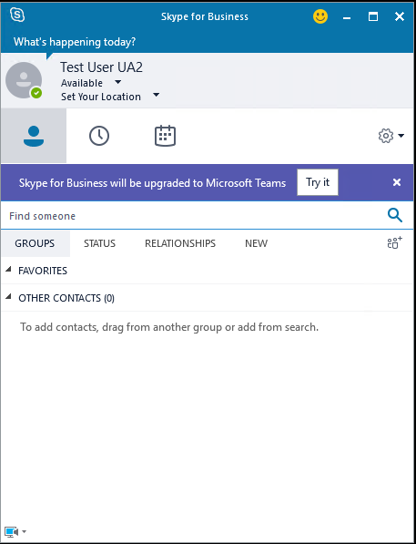

# <a name="move-users-from-on-premises-to-teams"></a>オンプレミスから Teams にユーザーを移動する

オンプレミスから Teams のみにユーザーを移動すると、ユーザーの Skype for Business ホームはオンプレミスからオンラインに移行され、ユーザーは TeamsUpgradePolicy を mode = TeamsOnly で割り当てられます。  オンプレミスから TeamsOnly モードにユーザーを移動した後:

- 他のユーザーからのすべての着信呼び出しとチャット (Skype for Business または Teams から送信された場合を除く) は、ユーザーの Teams クライアントに着陸します。
- ユーザーは、Skype for Business (オンラインまたはオンプレミス) を使用している他のユーザーと相互運用することができます。
- ユーザーは、フェデレーション組織のユーザーと通信できるようになります。
- そのユーザーによってスケジュールされた新しい会議は Teams 会議です。
- ユーザーは、引き続き Skype for Business 会議に参加できます。
- 今後予定されているユーザーの既存の会議は、オンプレミスから Teams に移行されます。
- 社内に存在していた連絡先は、ユーザーが初めてログオンした直後に Teams で利用できます。
- ユーザーは、Skype for business から通話やチャットを開始することはできません。また、Skype for Business で新しい会議をスケジュールすることもできません。 ユーザーが Skype for Business クライアントを開こうとすると、以下に示すように Teams を使用するようにリダイレクトされます。 Teams クライアントがインストールされていない場合は、ブラウザーを使用して、チームの web バージョンに転送されます。<br><br>
    

ユーザーを移動する前に、ユーザーをクラウドに移動するための [前提条件](move-users-between-on-premises-and-cloud.md#prerequisites) を確認してください。 また [、Teams と Skype For business を併用している組織の移行と相互運用性のガイダンス](/microsoftteams/migration-interop-guidance-for-teams-with-skype)を確認してください。


> [!NOTE]
> 連絡先を Teams に移行するには、オンプレミスの SfB アカウントで統合連絡先ストアを無効にする必要があります。


オンプレミスから Teams にユーザーを移動するには、次の2つの方法があります。

- Skype for Business Server 2015 CU8 より前のバージョンを使用している場合は、次の2つの手順を実行する必要があります (必要に応じて、1つの手順として一緒にスクリプトを作成することもできます)。
  - [ユーザーを skype For Business Server (オンプレミス) から skype for Business Online に移動](move-users-from-on-premises-to-skype-for-business-online.md)します。
  - ユーザーが Skype for Business Online に所属したら、user TeamsUpgradePolicy を mode = TeamsOnly として割り当てます。 TeamsOnly モードを許可するには、Skype for Business Online PowerShell ウィンドウから次のコマンドレットを実行します。 `Grant-CsTeamsUpgradePolicy -Identity $user -PolicyName UpgradeToTeams`
- Skype for Business Server 2015 CU8 以降の管理ツールがある場合は、上記の方法を使用することができます。または、次に示す手順でこの操作を実行することもできます。 また、必要に応じて Skype for business クライアントで通知を提供することもできます。これは、必要に応じて、Skype for business クライアントによって Teams クライアントが自動的にダウンロードされます。

## <a name="move-a-user-directly-from-skype-for-business-on-premises-to-teams-only"></a>オンプレミスの Skype for Business から Teams のみにユーザーを直接移動する

Skype for Business Server 2015 with CU8 および Skype for Business Server 2019 の社内管理ツールでは、以下に示すように、PowerShell または Skype for Business Server コントロールパネルの Move-CsUser コマンドレットを使用して、オンプレミスから Teams のみモードにユーザーを移行することができます。

### <a name="move-to-teams-using-move-csuser"></a>Move-CsUser を使用して Teams に移動する

Move-CsUser は、オンプレミスの Skype for Business 管理シェル PowerShell ウィンドウから使用できます。 以下の手順および必要なアクセス許可は、ユーザーを Skype for Business Online に移動する場合と同じですが、ユーザーには MoveToTeams スイッチも指定する必要があります。また、ユーザーにも (Skype for Business Online に加えて) Teams のライセンスが付与されていることを確認する必要があります。

[必要な管理者の資格情報](move-users-between-on-premises-and-cloud.md#required-administrative-credentials)で説明されているように、オンプレミス環境とクラウドサービス (Microsoft 365 または Office 365) の両方に十分な特権を持っている必要があります。 両方の環境で権限を持つ単一のアカウントを使用するか、オンプレミスの資格情報を使用してオンプレミスの Skype for Business Server 管理シェルウィンドウを開始することができます。また、パラメーターを使用して、 `-Credential` 必要な管理役割を持つ Microsoft 365 または Office 365 アカウントの資格情報を指定することもできます。

ユーザーを、CsUser を使用して Teams 専用モードに移行するには、次のようにします。

- パラメーターを使用して移動するユーザーを指定し `Identity` ます。
- 値が "sipfed <span> " の-Target パラメーターを指定します。com "。
- スイッチを指定し `MoveToTeams` ます。
- オンプレミスとクラウドサービス (Microsoft 365 または Office 365) の両方に十分な権限を持つアカウントがない場合は、パラメーターを使用して、 `-credential` Office 365 で十分な権限を持つアカウントを指定します。
- Microsoft 365 または Office 365 のアクセス許可を持つアカウントが "onmicrosoft" で終了していない場合。 <span>com "では、「 `-HostedMigrationOverrideUrl` [必要な管理者の資格情報](move-users-between-on-premises-and-cloud.md#required-administrative-credentials)」に説明されているように、適切な値を指定してパラメーターを指定する必要があります。

次のコマンドレットシーケンスを使用して、ユーザーを TeamsOnly に移動できます。また、Microsoft 365 または Office 365 の資格情報が別のアカウントであると想定し、Get-Credential プロンプトの入力として指定します。

  ```powershell
  $cred=Get-Credential
  $url="https://admin1a.online.lync.com/HostedMigration/hostedmigrationService.svc"
  Move-CsUser -Identity username@contoso.com -Target sipfed.online.lync.com -MoveToTeams -Credential $cred -HostedMigrationOverrideUrl $url
  ```

### <a name="move-to-teams-using-skype-for-business-server-control-panel"></a>Skype for Business Server コントロールパネルを使用して Teams に移動する

1. Skype for Business Server コントロールパネルアプリを開きます。
2. 左側のナビゲーションで、[ **ユーザー**] を選択します。
3. [ **検索** ] を使用して、Teams に移動するユーザーを検索します。
4. ユーザーを選択し、リストの上にある **アクション** ドロップダウンから、[ **選択したユーザーを Teams に移動**] を選択します。
5. ウィザードで、[ **次へ**] をクリックします。
6. メッセージが表示された場合は、onmicrosoft.com で終了し、十分な権限があるアカウントを使用して、Microsoft 365 または Office 365 にサインインします。
7. [ **次へ**] をクリックし、[ **次** へ] をもう一度クリックして、ユーザーを移動します。
8. 成功または失敗に関するステータスメッセージは、ウィザードではなく、メインコントロールパネルアプリの上部に表示されることに注意してください。

## <a name="notify-your-skype-for-business-on-premises-users-of-the-upcoming-move-to-teams"></a>今後 Teams に移行するために、Skype for Business のオンプレミスユーザーに通知する

Skype for business Server 2015 と CU8 のオンプレミスの管理ツール、および Skype for Business Server 2019 では、今後 Teams への移行の際に社内の Skype for Business ユーザーに通知することができます。 これらの通知を有効にすると、ユーザーには、次に示すように、Skype for Business クライアント (Win32、Mac、web、およびモバイル) に通知が表示されます。 ユーザーが [ **試す** ] ボタンをクリックすると、Teams クライアントがインストールされている場合は起動されます。そうしないと、ユーザーはブラウザー内の Teams の web バージョンに移動します。 既定では、通知が有効になっている場合、Win32 Skype for Business クライアントは、ユーザーを Teams のみモードに移行する前に、リッチクライアントが使用可能になるように Teams クライアントをダウンロードします。ただし、この動作を無効にすることもできます。  通知はの社内バージョンを使用して構成され、 `TeamsUpgradePolicy` Win32 クライアントのサイレントダウンロードは社内のコマンドレットによって制御され `TeamsUpgradeConfiguration` ます。

> [!TIP]
> CU8 を使用して Skype for Business 2015 で動作するために、一部のサーバーで再起動が必要になることがあります。



すぐに Teams にアップグレードすることをオンプレミスのユーザーに通知するには、NotifySfBUsers = true を使用して TeamsUpgradePolicy の新しいインスタンスを作成します。 そのポリシーをユーザーに直接割り当てるか、サイト、プール、またはグローバルレベルでポリシーを設定することによって、そのポリシーを通知するユーザーに割り当てます。 次のコマンドレットは、ユーザーレベルのポリシーを作成して付与します。

```powershell
New-CsTeamsUpgradePolicy -Identity EnableNotifications -NotifySfbUser $true
Grant-CsTeamsUpgradePolicy -Identity username@contoso.com -PolicyName EnableNotifications
```

Skype for Business Win32 クライアントを使用した Teams の自動ダウンロードは、TeamsUpgradeConfiguration コマンドレットで DownloadTeams パラメーターを使用して制御されます。 この構成は、グローバル、サイト、およびプールレベルで作成します。 たとえば、次のコマンドを実行すると、サイト Redmond1 というの構成が作成されます。

```powershell
New-CsTeamsUpgradeConfiguration -Identity "site:redmond1"
```

既定では、DownloadTeams の値は True です。ただし、指定されたユーザーの NotifySfbUser = True の場合に *のみ* 無視されます。

## <a name="see-also"></a>関連項目

[Move-CsUser](https://docs.microsoft.com/powershell/module/skype/move-csuser)

[CsTeamsUpgradePolicy](https://docs.microsoft.com/powershell/module/skype/grant-csteamsupgradepolicy
)

[Teams を Skype for Business と一緒に使用する組織向けの移行と相互運用に関するガイダンス](/microsoftteams/migration-interop-guidance-for-teams-with-skype)

[Skype for Business と共存する](/microsoftteams/coexistence-chat-calls-presence)
