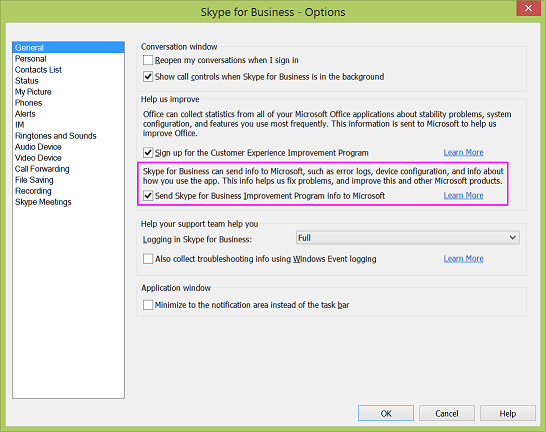

# Skype for Business と Microsoft Teams のデータ収集方法Skype for Business and Microsoft Teams data collection practices

ビジネス サーバー 2015 の Skype、Skype のビジネス、オンライン ビジネス、マイクロソフトのチームのアプリケーションの Skype とは、Microsoft がこれらの製品の使用方法と、サインインのエラーなど、エラーの種類が発生したを理解するためのデータを収集します。Skype for Business Server 2015, Skype for Business Online, along with Skype for Business and Microsoft Teams apps collect data to help Microsoft understand how these products are being used and what kinds of errors, such as sign-in errors, have occurred. Microsoft は、使用パターンの理解、将来の機能の計画、問題の領域のトラブルシューティングと修正のためにこれらの情報を活用できます。This information helps us understand usage patterns, plan new features, and troubleshoot and fix problem areas.
  
一部の使用データは自動的に収集されますが、管理者またはユーザーによって許可された場合にのみ収集できるデータもあります。収集されるデータは、次の 3 つのカテゴリに分類されます。While some usage data is collected automatically, other data can only be collected when the admin and/or user chooses to allow it. Data collection falls into these three categories:
  
- 全数調査データCensus data
    
- 使用状況データUsage data
    
- エラー報告データError reporting data
    
## 全数調査データCensus data

調査データは、提供、サポート、およびビジネス用の Skype を改善する目的でのみ取得されます。Census data is acquired solely to provide, support, and improve Skype for Business. マイクロソフトのチームと Skype ビジネスをオンラインにします。Microsoft Teams and Skype for Business Online. これには、デバイスとオペレーティング システムのバージョン、地域と言語の設定などの環境情報が含まれます。It includes environmental information such as device and operating system versions, and regional and language settings. サインイン試行と失敗のカウンターも含まれます。It also includes counters for sign-in attempts and failures. 次に、収集される全数調査データの具体例をいくつか示します。Here are some specific examples of the census data that's collected:

|**データ型****Data type**|**例****Example**|**メモ****Notes**|
|:-----|:-----|:-----|
|AppNameAppName    |iPhoneSkypeiPhoneSkype    ||
|DeviceModelDeviceModel    |iPhoneiPhone    ||
|OSNameOSName    |iPhoneiOSiPhoneiOS    ||
|OSVersionOSVersion    |8.38.3    ||
|例UserLanguage    |EN-USEN-US    ||
|ユーザー IdUserID    |E296D735-4F36-4E18-7C3B-52E1A02A0164E296D735-4F36-4E18-7C3B-52E1A02A0164    |ID は、2 回ハッシュされます (クライアントで 1 回、利用統計情報サービスでもう一回)。ハッシュによって、ID を特定のユーザーに結び付けることができなくなります。The ID is hashed twice: once on the client and again on the telemetry service. The hashing ensures the ID cannot be linked to a specific user.    |
|DeviceIDDeviceID    |5E872200-F546-4CCD-8F23-AF5F507AA2DD5E872200-F546-4CCD-8F23-AF5F507AA2DD    |デバイス ID は、デバイス上でランダムに生成される GUID であり、利用統計情報サービスに送信されます。The device ID is a GUID that's randomly generated once on the device and sent to the telemetry service.    |
   
全数調査データには、組織またはユーザーを特定できる情報は含まれていません。詳細については、「[Skype for Business のプライバシーに関する声明](https://www.microsoft.com/privacystatement/en-us/SkypeforBusiness/Default.aspx)」をご覧ください。Census data DOES NOT contain any information that identifies your organization or users. See the [Skype for Business Privacy Statement](https://www.microsoft.com/privacystatement/en-us/SkypeforBusiness/Default.aspx) for more information.
  
全数調査データは、既定でオンになり、管理者やエンド ユーザーがオフにすることはできません。Census data is on by default and cannot be turned off by admins or end users.
  
## 使用状況データUsage data

使用状況データには、発信した通話の回数、送受信した IM の数、参加した会議の数、機能を使用した頻度、安定性の問題などの情報が含まれます。Usage data includes information such as number of calls made, number of IMs sent or received, number of meetings joined, frequency of features used, and stability issues.
  
使用状況データには、contoso.com などの組織を特定できる情報が含まれる場合もあります。次に、収集される使用状況データの具体例をいくつか示します。Usage data might contain information that identifies your organization, such as contoso.com. Here are some specific examples of the usage data that's collected:
  
|**データ型****Data type**|**例****Example**|**メモ****Notes**|
|:-----|:-----|:-----|
|IM Sent (送信済み IM)IM Sent    |1212    ||
|IM Received (受信済み IM)IM Received    |55    ||
|Join a meeting (attempts) (会議への参加 (試行))Join a meeting (attempts)    |55    ||
|Join a meeting (success) (会議への参加 (成功))Join a meeting (success)    |44    ||
|Call/meeting minutes (通話/会議の時間)Call/meeting minutes    |30 mins (30 分)30 mins    ||
|FederationPartnerFederationPartner    |Microsoft.comMicrosoft.com    |これは、Office 365 に登録されている組織の名前で、テキスト形式で送信されるため暗号化されません。This is the name of the organization registered in Office 365 and is transmitted in cleartext, which means it's not obfuscated.    |
   
使用状況データには、ユーザーを特定できる情報は含まれていません。Usage data DOES NOT contain any information that identifies users.
  
使用状況データの収集は、既定でオンになりますが、オンプレミスの管理者が、Skype for Business Server 2015 の DisableAutomaticSendTracing グループ ポリシー設定を使用してオフにすることができます。この設定をオフにすると、組織のすべてのユーザーが影響を受けます。「[Skype for Business Server 2015 でのクライアント ブートストラップ ポリシーの構成](https://technet.microsoft.com/EN-US/library/gg425941.aspx)」を参照してください。Usage data collection is on by default, but on-premises admins can turn it off using the DisableAutomaticSendTracing Group Policy setting on Skype for Business Server 2015. Turning this setting off affects all users in the organization. See [Configure client bootstrapping policies in Skype for Business Server 2015](https://technet.microsoft.com/EN-US/library/gg425941.aspx) for more information.
  
エンド ユーザーは使用状況データの収集のオンとオフを切り替えることはできません。End users cannot turn usage data collection on or off.
  
Skype 会議アプリと Join Launcher Web ページでは、利用統計情報は次のポリシーによって制御されます。For Skype Meetings App and the join launcher web pages, the way to control telemetry is through this policy:
  
Set-CsWebServiceConfiguration -MeetingUxEnableTelemetry $TrueSet-CsWebServiceConfiguration -MeetingUxEnableTelemetry $True
  
このポリシーの既定値は False であるため、利用統計情報は既定では収集されません。この設定はプールごとに行われ、Skype 会議アプリを使用してそのサーバーでホストされる会議に接続するすべてのユーザーを制御します。This policy defaults to false, so telemetry collection is off by default. This setting is per-pool and controls all users who connect with Skype Meetings App to a meeting hosted on that server.
  
## エラー報告データError reporting data

エラー報告データには、パフォーマンスと信頼性、デバイスの構成、ネットワーク接続の品質、エラー コード、エラー ログ、例外などの情報が含まれることがあります。次に、収集されるエラー報告データの具体例をいくつか示します。Error reporting data can include information about performance and reliability, device configuration, network connection quality, error codes, error logs, and exceptions. Here are some specific examples of error reporting data that's collected:

|**データ型****Data type**|**例****Example**|**メモ****Notes**|
|:-----|:-----|:-----|
|Message direction (メッセージの方向)Message direction    |Incoming (受信)Incoming    ||
|Conversation state (会話の状態)Conversation state    |Idle (アイドル)Idle    ||
|Conversation thread ID (会話スレッド ID)Conversation thread ID    |AdDO8hsJqilU93hQHC3OZaPR2saEA = =AdDO8hsJqilU93hQHC3OZaPR2saEA==    ||
|ユーザー IdUserID    |amosmarbleamosmarble   |この ID はテキスト形式で送信され、利用統計情報サービスでハッシュされてから保存されます。The ID is sent in cleartext , which the telemetry service hashes before storing it    |
   
エラー報告データには、ユーザーの IP アドレスや SIP URI (Session Initiation Protocol Uniform Resource Identifier) などの個人を特定できる情報が含まれる場合もあります。収集されるデータの詳細な説明については、「[Skype for Business のプライバシーに関する声明](https://www.microsoft.com/privacystatement/en-us/SkypeforBusiness/Default.aspx)」を参照してください。Error reporting data may also contain personally identifiable information such as the user's IP address and Session Initiation Protocol Uniform Resource Identifier (SIP URI). See the [Skype for Business Privacy Statement](https://www.microsoft.com/privacystatement/en-us/SkypeforBusiness/Default.aspx) for a detailed explanation of what's collected.
  
エラー報告には次の 2 つが必要です。Error reporting requires two things:
  
- サーバーまたはテナント管理センターで DisableAutomaticSendTracing グループ ポリシー設定を False に設定する必要があります (これが既定の状態です)。詳細については、「[Skype for Business Server 2015 でのクライアント ブートストラップ ポリシーの構成](https://technet.microsoft.com/EN-US/library/gg425941.aspx)」を参照してください。The DisableAutomaticSendTracing Group Policy setting be set to False on the server or in the tenant admin center (this is the default state). See [Configure client bootstrapping policies in Skype for Business Server 2015](https://technet.microsoft.com/EN-US/library/gg425941.aspx) for more information.
    
- エンド ユーザーが Skype for Business クライアントの [全般] タブで個別に選択します (歯車アイコンをクリックすると、[オプション] ダイアログ ボックスに [全般] タブが表示されます)。End users individually opt in from the General tab (click the gear icon and the Option dialog opens with the General tab displayed) in the Skype for Business client.
    
     
  

  
Skype 会議アプリでは、MeetingUxEnableTelemetry によってエラー報告も制御されます。ただし、Windows のクラッシュに関しては Watson 設定によってクラッシュ情報のアップロードが制御されます。Skype 会議アプリには、デスクトップ クライアントのダイアログ ボックスのようにユーザー設定はありません。For Skype Meetings App, the MeetingUxEnableTelemetry also controls error reporting, although for crashes on Windows, the Watson settings control uploading crash info. There is no user setting for Skype Meetings App like you see in the desktop client dialog box.
  
詳細については、「[Skype for Business の全般オプションを設定する](http://support.office.com/article/e1a46d3e-dcea-437a-ba7b-6d442a40f439)」を参照してください。See [Set General options in Skype for Business](http://support.office.com/article/e1a46d3e-dcea-437a-ba7b-6d442a40f439) for more information.
  
「 [Skype for Business Online 向けにネットワークをセットアップする](http://support.office.com/article/81fa5e16-418d-4698-a5f0-e666211c5c66)」を参照してネットワークをセットアップできます。You can see [Set up your network for Skype for Business Online](http://support.office.com/article/81fa5e16-418d-4698-a5f0-e666211c5c66) to set up your network.
  
中国の 21Vianet によって運営されている Office 365 を使用している場合は、「[Set up your network for Lync Online](http://support.office.com/article/d21f89b0-3afc-432e-b735-036b2432fdbf)」を参照してください。If you are using Office 365 operated by 21Vianet in China, see [Set up your network for Skype for Business Online operated by 21Vianet](http://support.office.com/article/d21f89b0-3afc-432e-b735-036b2432fdbf).
  
## このモジュールは、64 ビットのコンピューターでのみサポートされ、Microsoft ダウンロード センターの「Skype for Business Online 用 Windows PowerShell モジュール」からダウンロードできます。Related topics
[カスタマー エクスペリエンス向上プログラムCustomer Experience Improvement Program](https://www.microsoft.com/products/ceip/en-US/default.mspx)

[国および地域ごとの電話会議および通話プランの利用可能性Country and region availability for Audio Conferencing and Calling Plans](../country-and-region-availability-for-audio-conferencing-and-calling-plans/country-and-region-availability-for-audio-conferencing-and-calling-plans.md)
