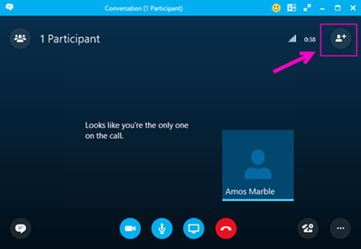

# 他のユーザーが参加できるように Skype for Business からダイヤルアウトするDialing out from a meeting so other people can join it

> [!NOTE]
> Teams の会議からのダイヤル アウトについての情報をお求めの場合は、「[他のユーザーが参加できるように Teams 会議からダイアル アウトする](/MicrosoftTeams/dialing-out-from-a-teams-meeting-so-other-people-can-join-it)」を参照してください。If you're looking for information about dialing out from a Teams meeting, see [Dialing out from a Teams meeting so other people can join it](/MicrosoftTeams/dialing-out-from-a-teams-meeting-so-other-people-can-join-it).

会議の開催者は、Skype for Business アプリを使用してダイヤルアウトし、他の参加者が自分の電話を使って同じ会議に参加できるようにすることができます。As the meeting organizer, you can dial out using a Skype for Business client to let other people join the same meeting using their phone. 必須ではありませんが、他のユーザーにダイヤルアウトする際には、国や地域番号も含め、番号をすべてダイヤルすることをお勧めします。Although it's not required, when you are dialing out to someone, it's recommended that you dial the full number, including the country/region code. ダイヤルアウトを実行するには、次の手順に従います。To get dial-out to work:
  
- Skype for Business アプリを使用して会議に参加している場合のみダイヤルアウトを実行できます。You can dial-out only if you join a meeting using a Skype for Business client.
    
- 会議の開催者は、電話会議を使用できます。You as the meeting organizer have been enabled for dial-in conferencing.

> [!NOTE]
> [!INCLUDE [updating-admin-interfaces](../includes/updating-admin-interfaces.md)]

 **手順 1:** 会議への招待で、[ **他の人を招待**] オプションを使用して、電話番号をダイヤルアウトすることができます。**Step 1:** In the invite meeting you can use the **Invite More People** option to dial out to a phone number.
  

  
 **手順 2:** 国コードまたは地域コードも含めた番号すべてを枠内に入力します。**Step 2:** Enter the full phone number including the country/region code in the box.
  

  
## サポートされている国と地域Supported countries and regions

ダイヤルアウトは一部の国と地域でのみ使用可能です。Dial-out is only available to some countries/regions. 詳細リストについては、「[国および地域ごとの電話会議および通話プランの利用可能性](/microsoftteams/country-and-region-availability-for-audio-conferencing-and-calling-plans/country-and-region-availability-for-audio-conferencing-and-calling-plans)」をご覧ください。[Country and region availability for Audio Conferencing and Calling Plans](/microsoftteams/country-and-region-availability-for-audio-conferencing-and-calling-plans/country-and-region-availability-for-audio-conferencing-and-calling-plans)
  
## 電話会議の詳細Want to know more about dial-in conferencing?

[Office 365 での電話会議を試用または購入するTry or purchase Audio Conferencing in Office 365](../audio-conferencing-in-office-365/try-or-purchase-audio-conferencing-in-office-365.md)
    
- [Skype for Business のアドオン ライセンスSkype for Business and Teams add-on licensing](../skype-for-business-and-microsoft-teams-add-on-licensing/skype-for-business-and-microsoft-teams-add-on-licensing.md)
    
## 関連トピックRelated topics

[Skype for Business をインストールするInstall Skype for Business](https://support.office.com/en-us/article/8a0d4da8-9d58-44f9-9759-5c8f340cb3fb)
