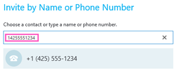

# 他のユーザーが参加できるように、会議のダイヤルアウト

会議開催者は、他のユーザーが携帯電話を使用して同じ会議に参加できるようにする Skype for Business または Microsoft チームのアプリを使用してダイヤルすることができます。必須ではありませんが、他のユーザーにダイヤルアウトしているときに、国/地域コードを含む、完全な番号をダイヤルすることをお勧めします。操作するには、ダイヤルアウトにアクセスします。
  
- ダイヤルアウトできます Skype を for Business または Microsoft チームのアプリを使って会議に参加する場合にのみです。
    
- 電話会議の会議の開催者が有効になってがあります。

 **手順 1:**招待の会議の電話番号をダイヤルする**その他の人を招待**] オプションを使用します。
  

  
 **手順 2:**国/地域コードを含む] ボックスに、完全な電話番号を入力します。
  

  
## サポートされている国と地域

ダイヤルアウトには、一部の国/地域にできるだけです。完全なリスト、[音声会議や通話プランの国と地域の空き時間情報](../country-and-region-availability-for-audio-conferencing-and-calling-plans/country-and-region-availability-for-audio-conferencing-and-calling-plans.md)を参照してください。
  
## 電話会議の詳細を知りたいとしていますか。

- [Skype for Business とチームの Microsoft の音声会議をセットアップする設定します。](set-up-audio-conferencing.md)
    
- [Skype Business および Microsoft チーム アドオン ライセンスを許可します。](../skype-for-business-and-microsoft-teams-add-on-licensing/skype-for-business-and-microsoft-teams-add-on-licensing.md)
    
## 関連トピック

[Skype for Business インストールします。](https://support.office.com/en-us/article/8a0d4da8-9d58-44f9-9759-5c8f340cb3fb)

