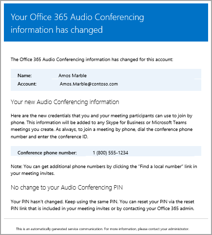
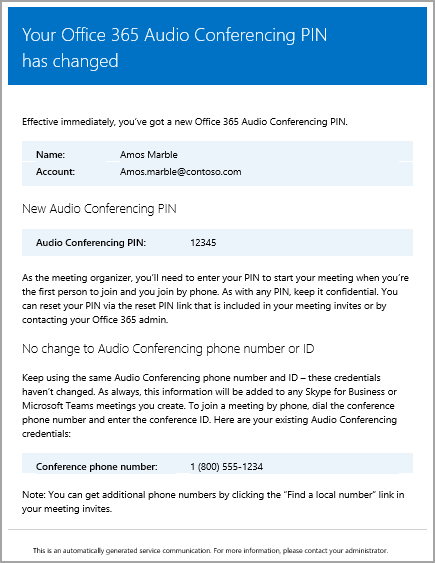
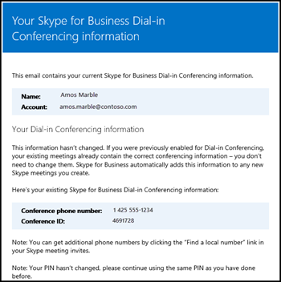

# <a name="emails-sent-to-users-when-their-settings-change"></a>設定を変更するときにユーザーに送信される e メール

[オーディオ会議を](set-up-audio-conferencing.md)有効になっているユーザーにメールが自動送信オーディオ会議プロバイダーに Microsoft を使用します。
  
既定では、電話会議が有効になっているユーザーに送信される電子メールの 4 つの種類があります。 ただし、ユーザーに送信するメールの数を制限する場合は、オフにすることができます。 Office 365 のオーディオ会議は、ユーザーの電子メールを送信時に電子メールを送信します。
  
- **またはマイクロソフトに電話会議プロバイダーを変更するときに、オーディオ会議のライセンスが割り当てられます。**
    
     この電子メールには、会議、音声会議、ユーザーの指示およびリンク ビジネス オンライン会議の更新ツールの既存の会議を更新するために使用されるため、Skype を使用するのには、暗証番号 (pin) の既定の会議電話番号、会議 ID が含まれています、ユーザーです。 [ビジネスおよびマイクロソフトのチームのライセンスの割り当ての Skype](../skype-for-business-and-microsoft-teams-add-on-licensing/assign-skype-for-business-and-microsoft-teams-licenses.md)または[オーディオ会議プロバイダーとしての Microsoft の割り当て](assign-microsoft-as-the-audio-conferencing-provider.md)を参照してください。
    
    > [!NOTE]
    > 会議 Id を動的に組織を有効になっている、会議 Id を表す一意のすべてのユーザーの会議をスケジュールするがあります。 [組織で電話会議の動的な Id](using-audio-conferencing-dynamic-ids-in-your-organization.md)を設定できます。 
  
    このメールの例を以下に示します。
    
     
  
    調べることができます Skype について[Skype](../skype-for-business-and-microsoft-teams-add-on-licensing/skype-for-business-and-microsoft-teams-add-on-licensing.md)を見ることによってビジネスのライセンス。
    
- **会議 ID または既定の会議の電話番号、ユーザーの変更。**
    
    この電子メールには、会議 ID、既定の会議の電話番号、指示およびリンク ビジネス オンライン会議の更新ツールを使用して、ユーザーの既存の会議を更新するため、Skype を使用するのにが含まれています。 ですが、この電子メールにはユーザーの電話会議暗証番号 (pin) にはが含まれていません。 [](reset-a-conference-id-for-a-user.md)Reset a conference organizer's PIN
    
    > [!NOTE]
    > 会議 Id を動的に組織を有効になっている、会議 Id を表す一意のすべてのユーザーの会議をスケジュールするがあります。 [組織で電話会議の動的な Id](using-audio-conferencing-dynamic-ids-in-your-organization.md)を設定できます。 
  
    このメールの例を以下に示します。
    
     
  
- **オーディオ会議のユーザーの PIN がリセットされます。**
    
    この電子メールには、電話会議の開催者の暗証番号 (pin) では、既存の会議 ID、およびユーザーの既定の会議電話番号が含まれています。 Once it's displayed just after being reset, the PIN won't be shown anymore on the user properties and instead ***** will be shown.
    
    > [!NOTE]
    > 会議 Id を動的に組織を有効になっている、会議 Id を表す一意のすべてのユーザーの会議をスケジュールするがあります。 [組織で電話会議の動的な Id](using-audio-conferencing-dynamic-ids-in-your-organization.md)を設定できます。 
  
    このメールの例を以下に示します。
    
     
  
- **ユーザーのライセンスを削除またはオーディオ会議プロバイダーが変更されたときマイクロソフトから他のプロバイダー、または [なし] にします。**
    
    これは、**オーディオ会議**のライセンスが削除されると、ユーザー、またはサード ・ パーティ製のオーディオ会議プロバイダーをマイクロソフトからユーザーの電話会議プロバイダーを変更する場合、プロバイダーを**[なし]**に設定する場合に発生します。 この電子メールには、説明および既定の会議電話番号] または [会議 ID などの特定の情報、オーディオ会議を削除するのには会議の更新ツールのオンライン ビジネスの Skype を使用するユーザーの情報が含まれています。
    
    「[一般法人向け Office 365 ライセンスの割り当てまたは解除方法](https://support.office.com/en-us/article/997596b5-4173-4627-b915-36abac6786dc)」をご覧ください。
    
    このメールの例を以下に示します。
    
     
  
## <a name="make-changes-to-the-email-messages-that-are-sent-to-them"></a>送信される電子メール メッセージに変更を加える

ユーザーの電子メール アドレスなど*の*連絡先情報に記載されている表示名を自動的に送信される電子メールには、変更を行うことができます。 既定では、電子メールの送信者になりますから、Office 365 は、電子メール アドレスを変更し、名前を表示できます Windows PowerShell と[セット CsOnlineDialInConferencingTenantSettings](https://go.microsoft.com/fwlink/?LinkId=627285)コマンドレットを使用します。 SendEmailFromDisplayName パラメーターにメールの表示名を入力する
  
- _SendEmailFromAddress_ パラメーターにメール アドレスを入力する
    
- _SendEmailFromDisplayName_ パラメーターにメールの表示名を入力する
    
- _SendEmailOverride_パラメーターを_True_に設定します。
    
実行して、電子メール アドレスから電子メールが送信されると、電子メールの表示名など、ユーザーに送信された電子メールには、変更を加えることができます。
  
```
Set-CsOnlineDialInConferencingTenantSetting -SendEmailOverride $true -SendEmailFromAddress amos.marble -SendEmailFromDisplayName "Amos Marble"
```

> [!NOTE]
>  電子メール アドレス情報を変更する場合は、環境内の受信電子メール ポリシーが、アドレスから指定されたユーザーから送信される電子メールを許可するかどうかを確認する必要があります。 **連絡先情報を上書きする場合は、電子メールがユーザーに正しく送信されるかを確認してください。 1 つのユーザー、組織内でこれをテストすることによってこれを行うことができます。
  
会議 ID をリセットする
  
## <a name="what-if-you-dont-want-email-to-be-sent-to-them"></a>しない場合は電子メールを送信しますか。

ユーザーに e メールを送信を無効にするとは、ユーザーにライセンスが割り当てられているを取得するときにも電子メールが送信されません。 会議 ID は、ここでは既定の会議の電話番号、および、さらに、オーディオ会議の暗証番号 (pin) をユーザーに送信されません。 このような場合は、別の電子メールを送信することによって、またはそれらを呼び出すことによってユーザーに通知する必要があります。
  
既定では、e メールは、ユーザーに送信されますが、音声会議用の電子メールを受信しないようにする場合は、ビジネス管理センターまたは Windows PowerShell の Skype を使用することができます。 
  
 ****職場または学校のアカウントを使用して、Office 365 にサインインします。
  
1. 職場または学校のアカウントを使用して、Office 365 にサインインします。
    
2. Sign in to Office 365 with your work or school account.
    
3. 既定値は 5 です。
    
4. **Microsoft ブリッジの設定**] ページをオンまたはオフの**オーディオ会議の設定を変更する場合、ユーザーに e メールを自動的に送信**します。 
    
5. [ **保存**] をクリックします。 
    
 The conference ID and default dial-in conferencing phone number is included on the meeting invite but not the PIN.
  
1. 電子メールを送信するすべてのユーザーを無効にするのには、次を実行します。
    
  ```
  Set-CsOnlineDialInConferencingTenantSetting -AutomaticallySendEmailsToUsers $false
  ```

会議 ID をリセットする
  
## <a name="what-else-should-you-know-about-this-email"></a>このようなメールについて知っておくべきその他のこと

- 詳細を有効にして、自動的に電子メールを送信するユーザーを無効にすると、[有効にするかオーディオ会議の設定を変更すると、送信メールを無効にする](enable-or-disable-sending-emails-when-their-settings-change.md)を参照してください。
    
- ユーザーには、オーディオの情報が失われ、それらすべてのオーディオ情報に送信できるようにする必要があります。 ビジネス管理センターは、Skype を使用してオーディオ会議のプロパティをユーザーの [**電子メール経由での会議の情報を送信**をクリックすると、これを行うことができます。 If you do this, an email will be sent that only includes conference ID and conference phone number, but the PIN won't be included. ただし、この情報には、オーディオ会議暗証番号 (pin) にはが含まれていません。
    
    送信されるメールの例を以下に示します。
    
     
  
## <a name="want-to-know-how-to-manage-with-windows-powershell"></a>Go to the Office 365 admin centerSkype for Business.

- 既定では、電子メールの送信者になりますから、Office 365 は、電子メール アドレスを変更し、名前を表示できます Windows PowerShell と[セット CsOnlineDialInConferencingTenantSettings](https://go.microsoft.com/fwlink/?LinkId=627285)コマンドレットを使用します。
    
- Windows PowerShell is all about managing users and what users are allowed or not allowed to do. With Windows PowerShell, you can manage Office 365 using a single point of administration that can simplify your daily work when you have multiple tasks to do. To get started with Windows PowerShell, see these topics:
    
  - [Windows PowerShell で Office 365 を管理するための最善の方法](https://go.microsoft.com/fwlink/?LinkId=525041)
    
  - [Windows PowerShell で Office 365 を管理するための最善の方法](https://go.microsoft.com/fwlink/?LinkId=525142)
    
- 多くのユーザーの設定を同時に変更するときなどは、Office 365 管理センターのみを使用するよりも、Windows PowerShell の方に、速度、わかりやすさ、生産性の点で多くのメリットがあります。 次のトピックで、これらの利点を説明します。 
    
  - [Windows PowerShell と Lync Online の概要](https://go.microsoft.com/fwlink/?LinkId=525039)
    
  - [Windows PowerShell による Skype for Business Online の管理](https://go.microsoft.com/fwlink/?LinkId=525453)
    
  - [Windows PowerShell を使用した一般的な Skype for Business Online の管理タスクの実行](https://go.microsoft.com/fwlink/?LinkId=525038)
    
    > [!NOTE]
    > [Windows PowerShell を使用した一般的な Skype for Business Online の管理タスクの実行](https://go.microsoft.com/fwlink/?LinkId=294688)
  
## <a name="related-topics"></a>このモジュールは、64 ビットのコンピューターでのみサポートされ、Microsoft ダウンロード センターの「Skype for Business Online 用 Windows PowerShell モジュール」からダウンロードできます。

[電話会議の設定が変更されたときのメールの自動送信を有効または無効にする](enable-or-disable-sending-emails-when-their-settings-change.md)
  
[ユーザーに電話会議情報が含まれたメールを送信する](send-an-email-to-a-user-with-their-dial-in-information.md)
