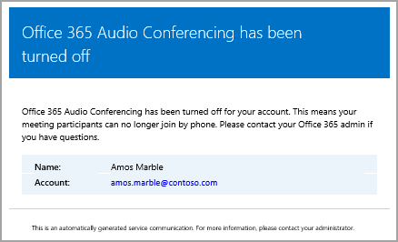

# <a name="emails-sent-to-users-when-their-settings-change-in-skype-for-business-online"></a>Skype for Business Online で設定が変更された場合にユーザーに送信されるメール

> [!Note]
> Microsoft Teams で自動メール情報を探している場合は、Microsoft Teams で設定が変更された場合にユーザーに送信されるメール [を参照してください](/MicrosoftTeams/emails-sent-to-users-when-their-settings-change-in-teams)。

Microsoft を電話会議プロバイダーとして使用して電話[](set-up-audio-conferencing.md)会議が有効になっているユーザーにメールが自動的に送信されます。
  
既定では、電話会議が有効になっているユーザーに 4 種類のメールが送信されます。 ただし、ユーザーに送信されるメールの数を制限する場合は、この機能をオフにできます。 Microsoft 365 または Office 365 の電話会議では、次の場合にメールがユーザーのメールに送信されます。
  
- **電話会議ライセンスが割り当てられているか、電話会議プロバイダーを Microsoft に変更する場合。**
    
     このメールには、会議 ID、会議の既定の電話会議電話番号、ユーザーの電話会議 PIN、ユーザーの既存の会議を更新するために使用する Skype for Business Online 会議更新ツールを使用する手順とリンクが含まれます。 「Skype [for Business ライセンスを割り当てる」](../skype-for-business-and-microsoft-teams-add-on-licensing/assign-skype-for-business-and-microsoft-teams-licenses.md) または [「Microsoft を電話会議プロバイダーとして割り当てる」を参照してください](assign-microsoft-as-the-audio-conferencing-provider.md)。
    
    > [!NOTE]
    > 組織で動的電話会議 ID が有効になっている場合、ユーザーがスケジュールするユーザーのすべての会議には一意の会議 ID が割り当てされます。 組織内で [電話会議の動的な ID を設定できます](./reset-a-conference-id-for-a-user.md)。 
  
    このメールの例を次に示します。
    
     ![Skype for Business の [ライセンスの確認]](../images/audio-conferencing-user-enabled.png)
  
    Skype for Business のライセンスの詳細については、「Skype for Business アドオン のライセンス」 [を参照してください](../skype-for-business-and-microsoft-teams-add-on-licensing/skype-for-business-and-microsoft-teams-add-on-licensing.md)。
    
- **ユーザーの会議 ID または既定の電話会議電話番号が変更されます。**
    
    このメールには、会議 ID、既定の電話会議の電話番号、ユーザーの既存の会議を更新するために使用する Skype for Business Online 会議更新ツールを使用する手順とリンクが記載されています。 ただし、このメールにはユーザーの電話会議の PIN は含めになっていません。 「[ユーザーの会議通話 ID をリセットする](reset-a-conference-id-for-a-user.md)」を参照してください。
    
    > [!NOTE]
    > 組織で動的電話会議 ID が有効になっている場合、ユーザーがスケジュールするユーザーのすべての会議には一意の会議 ID が割り当てされます。 組織内で [電話会議の動的な ID を設定できます](./reset-a-conference-id-for-a-user.md)。 
  
    このメールの例を次に示します。
    
     
  
- **ユーザーの電話会議の PIN がリセットされます。**
    
    このメールには、開催者の電話会議 PIN、既存の会議 ID、ユーザーの既定の電話会議電話番号が記載されています。 「[電話会議の PIN をリセットする](reset-the-audio-conferencing-pin.md)」を参照してください。
    
    > [!NOTE]
    > 組織で動的電話会議 ID が有効になっている場合、ユーザーがスケジュールするユーザーのすべての会議には一意の会議 ID が割り当てされます。 組織内で [電話会議の動的な ID を設定できます](./reset-a-conference-id-for-a-user.md)。 
  
    このメールの例を次に示します。
    
     
  
- **ユーザーのライセンスが削除された場合、または電話会議プロバイダーが Microsoft から他のプロバイダーまたは [なし] に変更された場合。**
    
    これは、電話会議ライセンスがユーザーから削除された場合、またはユーザーの電話会議プロバイダーを Microsoft からサードパーティの電話会議プロバイダーに変更した場合、またはプロバイダーを **[** なし] に設定した場合に発生します。 このメールには、ユーザーが Skype for Business Online Meeting Update Tool を使用して、既定の電話会議の電話番号や会議 ID などの電話会議固有の情報を削除する手順と情報が記載されています。
    
    ビジネス [向け Microsoft 365 アプリのライセンスの割り当てまたは削除を参照してください](https://support.office.com/article/997596b5-4173-4627-b915-36abac6786dc)。
    
    このメールの例を次に示します。
    
     
  
> [!NOTE]
> [!INCLUDE [updating-admin-interfaces](../includes/updating-admin-interfaces.md)]

## <a name="make-changes-to-the-email-messages-that-are-sent-to-them"></a>送信されるメール メッセージを変更する

[From] 連絡先情報に含まれるメール アドレスや表示名など、ユーザーに自動的に送信されるメール *を変更できます* 。 既定では、メールの送信者は Microsoft 365 または Office 365 から送信されますが、Windows PowerShell コマンドレットと [Set-CsOnlineDialInConferencingTenantSettings](/previous-versions//mt228132(v=technet.10)) コマンドレットを使用してメール アドレスと表示名を変更できます。 ユーザーにメールを送信するメール アドレスを変更するには、次の必要があります。
  
- _SendEmailFromAddress_ パラメーターにメール アドレスを入力する
    
- _SendEmailFromDisplayName_ パラメーターにメールの表示名を入力する
    
- _SendEmailOverride パラメーターを_ _True に設定します_。
    
メールの送信メール アドレスやメールの表示名など、ユーザーに送信されたメールを変更するには、次のコマンドを実行します。
  
```PowerShell
Set-CsOnlineDialInConferencingTenantSetting -SendEmailOverride $true -SendEmailFromAddress amos.marble -SendEmailFromDisplayName "Amos Marble"
```

> [!NOTE]
>  メール アドレス情報を変更する場合は、環境の受信メール ポリシーで、指定されたカスタムのアドレスから送信されるメールを許可する必要があります。 [From] 連絡先情報を上書 *き* する場合は、メールがユーザーに正しく送信されていることを確認する必要があります。 これを行うには、組織内の 1 人のユーザーでテストします。
  
会議 ID をリセットする[](/previous-versions//mt228132(v=technet.10))
  
## <a name="what-if-you-dont-want-email-to-be-sent-to-them"></a>メールを送信したくない場合は、どうしますか?

ユーザーへのメールの送信を無効にすると、ユーザーにライセンスが割り当てられた場合でも、メールは送信されません。 この場合、会議 ID、既定の電話会議の電話番号、さらに重要な点として、電話会議の PIN はユーザーに送信されません。 この場合は、別のメールを送信するか、ユーザーに呼び出すことによってユーザーに通知する必要があります。
  
既定では、メールはユーザーに送信されますが、ユーザーが電話会議のメールを受信したくない場合は、Skype for Business 管理センターまたは Windows PowerShell を使用できます。 
 
 **Skype for Business ロゴを示すアイコン**  
    
1. **Skype for Business 管理センター** の左側のナビゲーション ウィンドウで、[**電話会議**]  >  [**Microsoft ブリッジ設定**] の順に移動します。
    
2. Microsoft **Bridge の設定ページで** 、[電話会議の設定が変更された場合にユーザーにメールを自動的に送信する] をオンまたは **オフにします**。 
    
3. **[保存]** をクリックします。 

> [!Note]
> [!INCLUDE [updating-admin-interfaces](../includes/updating-admin-interfaces.md)]
  
**Windows PowerShell を使用する**
  
1. 次の手順を実行して、すべてのユーザーのメールの送信を無効にします。
    
   ```PowerShell
   Set-CsOnlineDialInConferencingTenantSettings -AutomaticallySendEmailsToUsers $false
   ```

会議 ID をリセットする[](/previous-versions//mt228132(v=technet.10))
  
## <a name="what-else-should-you-know-about-this-email"></a>このようなメールについて知っておくべきその他のこと

- ユーザーへのメールの自動送信を有効または無効にする方法の詳細については、「電話会議の設定が変更された場合のメール送信を有効または無効にする」を参照 [してください](enable-or-disable-sending-emails-when-their-settings-change.md)。
    
- ユーザーが音声情報を失い、すべての音声情報をユーザーに送信できる必要がある場合があります。 この操作を行うには、Skype for Business 管理センターを使用し、ユーザーの電話会議プロパティの下にある [電話会議情報をメールで送信] をクリックします。 「[電話会議の情報が記載された電子メールをユーザーに送信する](send-an-email-to-a-user-with-their-dial-in-information.md)」を参照してください。 ただし、この情報には電話会議の PIN は含まれます。
    
    次に、送信されるこのメールの例を示します。
    
     
  
## <a name="want-to-know-how-to-manage-with-windows-powershell"></a>Windows PowerShell での管理方法について

- 既定では、メールの送信者は Microsoft 365 または Office 365 から送信されますが、Windows PowerShell コマンドレットと [Set-CsOnlineDialInConferencingTenantSettings](/previous-versions//mt228132(v=technet.10)) コマンドレットを使用してメール アドレスと表示名を変更できます。
    
- Windows PowerShellは、ユーザーの管理と、ユーザーに許可する操作と許可しない操作の管理に使います。 Windows PowerShell を使用すると、単一の管理ポイントを使用して Microsoft 365 または Office 365 を管理し、複数のタスクを実行する必要があるときに日常業務を簡略化できます。 Windows PowerShell の使用を開始するには、次のトピックを参照してください。
    
  - [Microsoft 365 または Office 365 PowerShell を使用する必要がある理由](/microsoft-365/enterprise/why-you-need-to-use-microsoft-365-powershell)
    
  - [Microsoft 365 または Office 365 を他のユーザーとWindows PowerShell](/previous-versions//dn568025(v=technet.10))
    
- Windows PowerShellは、多くのユーザーに対して一度に設定変更を行う場合など、Microsoft 365 管理センターのみを使用する場合と同様に、速度、シンプルさ、生産性に多くの利点があります。 次のトピックで、これらの利点を説明します。 
    
  - [Windows PowerShell と Skype for Business Online の概要](../set-up-your-computer-for-windows-powershell/set-up-your-computer-for-windows-powershell.md)
    
  - [Windows PowerShell による Skype for Business Online の管理](../set-up-your-computer-for-windows-powershell/set-up-your-computer-for-windows-powershell.md)
    
  - [Windows PowerShell を使用した一般的な Skype for Business Online の管理タスクの実行](../set-up-your-computer-for-windows-powershell/set-up-your-computer-for-windows-powershell.md)
    
    > [!NOTE]
    > Skype for Business Online 用の Windows PowerShell モジュールがあれば、Skype for Business Online に接続するリモートの Windows PowerShell セッションを作成できます。このモジュールは、64 ビット版のコンピューターでのみサポートされており、「[Windows PowerShell Module for Skype for Business Online](https://go.microsoft.com/fwlink/?LinkId=294688)」の Microsoft ダウンロード センターからダウンロードできます。
  
## <a name="related-topics"></a>関連項目

[電話会議の設定が変更されたときのメールの自動送信を有効または無効にする](enable-or-disable-sending-emails-when-their-settings-change.md)
  
[電話会議の情報が記載されたメールをユーザーに送信する](send-an-email-to-a-user-with-their-dial-in-information.md)