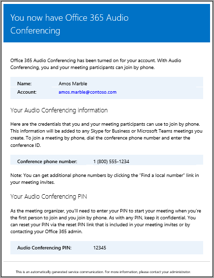

# <a name="emails-sent-to-users-when-their-settings-change-in-skype-for-business-online"></a><span data-ttu-id="2ce03-103">Skype for Business Online の設定が変更されたときにユーザーに送信されたメール</span><span class="sxs-lookup"><span data-stu-id="2ce03-103">Emails sent to users when their settings change in Skype for Business Online</span></span>

> [!Note]
> <span data-ttu-id="2ce03-104">Microsoft Teams で自動メール情報を探している場合は、「 [Microsoft teams で設定が変更されたときにユーザーに送信されるメール](/MicrosoftTeams/emails-sent-to-users-when-their-settings-change-in-teams)」を参照してください。</span><span class="sxs-lookup"><span data-stu-id="2ce03-104">If you're looking for automatic email information in Microsoft Teams, see [Emails sent to users when their settings change in Microsoft Teams](/MicrosoftTeams/emails-sent-to-users-when-their-settings-change-in-teams).</span></span>

<span data-ttu-id="2ce03-105">Microsoft を電話会議プロバイダーとして使用する電話[会議用に有効になっ](set-up-audio-conferencing.md)ているユーザーには、メールが自動的に送信されます。</span><span class="sxs-lookup"><span data-stu-id="2ce03-105">Emails will be automatically sent to users who are [enabled for Audio Conferencing](set-up-audio-conferencing.md) using Microsoft as the audio conferencing provider.</span></span>
  
<span data-ttu-id="2ce03-106">既定では、電話会議が有効になっているユーザーに送信されるメールには4種類のメールが用意されています。</span><span class="sxs-lookup"><span data-stu-id="2ce03-106">By default, there are four types of email that will be sent to your users who are enabled for Audio Conferencing.</span></span> <span data-ttu-id="2ce03-107">ただし、ユーザーに送信されるメールの数を制限する場合は、オフにすることができます。</span><span class="sxs-lookup"><span data-stu-id="2ce03-107">However, if you want to limit the number of emails sent to users, you can turn it off.</span></span> <span data-ttu-id="2ce03-108">Office 365 の電話会議では、次の場合にユーザーのメールにメールが送信されます。</span><span class="sxs-lookup"><span data-stu-id="2ce03-108">Audio Conferencing in Office 365 will send email to your users' email when:</span></span>
  
- <span data-ttu-id="2ce03-109">**電話会議ライセンスが割り当てられているか、電話会議プロバイダーを Microsoft に変更する場合。**</span><span class="sxs-lookup"><span data-stu-id="2ce03-109">**An Audio Conferencing license is assigned to them or when you are changing the audio conferencing provider to Microsoft.**</span></span>
    
     <span data-ttu-id="2ce03-110">このメールには、会議 ID、会議用の既定の会議電話番号、ユーザーの電話会議の PIN、ユーザーの既存の会議を更新するために使用される Skype for Business Online 会議更新ツールを使用するための手順とリンクが含まれています。ユーザーズ.</span><span class="sxs-lookup"><span data-stu-id="2ce03-110">This email includes the conference ID, the default conference phone number for the meetings, the audio conferencing PIN for the user, and the instructions and link to use the Skype for Business Online Meeting Update Tool that is used to update existing meetings for the user.</span></span> <span data-ttu-id="2ce03-111">「 [Skype For business ライセンスの割り当て](../skype-for-business-and-microsoft-teams-add-on-licensing/assign-skype-for-business-and-microsoft-teams-licenses.md)」または「 [Microsoft の電話会議プロバイダーとしての割り当て](assign-microsoft-as-the-audio-conferencing-provider.md)」を参照してください。</span><span class="sxs-lookup"><span data-stu-id="2ce03-111">See [Assign Skype for Business licenses](../skype-for-business-and-microsoft-teams-add-on-licensing/assign-skype-for-business-and-microsoft-teams-licenses.md) or [Assign Microsoft as the audio conferencing provider](assign-microsoft-as-the-audio-conferencing-provider.md).</span></span>
    
    > [!NOTE]
    > <span data-ttu-id="2ce03-112">組織で動的会議 Id が有効になっている場合、スケジュールされているすべてのユーザーの会議には、固有の会議 Id が割り当てられます。</span><span class="sxs-lookup"><span data-stu-id="2ce03-112">If your organization has been enabled for dynamic conference IDs, all of a user's meetings that they schedule will have unique conference IDs.</span></span> <span data-ttu-id="2ce03-113">[組織内の電話会議の動的 id](using-audio-conferencing-dynamic-ids-in-your-organization.md)を設定することができます。</span><span class="sxs-lookup"><span data-stu-id="2ce03-113">You can set up [Audio Conferencing dynamic IDs in your organization](using-audio-conferencing-dynamic-ids-in-your-organization.md).</span></span> 
  
    <span data-ttu-id="2ce03-114">このメールの例を次に示します。</span><span class="sxs-lookup"><span data-stu-id="2ce03-114">Here is an example of this email:</span></span>
    
     
  
    <span data-ttu-id="2ce03-116">Skype for business のライセンスの詳細については、「 [skype For business アドオンライセンス](../skype-for-business-and-microsoft-teams-add-on-licensing/skype-for-business-and-microsoft-teams-add-on-licensing.md)」を参照してください。</span><span class="sxs-lookup"><span data-stu-id="2ce03-116">You can find out more about Skype for Business licensing by seeing [Skype for Business add-on licensing](../skype-for-business-and-microsoft-teams-add-on-licensing/skype-for-business-and-microsoft-teams-add-on-licensing.md).</span></span>
    
- <span data-ttu-id="2ce03-117">**会議 ID またはユーザーの既定の会議の電話番号が変更されます。**</span><span class="sxs-lookup"><span data-stu-id="2ce03-117">**The conference ID or default conference phone number of a user changes.**</span></span>
    
    <span data-ttu-id="2ce03-118">このメールには、会議 ID、既定の会議電話番号、およびユーザーの既存の会議を更新するために使用される Skype for Business Online Meeting 更新ツールを使用するための手順とリンクが含まれています。</span><span class="sxs-lookup"><span data-stu-id="2ce03-118">This email contains the conference ID, default conference phone number, and the instructions and link to use the Skype for Business Online Meeting Update Tool that is used to update existing meetings for the user.</span></span> <span data-ttu-id="2ce03-119">ただし、このメールには、ユーザーの電話会議の PIN は含まれていません。</span><span class="sxs-lookup"><span data-stu-id="2ce03-119">But this email doesn't include the user's audio conferencing PIN.</span></span> <span data-ttu-id="2ce03-120">「[ユーザーの会議通話 ID をリセットする](reset-a-conference-id-for-a-user.md)」を参照してください。</span><span class="sxs-lookup"><span data-stu-id="2ce03-120">See [Reset a conference ID for a user](reset-a-conference-id-for-a-user.md).</span></span>
    
    > [!NOTE]
    > <span data-ttu-id="2ce03-121">組織で動的会議 Id が有効になっている場合、スケジュールされているすべてのユーザーの会議には、固有の会議 Id が割り当てられます。</span><span class="sxs-lookup"><span data-stu-id="2ce03-121">If your organization has been enabled for dynamic conference IDs, all of a user's meetings that they schedule will have unique conference IDs.</span></span> <span data-ttu-id="2ce03-122">[組織内の電話会議の動的 id](using-audio-conferencing-dynamic-ids-in-your-organization.md)を設定することができます。</span><span class="sxs-lookup"><span data-stu-id="2ce03-122">You can set up [Audio Conferencing dynamic IDs in your organization](using-audio-conferencing-dynamic-ids-in-your-organization.md).</span></span> 
  
    <span data-ttu-id="2ce03-123">このメールの例を次に示します。</span><span class="sxs-lookup"><span data-stu-id="2ce03-123">Here is an example of this email:</span></span>
    
     
  
- <span data-ttu-id="2ce03-125">**ユーザーの電話会議の PIN がリセットされます。**</span><span class="sxs-lookup"><span data-stu-id="2ce03-125">**The audio conferencing PIN of a user is reset.**</span></span>
    
    <span data-ttu-id="2ce03-126">このメールには、開催者の電話会議の PIN、既存の会議 ID、ユーザー用の既定の会議電話番号が含まれています。</span><span class="sxs-lookup"><span data-stu-id="2ce03-126">This email contains the organizer's audio conferencing PIN, the existing conference ID, and default conference phone number for the user.</span></span> <span data-ttu-id="2ce03-127">「[電話会議の PIN をリセットする](reset-the-audio-conferencing-pin.md)」を参照してください。</span><span class="sxs-lookup"><span data-stu-id="2ce03-127">See [Reset the Audio Conferencing PIN](reset-the-audio-conferencing-pin.md).</span></span>
    
    > [!NOTE]
    > <span data-ttu-id="2ce03-128">組織で動的会議 Id が有効になっている場合、スケジュールされているすべてのユーザーの会議には、固有の会議 Id が割り当てられます。</span><span class="sxs-lookup"><span data-stu-id="2ce03-128">If your organization has been enabled for dynamic conference IDs, all of a user's meetings that they schedule will have unique conference IDs.</span></span> <span data-ttu-id="2ce03-129">[組織内の電話会議の動的 id](using-audio-conferencing-dynamic-ids-in-your-organization.md)を設定することができます。</span><span class="sxs-lookup"><span data-stu-id="2ce03-129">You can set up [Audio Conferencing dynamic IDs in your organization](using-audio-conferencing-dynamic-ids-in-your-organization.md).</span></span> 
  
    <span data-ttu-id="2ce03-130">このメールの例を次に示します。</span><span class="sxs-lookup"><span data-stu-id="2ce03-130">Here is an example of this email:</span></span>
    
     
  
- <span data-ttu-id="2ce03-132">**ユーザーのライセンスが削除されるか、電話会議プロバイダーが Microsoft から別のプロバイダーまたは [なし] に変更されたとき。**</span><span class="sxs-lookup"><span data-stu-id="2ce03-132">**A user's license is removed or when audio conferencing provider changes from Microsoft to other provider or None.**</span></span>
    
    <span data-ttu-id="2ce03-133">この問題は、**電話会議**のライセンスがユーザーから削除された場合、またはユーザーの電話会議プロバイダーを Microsoft からサードパーティの電話会議プロバイダーに変更した場合、またはプロバイダーを **[なし**] に設定した場合に発生します。</span><span class="sxs-lookup"><span data-stu-id="2ce03-133">This happens when the **Audio Conferencing** license is removed from a user or when changing the audio conferencing provider of a user from Microsoft to a third-party audio conferencing provider or when setting the provider to **None**.</span></span> <span data-ttu-id="2ce03-134">このメールには、Skype for Business Online Meeting Update ツールを使用して、既定の会議電話番号や会議 ID などの電話会議固有の情報を削除するための手順と情報が含まれています。</span><span class="sxs-lookup"><span data-stu-id="2ce03-134">This email contains the instructions and information for the user to use the Skype for Business Online Meeting Update Tool to remove audio conferencing specific information, such as the default conference phone number or conference ID.</span></span>
    
    <span data-ttu-id="2ce03-135">「[一般法人向け Office 365 ライセンスの割り当てまたは解除方法](https://support.office.com/article/997596b5-4173-4627-b915-36abac6786dc)」をご覧ください。</span><span class="sxs-lookup"><span data-stu-id="2ce03-135">See [Assign or remove licenses for Office 365 for business](https://support.office.com/article/997596b5-4173-4627-b915-36abac6786dc).</span></span>
    
    <span data-ttu-id="2ce03-136">このメールの例を次に示します。</span><span class="sxs-lookup"><span data-stu-id="2ce03-136">Here is an example of this email:</span></span>
    
     
  
> [!NOTE]
> [!INCLUDE [updating-admin-interfaces](../includes/updating-admin-interfaces.md)]

## <a name="make-changes-to-the-email-messages-that-are-sent-to-them"></a><span data-ttu-id="2ce03-138">送信されたメールメッセージに変更を加える</span><span class="sxs-lookup"><span data-stu-id="2ce03-138">Make changes to the email messages that are sent to them</span></span>

<span data-ttu-id="2ce03-139">メールアドレス、および*差出人*の連絡先情報に含まれている表示名など、ユーザーに自動的に送信されるメールを変更できます。</span><span class="sxs-lookup"><span data-stu-id="2ce03-139">You can make changes to the email that is automatically sent to users including the email address and the display name that is included in the *From* contact information.</span></span> <span data-ttu-id="2ce03-140">既定では、メールの送信者は Office 365 から送信されますが、Windows PowerShell と[-](https://go.microsoft.com/fwlink/?LinkId=627285)コマンドレットを使用してメールアドレスと表示名を変更することができます。</span><span class="sxs-lookup"><span data-stu-id="2ce03-140">By default, the sender of the emails will be from Office 365, but you can change the email address and display name using Windows PowerShell and the [Set-CsOnlineDialInConferencingTenantSettings](https://go.microsoft.com/fwlink/?LinkId=627285) cmdlet.</span></span> <span data-ttu-id="2ce03-141">ユーザーにメールを送信するメールアドレスを変更するには、次のことを行う必要があります。</span><span class="sxs-lookup"><span data-stu-id="2ce03-141">To make changes to the email address that is sending the email to the users, you must:</span></span>
  
- <span data-ttu-id="2ce03-142">_SendEmailFromAddress_ パラメーターにメール アドレスを入力する</span><span class="sxs-lookup"><span data-stu-id="2ce03-142">Enter the email address in the  _SendEmailFromAddress_ parameter.</span></span>
    
- <span data-ttu-id="2ce03-143">_SendEmailFromDisplayName_ パラメーターにメールの表示名を入力する</span><span class="sxs-lookup"><span data-stu-id="2ce03-143">Enter the email display name in the  _SendEmailFromDisplayName_ parameter.</span></span>
    
- <span data-ttu-id="2ce03-144">_SendEmailOverride_パラメーターを_True_に設定します。</span><span class="sxs-lookup"><span data-stu-id="2ce03-144">Set the  _SendEmailOverride_ parameter to  _True_.</span></span>
    
<span data-ttu-id="2ce03-145">次のように実行して、メールの送信元のメールアドレスやメールの表示名など、ユーザーに送信されるメールの変更を行うことができます。</span><span class="sxs-lookup"><span data-stu-id="2ce03-145">You can make changes to the email sent to users, such as the email address that the email is sent from and the display name for the email, by running:</span></span>
  
```PowerShell
Set-CsOnlineDialInConferencingTenantSetting -SendEmailOverride $true -SendEmailFromAddress amos.marble -SendEmailFromDisplayName "Amos Marble"
```

> [!NOTE]
>  <span data-ttu-id="2ce03-146">メールアドレス情報を変更する場合は、カスタム指定の差出人アドレスから送信されるメールが、環境の受信メールポリシーで許可されていることを確認する必要があります。</span><span class="sxs-lookup"><span data-stu-id="2ce03-146">If you want to change the email address information, you need to make sure that the inbound email policies of your environment allow emails that come from the custom specified from address.</span></span> <span data-ttu-id="2ce03-147">*差出人*の連絡先情報を上書きする場合は、ユーザーにメールが正しく送信されていることを確認する必要があります。</span><span class="sxs-lookup"><span data-stu-id="2ce03-147">If you decide to override the *From* contact information, you should verify that the emails are correctly sent to users.</span></span> <span data-ttu-id="2ce03-148">これは、組織内の1人のユーザーとテストすることで実現できます。</span><span class="sxs-lookup"><span data-stu-id="2ce03-148">You can do this by testing this with one user in your organization.</span></span>
  
<span data-ttu-id="2ce03-149">会議 ID をリセットする[](https://go.microsoft.com/fwlink/?LinkId=627285)</span><span class="sxs-lookup"><span data-stu-id="2ce03-149">You can use the [Set-CsOnlineDialInConferencingTenantSettings](https://go.microsoft.com/fwlink/?LinkId=627285) cmdlet to manage other settings for your organization, including email.</span></span>
  
## <a name="what-if-you-dont-want-email-to-be-sent-to-them"></a><span data-ttu-id="2ce03-150">メールを送信したくない場合はどうすればよいですか?</span><span class="sxs-lookup"><span data-stu-id="2ce03-150">What if you don't want email to be sent to them?</span></span>

<span data-ttu-id="2ce03-151">ユーザーへのメールの送信を無効にすると、ユーザーにライセンスが割り当てられてもメールは送信されません。</span><span class="sxs-lookup"><span data-stu-id="2ce03-151">When you disable sending emails to users, email won't be sent even when a user gets assigned a license.</span></span> <span data-ttu-id="2ce03-152">この場合、会議 ID、既定の会議電話番号、さらに重要なのは、電話会議の PIN はユーザーに送信されません。</span><span class="sxs-lookup"><span data-stu-id="2ce03-152">In this case, the conference ID, default conferencing phone number, and, more importantly, their audio conferencing PIN won't be sent to the user.</span></span> <span data-ttu-id="2ce03-153">この問題が発生した場合は、個別のメールを送信するか、または電話をかけて、ユーザーに通知する必要があります。</span><span class="sxs-lookup"><span data-stu-id="2ce03-153">When this happens, you must tell the user by sending them a separate email or by calling them.</span></span>
  
<span data-ttu-id="2ce03-154">既定では、メールはユーザーに送信されますが、電話会議のメールを受信しないようにするには、Skype for Business 管理センターまたは Windows PowerShell を使用します。</span><span class="sxs-lookup"><span data-stu-id="2ce03-154">By default, emails will be sent to your users, but if you want to prevent them from receiving email for audio conferencing, you can use the Skype for Business admin center or Windows PowerShell.</span></span> 
 
<span data-ttu-id="2ce03-155">**Skype for business 管理センターを使用し**た skype for business ロゴを示すアイコン  </span><span class="sxs-lookup"><span data-stu-id="2ce03-155">  **Using the Skype for Business admin center**</span></span>
    
1. <span data-ttu-id="2ce03-156">**Skype for Business 管理センター**の左側のナビゲーション ウィンドウで、[**電話会議**]  >  [**Microsoft ブリッジ設定**] の順に移動します。</span><span class="sxs-lookup"><span data-stu-id="2ce03-156">In the **Skype for Business admin center**, in the left navigation, go to **Audio conferencing** > **Microsoft bridge settings**.</span></span>
    
2. <span data-ttu-id="2ce03-157">[ **Microsoft bridge の設定**] ページで、[**電話会議の設定が変更された場合にユーザーに電子メールを自動的に送信する**] をオンまたはオフにします。</span><span class="sxs-lookup"><span data-stu-id="2ce03-157">On the **Microsoft bridge settings** page, select or clear **Automatically send emails to users if their audio conferencing settings change**.</span></span> 
    
3. <span data-ttu-id="2ce03-158">**[保存]** をクリックします。</span><span class="sxs-lookup"><span data-stu-id="2ce03-158">Click **Save**.</span></span> 

> [!Note]
> [!INCLUDE [updating-admin-interfaces](../includes/updating-admin-interfaces.md)]
  
<span data-ttu-id="2ce03-159">**Windows PowerShell を使用する**</span><span class="sxs-lookup"><span data-stu-id="2ce03-159">**Using Windows PowerShell**</span></span>
  
1. <span data-ttu-id="2ce03-160">すべてのユーザーメールの送信を無効にするには、次の操作を実行します。</span><span class="sxs-lookup"><span data-stu-id="2ce03-160">Run the following to disable sending all of your users email:</span></span>
    
   ```PowerShell
   Set-CsOnlineDialInConferencingTenantSettings -AutomaticallySendEmailsToUsers $false
   ```

<span data-ttu-id="2ce03-161">会議 ID をリセットする[](https://go.microsoft.com/fwlink/?LinkId=627285)</span><span class="sxs-lookup"><span data-stu-id="2ce03-161">You can use the [Set-CsOnlineDialInConferencingTenantSettings](https://go.microsoft.com/fwlink/?LinkId=627285) cmdlet to manage other settings for your organization, including email.</span></span>
  
## <a name="what-else-should-you-know-about-this-email"></a><span data-ttu-id="2ce03-162">このようなメールについて知っておくべきその他のこと</span><span class="sxs-lookup"><span data-stu-id="2ce03-162">What else should you know about this email?</span></span>

- <span data-ttu-id="2ce03-163">ユーザーへのメールの自動送信を有効または無効にする方法について詳しくは、「[電話会議の設定が変更されたときにメールを送信する](enable-or-disable-sending-emails-when-their-settings-change.md)」を参照してください。</span><span class="sxs-lookup"><span data-stu-id="2ce03-163">For more on enabling and disabling automatically sending email to your users, see [Enable or disable sending emails when Audio Conferencing settings change](enable-or-disable-sending-emails-when-their-settings-change.md).</span></span>
    
- <span data-ttu-id="2ce03-164">ユーザーの音声情報が失われたり、それらの音声情報をすべて送信したりできるようにする必要があります。</span><span class="sxs-lookup"><span data-stu-id="2ce03-164">Sometimes users lose their audio information and you need to be able to send them all of their audio information to them.</span></span> <span data-ttu-id="2ce03-165">これを行うには、Skype for Business 管理センターを使って、ユーザーの電話会議のプロパティの下にある [**電話会議情報をメールで送信**] をクリックします。</span><span class="sxs-lookup"><span data-stu-id="2ce03-165">You can do this by using the Skype for Business admin center and clicking **Send conference info via email** under the audio conferencing properties for a user.</span></span> <span data-ttu-id="2ce03-166">「[電話会議の情報が記載された電子メールをユーザーに送信する](send-an-email-to-a-user-with-their-dial-in-information.md)」を参照してください。</span><span class="sxs-lookup"><span data-stu-id="2ce03-166">See [Send an email to a user with their Audio Conferencing information](send-an-email-to-a-user-with-their-dial-in-information.md).</span></span> <span data-ttu-id="2ce03-167">ただし、この情報には電話会議の PIN は含まれていません。</span><span class="sxs-lookup"><span data-stu-id="2ce03-167">However, this information doesn't include the audio conferencing PIN.</span></span>
    
    <span data-ttu-id="2ce03-168">このメールの例を次に示します。</span><span class="sxs-lookup"><span data-stu-id="2ce03-168">Here is an example of this email that will be sent to them:</span></span>
    
     
  
## <a name="want-to-know-how-to-manage-with-windows-powershell"></a><span data-ttu-id="2ce03-170">Windows PowerShell での管理方法について</span><span class="sxs-lookup"><span data-stu-id="2ce03-170">Want to know how to manage with Windows PowerShell?</span></span>

- <span data-ttu-id="2ce03-171">既定では、メールの送信者は Office 365 から送信されますが、Windows PowerShell と[-](https://go.microsoft.com/fwlink/?LinkId=627285)コマンドレットを使用してメールアドレスと表示名を変更することができます。</span><span class="sxs-lookup"><span data-stu-id="2ce03-171">By default, the sender of the emails will be from Office 365, but you can change the email address and display name using Windows PowerShell and the [Set-CsOnlineDialInConferencingTenantSettings](https://go.microsoft.com/fwlink/?LinkId=627285) cmdlet.</span></span>
    
- <span data-ttu-id="2ce03-p113">Windows PowerShell で行うのは、ユーザーを管理し、ユーザーに何を許可して何を禁止するかを管理することです。Windows PowerShell を利用すると、Office 365 の管理を 1 か所で行うことができるので、複数のタスクを担当する管理者の日常業務を単純化できます。Windows PowerShell の使用を開始するには、次のトピックを参照してください。</span><span class="sxs-lookup"><span data-stu-id="2ce03-p113">Windows PowerShell is all about managing users and what users are allowed or not allowed to do. With Windows PowerShell, you can manage Office 365 using a single point of administration that can simplify your daily work when you have multiple tasks to do. To get started with Windows PowerShell, see these topics:</span></span>
    
  - [<span data-ttu-id="2ce03-175">Office 365 PowerShell を使用する必要がある理由</span><span class="sxs-lookup"><span data-stu-id="2ce03-175">Why you need to use Office 365 PowerShell</span></span>](https://go.microsoft.com/fwlink/?LinkId=525041)
    
  - [<span data-ttu-id="2ce03-176">Windows PowerShell で Office 365 を管理するための最善の方法</span><span class="sxs-lookup"><span data-stu-id="2ce03-176">Best ways to manage Office 365 with Windows PowerShell</span></span>](https://go.microsoft.com/fwlink/?LinkId=525142)
    
- <span data-ttu-id="2ce03-177">Windows PowerShell には、Microsoft 365 管理センターを使用する場合にのみ、速度、シンプルさ、生産性を向上させるための多くの利点があります。たとえば、複数のユーザーに対して同時に設定を変更する場合です。</span><span class="sxs-lookup"><span data-stu-id="2ce03-177">Windows PowerShell has many advantages in speed, simplicity, and productivity over only using the Microsoft 365 admin center, such as when you are making setting changes for many users at one time.</span></span> <span data-ttu-id="2ce03-178">次のトピックで、これらの利点を説明します。</span><span class="sxs-lookup"><span data-stu-id="2ce03-178">Learn about these advantages in the following topics:</span></span> 
    
  - [<span data-ttu-id="2ce03-179">Windows PowerShell と Skype for Business Online の概要</span><span class="sxs-lookup"><span data-stu-id="2ce03-179">An introduction to Windows PowerShell and Skype for Business Online</span></span>](https://go.microsoft.com/fwlink/?LinkId=525039)
    
  - [<span data-ttu-id="2ce03-180">Windows PowerShell による Skype for Business Online の管理</span><span class="sxs-lookup"><span data-stu-id="2ce03-180">Using Windows PowerShell to manage Skype for Business Online</span></span>](https://go.microsoft.com/fwlink/?LinkId=525453)
    
  - [<span data-ttu-id="2ce03-181">Windows PowerShell を使用した一般的な Skype for Business Online の管理タスクの実行</span><span class="sxs-lookup"><span data-stu-id="2ce03-181">Using Windows PowerShell to do common Skype for Business Online management tasks</span></span>](https://go.microsoft.com/fwlink/?LinkId=525038)
    
    > [!NOTE]
    > <span data-ttu-id="2ce03-p115">Skype for Business Online 用の Windows PowerShell モジュールがあれば、Skype for Business Online に接続するリモートの Windows PowerShell セッションを作成できます。このモジュールは、64 ビット版のコンピューターでのみサポートされており、「[Windows PowerShell Module for Skype for Business Online](https://go.microsoft.com/fwlink/?LinkId=294688)」の Microsoft ダウンロード センターからダウンロードできます。</span><span class="sxs-lookup"><span data-stu-id="2ce03-p115">The Windows PowerShell module for Skype for Business Online enables you to create a remote Windows PowerShell session that connects to Skype for Business Online. This module, which is supported only on 64-bit computers, can be downloaded from the Microsoft Download Center at [Windows PowerShell Module for Skype for Business Online.](https://go.microsoft.com/fwlink/?LinkId=294688)</span></span>
  
## <a name="related-topics"></a><span data-ttu-id="2ce03-184">関連トピック</span><span class="sxs-lookup"><span data-stu-id="2ce03-184">Related topics</span></span>

[<span data-ttu-id="2ce03-185">電話会議の設定が変更されたときのメールの自動送信を有効または無効にする</span><span class="sxs-lookup"><span data-stu-id="2ce03-185">Enable or disable sending emails when Audio Conferencing settings change</span></span>](enable-or-disable-sending-emails-when-their-settings-change.md)
  
[<span data-ttu-id="2ce03-186">電話会議の情報が記載されたメールをユーザーに送信する</span><span class="sxs-lookup"><span data-stu-id="2ce03-186">Send an email to a user with their Audio Conferencing information</span></span>](send-an-email-to-a-user-with-their-dial-in-information.md)
