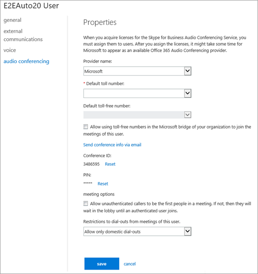

# ユーザーの電話会議の設定を管理します。Manage the Audio Conferencing settings for a user

Office 365 管理者の場合は、電話会議の設定を編集することができます: プロバイダー、既定の有料またはフリー ダイヤル番号、会議 ID、PIN など、組織内の個々 のユーザーのします。組織の設定を編集する場合は、[組織用の電話会議の設定を管理する](manage-the-audio-conferencing-settings-for-my-organization.md)を参照してください。As an Office 365 admin, you can edit the Audio Conferencing settings—such as the provider, default toll or toll-free number, conference ID, or PIN—for an individual user in your organization. If you want to edit settings for your organization, see [Manage the Audio Conferencing settings for my organization](manage-the-audio-conferencing-settings-for-my-organization.md).
  

  
1. 職場または学校のアカウントで Office 365 にサインインします。Sign in to Office 365 with your work or school account.
    
2. **管理センター**] を選びます > **Skype for Business**します。Choose **Admin centers** > **Skype for Business**.
    
3. Skype for Business 管理センター] では、**ユーザー**を選択します。In the Skype for Business admin center, choose **Users**.
    
4. 設定を管理するユーザーを選択し、[アクション] ウィンドウで、[**編集**] をクリックしてします。Select the user for whom you want to manage settings, and then in the Action pane, click **Edit**.
    
5. 左のナビゲーションで**電話会議**を選択し、[ユーザーの [**プロパティ**] ページで、次のいずれかを変更します。Choose **Audio conferencing** in the left navigation, and then on the **Properties** page for the user, modify any of the following:
    
|**設定****Setting**|**{Description}****Description**|
|:-----|:-----|
|**プロバイダー名****Provider name**   |リストから、プロバイダーを選択します。Choose your provider from the list.     **メモ:**次の表の他の設定は、電話会議プロバイダーとして Microsoft を選ぶ場合にのみに適用します。**Note:** The remaining settings in this table apply only if you select Microsoft as the audio conferencing provider.           |
|**既定の電話番号**(必須)**Default toll number** (required)   |サード パーティのプロバイダーでは、これらの電話番号は、電話会議プロバイダーから受信したものです。ユーザーが電話会議プロバイダーとして Microsoft を使用している場合は、電話会議ブリッジに設定されている数値これらがされます。[数値の書式を設定して、ビジネスや Microsoft チーム会議出席依頼の Skype で表示されるようにしたいとします。For a third-party providers, these phone numbers are the ones you received from the audio conferencing provider. If the user is using Microsoft as the audio conferencing provider, these will be numbers that are set on the audio conferencing bridge. Format the numbers as you want them to appear in Skype for Business and Microsoft Teams meeting requests.    |
|**既定のフリー ダイヤル umber****Default toll-free umber**   |サード パーティのプロバイダーでは、これらの電話番号は、電話会議プロバイダーから受信したものです。ユーザーが電話会議プロバイダーとして Microsoft を使用している場合は、電話会議ブリッジに設定されている数値これらがされます。[数値の書式を設定して、ビジネスや Microsoft チーム会議出席依頼の Skype で表示されるようにしたいとします。For a third-party providers, these phone numbers are the ones you received from the audio conferencing provider. If the user is using Microsoft as the audio conferencing provider, these will be numbers that are set on the audio conferencing bridge. Format the numbers as you want them to appear in Skype for Business and Microsoft Teams meeting requests.    |
|**組織の Microsoft ブリッジのフリー ダイヤルの番号を使用して、このユーザーの会議に参加する許可します。****Allow using toll-free numbers in the Microsoft bridge of your organization to join the meetings of this user**   |会議に参加するため、ユーザーのフリー ダイヤルの番号を入力できるようにする場合は、このオプションを選択します。Select this option if you want to allow the user of toll-free numbers for joining meetings.    |
|**会議情報を電子メールで送信します。****Send conference info via email**   |すぐにだれかの電話会議用の ID と電話番号をユーザーにメールを送信する場合にのみ、このリンクをクリックします。(このメールは含まれません PIN。)[この情報は、電話会議情報を持つユーザーに電子メールを送信](send-an-email-to-a-user-with-their-dial-in-information.md)を参照してください。Click this link only if you want to immediately send an email to the user with his or her conference ID and phone number. (This email does not include the PIN.) See [Send an email to a user with their Audio Conferencing information](send-an-email-to-a-user-with-their-dial-in-information.md).    |
|**電話会議 ID****Conference ID**   |ユーザーの会議 ID をリセットする必要がある場合は、[**リセット**] を選びます。詳細については、[ユーザーの会議 ID をリセットする](reset-a-conference-id-for-a-user.md)を参照してください。Select **Reset** if you need to reset the conference ID for the user. For more information, see [Reset a conference ID for a user](reset-a-conference-id-for-a-user.md).    |
|**暗証番号 (PIN)****PIN**   |ユーザーの PIN をリセットする必要がある場合は、[**リセット**] を選びます。詳細については、[ユーザーの音声会議の PIN のリセット](reset-the-audio-conferencing-pin-for-a-user.md)を参照してください。Select **Reset** if you need to reset the PIN for the user. For more information, see [Reset the Audio Conferencing PIN for a user](reset-the-audio-conferencing-pin-for-a-user.md).    |
|**会議内の最初のユーザーを認証されていない呼び出しを許可します。****Allow unauthenticated callers to be the first people in a meeting**   |最初に会議に参加する認証されていない呼び出しを許可するには、このオプションを選択します。Select this option to allow unauthenticated callers to be the first to join meetings.    |
|**このユーザーの会議からダイヤル アウトする制限****Restrictions to dial-outs from meetings of this user**   |ダイヤル アウトを国内のみに制限する場合、または会議からすべてダイヤル アウトできないようにする場合は、ボックスの一覧でオプションを選択します。Select an option in this list if you want to restrict dial-outs to domestic only, or if you want to prevent all dial-outs from meetings.    |
   
## 関連トピックRelated topics

[組織用の電話会議の設定を管理します。Manage the Audio Conferencing settings for my organization](manage-the-audio-conferencing-settings-for-my-organization.md)

[Skype for Business とチームの Microsoft の音声会議をセットアップする設定します。Set up Audio Conferencing for Skype for Business and Microsoft Teams](set-up-audio-conferencing.md)
  
[音声会議よく寄せられる質問Audio Conferencing common questions](audio-conferencing-common-questions.md)
  

