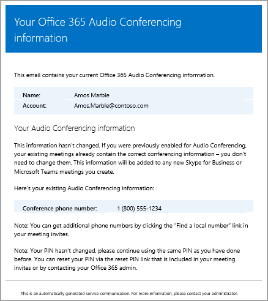

# <a name="send-an-email-to-a-user-with-their-audio-conferencing-information"></a><span data-ttu-id="ddb56-103">ユーザーにダイヤルイン会議情報が含まれたメールを送信する</span><span class="sxs-lookup"><span data-stu-id="ddb56-103">Send an email to a user with their Audio Conferencing information</span></span>

<span data-ttu-id="ddb56-104">ビジネスまたはマイクロソフトのチームのユーザーの Skype の電話会議の情報を送信する必要があります。</span><span class="sxs-lookup"><span data-stu-id="ddb56-104">Sometimes Skype for Business or Microsoft Teams users may need you to send them their Audio Conferencing information.</span></span> <span data-ttu-id="ddb56-105">**Skype**を使用してクリックして**電子メールを使用して会議情報を送信する**ユーザーのプロパティ] の下で、これを行うことができます。</span><span class="sxs-lookup"><span data-stu-id="ddb56-105">You can do this by using the **Skype for Business admin center** and clicking **Send conference info via email** under the properties for a user.</span></span> <span data-ttu-id="ddb56-106">この電子メールを送信するとき、すべてが含まれますのオーディオ会議の情報を含みます。</span><span class="sxs-lookup"><span data-stu-id="ddb56-106">When you send this email, it will contain all of the audio conferencing information, including:</span></span>
  
- <span data-ttu-id="ddb56-107">ユーザー用の会議の電話番号またはダイヤルイン電話番号。</span><span class="sxs-lookup"><span data-stu-id="ddb56-107">The conference phone or dial-in phone number for the user.</span></span>
    
- <span data-ttu-id="ddb56-108">ユーザーの会議 ID。</span><span class="sxs-lookup"><span data-stu-id="ddb56-108">The user's conference ID.</span></span>
    
   
<span data-ttu-id="ddb56-109">送信されるメールの例を以下に示します。</span><span class="sxs-lookup"><span data-stu-id="ddb56-109">Here is an example of the email that is sent:</span></span>
  


> [!NOTE]
> [!INCLUDE [updating-admin-interfaces](../includes/updating-admin-interfaces.md)]
  
## <a name="send-an-email-with-audio-conferencing-information-to-a-user"></a><span data-ttu-id="ddb56-111">オーディオ会議の情報を使用して電子メールをユーザーに送信します。</span><span class="sxs-lookup"><span data-stu-id="ddb56-111">Send an email with audio conferencing information to a user</span></span>

<span data-ttu-id="ddb56-112"> **、マイクロソフトのチームとビジネス管理センターの Skype を使用します。**</span><span class="sxs-lookup"><span data-stu-id="ddb56-112"> **Using the Microsoft Teams and Skype for Business Admin Center**</span></span>

1. <span data-ttu-id="ddb56-113">左側のナビゲーションでは、**ユーザー**] をクリックしてで使用可能なユーザーの一覧からユーザーを選択します。</span><span class="sxs-lookup"><span data-stu-id="ddb56-113">In the left navigation, click **Users**, and then select the user from the list of available users.</span></span>

2. <span data-ttu-id="ddb56-114">ページの上部で、[**編集**] をクリックします。</span><span class="sxs-lookup"><span data-stu-id="ddb56-114">At the top of the page, click **Edit**.</span></span>

<span data-ttu-id="ddb56-115"> **Skype for Business の管理センターを使用する**</span><span class="sxs-lookup"><span data-stu-id="ddb56-115"> **Using the Skype for Business admin center**</span></span>

1. <span data-ttu-id="ddb56-116">左側のナビゲーションでは、**ユーザー**] をクリックしてで使用可能なユーザーの一覧からユーザーを選択します。</span><span class="sxs-lookup"><span data-stu-id="ddb56-116">In the left navigation, click **Users**, and then select the user from the list of available users.</span></span>

2. <span data-ttu-id="ddb56-117">ページの上部で、[**編集**] をクリックします。</span><span class="sxs-lookup"><span data-stu-id="ddb56-117">At the top of the page, click **Edit**.</span></span>

3. <span data-ttu-id="ddb56-118">[**オーディオ会議****電子メールで会議の情報を送信**をクリックします。</span><span class="sxs-lookup"><span data-stu-id="ddb56-118">Under **Audio Conferencing**, click **Send conference info in email**.</span></span>

1. <span data-ttu-id="ddb56-119">職場または学校のアカウントを使用して、Office 365 にサインインします。</span><span class="sxs-lookup"><span data-stu-id="ddb56-119">Sign in to Office 365 with your work or school account.</span></span>
    
2. <span data-ttu-id="ddb56-120">**Office 365 管理センター**を参照して > **ビジネス用の Skype**では、左側のナビゲーションで [**電話会議**] をクリックします。</span><span class="sxs-lookup"><span data-stu-id="ddb56-120">Go to the **Office 365 admin center** > **Skype for Business**, and in the left navigation, click **Audio conferencing**.</span></span>
    
3. <span data-ttu-id="ddb56-121">**ユーザー**] をクリックし、ユーザーを選択します。</span><span class="sxs-lookup"><span data-stu-id="ddb56-121">Click **Users**, and then select the user.</span></span>
    
4. <span data-ttu-id="ddb56-122">操作ウィンドウで、[ **電話会議情報をメールで送信**] をクリックします。</span><span class="sxs-lookup"><span data-stu-id="ddb56-122">In the Action pane, click **Send conference info via email**.</span></span>
    
> [!TIP]
> <span data-ttu-id="ddb56-123">送信することも電子メール ユーザーに電話会議の設定を使用してユーザーのプロパティを編集し、[**電話会議**] をクリックして > **メールでの会議の情報を送信**します。</span><span class="sxs-lookup"><span data-stu-id="ddb56-123">You can also send email to the user with the audio conferencing settings by editing the user's properties and then clicking **Audio conferencing** > **Send conference info via email**.</span></span> 

## <a name="what-else-should-you-know-about-this-email"></a><span data-ttu-id="ddb56-124">このようなメールについて知っておくべきその他のこと</span><span class="sxs-lookup"><span data-stu-id="ddb56-124">What else should you know about this email?</span></span>

- <span data-ttu-id="ddb56-125">送信される、組織内のユーザーを有効にした後には、オーディオ会議のいくつかの電子メールがあります。</span><span class="sxs-lookup"><span data-stu-id="ddb56-125">There are several emails that are sent to users in your organization after they are enabled for audio conferencing:</span></span>
    
  - <span data-ttu-id="ddb56-126">ときに、**オーディオ会議**のライセンスが割り当てられます。</span><span class="sxs-lookup"><span data-stu-id="ddb56-126">When an **Audio Conferencing** license is assigned to them.</span></span>
    
  - <span data-ttu-id="ddb56-127">リセットすると手動で電話会議のユーザーの暗証番号 (pin) です。</span><span class="sxs-lookup"><span data-stu-id="ddb56-127">When you manually reset the user's audio conferencing PIN.</span></span>
    
  - <span data-ttu-id="ddb56-128">ユーザーの会議 ID を手動でリセットした場合。</span><span class="sxs-lookup"><span data-stu-id="ddb56-128">When you manually reset the user's conference ID.</span></span>
    
  - <span data-ttu-id="ddb56-129">これらのファイルから、**オーディオ会議**のライセンスが削除されます。</span><span class="sxs-lookup"><span data-stu-id="ddb56-129">When an **Audio Conferencing** license is removed from them.</span></span>
    
  - <span data-ttu-id="ddb56-130">オーディオ会議プロバイダーのユーザーの変更されたとき Microsoft から別のプロバイダーまたは **[なし]** にします。</span><span class="sxs-lookup"><span data-stu-id="ddb56-130">When the audio conferencing provider for a user is changed from Microsoft to another provider or **None**.</span></span>
    
  - <span data-ttu-id="ddb56-131">マイクロソフトにユーザーの電話会議プロバイダーが変更されたとき。</span><span class="sxs-lookup"><span data-stu-id="ddb56-131">When the audio conferencing provider for a user is changed to Microsoft.</span></span>
    
- <span data-ttu-id="ddb56-132">既定では、電子メールの送信者は、Office 365 からされますが、メール アドレスの変更し、Windows PowerShell と[セット CsOnlineDialInConferencingTenantSettings](https://go.microsoft.com/fwlink/?LinkId=708983)コマンドレットを使用して名前を表示できます。</span><span class="sxs-lookup"><span data-stu-id="ddb56-132">By default, the sender of the emails will be from Office 365, but you can change the email address and display name by using Windows PowerShell and the [Set-CsOnlineDialInConferencingTenantSettings](https://go.microsoft.com/fwlink/?LinkId=708983) cmdlet.</span></span> <span data-ttu-id="ddb56-133">ユーザーに電子メールを送信する電子メール アドレスを変更するには、次の操作を行う必要があります。</span><span class="sxs-lookup"><span data-stu-id="ddb56-133">To make changes to the email address that is sending the email to users, you must:</span></span>
    
  - <span data-ttu-id="ddb56-134">Enter the email display name in the  SendEmailFromDisplayName parameter.</span><span class="sxs-lookup"><span data-stu-id="ddb56-134">Enter the email address in the SendEmailFromAddress parameter.</span></span>
    
  - <span data-ttu-id="ddb56-135">メール アドレス情報を変更したい場合は、カスタムのメール アドレスから送信されるメールが、組織の受信メール ポリシーで許可されていることを確認する必要があります。</span><span class="sxs-lookup"><span data-stu-id="ddb56-135">Set the SendEmailOverride parameter to True.</span></span>
    
  - <span data-ttu-id="ddb56-136">SendEmailFromDisplayName パラメーターでは、電子メールの表示名を入力します。</span><span class="sxs-lookup"><span data-stu-id="ddb56-136">Enter the email display name in the SendEmailFromDisplayName parameter.</span></span>
    
     `Set-CsOnlineDialInConferencingTenantSetting -SendEmailOverride $true -SendEmailFromAddress amos.marble@contoso.com -SendEmailFromDisplayName "Amos Marble"`
    
    > [!NOTE]
    > <span data-ttu-id="ddb56-137">メール アドレス情報を変更する場合、設定した独自のメール アドレスから送信されるメールが、組織の受信メール ポリシーで許可されることを確認する必要があります。</span><span class="sxs-lookup"><span data-stu-id="ddb56-137">If you want to change the email address information, you need to make sure that the inbound email policies of your organization allow emails that come from the custom email address that is set.</span></span> 
  
## <a name="want-to-know-how-to-manage-with-windows-powershell"></a><span data-ttu-id="ddb56-138">Windows PowerShell で管理する方法</span><span class="sxs-lookup"><span data-stu-id="ddb56-138">Want to know how to manage with Windows PowerShell?</span></span>

- <span data-ttu-id="ddb56-139">時間を節約したり、自動化したりするには、[Set-CsOnlineDialInConferencingUser](https://go.microsoft.com/fwlink/?LinkId=617688 ) コマンドレットを使用できます。</span><span class="sxs-lookup"><span data-stu-id="ddb56-139">To save time or automate this, you can use the [Set-CsOnlineDialInConferencingUser](https://go.microsoft.com/fwlink/?LinkId=617688 ) cmdlet.</span></span>
    
    <span data-ttu-id="ddb56-140">音声会議情報を使用してユーザーに電子メールを送信するのには、次の手順を実行します。</span><span class="sxs-lookup"><span data-stu-id="ddb56-140">To send an email to the user with their audio conferencing information, run the following:</span></span>
    
  ```
  Set-CsOnlineDialInConferencingUser -id amos.marble@contoso.com  -SendEmail
  ```

-  <span data-ttu-id="ddb56-p103">Windows PowerShell の場合、Skype for Business Online はユーザーの管理と、ユーザーが許可されている操作や許可されていない操作の管理に使います。Windows PowerShell により、単一の管理ポイントを使って Office 365 を管理でき、複数の作業を実行する必要があるときに日常業務を合理化できます。Windows PowerShell を使い始めるには、次のトピックを参照してください。</span><span class="sxs-lookup"><span data-stu-id="ddb56-p103">When it comes to Windows PowerShell, Skype for Business Online is all about managing users and what users are allowed or not allowed to do. With Windows PowerShell, you can manage Office 365 using a single point of administration that can simplify your daily work when you have multiple tasks to do. To get started with Windows PowerShell, see these topics:</span></span>
    
  - [<span data-ttu-id="ddb56-144">Windows PowerShell で Office 365 を管理するための最善の方法</span><span class="sxs-lookup"><span data-stu-id="ddb56-144">Why you need to use Office 365 PowerShell</span></span>](https://go.microsoft.com/fwlink/?LinkId=525041)
    
  - [<span data-ttu-id="ddb56-145">Windows PowerShell で Office 365 を管理するための最善の方法</span><span class="sxs-lookup"><span data-stu-id="ddb56-145">Best ways to manage Office 365 with Windows PowerShell</span></span>](https://go.microsoft.com/fwlink/?LinkId=525142)
    
- <span data-ttu-id="ddb56-p104">多くのユーザーの設定を同時に変更するときなどは、Office 365 管理センターのみを使用するよりも、Windows PowerShell の方に、速度、わかりやすさ、生産性の点で多くのメリットがあります。 次のトピックで、これらの利点を説明します。</span><span class="sxs-lookup"><span data-stu-id="ddb56-p104">Windows PowerShell has many advantages in speed, simplicity, and productivity over only using the Office 365 admin center, such as when you are making setting changes for many users at one time. Learn about these advantages in the following topics:</span></span> 
    
  - [<span data-ttu-id="ddb56-148">Windows PowerShell と Lync Online の概要</span><span class="sxs-lookup"><span data-stu-id="ddb56-148">An introduction to Windows PowerShell and Skype for Business Online</span></span>](https://go.microsoft.com/fwlink/?LinkId=525039)
    
    [<span data-ttu-id="ddb56-149">Windows PowerShell による Skype for Business Online の管理</span><span class="sxs-lookup"><span data-stu-id="ddb56-149">Using Windows PowerShell to manage Skype for Business Online</span></span>](https://go.microsoft.com/fwlink/?LinkId=525453)
    
  - [<span data-ttu-id="ddb56-150">Windows PowerShell を使用した一般的な Skype for Business Online の管理タスクの実行</span><span class="sxs-lookup"><span data-stu-id="ddb56-150">Using Windows PowerShell to do common Skype for Business Online management tasks</span></span>](https://go.microsoft.com/fwlink/?LinkId=525038)
    
    > [!NOTE]
    > <span data-ttu-id="ddb56-p105">[Windows PowerShell を使用した一般的な Skype for Business Online の管理タスクの実行](https://go.microsoft.com/fwlink/?LinkId=294688)</span><span class="sxs-lookup"><span data-stu-id="ddb56-p105">The Windows PowerShell module for Skype for Business Online enables you to create a remote Windows PowerShell session that connects to Skype for Business Online. This module, which is supported only on 64-bit computers, can be downloaded from the Microsoft Download Center at [Windows PowerShell Module for Skype for Business Online.](https://go.microsoft.com/fwlink/?LinkId=294688)</span></span>
  
## <a name="related-topics"></a><span data-ttu-id="ddb56-153">このモジュールは、64 ビットのコンピューターでのみサポートされ、Microsoft ダウンロード センターの「Skype for Business Online 用 Windows PowerShell モジュール」からダウンロードできます。</span><span class="sxs-lookup"><span data-stu-id="ddb56-153">Related topics</span></span>

[<span data-ttu-id="ddb56-154">Office 365 での電話会議を使用または購入する</span><span class="sxs-lookup"><span data-stu-id="ddb56-154">Try or purchase Audio Conferencing in Office 365</span></span>](../audio-conferencing-in-office-365/try-or-purchase-audio-conferencing-in-office-365.md)
