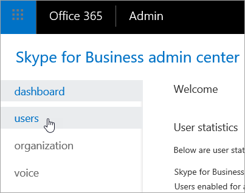
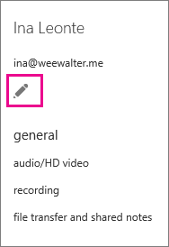

# <a name="set-the-phone-numbers-included-on-invites"></a><span data-ttu-id="ea164-103">携帯電話への招待に含まれている番号を設定します。</span><span class="sxs-lookup"><span data-stu-id="ea164-103">Set the phone numbers included on invites</span></span>

<span data-ttu-id="ea164-104">ビジネスおよびマイクロソフトのチーム会議では、Skype を作成し、電話を使用してその会議にダイヤルインするユーザーを許可し、組織内のユーザーを Office 365 での音声会議に使用できます。</span><span class="sxs-lookup"><span data-stu-id="ea164-104">Audio Conferencing in Office 365 enables users in your organization to create Skype for Business and Microsoft Teams meetings, and then allow users to dial in to those meetings using a phone.</span></span> <span data-ttu-id="ea164-105">、Office 365 では、マイクロソフトのオーディオ会議ブリッジまたは、承認済みの音声会議プロバイダー (ACP) によってホストされているサード ・ パーティ製のオーディオ会議ブリッジを使用するオプションがあります。</span><span class="sxs-lookup"><span data-stu-id="ea164-105">In Office 365, you have the option of using a Microsoft audio conferencing bridge or a third-party audio conferencing bridge that is hosted by an approved audio conferencing provider (ACP).</span></span>
  
> [!NOTE]
> <span data-ttu-id="ea164-106">電話会議のすべてのダイヤルイン番号のリストを含んでいるリソースはありません。</span><span class="sxs-lookup"><span data-stu-id="ea164-106">There isn't a resource that contains a listing of all of the dial-in numbers for Audio Conferencing.</span></span> <span data-ttu-id="ea164-107">かどうかダイヤルインの電話番号では、領域または国/地域を表示するを検索する場合は、 **Skype**を使用して、 > **音声** > **の電話番号**をクリックし、**追加**新しいサービスの番号を****.</span><span class="sxs-lookup"><span data-stu-id="ea164-107">If you are looking to see if there are dial-in phone numbers available in your area or country/region, use the **Skype for Business admin center** > **Voice** > **Phone Numbers**, click **Add** then **New Service Numbers**.</span></span> <span data-ttu-id="ea164-108">**国/地域**、**状態の範囲のリストを使用して**と検索をフィルター処理する**市区町村**> また、有料無料のサービスの番号を検索する場合は、**フリー ダイヤル**から**の状態または地域を選択**リストです。</span><span class="sxs-lookup"><span data-stu-id="ea164-108">Use the lists for **Country/Region**, **State/Region** and **City** to filter your search.> Also, if you are looking for toll free service numbers, select **Toll-Free** from the **State/Region** list.</span></span>
  
<span data-ttu-id="ea164-p103">会議ブリッジは、組織用のダイヤルイン電話番号のセットを提供します。これらの番号はすべて会議開催者が作成した会議に参加するために使用できますが、会議出席依頼にどの番号を含めるか選ぶことができます。</span><span class="sxs-lookup"><span data-stu-id="ea164-p103">A conferencing bridge gives you a set of dial-in phone numbers for your organization. All of them can be used to join the meetings that a meeting organizer has created, but you can select which ones will be included on their meeting invites.</span></span>
  
> [!NOTE]
> <span data-ttu-id="ea164-111">会議主催者の会議出席依頼には、1 つの有料電話番号と 1 つの無料電話番号を含めることができますが、会議出席依頼の下部に、会議に参加するために使用できるダイヤルイン電話番号のすべての一覧を表示するリンクも記載されています。</span><span class="sxs-lookup"><span data-stu-id="ea164-111">There can be a maximum of one toll and one toll-free phone number on the meeting invite for a meeting organizer, but there is also a link located at the bottom of each meeting invite that opens the full list of all dial-in phone numbers that can be used to join a meeting.</span></span> 
  
## <a name="setting-the-default-dial-in-phone-number-for-a-meeting-organizer"></a><span data-ttu-id="ea164-112">会議開催者の既定のダイヤルイン電話番号の設定</span><span class="sxs-lookup"><span data-stu-id="ea164-112">Setting the default dial-in phone number for a meeting organizer</span></span>

1. <span data-ttu-id="ea164-113">職場または学校のアカウントを使用して、Office 365 にサインインします。</span><span class="sxs-lookup"><span data-stu-id="ea164-113">Sign in to Office 365 with your work or school account.</span></span>
    
2. <span data-ttu-id="ea164-114">Choose **Admin centers** > **Skype for Business**.</span><span class="sxs-lookup"><span data-stu-id="ea164-114">Choose **Admin centers** > **Skype for Business**.</span></span>
    
3. <span data-ttu-id="ea164-115">[ **ユーザー**] を選びます。</span><span class="sxs-lookup"><span data-stu-id="ea164-115">Choose **Users**.</span></span>
    
    
  
4. <span data-ttu-id="ea164-117">編集しユーザーを選択します。</span><span class="sxs-lookup"><span data-stu-id="ea164-117">Choose the users you want to edit:</span></span>
    
  - <span data-ttu-id="ea164-118">1 人のユーザーを選択するには、ユーザーの名前を選択します。</span><span class="sxs-lookup"><span data-stu-id="ea164-118">To select a single user, select the user's name.</span></span>
    
  - <span data-ttu-id="ea164-119">ページ上のすべてのユーザーを選択するには、リストの上部にある**表示名**の横のボックスを選択します。</span><span class="sxs-lookup"><span data-stu-id="ea164-119">To select all users on the page, select the box next to **Display name** at the top of the list.</span></span>
    
  - <span data-ttu-id="ea164-120">複数のユーザーを選択するには、各ユーザーの名前の横のボックスを選択します。</span><span class="sxs-lookup"><span data-stu-id="ea164-120">To select multiple users, select the box next to each user's name.</span></span>
    
5. <span data-ttu-id="ea164-121">右側のウィンドウで、[ **編集**] を選びます。</span><span class="sxs-lookup"><span data-stu-id="ea164-121">In the right panel, choose **Edit**.</span></span>
    
    
  
6. <span data-ttu-id="ea164-123">**オーディオ会議**を選択します。</span><span class="sxs-lookup"><span data-stu-id="ea164-123">Choose **Audio conferencing**.</span></span>
    
7. <span data-ttu-id="ea164-124">[**のプロパティ**] ページで、[**プロバイダー名**] ボックスの一覧でユーザーのプロバイダーを選択します。</span><span class="sxs-lookup"><span data-stu-id="ea164-124">On the **Properties** page, in the **Provider name** list, choose the provider for the user.</span></span> <span data-ttu-id="ea164-125">プロバイダーに応じて、次のボックスに入力します。</span><span class="sxs-lookup"><span data-stu-id="ea164-125">Depending on the provider, complete the following boxes.</span></span>
    
  - <span data-ttu-id="ea164-126">**マイクロソフトではプロバイダー**:**既定の有料電話番号**を使用し、ユーザーの既定の番号を選択するのには**既定の無料電話番号**を一覧表示します。</span><span class="sxs-lookup"><span data-stu-id="ea164-126">**Microsoft is the provider**: Use the **Default toll number** and **Default toll-free number** lists to select the default numbers for the user.</span></span>
    
    > [!NOTE]
    > <span data-ttu-id="ea164-127">ユーザーの既定の無料電話番号として設定できるようになるには、少なくとも 1 つの無料電話番号が会議ブリッジに割り当てられている必要があります。</span><span class="sxs-lookup"><span data-stu-id="ea164-127">At least one toll-free number must be assigned to your conferencing bridge before it can be set as the default toll-free number of a user.</span></span> <span data-ttu-id="ea164-128">フリー ダイヤル番号を取得するには、 [Skype のビジネスおよびマイクロソフトのチームの取得サービスの電話番号](../what-is-phone-system-in-office-365/getting-service-phone-numbers.md)を参照してください。</span><span class="sxs-lookup"><span data-stu-id="ea164-128">To get a toll-free number, see [Getting service phone numbers for Skype for Business and Microsoft Teams](../what-is-phone-system-in-office-365/getting-service-phone-numbers.md).</span></span> 
  
  - <span data-ttu-id="ea164-129">**サード パーティ プロバイダー**:**有料電話番号**や**フリー ダイヤル番号**のフィールドを使用して、ユーザーの数値を入力します。</span><span class="sxs-lookup"><span data-stu-id="ea164-129">**A third-party is the provider**: Use the **Toll number** and **Toll-free number** fields to enter the numbers for the user.</span></span>
    
## <a name="reset-audio-conferencing-phone-numbers"></a><span data-ttu-id="ea164-130">電話会議の電話番号をリセットする</span><span class="sxs-lookup"><span data-stu-id="ea164-130">Reset audio conferencing phone numbers</span></span>

1. <span data-ttu-id="ea164-131">[ **Skype for Business 管理センター**] で、[ **電話会議**] を選びます。</span><span class="sxs-lookup"><span data-stu-id="ea164-131">In the **Skype for Business admin center**, choose **Audio conferencing**.</span></span>
    
2. <span data-ttu-id="ea164-132">ページの上部で、[ **ユーザー**] を選びます。</span><span class="sxs-lookup"><span data-stu-id="ea164-132">At the top of the page, choose **Users**.</span></span>
    
3. <span data-ttu-id="ea164-133">、リセットするユーザーを選択し、アクション ペインで、[**クリア**] をクリックします。</span><span class="sxs-lookup"><span data-stu-id="ea164-133">Choose the users you want to reset, and then in the Action pane, click **Clear**.</span></span>
    
<span data-ttu-id="ea164-134">既定では、ユーザーの会議の設定を変更すると、ユーザーに電子メールが送信されます。</span><span class="sxs-lookup"><span data-stu-id="ea164-134">By default, when you change a user's conferencing settings, an email is sent to the user.</span></span> <span data-ttu-id="ea164-135">これを変更する場合は、「[電話会議の設定が変更されたときのメールの自動送信を有効または無効にする](enable-or-disable-sending-emails-when-their-settings-change.md)」をご覧ください。</span><span class="sxs-lookup"><span data-stu-id="ea164-135">To change this, see [Enable or disable sending emails when Audio Conferencing settings change](enable-or-disable-sending-emails-when-their-settings-change.md).</span></span>
  
> [!IMPORTANT]
> <span data-ttu-id="ea164-136">ユーザーの電話会議設定を変更するときは、繰り返し発生する今後の Skype for Business 会議および Microsoft Teams 会議が更新されて、出席者に送信されるようにする必要があります。</span><span class="sxs-lookup"><span data-stu-id="ea164-136">When you change a user's audio conferencing settings, recurring and future Skype for Business and Microsoft Teams meetings must be updated and sent to attendees.</span></span> 
  
## <a name="want-to-know-how-to-manage-with-windows-powershell"></a><span data-ttu-id="ea164-137">Windows PowerShell で管理する方法</span><span class="sxs-lookup"><span data-stu-id="ea164-137">Want to know how to manage with Windows PowerShell?</span></span>

- <span data-ttu-id="ea164-138">時間を節約したり、自動化したりするには、[Set-CsOnlineDialInConferencingUser](https://go.microsoft.com/fwlink/?LinkId=617688) コマンドレットを使用できます。</span><span class="sxs-lookup"><span data-stu-id="ea164-138">To save time or automate this, you can use the [Set-CsOnlineDialInConferencingUser](https://go.microsoft.com/fwlink/?LinkId=617688) cmdlet.</span></span>
    
- <span data-ttu-id="ea164-139">特定ユーザーのデフォルトの有料または無料電話番号を変更するには、[[Set-CsOnlineDialInConferencingUser](https://go.microsoft.com/fwlink/?LinkId=617688)] コマンドレットを使用します。</span><span class="sxs-lookup"><span data-stu-id="ea164-139">Use the [Set-CsOnlineDialInConferencingUser](https://go.microsoft.com/fwlink/?LinkId=617688) cmdlet to change the default toll or toll-free number for specific users.</span></span>
    
    <span data-ttu-id="ea164-140">ユーザーのデフォルトの無料電話番号を変更するには、次を実行します。</span><span class="sxs-lookup"><span data-stu-id="ea164-140">To change the default toll-free number for a user, run:</span></span>
    
  ```
  Set-CsOnlineDialinConferencingUser -Identity amos.marble@Contoso.com -TollFreeServiceNumber   +180045551234
  ```

- <span data-ttu-id="ea164-141">ユーザーの元の既定の電話番号または所在地に基づいて既定の有料または無料電話番号を変更するには、 **Set-CsOnlineDialInConferencingUserDefaultNumber** コマンドレットを使用します。</span><span class="sxs-lookup"><span data-stu-id="ea164-141">Use the **Set-CsOnlineDialInConferencingUserDefaultNumber** cmdlet to change the default toll or toll-free number of users based on their original default number or their location.</span></span>
    
    > [!NOTE]
    > <span data-ttu-id="ea164-142">BridgeID を探すには、 **Get-CsOnlineDialInConferencingBridge** を使用します。</span><span class="sxs-lookup"><span data-stu-id="ea164-142">To find the BridgeID, use the **Get-CsOnlineDialInConferencingBridge**.</span></span>
  
  ```
  Set-CsOnlineDialInConferencingUserDefaultNumber -FromNumber +18005551234 -ToNumber +18005551239 NumberType TollFree -BridgeId <Bridge Id> -RescheduleMeetings 
  ```

  - <span data-ttu-id="ea164-143">既定の無料電話番号がないユーザー全員の無料電話番号を既定で +18005551234 に設定するには、次を実行します。</span><span class="sxs-lookup"><span data-stu-id="ea164-143">To set the default toll-free number for all users without one to +18005551234, run:</span></span>
    
  ```
  Set-CsOnlineDialInConferencingUserDefaultNumber -FromNumber $null -ToNumber +18005551234 -NumberType TollFree -BridgeId <Bridge Id>  
  ```

  - <span data-ttu-id="ea164-144">既定の無料電話番号が +18005551234 のユーザー全員の無料電話番号を既定で +18005551239 に変更するには、次を実行します。</span><span class="sxs-lookup"><span data-stu-id="ea164-144">To change the default toll-free number of all users that have +18005551234 as their default toll-free number to +18005551239, run:</span></span>
    
  ```
  Set-CsOnlineDialInConferencingUserDefaultNumber -FromNumber +18005551234 -ToNumber +18005551239 NumberType TollFree -BridgeId <Bridge Id>
  ```

  - <span data-ttu-id="ea164-145">所在地が米国内のユーザー全員の既定の無料電話番号を +18005551234 に設定するには、次を実行します。</span><span class="sxs-lookup"><span data-stu-id="ea164-145">To set the default toll-free number of all users located in the U.S. to +18005551234, run:</span></span>
    
  ```
  Set-CsOnlineDialInConferencingUserDefaultNumber -Country US -ToNumber +18005551234 -NumberType TollFree -BridgeId <Bridge Id>
  ```
## <a name="want-to-learn-more-about-windows-powershell"></a><span data-ttu-id="ea164-146">Windows PowerShell に関する詳細についてはしますか。</span><span class="sxs-lookup"><span data-stu-id="ea164-146">Want to learn more about Windows PowerShell?</span></span>
- <span data-ttu-id="ea164-p107">Windows PowerShell で行うのは、ユーザーを管理し、ユーザーに何を許可して何を禁止するかを管理することです。Windows PowerShell を利用すると、Office 365 と Skype for Business Online の管理を 1 か所で行うことができるので、複数のタスクを担当する管理者の日常業務を単純化できます。Windows PowerShell の使用を開始するには、次のトピックを参照してください。</span><span class="sxs-lookup"><span data-stu-id="ea164-p107">When it comes to Windows PowerShell is all about managing users and what users are allowed or not allowed to do. With Windows PowerShell, you can manage Office 365 and Skype for Business Online using a single point of administration that can simplify your daily work, when you have multiple tasks to do. To get started with Windows PowerShell, see these topics:</span></span>
    
  - [<span data-ttu-id="ea164-150">Windows PowerShell と Skype for Business Online の概要</span><span class="sxs-lookup"><span data-stu-id="ea164-150">An introduction to Windows PowerShell and Skype for Business Online</span></span>](https://go.microsoft.com/fwlink/?LinkId=525039)
    
  - [<span data-ttu-id="ea164-151">Windows PowerShell で Office 365 を管理するための最善の方法</span><span class="sxs-lookup"><span data-stu-id="ea164-151">Why you need to use Office 365 PowerShell</span></span>](https://go.microsoft.com/fwlink/?LinkId=525041)
    
- <span data-ttu-id="ea164-p108">Windows PowerShell には、ただ Office 365 管理センターを使用するだけではなく、速度、単純さ、生産性において多くの利点があります。次のトピックでこれらの利点について説明します。</span><span class="sxs-lookup"><span data-stu-id="ea164-p108">Windows PowerShell has many advantages in speed, simplicity, and productivity over only using the Office 365 admin center such as when you are making setting changes for many users at one time. Learn about these advantages in the following topics:</span></span>
    
  - [<span data-ttu-id="ea164-154">Windows PowerShell で Office 365 を管理するための最善の方法</span><span class="sxs-lookup"><span data-stu-id="ea164-154">Best ways to manage Office 365 with Windows PowerShell</span></span>](https://go.microsoft.com/fwlink/?LinkId=525142)
    
  - [<span data-ttu-id="ea164-155">Windows PowerShell による Skype for Business Online の管理</span><span class="sxs-lookup"><span data-stu-id="ea164-155">Using Windows PowerShell to manage Skype for Business Online</span></span>](https://go.microsoft.com/fwlink/?LinkId=525453)
    
  - [<span data-ttu-id="ea164-156">クイック リファレンス: Windows PowerShell を使用した一般的な Lync Online の管理タスクの実行</span><span class="sxs-lookup"><span data-stu-id="ea164-156">Using Windows PowerShell to do common Skype for Business Online management tasks</span></span>](https://go.microsoft.com/fwlink/?LinkId=525038)
    
## <a name="related-topics"></a><span data-ttu-id="ea164-157">See also</span><span class="sxs-lookup"><span data-stu-id="ea164-157">Related topics</span></span>

[<span data-ttu-id="ea164-158">Office 365 での電話会議を使用または購入する</span><span class="sxs-lookup"><span data-stu-id="ea164-158">Try or purchase Audio Conferencing in Office 365</span></span>](../audio-conferencing-in-office-365/try-or-purchase-audio-conferencing-in-office-365.md)
