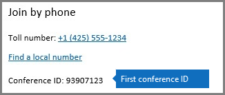

# 組織で電話会議の動的な Id を使用します。Using Audio Conferencing dynamic IDs in your organization

別の会議 Id を使ってビジネスや Microsoft チームの会議の各 Skype を提供するには、音声会議サービスを更新しています。動的会議 Id が大幅に改善静的会議 Id を提供するためです。The Audio Conferencing service is being updated to provide each Skype for Business and Microsoft Teams meeting with different conference IDs. Dynamic conference IDs are a significant improvement over static conference IDs, because they provide:
  
- **強化されたセキュリティ**会議 Id は各 skype for Business または Microsoft チーム会議と一意の会議が予定されているときに生成します。**Enhanced security** The conference IDs are unique for each Skype for Business or Microsoft Teams meeting and are generated when the meeting is being scheduled.
    
- **連続してと並列に会議のエクスペリエンスを向上させる**1 つの開催者の会議には、他の参加者との組み合わせは、他の横にある、スケジュールされているときに中から 1 つの会議の電話で参加しないように特定のダイヤルイン情報が与えられます。**A better experience for back-to-back and side-to-side meetings** Meetings for a single organizer are given specific dial-in information that prevents phone participants of one meeting from being mixed with participants of another one when they're scheduled next to each other.
    
- **シームレスな移行**組織が動的会議 Id を有効にすると、静的会議で、組織内で既にスケジュールされているすべての会議 Id が作業を続けられます。**A seamless transition** When your organization is enabled for dynamic conference IDs, all the meetings that have been already scheduled in your organization with static conference IDs will continue to work.
    
> [!TIP]
> 動的な Id があるのみが有効なユーザーに * * 音声会議 * *、電話会議プロバイダーとして Microsoft があるとします。ユーザーの[電話会議プロバイダーとして Microsoft を割り当てる](assign-microsoft-as-the-audio-conferencing-provider.md)ことができます。Dynamic IDs are only available to users who are enabled for ** Audio Conferencing** and have Microsoft set as their audio conferencing provider. You can [Assign Microsoft as the audio conferencing provider](assign-microsoft-as-the-audio-conferencing-provider.md) for your users.
  
## 自分の所属組織内のユーザーでどのような変更が表示されますか。What changes will the users in my organization see?

組織の動的会議 Id を有効になっている、任意の新しい Skype for Business または Microsoft のチーム会議の音声会議は会議 Id を別のものになりますがある有効になっている、組織内のユーザーによってスケジュールは、静的会議 ID がもします。開催者が固定する前に、会議 Id に参加すること前に、会議の出席依頼で新しい会議 ID を使用する必要がありますが、会議に参加するユーザーに通知する必要があります。After dynamic conference IDs have been enabled for your organization, any new Skype for Business or Microsoft Teams meeting that is scheduled by users in your organization who are enabled for Audio Conferencing will have conference IDs that will be different from the static conference ID they had before. Organizers who had static conference IDs before need to remind the users joining their meetings that they now need to use a new conference ID in the meeting's invite before they can join it.
  
> [!NOTE]
> Id は、影響を与えずに会議をスケジュールする、引き続きように、静的会議 Id を継続動的会議、組織が有効になっている前に静的会議 Id を持つユーザーによってスケジュールされた会議ができます。Meetings that were scheduled by a user with static conference IDs before the organization was enabled for dynamic conference IDs will continue to have the static conference IDs, so they'll continue to schedule meetings without any impact. 
  
次の例は、次の 2 つの Skype for Business 会議を同じユーザーごとの新しいエクスペリエンスを示しますが、両方が 2 つの異なる会議 Id。These examples show you the new experience for two Skype for Business meetings that have been organized by the same user but will both now have two different conference IDs: 
  
 **会議 1**午前 10 時まで 9時 00分 AM からスケジュールされてし、会議 ID として 93907123 があります。**Meeting #1** has been scheduled from 9:00 AM to 10:00 AM and it has 93907123 as its conference ID:
  

  
 11時 00分 AM 10時 00分 AM から同じユーザーが**会議 2**がスケジュール設定されているし、会議 ID として 16353789 があります。**Meeting #2** has been scheduled by the same user from 10:00 AM to 11:00 AM and it has 16353789 as its conference ID:
  

  
## 関連トピックRelated topics

- [Skype for Business Online をセットアップします。Set up Skype for Business Online](../set-up-skype-for-business-online/set-up-skype-for-business-online.md)
    
- [Skype for Business とチームの Microsoft の音声会議をセットアップする設定します。Set up Audio Conferencing for Skype for Business and Microsoft Teams](set-up-audio-conferencing.md)
    
- [Skype Business および Microsoft チーム アドオン ライセンスを許可します。Skype for Business and Microsoft Teams add-on licensing](../skype-for-business-and-microsoft-teams-add-on-licensing/skype-for-business-and-microsoft-teams-add-on-licensing.md)
    

