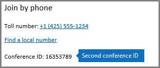

# 組織で電話会議の動的な Id を使用します。

別の会議 Id を使ってビジネスや Microsoft チームの会議の各 Skype を提供するには、音声会議サービスを更新しています。動的会議 Id が大幅に改善静的会議 Id を提供するためです。
  
- **強化されたセキュリティ**会議 Id は各 skype for Business または Microsoft チーム会議と一意の会議が予定されているときに生成します。
    
- **連続してと並列に会議のエクスペリエンスを向上させる**1 つの開催者の会議には、他の参加者との組み合わせは、他の横にある、スケジュールされているときに中から 1 つの会議の電話で参加しないように特定のダイヤルイン情報が与えられます。
    
- **シームレスな移行**組織が動的会議 Id を有効にすると、静的会議で、組織内で既にスケジュールされているすべての会議 Id が作業を続けられます。
    
> [!TIP]
> 動的な Id があるのみが有効なユーザーに * * 音声会議 * *、電話会議プロバイダーとして Microsoft があるとします。ユーザーの[電話会議プロバイダーとして Microsoft を割り当てる](assign-microsoft-as-the-audio-conferencing-provider.md)ことができます。
  
## 自分の所属組織内のユーザーでどのような変更が表示されますか。

組織の動的会議 Id を有効になっている、任意の新しい Skype for Business または Microsoft のチーム会議の音声会議は会議 Id を別のものになりますがある有効になっている、組織内のユーザーによってスケジュールは、静的会議 ID がもします。開催者が固定する前に、会議 Id に参加すること前に、会議の出席依頼で新しい会議 ID を使用する必要がありますが、会議に参加するユーザーに通知する必要があります。
  
> [!NOTE]
> Id は、影響を与えずに会議をスケジュールする、引き続きように、静的会議 Id を継続動的会議、組織が有効になっている前に静的会議 Id を持つユーザーによってスケジュールされた会議ができます。 
  
次の例は、次の 2 つの Skype for Business 会議を同じユーザーごとの新しいエクスペリエンスを示しますが、両方が 2 つの異なる会議 Id。 
  
 **会議 1**午前 10 時まで 9時 00分 AM からスケジュールされてし、会議 ID として 93907123 があります。
  

  
 11時 00分 AM 10時 00分 AM から同じユーザーが**会議 2**がスケジュール設定されているし、会議 ID として 16353789 があります。
  

  
## 関連トピック

- [Skype for Business Online をセットアップします。](../set-up-skype-for-business-online/set-up-skype-for-business-online.md)
    
- [Skype for Business とチームの Microsoft の音声会議をセットアップする設定します。](set-up-audio-conferencing.md)
    
- [Skype Business および Microsoft チーム アドオン ライセンスを許可します。](../skype-for-business-and-microsoft-teams-add-on-licensing/skype-for-business-and-microsoft-teams-add-on-licensing.md)
    

