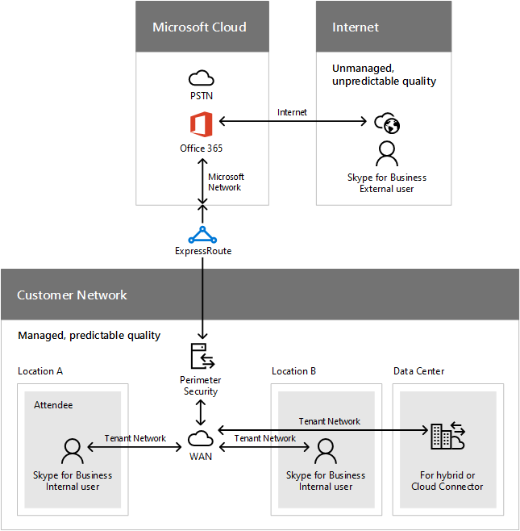
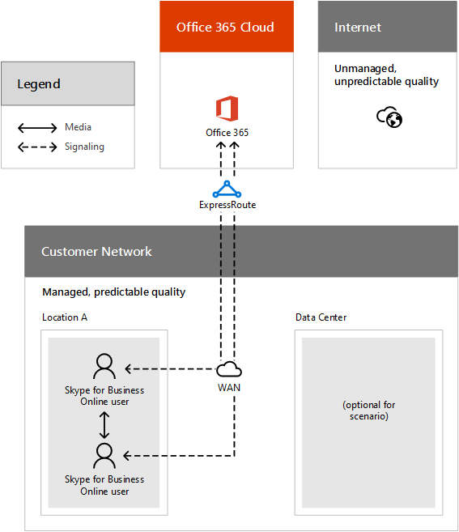
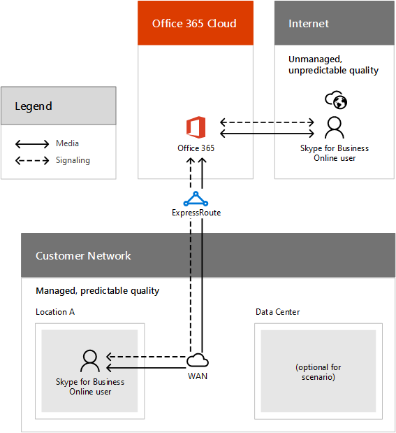
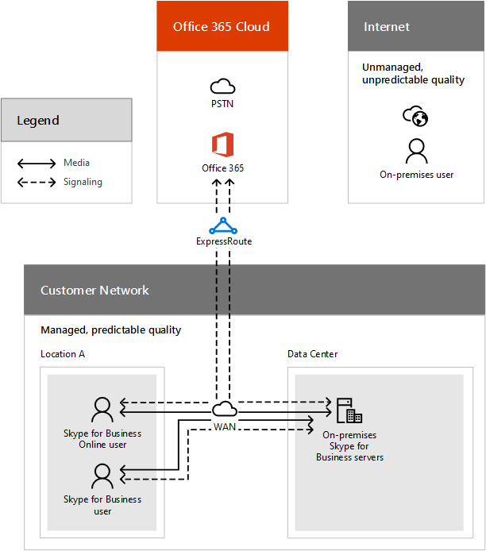
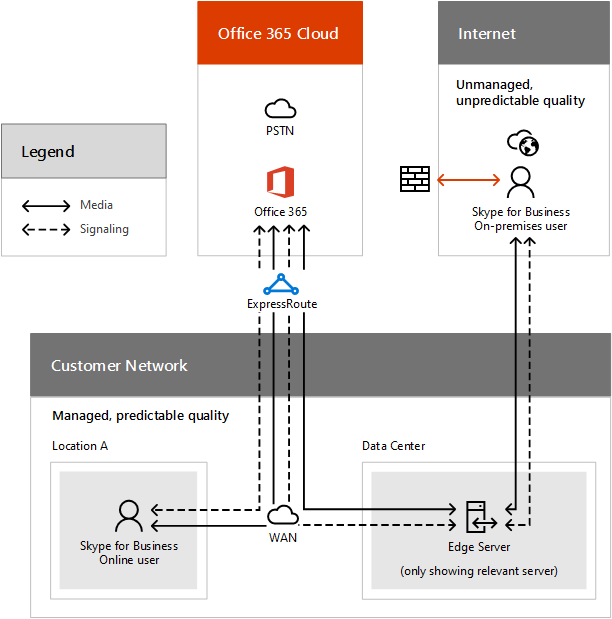
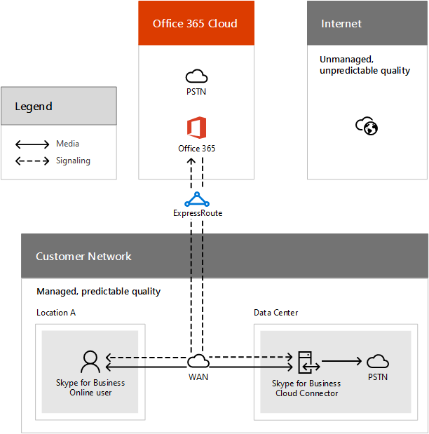
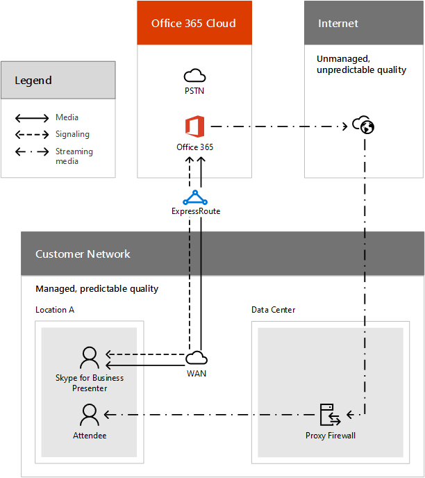

# ExpressRoute を使用して通話のフローCall flow using ExpressRoute

この記事では、Skype for Business Online と ExpressRoute、基本通話フロー原則を説明するによりし、では、通話フローの詳細な例をいくつかを理解するし、正しくを計画することができます。This article helps to explain the core call flow principles for Skype for Business Online and ExpressRoute, and gives you some detailed examples of call flows so you can understand and plan correctly.
  
Skype for Business Online を展開する Office 365、Skype for Business Server、または Skype for Business クラウド コネクタ エディションの一部として場合、は、Skype for Business クライアントとサーバーと通話フロー間の通信を理解する必要があります。効果的なマーケティング文書を計画、展開、運用、して Skype for Business Online サービスのトラブルシューティングを行うできます。If you are deploying Skype for Business Online as part of Office 365, Skype for Business Server Hybrid, or Skype for Business Cloud Connector Edition, you will need to understand the communication between the Skype for Business client and servers and the call flow so you can effectively plan, deploy, operate, and troubleshoot your Skype for Business Online services. 
  
## 通話フローの概要Call flow overview

ここでは、これらの通話のフローし、トラフィックの種類を理解するのに役立ちますデータが実行できるセグメントをインターネット経由でまたは ExpressRoute が移動トラフィックと比較して、ネットワークにローカルは引き続きネットワークについて説明します。ExpressRoute を使用するトラフィックを把握するのに役立ちます ExpressRoute と ExpressRoute 展開のガイダンスを検証し、最終的にした後、配置のトラブルシューティングを理解するヘルプを使用して組織を受信する主な利点を評価します。ExpressRoute を使用します。This document describes the network segments that can carry data for these call flows and helps you to understand which traffic will remain local to your network compared to the traffic that will travel over the Internet or through ExpressRoute. Knowing which traffic uses ExpressRoute will help you to assess the benefits that your company will receive by using ExpressRoute, as well as help you understand the ExpressRoute deployment guidance to validate and troubleshoot your deployment once you've decided to use ExpressRoute.
  
ここで説明した通話フローさまざまなファイアウォール ルール、NAT 構成、プロキシ、およびルーターの構成を含む、コントロールを下にある要因によって影響を受けることができます。このドキュメントでは、推奨設定が適用されていることを前提としています。これらの推奨設定はでについて説明します。The call flows described here can be impacted by a variety of factors that are under your control, including firewall rules, NAT configuration, proxies, and router configuration. This document assumes that the recommended settings have been applied. These recommended settings are described in:
  
- [Skype for Business Online をセットアップします。Set up Skype for Business Online](../set-up-skype-for-business-online/set-up-skype-for-business-online.md)
    
- [Office 365 の Url と IP アドレス範囲Office 365 URLs and IP address ranges](https://support.office.com/article/8548a211-3fe7-47cb-abb1-355ea5aa88a2)
    
- [ExpressRoute の概要ExpressRoute Overview](https://docs.microsoft.com/azure/expressroute/expressroute-introduction)
    
- [Azure ExpressRouteAzure ExpressRoute](https://azure.microsoft.com/services/expressroute/)
    
セットアップと構成していない上のドキュメントに記載のセットアップ手順を実行するよりもここに記載されているさまざまな流れることができます。さらに、非対称および最適なネットワーク ルーティング、最適な転送プロトコルなどの構成に関する問題と自分を見つけること可能性があります。非対称ルーティングは重要 ExpressRoute が含まれるときにいつでも ExpressRoute は、2 番目のパスを一方向にインターネットを使用するルートを使用する別のルート可能性を作成すると、Office 365 に紹介します。その他の方向に ExpressRoute します。これは、結果、トラフィック ステートフル ファイアウォールを通過する場合、戻り値の方向でブロックされていることができます。Setup and configurations that haven't followed the setup steps found in the documentation above can have different call flows than those we have documented here. Additionally, you may find yourself with configuration issues such as asymmetrical and non-optimal network routes, or non-optimal transport protocols. Asymmetrical routing is an important consideration whenever ExpressRoute is involved, because ExpressRoute introduces a second path to Office 365, which creates the possibility for a route that uses the Internet in one direction and another route that uses ExpressRoute in the other direction. This can result in traffic being blocked in the return direction if it traverses a stateful firewall.
  
## ネットワーク セグメントとトラフィックの種類Network segments and traffic types

### ネットワーク セグメントNetwork Segments

呼び出しの流れを説明できる、前にネットワーク セグメントと skype for Business Online の使用されるメディアの種類を理解するのに役立ついくつかの条件を定義する必要があります。Before we can explain the call flow, we need to define some terms that will help you understand the network segments and types of media that are used in Skype for Business Online. 
  
通話フロー図の下には、異なるが別の組織 (内部ネットワーク、ネットワーク、サービス プロバイダーと、インターネット ピアリング パートナー、および Microsoft) によって管理されているは、4 つの別のネットワーク セグメントが表示します。パフォーマンスの特性します。ネットワーク パフォーマンスの目標のガイドラインは、[メディアの品質と Skype for Business Online でネットワーク接続のパフォーマンス](media-quality-and-network-connectivity-performance.md)を参照してください。The call flow diagrams below show you four different network segments, each of which are managed by different organizations (your internal network, your network service provider, and their Internet peering partners, and Microsoft) that have different performance characteristics. For guidelines on network performance targets, refer to [Media Quality and Network Connectivity Performance in Skype for Business Online](media-quality-and-network-connectivity-performance.md).
  
次のことについてお話しする各ネットワーク セグメントを確認できます。Below you can see each network segment that we will be talking about.
  

  
 **ネットワーク**これは、ネットワーク セグメントを制御および管理する全体的なネットワークの一部であります。すべてに、オフィス内で接続が含まれますワイヤード (有線) またはワイヤレス、内部設置型のデータ センターのオフィス ビルとインターネット プロバイダーまたは ExpressRoute パートナーへの接続の状態であるかどうか。**Your network** This is the network segment that is part of your overall network that you control and manage. This includes all of your connections within your offices, whether wired or wireless, between office buildings, to on-premises datacenters, and your connections to Internet providers or ExpressRoute partners.
  
通常、ネットワークの端には、ファイアウォールまたはプロキシ サーバー、組織のセキュリティ ポリシーを適用して、のみにセットアップと構成した特定のネットワーク トラフィックを許可すると、1 つまたは複数の DMZ があります。両方のネットワークと Skype for Business にネットワークからのサイト内のパフォーマンスを検証するためのネットワークの評価を完了するこのネットワークを管理するため、ネットワークのパフォーマンスを直接制御があることを強く推奨します。オンライン。パフォーマンスの要件を表示するには、[メディアの品質と Skype for Business Online でネットワーク接続のパフォーマンス](media-quality-and-network-connectivity-performance.md)を参照してください。Typically, the edge of your network has one or more DMZ with firewalls and/or proxy servers, which enforce your organization's security policies and that only allow certain network traffic that you have set up and configured. Because you manage this network, you have direct control over the performance of your network, and it is highly recommended that you complete network assessments to validate performance both within sites in your network and from your network to Skype for Business Online. To see the performance requirements, see [Media Quality and Network Connectivity Performance in Skype for Business Online](media-quality-and-network-connectivity-performance.md).
  
 **インターネット**これは、ネットワーク セグメントに接続する Skype for Business Online から、ネットワークの外部で ExpressRoute が構成されていないときに、すべての接続に使用できるユーザーによって使用される全体的なネットワークの一部であります。インターネットとのすべての接続は、パフォーマンスとルーティング パスは判断できない、および最大通話フローと品質を全体的に影響を与えるこのようにするか、Microsoft で管理されないです。**Internet** This is the network segment that is part of your overall network that will be used by users who are connecting to Skype for Business Online from outside of your network, and is used for all connections when ExpressRoute isn't configured. The Internet and all of its connections aren't managed by you or Microsoft, so performance and routing paths can't be determined, and this will have the greatest impact on overall call flow and quality.
  
 **ExpressRoute**これは、ネットワーク セグメント、専用の個人的な Microsoft のネットワークに接続するため、全体的なネットワークの一部であります。これは、ネットワークの速度や、Skype for Business Online のリアルタイムのコミュニケーションなどのパフォーマンスに依存しているワークロードのすべてのネットワーク ネットワークに接続する Microsoft (Office 365 のデータ センター) の推奨オプションです。ExpressRoute 接続が行われます、ネットワークと Microsoft ネットワークの使用[ExpressRoute 接続プロバイダー](https://azure.microsoft.com/documentation/articles/expressroute-locations/)間とマネージのプライベート ネットワークでは、99.9% の稼働時間とサービスの品質 (QoS) のパフォーマンスを向上させるためのサポートを提供ネットワークの混雑の期間中にメディアのリアルタイムします。**ExpressRoute** This is the network segment that is part of your overall network that will give you a dedicated, private connection to the Microsoft network. This is the recommended option for connecting your network to the Microsoft network (Office 365 datacenters) for all of the workloads that are dependent on network speed and performance, such as Skype for Business Online real-time communication. ExpressRoute connections are made between your network and the Microsoft network use [ExpressRoute connectivity providers](https://azure.microsoft.com/documentation/articles/expressroute-locations/) to provide a private and managed network, with 99.9% uptime and support for Quality of Service (QoS) that can improve performance for real-time media during periods of network congestion.
  
 **Microsoft ネットワーク**これは、Office 365 のサービスをサポートしている全体的なネットワークの一部であるネットワーク セグメントです。すべての Office 365 のオンラインのサーバー間の通信が含まれます。これには、Microsoft ネットワーク バックボーンを通過して、地域間で送信するトラフィックが含まれます。**Microsoft network** This is the network segment that is part of your overall network that supports Office 365 services. This includes all of the communication between Online servers for Office 365. This may include traffic that traverses the Microsoft network backbone and is transmitted between geographical regions.
  
### トラフィックの種類Types of traffic

Skype for Business Online のネットワーク トラフィックは、独立したコール フロー パスとして表示される、2 つのカテゴリに分類されます。The network traffic for Skype for Business Online falls into two broad categories, shown as separate paths in the call flow:
  
 **リアルタイム メディア**RTP (リアルタイム転送プロトコル) にカプセル化されたデータは、音声、ビデオ、アプリケーションの共有、およびファイル転送の作業負荷をサポートしています。一般に、メディア トラフィックが高度な待機時間の機密性の高い、可能であれば、さまざまな場所を実行するには、このトラフィックするし、TCP を使用しているために、トランスポート層プロトコルとして UDP を使用するには、遅延時間が高いを紹介します。**Real-time media** is data encapsulated within RTP (Real-time Transport Protocol) and supports audio, video, application sharing, and file transfer workloads. In general, media traffic is highly latency sensitive, so you would want this traffic to take the most direct path possible, and to use UDP as the transport layer protocol because using TCP introduces higher latency.
  
 **シグナル**は、クライアントとサーバー、または (たとえば、通話を開始した場合)、アクティビティを制御するために使用する他のクライアントと配信 Im の間の通信リンクです。一部のクライアントが HTTP ベースの残りのインターフェイスを使用している場合、ほとんどのシグナリング トラフィックは SIP プロトコルを使用します。単純なするためにをこの種類のトラフィックの HTTP と HTTPS または TLS 接続経由で旅行さまざまな通知を検討しています。このトラフィックが待機時間を大幅に低下機密性の高いことを理解するが、可能性がありますサービスの停止を引き起こすまたは通話のタイムアウト端点の間の待機時間が、いくつかの秒を超えた場合は重要です。**Signaling** is the communication link between the client and server, or other clients that are used to control activities (for example, when a call is initiated), and deliver IMs. Most signaling traffic uses the SIP protocol, though some clients use HTTP-based REST interfaces. To make it simple, we are considering a variety signaling that may travel over HTTP and HTTPS or TLS connections in this type of traffic. It's important to understand that this traffic is much less sensitive to latency, but may cause service outages or call timeouts if latency between the endpoints exceed several seconds.
  
このトラフィックの宛先はすべての Office 365 サービスでは、 [Office 365 の Url と IP アドレスの範囲](https://support.office.com/article/8548a211-3fe7-47cb-abb1-355ea5aa88a2)でが見つかりました。各 URL には、Office 365 のトラフィックの部分が、ExpressRoute をスキャン可能性があるかどうかを示します。ExpressRoute が有効にすると、インターネットがまだ一部のトラフィックの使用を示す図では、 [Office 365 向け Azure ExpressRoute](http://support.office.com/article/6d2534a2-c19c-4a99-be5e-33a0cee5d3bd)を参照してください。理解している ExpressRoute 経由でルーティングされると表示されている Url が偶数もルーティング可能なインターネット経由で重要です。これは、状況によっては、インターネットまたは ExpressRoute を使用するかどうかを決定がプロキシやファイアウォールのクライアントの位置と構成に依存することを意味します。詳細については、そのに関連付けられているすべての Url から Office 365 に ExpressRoute を使用することが、ExpressRoute ExpressRoute パートナーから購入した場合でも、インターネット接続が必要な重要なもできます。The destinations for this traffic are found in [Office 365 URLs and IP address ranges](https://support.office.com/article/8548a211-3fe7-47cb-abb1-355ea5aa88a2) for all Office 365 services. For each URL, it indicates whether that portion of traffic may traverse the ExpressRoute for Office 365. For diagrams that show that the Internet is still used for some traffic when ExpressRoute is enabled, please see [Azure ExpressRoute for Office 365](http://support.office.com/article/6d2534a2-c19c-4a99-be5e-33a0cee5d3bd). It is important to understand that even URLs that are listed as being routable over ExpressRoute are also routable over the Internet. This means that in some scenarios, the determination about whether the Internet or ExpressRoute will be used depends on location of client and configuration of proxy servers and firewalls. It is also important to understand that since not all URLs associated with Office 365 are able to use ExpressRoute, an Internet connection is required even if you purchase ExpressRoute from an ExpressRoute partner. 
  
インターネット経由でのみ送信できるトラフィックにはによってなど、Office 365 管理センターでは、および一部以外のリアルタイムの証明書失効リスト (Crl)、DNS 参照の名前解決、共有の Office 365 サービスの Url などの一般的なインターネットの依存関係が含まれます。Skype 会議メディアのストリーミングがよくメディアとして Skype のコンシューマーと相互運用性のフェデレーション テレメトリなどの Skype for Business Online では、コミュニケーション機能します。意思決定するために、ネットワークのルーティングを計画している場合の他の考慮事項に従って[Office 365 向け ExpressRoute にルーティング](https://support.office.com/article/e1da26c6-2d39-4379-af6f-4da213218408)が表示します。Traffic that can only be sent over the Internet includes common Internet dependencies, such as Certificate Revocation Lists (CRLs), DNS lookups and name resolution, URLs for shared Office 365 services, such as for the Office 365 admin center, and some non-real-time communication features of Skype for Business Online, such as telemetry and federation for interoperability with Skype consumer, as well media that is streamed for Skype Meeting Broadcast. To help you make decisions, see [Routing with ExpressRoute for Office 365](https://support.office.com/article/e1da26c6-2d39-4379-af6f-4da213218408) for more considerations when you are planning your network routing.
  
## ビジネスの Skype とフローにお問い合わせの基本原則Principles for call flows with Skype for Business

詳細に入る前に特定のフローのシナリオを呼び出す、できるようにする 6 つの一般的な原則が skype for Business 通話フローを理解します。Before we get into the details of specific call flow scenarios, there are six general principles that help you understand call flows for Skype for Business.
  
1. Skype for Business 会議は、会議の開催者の存在を同じ領域でホストされます。これによっては、開催者が、オンラインのユーザーの場合は、Office 365 クラウドまたはオンプレミスのデータ センターでは、会議の開催者がオンプレミス ユーザーの場合です。A Skype for Business conference is hosted in the same region where the conference organizer is homed. This is in the Office 365 cloud if the organizer is an Online user, or in an on-premises datacenter if the meeting organizer is an on-premises user.
    
2. メディアから送信されるトラフィック クライアントをホストされている会議を常には、会議がホストされているサーバーに移動します。管理するためのデータ センター内を社内サーバーまたは Office 365 クラウド内でオンライン サーバーがあります。ただし、エッジ サーバーが常にフローに使われるメディア オンライン会議にします。Media traffic sent from a client to a hosted conference always goes to the server where the conference is hosted. This may be an on-premises server within a datacenter that you manage or an Online server within the Office 365 cloud. However, an Edge server is always used for media flow for Online conferences.
    
3. ピア ツー ピア通話メディア トラフィックで使用できる最もに直接ルーティングを実行します。推奨される方法がリモート ピア (クライアント) に直接アクセスするには、このようななど、トラフィックをブロックするファイアウォールが原因でそのルートを使えない場合、1 つまたは複数のエッジ サーバーを中継トラフィックできます。Media traffic for peer-to-peer calls take the most direct route that is available. The preferred route is direct to the remote peer (client), but if that route isn't available due to firewall blocking the traffic or something like that, then one or more Edge servers will relay traffic.
    
4. シグナル トラフィックを常にオンラインするか、ユーザーが所属している、サーバーまたは内部設置型にします。フロント エンド サーバーに直接接続できない場合は、エッジ サーバーが使用されます。Signaling traffic always goes to the server where the user is homed, either Online or on-premises. An Edge server will be used if the Front End server can't be connected to directly.
    
5. エッジ サーバー (または 2 つのクライアント ファイアウォールの設定が原因で必要な場合)、オンラインでホストされている会議に参加するユーザーは常に使用します。Users joining a conference hosted Online will always use an Edge server (or two if required due to client firewall configurations).
    
6. ユーザーへの参加をホストされている会議の内部設置型通常は使用しませんエッジ サーバーを内部設置型の展開を含みから外部ネットワークで接続しているときに 1 つまたは 2 つのエッジ サーバーを使って、同じネットワークに接続する場合。Users joining a conference hosted on-premises will typically not use an Edge server if connecting from within the same network that contains the on-premises deployment, and will use either one or two Edge servers when connecting from outside of your network. 
    
選択されているメディア パスの詳細については、に関する詳細については、 [ICE - エッジ メディアの接続](https://aka.ms/AVEdge)を参照してください。このビデオでは Lync Server 2013、原則しており、プロトコルは、Skype for Business にも適用されます。To learn more about the details on the media path that is chosen, please see [ICE - Edge Media Connectivity](https://aka.ms/AVEdge). Although this video is about Lync Server 2013, the principles and protocols still apply to Skype for Business.
  
## Skype for Business 通話 ExpressRoute のフローSkype for Business call flows with ExpressRoute

Skype for Business 通話フローの 4 つの別のネットワーク セグメントといくつかの一般的な指針の理解がある場合、これでビジネス トラフィック用には、どの Skype を理解するための情報が、ExpressRoute を通過するを使用することができます。ネットワーク セグメントします。Now that you have an understanding of the four different network segments and some general guiding principles for Skype for Business call flows, you can use that information to help you understand which Skype for Business traffic will traverse an ExpressRoute network segment.
  
一般に、ネットワーク トラフィックでは、ネットワークに 1 つのエンドポイントがあり、Office 365 のデータ センターでは、他のエンドポイント場合、ExpressRoute 接続がスキャンされます。これはシグナル クライアントとサーバー、会議、または Online Edge サーバーを使用してピア ツー ピア通話中に使用されるメディア トラフィックの間のトラフィックが含まれます。In general, network traffic will traverse the ExpressRoute connection if one endpoint is in your network and the other endpoint is in the Office 365 datacenter. This will include signaling traffic between client and server, media traffic used during conference calls, or peer-to-peer calls that use an Online Edge server.
  
インターネット経由で直接通信することがエンドポイントの両方のネットワーク内にある場合、トラフィックが ExpressRoute 接続を通過しません。これにより、ピア ツー ピア通話、トラフィックを内部設置型の展開に配信されるインターネットから、またはインターネットと Office 365 のエッジ サーバー間のトラフィックのメディアが含まれます。次の例は、ホテルからオンライン会議に参加しているユーザーになります。Traffic won't traverse the ExpressRoute connection if both of the endpoints are able to communicate directly across the internet or are located within your network. This will include media for peer-to-peer calls, traffic from the Internet destined to an on-premises deployment, or any traffic between the Internet and Office 365 Edge Servers. An example of this would be a user joining an Online conference from a hotel.
  
## 基本の Skype Business 通話フローBasic Skype for Business call flow

Skype for Business 通話フローの上に記載されているに関する一般的な原則を適用するために、この記事の次のセクションには、参照の複数の図が含まれています。これにより、すべての可能な通話フローすべてではありませんが、上にある詳細な原則を適用するためのものが。オンライン、ハイブリッド、クラウド コネクタなどの一般的な展開種類の説明の図のシナリオが選択されてさらに、1 つの特殊な場合は Skype 会議メディアとします。To help you apply the general principals about the Skype for Business call flows that are described above, the next section of this article contains several diagrams for reference. This isn't an exhaustive list of all possible call flows, but is intended to help you apply the principles detailed above. Additionally, the scenarios in the diagrams have been selected to cover common deployment types including Online, Hybrid, Cloud Connector, and in one special case, Skype Meeting Broadcast.
  
> [!NOTE]
> 向けに Skype で使用されるトラフィックのサブセットを ExpressRoute、経由でルーティング可能ないないされが常にインターネット パス。[Office 365 の Url と IP アドレスの範囲](https://support.office.com/article/8548a211-3fe7-47cb-abb1-355ea5aa88a2)を決定する影響を受けることができる Url を参照してください。A subset of traffic used by Skype for Business isn't routable over ExpressRoute, and will always take an Internet path. Refer to the [Office 365 URLs and IP address ranges](https://support.office.com/article/8548a211-3fe7-47cb-abb1-355ea5aa88a2) to determine the URLs that can be affected.
  
### カスタマー ネットワーク内から Office 365 ユーザー向けのピア ツー ピア通話Peer-to-peer call for Office 365 users from within customer network

ピア ツー ピア通話、トラフィックのメディアは、宛先に最も直接ルーティングを常に移動します。ただし、シグナリング トラフィックは、Office 365 のデータ センターへオンラインのユーザーが所属しています。両方のユーザーが同じ WAN では、何も、クライアントは直接通信できなくので、メディアの間に続きします。シグナル トラフィックの両方のユーザーに、各組織のデータ センターに送信される ExpressRoute 接続を移動します。このシナリオで通話フローに表示する、次を参照してください。For peer-to-peer calls, media traffic always takes the most direct route to its destination. However, the signaling traffic goes to an Office 365 datacenter where the Online user is homed. Since both users are on the same WAN and nothing prevents the clients from communicating directly, the media flows directly between them. Signaling traffic, for both users traverses the ExpressRoute connection that is destined for each organization's datacenter. To show you the call flow in this scenario, see this.
  
 **ピア ツー ピア通話フロー****Peer-to-peer call flow**
  

  
### オンラインがオンラインのユーザーが会議に参加するネットワーク上にホストされています。Online user on your network joining a conference that is hosted Online

ピア ツー ピアなどのメディア トラフィックは、宛先に最も直接ルーティングを常に移動します。ただし、オンライン会議、宛先は、Office 365 クラウドでは。つまり、ネットワーク内から会議に参加するすべてのユーザーのメディア トラフィックが ExpressRoute 接続をスキャンしてシグナリング トラフィックが Office 365 クラウドに移動します。下の図ことを示して メディアと通知の両方 ExpressRoute へ、ネットワーク内のユーザーの接続を通過するが、コーヒーからなどのネットワーク外部からのインターネットに接続されているユーザーのインターネット上を直接スキャンは喫茶店、ホテルIn the peer-to-peer example, media traffic always takes the most direct route to its destination. However, for an Online conference, the destination is in the Office 365 cloud. This means that media traffic for all users joining the conference from within your network will traverse the ExpressRoute connection and the signaling traffic travels to the Office 365 cloud. The graphic below shows you that both media and signaling will traverse the ExpressRoute connection for a user within your network, and will directly traverse the Internet for users that are connected to the Internet from outside your network, such as from a coffee shop or hotel.
  
会議の開催者と参加者ではなく、会議の場所が定義されていることを覚えておいてください。つまり、場合は、会議は、内部設置型の顧客にによって設定された、メディア トラフィック ExpressRoute、上に Office 365 クラウドにフローされませんが、会議の開催者の内部設置型のデータ センターへのインターネット経由代わりにします。Remember that the location of a conference is defined by the meeting organizer and not by the participants. This means that if the meeting were scheduled by an on-premises customer, the media traffic won't flow to the Office 365 cloud over ExpressRoute, but would instead traverse the Internet to the on-premises datacenter of the meeting organizer.
  
オンライン会議用のメディアの保存先は、Office 365 クラウド内のデータ センターになりますが、会議に参加するユーザーよりも地域別データ センターがあります。2 つの方法でこの問題が発生することができます。The destination for media for Online conferences will be a datacenter within Office 365 cloud, but the datacenter may be in a different geographical region than the users that are joining the conference. This can happen in one of two ways:
  
- 会議の開催者がから国/地域または別の地理的な場所により、出席者や、参加者、開催者の組織の別の会社でホストされます。If the meeting organizer is from a different company than the attendees or participants, and the organization for the organizer is hosted in a different geographic location or country/region.
    
- 場合は、ユーザーは、会社の組織が含まれているよりも別の国/地域から参加する多国籍、会社や、ユーザーが原因でいずれかを移動します。If a user is joining from a different country/region than where the company's organization is located, either due to the company being multinational, or the user is traveling.
    
このシナリオで ExpressRoute の使用については、ExpressRoute premium アドオンを ExpressRoute パスで行われるデータが自動的に間で渡すこと、会議の開催者の地域に関係なく、マイクロソフトのバックボーン組織のデータ センターです。The good news about using ExpressRoute in this scenario is that with ExpressRoute premium add-on, data that follows the ExpressRoute path will pass automatically across Microsoft's backbone regardless of geographical region of the organizer of the meeting organization's datacenter.
  
 **オンライン会議とオンラインのユーザーの通話のフロー****Online user with Online meeting call flow**
  

  
### ハイブリッド展開でユーザーを社内でホストされている会議に参加します。Joining a conference hosted by on-premises user in Hybrid deployment

ホストされている会議をサポートする会議サーバーが、会議の開催者のホームで定義されていることを覚えておいてください。このシナリオでメディアをオンプレミス ハイブリッド展開でユーザーによってスケジュールされた会議に参加するすべてのユーザーを内部設置型のデータ センターへフローします。メディアは直接接続を試みます中に、Office 365 のクラウドで自分の組織で Online ホーム ユーザーの通知が確立されます。このシナリオで両方のユーザーは、ネットワーク内から接続しているため、直接メディア接続が可能であれば、シグナル Online ホーム ユーザー用のトラフィックに対してのみ ExpressRoute が使われるようにします。オンライン ホーム ユーザーは、インターネットから接続している場合、メディアはオンライン エッジ サーバーを使用して接続する場合 ExpressRoute を通過可能性があります。Remember that the conferencing servers that support hosted conferences are determined by where the meeting organizer is homed. In this scenario, media for all users joining a conference scheduled by an on-premises user in a Hybrid deployment will flow to an on-premises datacenter. Signaling for Online homed users will be established through their organization in the Office 365 Cloud, while media will attempt a direct connection. In this scenario, since both users are connecting from within your network, a direct media connection is possible, so ExpressRoute is used only for signaling traffic for the Online homed user. If an Online homed user connects from the Internet, the media could traverse ExpressRoute if an Online Edge server is used to connect.
  
 **ハイブリッド ユーザーの通話フローによってホストされている会議****Conference hosted by a Hybrid user call flow**
  

  
### オンプレミスのエッジ サーバーでホストされている Office 365 の会議On-premises Edge server with Office 365 hosted conferences

ハイブリッド ユーザー結合をオンラインに会議がホストされている場合、シグナリングとメディアがの宛先は、Office 365 クラウドし、ユーザーは、インターネットから参加するため通常の方法で直接インターネット パスありますがわかっています。ただし、場合によっては、ように、ファイアウォールの制限が原因で直接インターネット パスは利用できません。この例では、オンプレミスのエッジ サーバーでは、メディア トラフィックを Office 365 クラウド ExpressRoute 回路を移動する前に、社内ネットワークに戻るには、メディアのトラフィックを中継できます。When a Hybrid user joins an Online hosted conference, we know that signaling and media will be destined for the Office 365 cloud, and since the user is joining from the Internet, normally a direct internet path would be taken. However, in some cases, such as due to firewall restrictions, a direct Internet path isn't available. In this case, an on-premises Edge server can relay the media traffic, which causes the media traffic to return to your on-premises network before traversing the ExpressRoute circuit to the Office 365 cloud.
  
 **オンプレミスのユーザーをオンプレミスのエッジ サーバーを使用して、オンライン会議電話への参加****On-premises user joining an online conference call using an on-premises Edge server**
  

  
### Skype for Business クラウド コネクタ Edition を使った PSTN 通話PSTN call using Skype for Business Cloud Connector Edition

[Skype for Business Online クラウド コネクタ Edition](https://aka.ms/CloudConnectorInstaller)を使用して、SIP トランクまたは PSTN ゲートウェイなどの内部設置型のリソースを使用するか、最低限のハードウェア デバイスを使用して、Skype for Business との統合 PSTN への接続を提供します。クラウドのコネクタのエディションでは、ユーザーは、オンラインが置かれているし、プランの呼び出しに関係がない場合は、通常のオンライン ユーザーとして機能します。を使用できる場合は、ExpressRoute 接続を介してクライアントとクラウドとの間で移動 PSTN シナリオ シグナリングとメディアのトラフィックが WAN 内に収まます。この例では、[シグナリング、回転して、Office 365 クラウド クラウド コネクタに終了します。Using the [Skype for Business Online Cloud Connector Edition](https://aka.ms/CloudConnectorInstaller) provides PSTN connectivity using on-premises resources such as a SIP trunk, or a PSTN gateway, or using a minimal hardware device to integrate with Skype for Business. With Cloud Connector Edition, users are homed Online and act as normal Online users when they don't involve Calling Plans. Signaling for PSTN scenarios will travel between the client and the cloud across an ExpressRoute connection if available, and the media traffic stays within your WAN. In this case, signaling turns around at the Office 365 cloud, and terminates at the Cloud Connector.
  
 **Office 365 とクラウド コネクタで電話システムでの PSTN 通話****PSTN call via the Phone System in Office 365 and Cloud Connector**
  

  
### Skype 会議メディアとユーザーのカスタマー ネットワークに参加します。Skype Meeting Broadcast with users joining from customer network

Skype 会議メディアは、特別なユース ケース、2 つの部分との会議の別のネットワーク トランスポート プロファイルを持つ各部分から成り立っています。最初の部分とは、ネットワーク パフォーマンスの観点から、最も重要なは、内部の会議です。これは、Office 365 クラウドでの会議サーバーに接続する 1 つまたは複数のクライアント エンドポイントを含む、会議のリアルタイム部分です。これは、会議の一部を使用して送信されたデータは、上にある、Office 365 のユーザーに参加するとオンライン会議の例と同様です。Skype Meeting Broadcast is a special use case, which consists of a two-part meeting with each part having different network transport profiles. The first part, and the one that is most important from a network performance point of view, is the inner meeting. This is the real-time portion of the meeting that includes one or more client endpoints connecting to the conferencing server in the Office 365 cloud. Data transmitted using this portion of the meeting is exactly like the example above, with an Office 365 user joining and Online conference. 
  
Skype 会議メディア固有は、多数のサービスをストリーミング ブロードキャストを使用して会議の出席者に会議を配布することです。サービスのストリーミング ブロードキャストでは、ExpressRoute、経由でルーティング可能なはありませんがコンテンツ配信ネットワーク (CDN) サービスのサポート オプションを使用して、インターネットが代わりに使用します。ブロードキャスト ストリーミングは単方向メディア フロー出席者聞きがないメンバーと話すことをバッファー処理をサポートしているためため、待機時間、パケット損失、ジッターなどのネットワーク パフォーマンスの問題を大幅に低下と小文字を区別することをお勧めします。これらの問題のブロードキャスト トラフィックを最適化するには、代わりにストリーム メディアの受信出席者数が非常に大きながある可能性があるので帯域幅の使用に最適です。What makes Skype Meeting Broadcast unique is that the meeting is distributed to a large number of conference attendees using a broadcast streaming service. This broadcast streaming service isn't routable over ExpressRoute, but instead uses the Internet with the optional support of Content Delivery Network (CDN) services. It is helpful to recognize that the broadcast streaming is a unidirectional media flow because the attendees listen but don't talk and supports buffering, so it is much less sensitive to network performance issues such as latency, packet loss, and jitter. Instead of optimizing broadcast traffic for these issues, it is optimized for bandwidth utilization because there is potentially a very large number of attendees receiving the streamed media.
  
 **カスタマー ネットワークからのユーザーと Skype 会議メディア****Skype Meeting Broadcast with users from customer network**
  

  
## 展開の種類によってフロー パターンを呼び出すCall flow patterns by deployment type

共通の着信のフロー上の例と、トラフィックのパターンを制御する一般的な原則について、次の表は、展開と使用のシナリオの大規模な組み合わせのトラフィックのパターンの概要を提供します。次の表では、通話フロー、考えられるすべての組み合わせをキャプチャしませんが、さらに通話フローの一般的な原則を理解する際に役立ちます。With the common call flow examples above, and an understanding of the general principles that control traffic patterns, the tables below provide a summary of the traffic patterns for a large combination of deployment and usage scenarios. These tables do not capture all possible combinations of call flows, but should help you to further understand the general principles of call flow.
  
データが転送され、は、ローカルの組織にすると表示カスタマー ネットワーク、インターネット、または ExpressRoute のままにしてされません。以下のパターンでは、ネットワークの最も一般的な設定、ファイアウォール、フェデレーション、およびインターネットなどに基づくし、マルチパーティまたはフェデレーションのフローに関係するすべての組織の ExpressRoute であると想定されています。実際には、さまざまな設定が生じると、別のトラフィック パターンの下に一覧表示されている可能性があります。Data is transmitted and is listed as being local to the organization; it doesn't leave the customer network, Internet, or ExpressRoute. The patterns listed below are based on the most common network settings, such as firewalls, federation, and Internet, and assume that all organizations involved in multi-party or federated flows have ExpressRoute. In practice, having different settings could result in different traffic patterns than those that are listed below.
  
### Skype for Business Online の通話のフローCall flows for Skype for Business Online

Skype for Business Online の使用例では、ユーザーがオンラインに置かれているし、内部ネットワーク、またはインターネットから通話することがありますが含まれます。オンプレミス サーバーでは、これらのシナリオの一部をできないため、すべての会議または PSTN 関連メディア、Office 365 クラウドとエッジ サーバーがクラウド内にはもオンラインのユーザーに移動します。Skype for Business Online usage scenarios involve users who are homed Online, and may be calling from either your internal network or the Internet. On-premises servers aren't part of these scenarios, so all conferencing or PSTN related media will flow to the Office 365 cloud, and the Online users Edge server will also be in the cloud.
  
 **Skype for Business Online の通話フローの概要****Call flow summary for Skype for Business Online**
  
|||||||
|:-----|:-----|:-----|:-----|:-----|:-----|
|**使用のシナリオ****Usage scenario**   |**端点****Endpoints**   |**シグナリング パス****Signaling path**   |**メディアのパス****Media path**   |**例のフロー****Example flow**   |**ノート****Notes**   |
|ピア ツー ピア通話Peer-to-peer call    |2 つのクライアント、両方のネットワークにします。Two clients, both on your network.    |ExpressRouteExpressRoute    |地元のlocal    |[カスタマー ネットワーク内から Office 365 ユーザー向けのピア ツー ピア通話Peer-to-peer call for Office 365 users from within customer network](call-flow-using-expressroute.md#bk_Figure2)   ||
|ピア ツー ピア通話Peer-to-peer call    |2 つのクライアント (内部) ネットワーク上の 1 つ、インターネット (外部) で、その他のクライアントします。Two clients, one on your network (internal) and the other client on the Internet (external).    |内部ユーザー: ExpressRouteInternal user: ExpressRoute    外部ユーザー: インターネットExternal user: Internet    |内部ユーザー: ExpressRouteInternal user: ExpressRoute    外部ユーザー: Office 365 のエッジ サーバーのインターネットします。External user: Internet to Office 365 Edge server.    |[カスタマー ネットワーク内から Office 365 ユーザー向けのピア ツー ピア通話Peer-to-peer call for Office 365 users from within customer network](call-flow-using-expressroute.md#bk_Figure2)   |クライアントでは、オンラインのエッジ サーバーが必要な間で直接接続をブロックするファイアウォールを想定しています。電話会議への会議サーバーとのようなパスを内部ユーザーから Online Edge サーバーへのトラフィックに従います。Assumes that firewall blocks direct connections between clients, that requires an Online Edge server. Traffic from internal user to Online Edge server follows similar path as that to conferencing server for conference call.    |
|フェデレーションの組織内のユーザーにピア ツー ピア通話Peer-to-peer call to a user in a federated organization    |2 つ、クライアント (内部) ネットワーク上 (フェデレーション) フェデレーションの組織のネットワーク上のオンラインのユーザーにします。Two clients, on your network (internal) and at Online user on federated organization's network (federated).    |ExpressRouteExpressRoute    |ExpressRouteExpressRoute    |[オンラインがオンラインのユーザーが会議に参加するネットワーク上にホストされています。Online user on your network joining a conference that is hosted Online](call-flow-using-expressroute.md#bk_Figure3)   |オンラインのエッジ サーバーを必要とする、クライアントの間で直接接続をブロックするファイアウォールを想定しています。電話会議への会議サーバーの名前を付けてのようなパスを内部ユーザーから Online Edge サーバーへのトラフィックに従います。Assumes a firewall blocks direct connections between clients, requiring Online Edge server. Traffic from the internal user to Online Edge server follows a similar path as that of a conferencing server for conference call.    |
|カスタマー ネットワークのユーザーの電話会議に参加します。Join conference call by user in customer network    |Office 365 のクラウドのネットワークとビデオ会議サーバー上のクライアントします。Client on your network and conferencing server in Office 365 cloud.    |ExpressRouteExpressRoute    |ExpressRouteExpressRoute    |[オンラインがオンラインのユーザーが会議に参加するネットワーク上にホストされています。Online user on your network joining a conference that is hosted Online](call-flow-using-expressroute.md#bk_Figure3)   ||
|インターネットでのユーザーによる会議通話への参加します。Join conference call by user in Internet    |クライアントでは、Office 365 のクラウドのインターネットとビデオ会議サーバー上です。Client is on the Internet and conferencing server in Office 365 cloud.    |インターネットInternet    |インターネットInternet    |[オンラインがオンラインのユーザーが会議に参加するネットワーク上にホストされています。Online user on your network joining a conference that is hosted Online](call-flow-using-expressroute.md#bk_Figure3)   ||
|他の会社のオンプレミスのサーバーでホストされている会議に参加します。Join conference hosted by another company's on-prem Server    |サード パーティのデータ センターのネットワークとビデオ会議サーバー上のクライアントします。Client on your network and conferencing server in third-party datacenter.    |インターネットInternet    |インターネットInternet    |適用できませんNot applicable    |会議をホストしている会議サーバーが別の顧客のオンプレミス ネットワーク上にあるため、データがないを通過マイクロソフト クラウドします。Since the conferencing server that hosts the conference is on an on-premises network of a different customer, no data would pass through the Microsoft cloud.    |
|PSTN 通話PSTN call    |お客様のネットワークと Office 365 クラウド内の電話システムでサーバーでクライアントClient in customer network and Phone System servers in Office 365 cloud    |ExpressRouteExpressRoute    |ExpressRouteExpressRoute    |[オンラインがオンラインのユーザーが会議に参加するネットワーク上にホストされています。Online user on your network joining a conference that is hosted Online](call-flow-using-expressroute.md#bk_Figure3)   ||
|PSTN 通話PSTN call    |Office 365 のクラウドのインターネット、電話システムでのサーバーでクライアントClient on the Internet and Phone System servers in Office 365 cloud    |インターネットInternet    |インターネットInternet    |適用できませんNot applicable    |メディアとは通知は、Office 365 のデータ センターへフローします。クライアントのエンドポイントがインターネット上にあるため、すべてのデータ フロー Microsoft データ センターにインターネット経由で (オンライン エッジ サーバーは、接続を必要に応じて) 場合でもします。The media and signaling will flow to the Office 365 datacenter. Since the client endpoint is on the Internet, all data will flow to the Microsoft datacenter across the Internet (even if an Online Edge server is needed for connectivity).    |
   
> [!NOTE]
> ExpressRoute はオンライン エッジ サーバー、社内ネットワーク上にあるユーザーからメディア パスで使用されますが、別の顧客のオンプレミス展開のエッジ サーバーが使用されている場合は使用されません。ExpressRoute will be used on the media path from a user located on the corporate network to an online Edge Server, but won't be used if the Edge server for another customer's on-premises deployment is used. 
  
### Skype for Business 通話フローCall flows for Skype for Business Hybrid

Skype for Business の展開を含む少なくともいくつかのユーザーをオンプレミスでホームがある場合、ハイブリッド通話フローが適用されます。このセクションで、通話のフローは両方の内部設置型の会議を追加しを少なくとも 1 つの内部設置型のホーム ユーザーとのピア ツー ピアまたは PSTN 通話します。Hybrid call flows apply when you have a Skype for Business deployment that includes at least some users that are homed on-premises. The call flows in this section include both on-premises conferences and peer-to-peer or PSTN calls with at least one on-premises homed user.
  
|||||||
|:-----|:-----|:-----|:-----|:-----|:-----|
|**使用のシナリオ****Usage scenario**   |**端点****Endpoints**   |**シグナリング パス****Signaling path**   |**メディアのパス****Media path**   |**例のフロー****Example flow**   |**ノート****Notes**   |
|ピア ツー ピア通話Peer-to-peer call    |お客様のネットワークとホーム内部設置型の両方で、2 つのクライアントTwo clients, both on customer network and homed on-premises    |地元のLocal    |地元のlocal    |[カスタマー ネットワーク内から Office 365 ユーザー向けのピア ツー ピア通話Peer-to-peer call for Office 365 users from within customer network](call-flow-using-expressroute.md#bk_Figure2)   |ユーザーがオンプレミスでホームであるため、信号フロー ローカルで Office 365 ではなく、オンプレミスのデータ センターへクラウドです。Since users are homed on-premises, signaling flows locally to the on-premises datacenter instead of Office 365 cloud.    |
|ピア ツー ピア通話Peer-to-peer call    |2 つのクライアント、両方のカスタマー ネットワークから接続します。オンラインに存在いずれかが、他のホーム オンプレミスです。Two clients, both connecting from customer network. One is homed online, the other is homed on-premises.    |オンライン ユーザー: ExpressRouteOnline user: ExpressRoute    オンプレミスのユーザー: ローカルOn-premises user: local    |地元のlocal    |[カスタマー ネットワーク内から Office 365 ユーザー向けのピア ツー ピア通話Peer-to-peer call for Office 365 users from within customer network](call-flow-using-expressroute.md#bk_Figure2)   |のみホーム ユーザーのオンライン送信トラフィックを Office 365 クラウドを通知します。Only the Online homed user sends signaling traffic to the Office 365 cloud.    |
|フェデレーションの組織内のユーザーにピア ツー ピア通話Peer-to-peer call to a user in a federated organization    |顧客のオンプレミス ユーザーの 2 つのクライアント ネットワーク (社内) し、オンライン ユーザー フェデレーション会社のネットワーク (フェデレーション) します。Two clients, on premise-user in customer network (internal) and online user at federated company's network (Federated).    |内部ユーザー: ローカルInternal user: local    フェデレーションされたユーザー: ExpressRouteFederated user: ExpressRoute    |インターネットまたは ExpressRoute (依存オンラインかどうかオンプレミス エッジ サーバーが使用されている)Internet or ExpressRoute (depends whether online or on-premises edge server is used)    |[オンラインがオンラインのユーザーが会議に参加するネットワーク上にホストされている](call-flow-using-expressroute.md#bk_Figure3)と (メディア トラフィック用) の一部の[Office 365 を使って、オンプレミスのエッジ サーバーには、会議がホストされています](call-flow-using-expressroute.md#bk_Figure5)。[Online user on your network joining a conference that is hosted Online](call-flow-using-expressroute.md#bk_Figure3) and part of [On-premises Edge server with Office 365 hosted conferences](call-flow-using-expressroute.md#bk_Figure5) (for media traffic).   |オンラインのエッジ サーバーを必要とする、クライアントの間で直接接続をブロックするファイアウォールを想定しています。ICE やり取りは、オンラインのユーザーによってオンラインとの接続、オンプレミスのユーザーによってオンプレミス エッジ サーバーの両方が提供されます。Assumes a firewall blocks direct connections between clients, requiring Online Edge server. ICE negotiation will offer both Online (by the online user) and on-premises Edge servers (by the on-premises user) for connectivity.    |
|カスタマー ネットワーク (オンラインのユーザーによってスケジュールされた会議) でユーザーの電話会議に参加します。Join conference call by user in customer network (conference scheduled by Online user)    |オンプレミス ユーザーで Office 365 クラウド ネットワークとビデオ会議サーバーにします。On-premises user on your network and conferencing server in Office 365 cloud.    |ExpressRouteExpressRoute    |ExpressRouteExpressRoute    |[オンラインがオンラインのユーザーが会議に参加するネットワーク上にホストされています。Online user on your network joining a conference that is hosted Online](call-flow-using-expressroute.md#bk_Figure3)   |電話会議のサーバー リソースは、会議の開催者によって決定されます。この例では、スケジュール、オンラインのユーザーがリソースは、Office 365 クラウドでようにします。Server resources for conference call are defined by the meeting organizer. In this case, it was scheduled by an Online user, so resources are in the Office 365 cloud.    |
|PSTN 通話PSTN call    |社内ネットワーク上のユーザーとオンプレミス Skype for Business のデータ センターします。On-premises user on your network and on-premises Skype for Business datacenter.    |地元のLocal    |地元のLocal    |[Skype for Business クラウド コネクタ Edition を使った PSTN 通話PSTN call using Skype for Business Cloud Connector Edition](call-flow-using-expressroute.md#bk_Figure6)   |同様のクラウド コネクタ エディションでは、そのユーザーを除くを使用するシナリオはホーム、社内でネットワーク内に収まる通知。Similar scenario to use of Cloud Connector Edition, except that user is homed on-premises, so the signaling stays within your network.    |
   
### Skype for Business をクラウドのコネクタのフローにお問い合わせCall flows for Skype for Business with Cloud Connector

コネクタのエディションをクラウドに接続するユーザーは、オンラインに存在すべて。会議は、オンラインありをシグナリング Online ユーザーの場合と同じパターンを次になります。PSTN 通話以外の場合、通話フローに skype for Business Online 上で説明したとおりになります。Users that will connect to Cloud Connector Edition are all homed Online. This means that conferences will be online, and signaling follows the same patterns as for Online users. For scenarios other than PSTN calls, the call flow will be exactly as described above for Skype for Business Online.
  
|||||||
|:-----|:-----|:-----|:-----|:-----|:-----|
|**使用のシナリオ****Usage scenario**   |**端点****Endpoints**   |**シグナリング パス****Signaling path**   |**メディアのパス****Media path**   |**例のフロー****Example flow**   |**ノート****Notes**   |
|PSTN 通話PSTN call    |クラウド コネクタ Edition を使って、ネットワーク上のオンライン ユーザー。Online user on your network using Cloud Connector Edition.    |地元のlocal    |地元のlocal    |[Skype for Business クラウド コネクタ Edition を使った PSTN 通話PSTN call using Skype for Business Cloud Connector Edition](call-flow-using-expressroute.md#bk_Figure6)   ||
|PSTN 通話PSTN call    |オンラインのユーザーがクラウド コネクタ エディションを使用するインターネットを使用します。Online user using the internet using Cloud Connector Edition.    |インターネットInternet    |インターネットInternet    |[Office 365 を使って、オンプレミスのエッジ サーバーには、会議がホストされている](call-flow-using-expressroute.md#bk_Figure5)し、 [PSTN 通話の Skype for Business クラウド コネクタ Edition を使用して](call-flow-using-expressroute.md#bk_Figure6)の組み合わせです。Combination of [On-premises Edge server with Office 365 hosted conferences](call-flow-using-expressroute.md#bk_Figure5) and [PSTN call using Skype for Business Cloud Connector Edition](call-flow-using-expressroute.md#bk_Figure6).    |インターネットのユーザーが、クラウドのコネクタに含まれるエッジ サーバー経由で接続し、クラウドのコネクタを PSTN ネットワークに接続します。Internet users will connect via the Edge server that is included in Cloud Connector, and Cloud Connector will connect to the PSTN network.    |
   
## 関連トピックRelated topics

[ドキュメントの ExpressRouteExpressRoute documentation](https://go.microsoft.com/fwlink/?LinkId=690285)
