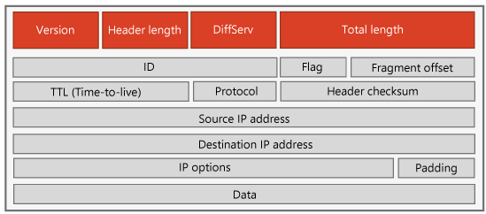

# ExpressRoute と Skype for Business Online ネットワーク通信

Office 365 と Skype for Business Online Azure ExpressRoute を使用して専用のネットワーク接続経由で Office 365 に接続します。信頼性の高いと予測可能なパフォーマンスとパブリック インターネットから遠い方のプライバシーの Skype for Business アプリには、専用への接続では提供されます。For Business Online の予測、ビジネス クラスの信頼性を追加し、稼働時間 SLA が付属している Office 365 と Skype への良いネットワーク接続を今すぐ購入できます。
  
> [!NOTE]
> 新しいバージョンの帯域幅計算ツールが使用可能な: [Skype for Business、帯域幅計算](https://go.microsoft.com/fwlink/?LinkId=715766)します。ただし、このドキュメントに表示される指示は、Lync 2010 と 2013 の帯域幅計算機を使用します。 
  
## Skype for Business Online と ExpressRoute

Microsoft の ExpressRoute パートナーを操作するさまざまな Office 365 のアプリケーション Skype for Business Online クラウドで専用接続経由で接続できます。ただし、リアルタイムの音声と skype for Business ビデオの通信機能には、次の Office 365 リアルタイム ワークロードをサポートするように構成されたネットワーク サービスが必要。これには、必要なのトラフィック量を実行して、ユーザーのサービスの品質、ビジネス クラスの機能を提供するには、(QoS) をサポートしている十分な帯域幅のあるネットワークが含まれます。
  
このドキュメントが、管理者やネットワーク設計者がサポートされているネットワークを設計するために Microsoft が提供するツール、リアルタイムの通信をサポートするために必要な特別な課題を理解するために設計されています要件については、ケース スタディを使用して、デザイン プロセスに対するとします。 
  
この文書の最初の部分では、ネットワーク、複数のサイトを含む大きい Skype for Business ExpressRoute 展開のための要件を評価する[Lync 2010 と 2013 の帯域幅計算機](https://go.microsoft.com/fwlink/?LinkId=690282)を使用してネットワーク設計するためのケース スタディについて説明します。このドキュメントの 2 番目の部分を使用すると、サービスの品質 (QoS)、ビジネスのリアルタイム通信、およびネットワーク サービスの特定の種類の Skype をサポートするための特定の技術的な詳細で詳しくの基本的な概念必要であります。
  
すべての情報をここでは、する技術的な詳細とについて QoS および ExpressRoute、特定の課題を理解する 見開き、実用的な知識ツールとは、正常に技術を使うSkype for Business のネットワークにわたって、ExpressRoute を展開します。 
  
## はじめに

Skype for Business の ExpressRoute 進む準備ができたらを取得するが、別の ExpressRoute 接続モデルとパートナーと場所のさまざまな選択肢を表示し、購入し、組織内の ExpressRoute のプロビジョニング方法をご覧に理解するのにが勧めします。使い始めるときに、いくつかのリソースを紹介します。 
  
- [Azure ExpressRoute]( https://go.microsoft.com/fwlink/?LinkId=690283)
    
- [ExpressRoute 価格](https://go.microsoft.com/fwlink/?LinkId=690284)
    
- [ドキュメントの ExpressRoute](https://go.microsoft.com/fwlink/?LinkId=690285)
    
## パート 1: のケース スタディ - デューイ準拠法、以下の ExpressRoute します。

このデューイ準拠法、以下のケース スタディします。されると、ネットワーク、注文のネットワーク アクセス サービスをセットアップして、skype for Business Online ExpressRoute をサポートするための帯域幅要件を確認する方法を示します。
  
 **背景**Dewy 法以下。790 弁護士と 5,580 従業員の合計を含む大きな国内法律事務所にわたって 78 場所です。企業では、千代田区の本社住所を次の 3 つの支店シカゴ、サンフランシスコ、およびダラス、大きな 24 と共に」と「国散在 50 の小規模事業所があります。企業は、通常は分散オフィスの 2 つ以上の作業負荷を大規模で複雑な場合を処理します。このネットワーク設計の結果が生じるオフィス間でネットワーク トラフィックが大幅にします。
  
Dewy 法以下。比較的新しい会社と弁護士スタッフ メンバーは他の技術に非常に慣れてし、日常業務用に大きく依存します。 
  
 **上の場所と位置では、ユーザーの配布**
  
||**本社 (NY)**|**支店 (3)**|**大規模な支社 (24)**|**小規模事業所 (50)**|
|:-----|:-----|:-----|:-----|:-----|
|エグゼクティブ    |[エンタープライズ フラグ 20    |10    |1    |1    |
|パートナー    |150    |50    |10    |5    |
|同僚    |300    |100    |[エンタープライズ フラグ 20    |10    |
|Paralegal    |400    |125    |[エンタープライズ日付 30    |15    |
|エグゼクティブ管理者    |100    |35    |6    |3    |
|IT と一般的な管理    |100    |25    |3    |2    |
|サイトあたりの合計します。    |1,070    |345    |70    |36    |
|クラスのサイトごとの合計します。    |1,070    |1,035    |1,680    |1,800    |
   
### ネットワークのセットアップ

デューイ法律します。 以下の一貫性のある、高品質のリアルタイム サービスを提供するには、いくつかの基本要件を満たす必要があるがあります。
  
- イーサネット (PoE) IEEE 802.3 af または 802.3at 経由で power を提供する必要がありますがネットワーク配布スイッチとルーターように、停電中に音声サービスを提供します。
    
- ネットワークのスイッチとルーターする必要がありますもを使用して中断電源 (UPS) 停電中に動作を続行するようにします。
    
    Wi-fi 接続するある LAN 事務所ため、 [Skype for Business Solutions](https://go.microsoft.com/fwlink/?LinkId=690281)からビジネス Wi-fi インフラストラクチャ パートナーの認定 Skype を使うことを強くお勧めします。
    
    > [!TIP]
    >  802.11 n および 802.11ac ワイヤレス アクセス ポイントをお勧めします。
  
- 最も重要なは、すべてのすべてのオフィスに LAN ネットワークする必要があります設定するサービスの品質 (QoS) を入力します。これには、Pc、ラップトップ コンピューター、ネットワーク ハードウェア スイッチとルーターなどが含まれます。
    
について基本がある場合は、これでデューイ法律以下。 のビジネス成績音声サービスを提供することをお勧め Azure ExpressRoute サービスに接続するネットワーク サービス パートナーから複数のプロトコル ラベルの切り替え (MPLS) IP サービスを使用します。MPLS では、遅延、ジッター パケット損失のパフォーマンス保証 IP サービスを提供します。ただし、MPLS を使用できない場合、イーサネットは、exchange パートナーのデータを使用することも、ExpressRoute のいずれかに接続します。
  
MPLS プロバイダーは、サービス レベルのいくつかのクラスが、それらを識別するさまざまな条件を使用する各を提供します。データが、 [Lync 2010 と 2013 の帯域幅計算機](https://go.microsoft.com/fwlink/?LinkID=690282)と利用可能なオプションを入力して、お勧めの別の Office 365 リアルタイム作業負荷を理解することを確認するには、プロバイダーと密接に連携する必要があります。アプリケーションです。
  
サービスの適切な MPLS クラスにビジネス アプリケーションの Skype からデータをマップする方法の 2 つのオプションがあります。
  
- DiffServ コントロール ポイント (DSCP) を使用して、トラフィックのエンドポイント マーク
    
- ネットワーク アクセス制御リスト (ACL) ベース
    
エンドポイントのマークを実装するには、デューイ法律以下の参加しているドメインのすべての Windows コンピューターを構成する必要があります。適切な DiffServ コントロール ポイント (DSCP) マークが付いた各パケットをマークし、すべての QoS いることを確認するには、その office サイト全体ですべてのネットワーク スイッチ、およびルーター QoS を実装のタイム スケール マーカーは維持され、削除されません。ネットワーク パケットに DSCP マーキングは、ネットワーク パケットの優先度はサービス プロバイダーを伝えます。**QoS] セクションの第 2 部で DSCP の詳細については、** 。
  
ネットワーク ACL ベースの割り当て、DSCP 優先度のマークを上位ルーターで実装されるとに基づいて、ソースの UDP ポートします。各アプリケーションの推奨ポート範囲は、[ネットワーク計画、監視、および Lync Server でトラブルシューティング](https://go.microsoft.com/fwlink/?LinkId=690286)2.6.1.1] セクションに表示されます。これをデューイ法律以下の全体的な QoS 実装とデザインと連携して別の QoS ポリシーおよび不一致のマークを付けるパケットが発生する可能性が重要です。
  
各 ExpressRoute ネットワーク サービス プロバイダー (QoS) サービスのリアルタイムの音声とビデオの適切なクラスが表示されます。この COS 呼びます '優先転送' (EF) に対して音声 '保証転送' (AF) ビデオ。慎重に EF トラフィックの音声を購入する帯域幅のサイズを変更する必要があります。サービスのクラスが自動的にプロビジョニング ボイス トラフィックを送信する場合に、サービスの音声クラスが非常にないことです。
  
> [!TIP]
>  サービス プロバイダーの取り組みをサービスの音声クラスに送信されるすべてのトラフィックを使用して、[効果の音声品質破棄がすぐにします。
  
探していたとき全体的なデザインのデューイ法律以下します。ネットワークの帯域幅、ネットワーク経由で音声トラフィックをサポートして、音声 (例: DSCP EF 46) の DSCP 設定に各ボイス パケット (およびボイス パケットのみ) をマークするために必要な量を正確に確認することが非常に重要です。
  
企業ネットワーク、端点またはルーターにわたって QoS を実装するには、適切なレイヤー 3 優先度] インジケーター (DSCP など) が各パケットをマークする必要があります。全体のネットワーク パス、各スイッチとルーター必要があります QoS オプションをオンにします。が生じるは、1 つだけでものネットワーク移行または QoS が有効でないルーター、そのスイッチまたはルーターを通過する音声またはビデオのパケットのマーキングがある可能性があります QoS が削除されます。これまで効果的なマーケティング文書のすべての下位スイッチと ExpressRoute の価値の低下ルーター QoS できなくなります。
  
これには、それぞれの時点で、レイヤー 3 とレイヤー 2 QoS 優先度の関連付けを定義することも必要です。レイヤー 2 優先度のしくみは IEEE 802.1p 有線ネットワークと 802.11e で定義されて/WMM Wi-fi ネットワークにします。さらに、ネットワーク サービス プロバイダーの MPLS ネットワークが直面するネットワーク ルーターは、サービスの適切な MPLS クラスは維持するよう、すべての送信パケットに DSCP 設定を維持する必要があります。 
  
> [!TIP]
>  特定の詳細については、QoS セットアップでは、セクション 2.6 の[ネットワーク計画、監視、および Lync Server でトラブルシューティング]( https://go.microsoft.com/fwlink/?LinkId=760669)を参照してください。表示できます[Skype for Business 2015 のネットワークの要件を計画する](https://go.microsoft.com/fwlink/?LinkId=690287)その他のネットワーク計画の要件にします。
  
### ネットワーク アクセス サービスの注文

いったん QoS ネットワークの前提条件およびメカニズム ExpressRoute をサポートするために、次の手順では、ExpressRoute ネットワーク アクセス サービスの注文します。Microsoft ネットワーク サービス プロバイダー パートナーからデューイ法律以下 ExpressRoute サービスにアクセスを並べ替え、ときに、次の 2 つを指定する必要があります。
  
- それぞれのサイトを ExpressRoute と Office 365 に接続するために必要な帯域幅の合計。
    
- 各クラス デューイ法律以下で使用されているビジネス アプリケーションの Skype をサポートするために必要なサービスのために必要な合計帯域幅します。優先するスケジュール方法は、サービスの帯域幅要件のクラスのトラフィック量を期待するさまざまな Skype の音声、ビデオなどのビジネス アプリケーションの各 IM、プレゼンス、および画面を共有します。
    
### ビジネス アプリケーションの Skype の帯域幅要件を決定します。

デューイ法律します。 以下のために必要な帯域幅の合計を確認したらを今すぐ知る必要がその量の帯域幅のサービスのさまざまなクラスの分割方法。たとえば、各 skype ビジネス アプリケーションの帯域幅の量。
  
デューイ法の以下のでは、このような要件を確認します。サイト[Lync 2010 と 2013 の帯域幅計算機](https://go.microsoft.com/fwlink/?LinkID=690282)を使用します。計算結果は、ビジネス アプリケーションの音声、ビデオ、会議、画面の共有などのさまざまな Skype の予想される使用を指定することができる Excel に基づくツールです。電卓の帯域幅の見積もりが自動的に生成および CoS それぞれのサイト、ネットワーク上の要件です。Lync 2010 と 2013 の帯域幅計算機をダウンロードするとユーザーのガイドもダウンロードされます使用方法の詳細を提供するされます。 
  
スプレッドシートにするために、スプレッドシート内のさまざまなセルは、色分けされました。
  
- **緑**全般的なデータの入力領域です。
    
- **黄色い**これらのデータの入力領域は、詳細なします。、これらの変更が、慎重に行うことができます。
    
- **赤**これらは読み取り専用領域とがロックされている値の代入ありは変更できません。
    
- **灰色**表示のみの領域です。結果や一般的な入力領域にあるデータいること。
    
デューイ法律以下のデザイン プロセスです。さまざまな 'ペルソナ' にユーザーを把握することで開始します。各ペルソナを定義する] を必要なアプリケーションを使用するさまざまな Skype のビジネス ('なし、'低'、'Medium'、'高'、または 3 つの定義されている [カスタム] 設定のいずれか) を指定できます。'ペルソナ' ワークシートでは、これらの設定は含まれています。選択肢 ('低' ''、'高') の特定の使用があっても選択肢ごとに既定値を変更することができます。電卓はそれぞれのサイトにある各ペルソナのユーザーの数を特定するには、それぞれの場所に必要な帯域幅の合計を計算できます。
  
オーディオ、ビデオ コーデックを使用する、転送エラーの修正候補を使用するかどうか、また帯域幅の要件に影響を及ぼすその他のシステム パラメーターを指定することもできます。Lync 2010 と 2013 の帯域幅計算機の既定の設定を使用したり、さまざまなコーデックとその他のシステムのパラメーターを選択することができます。デューイ法律以下のサイトのデザインの既定の設定を使用できます。ただしから既定値のいずれかを変更する設定はすべての利用可能なプルダウン メニューです。'コーデック' ワークシートには、各選択に使用される帯域幅が含まれます。変更すると、設定、帯域幅、およびサービスのクラスの変更 (Co) は、それぞれのサイトでの混在を更新します。この機能をテストして別の潜在的な構成と変更して帯域幅の要件に与える影響を表示できます。
  
'エグゼクティブ/パートナー '、' 関連付けます/Paralegal' と 'IT 管理者' デューイ法です。、以下の 3 つのペルソナを定義しています。次の表では、各ペルソナのビジネス アプリケーションでさまざまな skype 使用プロファイルを設定して方法を示します。
  
 **ペルソナと使用プロファイル ('ペルソナ' ワークシートの列 A ~ P)**
  
|**ペルソナ**|**IM/プレゼンス**|**P2P オーディオ**|**P2P ビデオ**|**会議のオーディオ**|**会議のビデオ**|**デスクトップの共有**|**電話会議**|**Lync 2010 RTV_Type**|**リモート ユーザー**|**Lync 2013 ステレオ音声**|**Lync 2013 のビデオの品質**|**P2P ビデオ ウィンドウの Lync 2013 のユーザーの動作**|**Lync 2013 の複数のビューの使用**|
|:-----|:-----|:-----|:-----|:-----|:-----|:-----|:-----|:-----|:-----|:-----|:-----|:-----|:-----|
|エグゼクティブ パートナー/    |高    |メディア    |安値    |メディア    |メディア    |なし    |メディア    |CIF    |0%    |0%    |最適    |一般的です    |一般的です    |
|関連付け/Paralegal    |高    |メディア    |安値    |メディア    |高    |高    |メディア    |CIF    |0%    |0%    |メディア    |一般的です    |一般的です    |
|IT 管理者    |高    |メディア    |なし    |安値    |なし    |なし    |メディア    |CIF    |0%    |0%    |メディア    |一般的です    |一般的です    |
   
Lync 2010 と 2013 の帯域幅計算機の 'サイト' ワークシートの上の**場所と位置では、ユーザーの分布**表に情報を入力する必要があります。支店のユーザーの数が等しいが 1 'サイト' の定義およびの 3 つのインスタンスがあったことを指定します。同じ規模分岐で行ったが 24 と 50 ユーザーのサイトにそれぞれ場所です。
  
各ペルソナの設定を指定すると後に、、各ペルソナ 'サイト' ワークシート内の各サイトにある [ユーザーの数を入力する必要があります。すべてのサイトでユーザーの総数は、自動的に更新されます。Office 365 の場所にあるユーザーがないため、すべてに入力されるワークシートの行を '分岐' します。Lync 2010 と 2013 の帯域幅計算機は、[' 最適な残存作業時間のクラス '、' データ トラフィック クラス 'と' QoS トラフィック クラスごとの WAN 白黒 ' テーブル内の 'リアルタイム トラフィック クラス' 列を作成します。これは、次の表のデータが表示されます。
  
> [!TIP]
>  完全なスプレッドシートにも、アプリケーションごとに同時にセッションの最大数が含まれていますが、これらの容量を節約する列を削除しました。
  
 **サイトの ('サイト' ワークシートの列 A、D はおよび AX を通じて AI) でペルソナ**
  
|**サイト名**|**サイトでユーザーの合計**|**次のようなサイト**|**ユーザー プロファイル 1**|**ユーザーのプロファイル 1**|**ユーザー プロファイル 2**|**ユーザーのプロファイル 2**|**ユーザー プロファイル 3**|**ユーザーのプロファイル 3**|
|:-----|:-----|:-----|:-----|:-----|:-----|:-----|:-----|:-----|
|本社    |1070    |1    |エグゼクティブ/パートナー    |170    |関連付け/Paralegal    |700    |IT 管理者    |200    |
|支店    |345    |3    |エグゼクティブ/パートナー    |60    |関連付け/Paralegal    |225    |IT 管理者    |60    |
|大規模の事業所    |70    |24    |エグゼクティブ/パートナー    |11    |関連付け/Paralegal    |50    |IT 管理者    |9    |
|小規模事業所    |36    |50    |エグゼクティブ/パートナー    |6    |関連付け/Paralegal    |25    |IT 管理者    |1    |
   
 **アプリケーション Kbps のサイトが必要な帯域幅 (' サイト ワークシート ' の列 A と LF を通じて BQ)**
  
|**サイト**|**ピーク時の SIP/IM の帯域幅**|**[最大使用数ピアツーピアの音声をサイト間の帯域幅**|**[最大使用数サイト間のピア ビデオの帯域幅**|**電話会議の帯域幅を最大使用数]**|**[最大使用数ビデオ電話会議の帯域幅**|**[最大使用数 WAN 共有帯域幅**|**PSTN 通話 WAN 帯域幅を最大使用数]**|
|:-----|:-----|:-----|:-----|:-----|:-----|:-----|:-----|
|本社    |1070    |525.30    |560.00    |739.50    |2640.00    |4224.00    |2688.30    |
|支店    |345    |185.40    |560.00    |255.00    |1320.00    |1536.00    |896.10    |
|大規模な分岐    |70    |92.70    |560.00    |102.00    |600.00    |384.00    |216.30    |
|小さな分岐    |36    |119.40    |560.00    |76.50    |600.00    |384.00    |123.60    |
   
可能性があります、最も重要な列、スプレッドシートでは QoS クラスで WAN の帯域幅を説明します。これは、次の表に表示されます。このデータは、ネットワーク サービス プロバイダーは、それぞれのサイトのアクセスの接続を注文を提供する必要な情報をまとめたものです。帯域幅の合計を計算する場合は、同じ種類のサイトの数で分岐サイトの種類ごとに帯域幅の積を求めるにお問い合わせください。ExpressRoute ネットワーク サービス パートナーに接続するには、 [Azure ExpressRoute]( https://go.microsoft.com/fwlink/?LinkId=690283)を表示できます。
  
音声またはサービスのクラスの '優先転送' (EF) の帯域幅を超えていないことが重要です。ランダムな一連のパケットは破棄され、1 つの通話またはグループの通話の品質を小さくではなくすべての進行中の呼び出しできます影響を受けます。EF の場合は、音声のみ DSCP でマークが重要です (例: DSCP = 46) 非音声トラフィックが追加されると、音声キューがオーバーフローまたはします。
  
> [!TIP]
>  もう一度、サービス EF クラスは、定義済みの帯域幅を超えている場合、最適なパフォーマンス保証を提供するときに追加のパケットすぐに破棄されます。
  
 **QoS トラフィック クラス ('サイト' ワークシートの列 A と列を様 ML) を使用してサイトごとの集計の帯域幅**
  
|**サイト名**|**最適な残存作業時間のクラス (DSCP 0)**|**データのトラフィック クラス (DSCP カスタム)**|**リアルタイムのトラフィック クラス (DSCP 34、AF41)**|**優先度のトラフィック クラス (DSCP 46、EF)**|
|:-----|:-----|:-----|:-----|:-----|
|本社    |0.00    |5764.80    |3200.00    |3953.10    |
|支店    |0.00    |2033.60    |1880.00    |1336.50    |
|大規模な分岐    |0.00    |486.40    |1160.00    |411.00    |
|小さな分岐    |0.00    |438.40    |1160.00    |319.50    |
   
### アクションに現在のプランを配置します。

WAN と ExpressRoute のスキャンが帯域幅のスキャンが帯域幅の合計を計算できますは、上の表**のアプリケーション サイトごと**の推定帯域幅を使用します。ExpressRoute を通過するトラフィックの部分では、サイト間のピア帯域幅を除外します。

 
|**サイト**|**ピーク時の SIP/IM の帯域幅**|**電話会議の帯域幅を最大使用数]**|**[最大使用数ビデオ電話会議の帯域幅**|**[最大使用数 WAN 共有帯域幅**|**PSTN 通話 WAN 帯域幅を最大使用数]**|**ExpressRoute の合計 サイト クラスごとのトラフィックの (つまり、合計 サイトの数時間)**|
|:-----|:-----|:-----|:-----|:-----|:-----|:-----|
|**本社**   |1,070    |739.50    |2640.00    |4224.00    |2688.30    |11361.80    |
|**支店**   |345    |255.00    |1320.00    |1536.00    |896.10    |8704.20    |
|**大規模な分岐**   |70    |102.00    |600.00    |384.00    |216.30    |32935.20    |
|**小さな分岐**   |36    |76.50    |600.00    |384.00    |123.60    |61005.00    |
   
Skype for Business Online のトラフィックが高速ルーティングをスキャンするなるは約 114 Mbps デューイに必要な最低 200 Mbps サブスクリプション ExpressRoute ようになります。ExpressRoute ピアリングの異なる場所にある複数の ExpressRoute 回路を購入することがあります。これは、デューイのサイトは、さまざまな地域または ExpressRoute 回路への接続に失敗しますが、復元を提供する場合に推奨される可能性があります。Azure の複数の領域内の ExpressRoute 回路を購入した場合、ExpressRoute premium アドオンは ExpressRoute 経由で接続がグローバルを受信する必要があります。
  
したので、必要な帯域幅の合計およびサービス (Co) のクラス サービス プロバイダーの帯域幅の数値が選択されているネットワークを使用して、注文を配置することができます。その他のアプリケーションとサービスのトラフィックの推定値を含めることを忘れないでください。ネットワーク計画の Exchange と OneDrive の帯域幅計算ツールを含む、他の Office 365 サービスのためのガイダンスを提供します。サイト内のトラフィックを再び追加する必要があるために、ネットワーク サービス プロバイダーの帯域幅のサブスクリプションが大きくなります。その負荷テストを実施トラフィック量をサポートするネットワークの機能を確認することを推奨ため、Lync 2010 と 2013 の帯域幅計算機は、予測されるトラフィックの推定値のみを提供します。 
  
> [!TIP]
> ネットワークをテスト負荷が強くお勧めネットワーク プレリリース評価を実行している場合。 
  
構築、インフラストラクチャを構成して、パフォーマンスを監視しながら、予想されるシミュレートのトラフィック量を使用して、負荷のテストが含まれます。トラフィック見積もりできない場合があります正確な一部の領域ですが少なくともする Lync 2010 のトラフィック量をサポートして 2013 の帯域幅計算機予測されることを確認できます。数日後に、最低の負荷テストを実行するが、長期間の実行に役立つ、数値を調整することをお勧めします。ただしとコストの実際のユーザーのネットワーク トラフィックを実行していないをネットワーク サービスを利用するには、負荷テスト期間の延長を検討する必要があります。Microsoft には、ネットワーク評価前強調ツールを含み、ネットワークの管理や操作を実行のツールを提供するには、その IT Pro ツール プログラムの一部として多数のベンダーが認められています。Skype for Business は、システム インテグレーター (SI) 認定 IT Pro ツールを実行して、ネットワークの評価が実行できるも提供します。詳細を表示できます[Skype for Business の解決策: IT Pro ツール](https://go.microsoft.com/fwlink/?LinkID=690307)します。
  
負荷テストからネットワークが必要となるトラフィックの量をサポートできるが実際には、Lync 2010 と 2013 の帯域幅計算機できるデータ オフのさまざまな理由を提供します。継続的なネットワーク評価、配置された帯域幅のことを確認するのには、十分なと QoS 機構が正常に動作を実行して、サイトのネットワークを監視する続行も考慮する必要があります。多くの実際のユーザーをオンラインにすると、ネットワークのパフォーマンスを監視を継続する重要です。
  
## パート 2: ExpressRoute Skype ビジネス QoS for

Microsoft の ExpressRoute サービス Azure クラウドに専用の接続を提供しますが、Office 365 のリアルタイムのワークロードのコミュニケーション サービスのトラフィック量を実行するために十分な帯域幅のネットワーク サービスが必要しはサポートサービスの品質をビジネス ユーザーの成績を行うには、(QoS) が発生します。接続を利用できる必要があります QoS QoS のサポートに失敗したパス内の任意の部分には、全体の通話の品質が低下する可能性が - エンドツー エンド (PC、ネットワーク スイッチとルーター、クラウドに) を構成します。
  
このセクションの目的は、IP ネットワークでのリアルタイムのトラフィックのサポートの構成と Microsoft の ExpressRoute Exchange を使って Office 365 のリアルタイム ワークロードの ExpressRoute 展開をサポートしている課題を理解できるようにするパートナーがプロバイダーであるかネットワーク サービス プロバイダー。
  
QoS は ExpressRoute ネットワーク接続を排他モードで、ネットワークからが承諾され、Skype for Business トラフィックに Microsoft ネットワーク内で使用します。今日では、Microsoft からの送信接続をいくつかの部分では、Skype for Business の不足している DSCP 値があります。この**ネットワーク アクセス制御リスト (ACL) を使用して実装する QoS** ] セクションで説明するように、ネットワーク境界にトラフィックを QoS マーキングを追加するためのガイドラインに従ってくださいことをお勧めするまでの送信トラフィックが完全に DSCP 値を持つ、記事。
  
### リアルタイムの問題

ビジネス品質の音声とビデオのサービスを提供すると、IP ネットワークに特別なニーズが配置されます。トラフィックをリアルタイムでは、ユーザー データグラム プロトコル (UDP) で実行されるリアルタイム転送プロトコル (RTP) を使用します。異なり伝送制御プロトコル (TCP) 番号、各メッセージのエラーをテストおよび検出して、喪失したか、エラー メッセージを再送信するには、その他のメカニズムが含まれていますが、この種類の信頼性の UDP がありません。メッセージは、エラーが破損しているやバッファー オーバーフローが失われる場合は、それらが失われます。リアルタイムのトラフィックの種類が場合でも、消失したメッセージを再送信された、到達することが遅すぎた音声メッセージの流れに正の影響を与えるために、その RTP で使用する UDP されました。
  
失われたボイス パケットの影響がわかるため、デザイナーに付属 IP 経由での音声およびビデオのパフォーマンスを向上させるために 2 つの方法。
  
- コーディング/デコード詳細ボイス パケットが失われたためです。これは、いずれかを実行できる転送エラーの修正候補を使用する機能は、エラーのパーセンテージの問題を解決するには、(FEC) が検出される Office 365 のリアルタイムの転送、または失われたパケットの効果をマスクしようとするシステムをデコード設計音声でします。Microsoft コーデックの特性がします。 
    
- 遅延、パケット損失とジッター パケットの遅延時間の変化に関連するネットワークのパフォーマンスを保証するためにサービス品質機構を使用するトランスポート サービスを使用します。
    
コーディングのための音声のみ問題を解決して、パケット損失ため、リアルタイムの音声を実行するためにネットワークを使用してビデオ遅延とジッターを最小限に抑えるメカニズムが重要です。コーディングのためにもが多すぎるパケットが失われた場合受信局必要はありません音声信号のわかりやすいバージョンを再設定するには、十分な情報。結果は使用されている手法をエンコード音声によって異なります音声品質の大幅な低下に失われたパケットの割合。すべてのケースでただし、連続するパケットの文字列を維持したままは非常に問題が発生します。
  
大きな遅延が発生が、会話の流れに影響を及ぼす、スピーカーの面倒な作業を作成することができるため、遅延を最小限に抑えることが重要です。ベスト プラクティスをお聞かせを 150 ミリ秒 (ミリ秒) の下にあるボイス (と呼ば '口に耳' 遅延) の遅延時間についてのエンドツー エンドを保つ必要があります。一方向いない 'ラウンド トリップ' 遅延。コースの伝達の遅延時間または物理的にケーブルを通過するシグナルになるまでの時間を指定して、海の間で移動するような長い転送リンクの遅延が大きくなります。
  
遅延は 150 ミリ秒よりも高いしています。一方向があるスピーカーの奇妙な効果。心理的、時計が言わ最後の操作を繰り返しますが、受信者が音が変わっていないものと考えることが発表者の脳で開始します。これは、末端の応答の遅延を競合します。サテライト チャネルをこれまで使われている必要がある場合は、この効果が認識されます。サテライト チャネルを一方向の延期期間] は約 250 ミリ秒です。 が有効な遅延時間を超えています。
  
 **ビジネス レベルの音声の推奨されるネットワーク パラメーター**
  
|**パラメーター**|**推奨される値**|
|:-----|:-----|
|受信パケット ジッター (平均) を間します。    |≦ 5 MS    |
|間の到着パケット ジッター (最大)    |≦ 40 MS    |
|パケット損失レート (平均)    |0% が近づいています。    |
|方法の 1 つのネットワーク待ち時間    |≦ 100 ミリ秒 (地理的な距離と遅延のチェックを含める必要があります)    |
   
### ビジネスの成績の音声ネットワークの一部として ExpressRoute

ExpressRoute には、ネットワーク サービス プロバイダー (NSP)、または、Exchange プロバイダー (EXP) の 3 つの接続オプションのいずれかの専用の接続が用意されています。 
  
- クラウド Exchange 設置
    
- ポイント間接イーサネット接続
    
- 任意のストレージ (IPVPN) 接続
    
これにより、可用性 (99.9% 稼働 SLA) の利点と (インターネットを転送しない)、信頼できるルーティングがセキュリティで保護、インターネット トラフィックと点 (QoS は、後述) トラフィックの優先順位付けのサービスの品質のタイム スケール マーカーのバリエーションによって影響はありません。.適切な計画 WAN と共に、ExpressRoute では、ビジネスの成績の音声ネットワークを提供できます。
  
オフィスまたはデータ センターからのデータの送信中に ExpressRoute を使用することがあります (場合ハイブリッド トポロジ) 回路に接続されています。オフサイトのユーザー (たとえば、ホーム オフィス、または外出先など) からのデータは、しない限り、ユーザーが VPN 接続または ExpressRoute 回路をサイズ変更の帯域幅の見積もりに含める必要はありません ExpressRoute 回路を活用されません。多国籍製品を使用している場合は、地域ごとの ExpressRoute 回路を購入し、BGP コミュニティ タグを使用して、トラフィックが優先 ExpressRoute 回路 (通常は、最も近い 1 それぞれのサイト)、他に転送されるようにルーティング ルールを通知する可能性があります。回路では、1 つの接続に影響を及ぼす障害冗長を提供します。 
  
### ExpressRoute がオプションがない場合

すべてのサイトを ExpressRoute、いずれかのコストが原因で ExpressRoute 前提条件、または現在、NSP の制限事項を満たすことができないに接続できないことがあります。場合できない ExpressRoute を使用していることをまだお勧めの下にある、ネットワーク内 QoS のマークを付けるためのガイダンスをフォローして、NSP ことを確認するための十分な帯域幅、および QoS に基づいてトラフィックの優先度のサポートに契約を計画します。
  
さらに、するオフィスで複数の領域がない場合は、すべての地域で ExpressRoute 回路必要がありますタグを使用地域 BGP コミュニティを回避するには不要な長距離輸送サテライト オフィスとの間のトラフィックをルーティングを構成するときにします。たとえば、企業では、Skype for Business Online の組織がアメリカ合衆国が支店ヨーロッパでホストされているあり、会社では、単一 ExpressRoute 回路シリコン谷でのみがあります。Skype のほとんどの (たとえば、会社内の他のユーザーとの会議)、組織がホストされているデータ センターには、Business Online のトラフィックをルーティングするが、ExpressRoute 回路を使用する場合がありますのトラフィックが最も優先します。ただし、ヨーロッパのユーザーが組織にヨーロッパのある別の会社によってホストされている電話会議に参加する場合は、その通話でメディアの保存先でヨーロッパのデータ センター 2 番目の会社が含まれています。シリコン谷で ExpressRoute 回路を通過するトラフィックをルーティングする機能はできるように、インターネット経由でよりも小さい直接ルートになります。このような場合は、ことになる (たとえば、ヨーロッパのオフィス) にあるネットワーク内のルーターを構成するときに、ルールをルーティングするには、コミュニティ タグとシリコン谷 ExpressRoute ではなく、インターネット トラフィックを持つ回線経由でルーティングを検査するにはヨーロッパ地域タグします。
  
### サービスの品質 (QoS) の基本的な概念/クラスのサービス (Co)

Ip では、サービスの品質 (QoS) は、他のユーザーにいくつかのパケットの優先度の処理するために使用されるメカニズムについて説明します。国際通信連合 (ITU) 定義に従って QoS には、遅延、損失、信号雑音比、クロストーク、エコー、割り込み、頻度の応答、音量レベルなどなどの接続のあらゆる品質が構成されています。どのようなことを参照してくださいパケット ネットワーク ネットワーク通信がより正確には (Co) 遅延、ジッター パケット損失のパフォーマンスの向上に焦点を当てた、引き続きが頻繁に使われるように、QoS 用語を使用しますが、クラスのサービスと呼ばれます。
  
2 つの主なコンポーネントの IP ネットワーク通信を提供するネットワークを呼び出します。
  
- リアルタイムのトラフィックのリンクの帯域幅の定義済みの量の予約いつでも帯域幅のリアルタイムの通信いない必要な場合は、その他のトラフィックを使用できます。一般的なガイダンスが、音声トラフィックのいずれかのリンクの容量の 30% 以内を割り当てる必要があります。
    
- スイッチを示すヘッダーの優先度のインジケーターとパスを割り当てる必要がありますパケットの優先度でルーター パケットをマークします。
    
パケットが受信すると、移行またはルーターには、次の旅またはホップの移動を出力キューにされます。別の優先度のレベルの別の出力キューがあります。移行またはルーター サービスの優先度の低いキューより頻繁に優先度の高いキュー アルゴリズムを使用します。
  
課題は、レイヤー 2 (例: イーサネットまたは Wi-fi layer) およびレイヤー 3 (IP レイヤーなど) で実装されるさまざまな QoS 技術があります。これらの異なる QoS 実装は、各スイッチとルーター、ネットワークとネットワーク サービス プロバイダーの間のインターフェイスと同様に、ネットワーク内で構成する必要があります。
  
サービスの適切なクラスにさまざまな Skype for Business のアプリケーションからのデータをマップする方法の 2 つのオプションがあります。
  
- 異なるサービス コントロール ポイント (DSCP) を使って、トラフィックの終点のマーク 
    
- ネットワーク アクセス制御リスト (ACL) に基づく
    
### 最終ポイント トラフィック マーキング-サービス コントロール ポイント (DSCP) を区別します。

差別化サービス (DiffServ) は、分類、ネットワーク トラフィックを管理および IP ネットワークで QoS を提供するための「粗い粗い」メカニズムと呼ばれます。ルーターやその他のレイヤー 3 関数を実装するデバイスは、パケットの優先度を定義するのに DiffServ コントロール ポイント (DSCP) を使用します。[IP ヘッダーに区別サービス フィールド (以前の「サービスの種類」フィールド) 6 ビット DSCP 値を挿入して QoS を実装します。6 ビットでは、64 レベルを別の優先順位ができます。優先度のレベルは、通常は、次に示すように定義されます。
  
 **推奨 DSCP 設定**
  
|**トラフィック クラス**|**処理 (DSCP マーキング)**|**ビジネスのワークロードの Skype**|
|:-----|:-----|:-----|
|**音声**   |EF (46)    |Skype for Business と Lync の音声    |
|**対話型**   |AF41 (34)    |ビデオ    |
||AF21 (18)    |アプリケーションの共有    |
|**既定**   |AF11 (10)    |ファイル転送    |
||CS0 (0)    |その他    |
   
 **IP バージョン 4 のヘッダー**
  

  
### レイヤー 2 QoS: IEEE 802.1 p/Wi-fi マルチ メディア (IEEE 802.11e)

DSCP レイヤー 3 で QoS を実装するための標準メカニズムですが別のレイヤー 2 QoS メカニズム (イーサネットなど) を有線、ワイヤレス (Wi-fi ネットワークなど)。有線ネットワークの品質保証は IEEE 802.1p 規格です。WLAN 品質保証は、「Wi-fi マルチ メディア認定」(WMM 認定) として識別すると、Wi-fi アライアンス IEEE 802.11e で定義されます。
  
IEEE 802.1p 3 ビット優先度のコード ポイント (PCP) を使用して、メッセージの優先度を特定します。[PCP は、32 ビット フィールドも VLAN 識別子を実行するイーサネット ヘッダーの一部です。PCP 値の定義は次のとおりです。
  
 **IEEE 802.1p PCP 値**
  
|**PCP 値**|**[優先度]**|**略語**|**トラフィックの種類**|
|:-----|:-----|:-----|:-----|
|7    |7    |NC    |ネットワークの制御    |
|6    |6    |会社間    |ネットワーク間のコントロール    |
|5    |5    |VO    |音声    |
|4    |4    |VI    |ビデオ    |
|3    |3    |CA    |重要なアプリケーション    |
|2    |2    |EE    |優れた残存作業時間    |
|0    |1    |BE    |最適な残存作業時間    |
|1    |0    |BK    |背景    |
   
場所 IEEE 802.1p はどれだけ、トラフィックの DSCP と同じ方法では実装されて、優先レベルごとに、自分の別の方法の Wlan 呼び出し共有メディア性質の異なる優先順位キューに並べ替えられます。アクセス ポイントとクライアントが別の優先度のレベルの別の出力キューの管理、中にもある方法フレームで送信ラジオ チャネルでの相違点。
  
アクセス ポイントに関連付けられているすべてのクライアントが、半二重の 1 つのチャンネルを共有すると、Wi-fi ネットワークでは、(例: 一度に 1 つだけクライアント局またはアクセス ポイントを送信できます)。ランダムな時間の peri オフ バックアップ局の待機するアイドル状態を「間フレーム間隔」と呼ばれる定義されている期間を送信するときに局チャネルがビジー状態である場合、チャンネルのフレームを送信する前に、無線チャネルの競合の可能性を最小限に抑える.od します。フレームを送信すると、受信者から、送信者に確認メッセージが表示されない場合は、競合はまたはその他のエラーが発生しましたを手順戻るランダムな間隔を再送信するラジオ チャネルにアクセスする前にします。返信の間隔は、同じの 2 つの局の競合がもう一度確率を小さくためにランダムです。
  
無線へのアクセスを優先順位付けするチャネル、IEEE 802.11e/WMM「調停フレームの間の間隔」(AFIS) とさまざまなバックアップを範囲と呼ばれると、別のトラフィック クラスの別の前の転送待機中の間隔を定義します。[アクセスの種類] と呼ばれる 4 つの優先度のレベルが決定されます。
  
優先度が高優先度のフレームに短い AFIS 値を割り当てることによって付与されます。音声フレームを送信する 1 つの局が待機しているデータ フレームを送信する別の待機している場合は、音声フレーム常に先に送られます。技術的には、音声およびビデオのフレームは、同じ AFIS 値に割り当てられたは、ビデオ フレームの間隔の範囲が高いです。ように音声とビデオのフレームは、最初の試行で競合する場合があります、中に音声フレームが常に再送信される早く。IEEE 802.1p と IEEE 802.11e の関連付けは、次に示します。
  
 **IEEE 802.11e 802.1p すると、Wi-fi マルチ メディア (WMM) マッピング/**
  
|**WMM へのアクセスのカテゴリ**|**WMM の説明**|**802.1p PCP 値**|**802.1p 名称**|
|:-----|:-----|:-----|:-----|
|1 (AC_VO)    |音声    |7 (111)    |NC    |
|6 (110)    |VO    |
|2 (AC_VI)    |ビデオ    |5 (101)    |VI    |
|4 (100)    |CL    |
|3 (AC_BE)    |最適な残存作業時間のデータ    |3 (011)    |EE    |
|0 (000)    |BE    |
|4 (AC_BK)    |背景のデータ    |1 (001)    |BK    |
|2 (010)    |---    |
   
レイヤー 2 優先順位を設定するレイヤー 3 の推奨関連付けを次に示します。
  
 **レイヤー 3 をお勧めするレイヤー 2 優先度の関連付け**
  
||**レイヤー 3 のタイム スケール マーカー**|**レイヤー 2 (PCP 値)**|**Wi-fi (アクセス カテゴリ)**|
|:-----|:-----|:-----|:-----|
|ネットワークの制御    |ホップの動作 (PHB) - クラス セレクター (座標系) 6 あたり    |6    |1 (AC_VO)    |
|DSCP 値-48    |
|音声    |ホップの動作 (PHB) あたりの転送 (EF) を促進します。    |5    |1 (AC_VO)    |
|46 DSCP 値    |
|ビデオ会議    |ホップの動作 (PHB) - あたり転送 (AF) 41 保証    |4    |2 (AC_VI)    |
|34 DSCP 値    |
|着信通知    |ホップの動作 (PHB) - クラス セレクター (座標系) 3 あたり    |3    |2 (AC_VI)    |
|DSCP 値 24    |
|待ち時間のデータ    |ホップの動作 (PHB) ごとに確実に転送 (AF) 21    |2    |3 (AC_BE)    |
|DSCP 値-18    |
|データのスループットの向上    |ホップの動作 (PHB) - あたり確実に転送 (AF) 11    |1    |3 (AC_BE)    |
|DSCP 値 10    |
|最適な残存作業時間    |ホップの動作 (PHB) - 0 あたり    |0    |4 (AC_BK)    |
|DSCP 値 0    |
   
ことが重要 IEEE 802.1p と WMM のコーディングを優先度の不一致があることに注意してください。802.1p、PCP が音声の値は 5、ただし、WMM への標準的な等価マッピング] で PCP 5 が翻訳アクセス カテゴリ 2、ビデオ (AC_VI) WMM へのアクセスのカテゴリにします。可能であれば PCP 5 のアクセス カテゴリ 1 に対応できるように、そのマッピングを上書きするか、単に [Wi-fi アライアンスこの問題に対処するまでに、同じ Wi-fi ネットワークに音声とビデオを使用しないようにします。Wi-fi の詳細については、 [Wi-fi カタログ アイテム]( https://go.microsoft.com/fwlink/?LinkId=690322)を参照してください。
  
### ネットワーク アクセス制御リスト (ACL) を使用して QoS を実装します。

ExpressRoute 構成 QoS を実装するための方法では、ネットワークのアクセス制御リスト (ACL) を使用します。端点のではなく方法では、各パケットのヘッダーに適切な DSCP マーキングを挿入することで、ソースの UDP ポートに基づいて、上位ルーターによってマークを実行できます。すべてのスイッチとルーターを DSCP 設定を保持する QoS をサポートする構成もあります。さらに、サービス プロバイダーのネットワークに接続してルーターで DSCP は、ネットワーク サービス プロバイダー命令基本的にそのパケットを処理する方法の各パケットのヘッダーに DSCP を維持する必要があります。
  
ビジネス アプリケーションの各 Skype の推奨ポート範囲は、[ネットワークの計画を監視して、Lync Server でのトラブルシューティング](https://go.microsoft.com/fwlink/?LinkId=690286)ガイドの「2.6.1.1 に表示されます。組織の全体的な QoS アプローチと組み合わせて使用するこのを別の QoS ポリシーと潜在的なパケット remarking 不一致のする必要がありますが重要です。
  
QoS および MPLS ネットワーク サービスが使用されている主な理由は、リアルタイムの音声とビデオの適切なユーザー エクスペリエンスのことを確認するのには、これらの機能もアプリケーションのデータに適用することができます。すべてのアプリケーションを均等に扱うことではなく MPLS ネットワークに組織を他のユーザー データの一部のアプリケーションを優先することができます。MPLS にクレジット_カードを画面の共有などのリアルタイムのアプリケーションを指定できます優先度の小さい時間の機密性の高いトラフィック メールなど。
  
### IP ネットワーク サービス-基本的な IP および MPLS の種類を理解します。

「最適な作業です」という原則に元の IP パケット転送が運営します。ルーター IP パケットを転送するための作業が最適な宛先に配信がまったくないも安心アップグレード プログラムに関するがあった場合、または宛先に届くようしたことを意味します。ホーム インターネット接続、現在の作業を含む、基本的な方法のインターネット サービスはありません。アイデアを信頼性の特定のアプリケーションで必要な場合、そのに提供されたプロトコル スタックがより高いレベルします。信頼性の高い配信しくみは、コントロール転送プロトコル (TCP) です。ユーザー データグラム プロトコル (UDP) リアルタイムの音声とビデオの使用が出所 (例:「ベスト残存作業時間」) の配信メカニズムします。 
  
マルチ プロトコル ラベルの切り替え (MPLS) は、プランのサービスのパフォーマンスを確実に時間がかかり、IP のジッターとパケット損失にネットワーク サービス プロバイダーの手段として作成されました。これらのパフォーマンスは保証でプレゼンテーションを行う MPLS では、従来の IP から予測不能です。各パケット検索の方法ではなく最初に、(結果可能性のあるには、各パケットは、先にソースから別のルート)、宛先をルーターに MPLS の「仮想回線」との接続ですべてのパケットがルーティングします。固定のルートでは、ラベル切り替えるパス (LSP) と呼ばれます。そのパスでリンクのいずれかが失敗した場合は、すべてのリンクを使用して住まいすばやく再接続します。
  
パケットが MPLS ネットワークに送信されたときに、ネットワーク サービス プロバイダーのエッジ ルーターは、パケットを適切な LSP に転送するためのラベルを含むに追加のヘッダーを追加します。ラベルが MPLS ネットワークの他の最後にあるエッジ ルーターを解除します。
  
転送プロセスを簡素化する] の横にある MPLS は、その他の利点は、ネットワークの管理システムがどのような接続がネットワーク内のすべてのリンクに導入されているを知っています。ネットワーク トラフィックのルーティング方法を制御するには、演算子は、各パスの説明が QoS を保証できます。ように従来または基本的な IP の残存作業時間の最適なパフォーマンスとは異なり MPLS 演算子サービスを提供できます、IP 一貫したパフォーマンスとします。従来のインターネット サービスより安全 LSP も、こと MPLS 本来します。ように基本的な IP サービスとできます願ってネットワーク コーディング可能性を向上させるために、十分な音声の品質を提供して FEC のような方法を使用してその他の抵抗音声が実行されているが、MPLS を使用すると、そのことを確認できます。
  
MPLS プロバイダーは、残念ながらそれらを識別する用語を使用するサービスのグラデーションのいくつかのクラスを提供します。[Lync 2010 と 2013 の帯域幅計算機](https://go.microsoft.com/fwlink/?LinkID=690282)と Office 365 のリアルタイムのワークロードのさまざまなアプリケーションのための推奨オプションからの出力を理解していることを確認するには、プロバイダーと密接に連携する必要があります。
  
## 結論

Skype for Business では、ビジネスとの通信を実施方法を拡張します。スタンドアロンのビデオ会議システム、メールの別のプラットフォーム、電話会議のための外部からのサービスとの IM、プレゼンス、いくつかの車、PBX に接続している電話ではなく Skype for Business をまとめてこれらすべての機能1 人のユーザー インターフェイスです。
  
一貫性のあるビジネス成績リアルタイムの音声とビデオのサービスを提供するには、QoS を提供することのできる - エンドツー エンド ネットワーク インフラストラクチャが必要です。LAN と WAN サービスの両方が含まれます。Microsoft [Lync 2010 と 2013 の帯域幅計算機](https://go.microsoft.com/fwlink/?LinkID=690282)さまざまなサービスが必要なネットワーク容量を推定するなどのツールを提供します。また、IT Pro ツールのプログラムでパートナーがある[Skype for Business のソリューション: IT Pro ツール](https://go.microsoft.com/fwlink/?LinkID=690307)済みネットワーク インフラストラクチャを評価し、監視、レポート、およびトラブルシューティングをサポートするためのツールを提供します。正しくサイズと設定されているネットワーク インフラストラクチャせずに、ExpressRoute Skype の品質と一貫性をユーザーの目標を満たしていないはビジネス展開することのリスクを実行します。
  
効果的なビジネス ツールは、確実に、一貫性のある、実行して、ユーザーの採用を促進するユーザー エクスペリエンスを提供する必要があります。あることを示すネットワークの観点からが発生するネットワーク インフラストラクチャ、ローカルと幅の両方の領域をモバイル、問題が発生することができます。計画、設計、実装およびそのインフラストラクチャを維持する必ずしも簡単にはクリアします。ハードウェア、ツールを実行するネットワーク サービス利用可能な today、ですが、IT 専門家が、設計、および実装されている管理、ユーザーのアクセスを設定する通信、コラボレーション サービスのことを確認する方法を表示する必要があります。効率的にかつ効率的に機能するようあり、提供することがあります組織がどのようなテクノロジのすべてのメリットを享受できます。 
  
## 関連トピック

[ドキュメントの ExpressRoute](https://go.microsoft.com/fwlink/?LinkId=690285)

