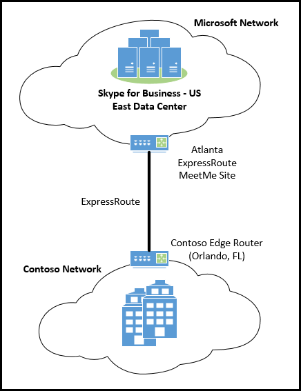
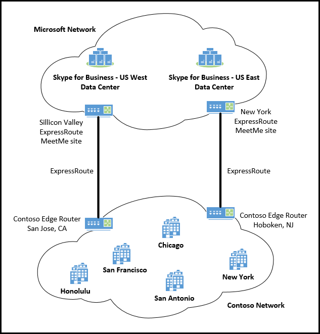
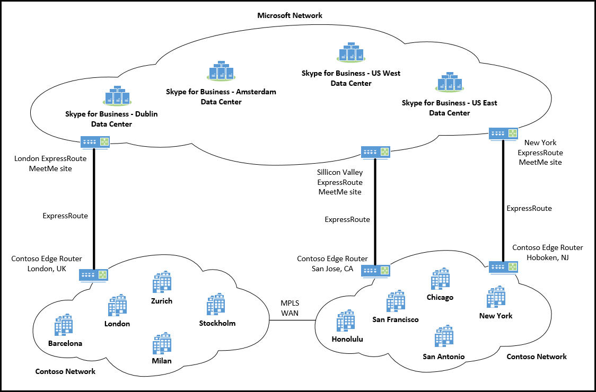
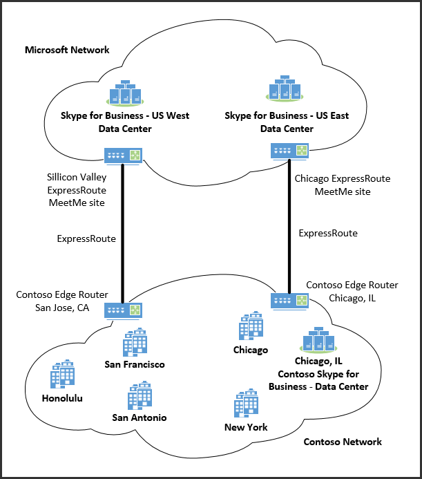
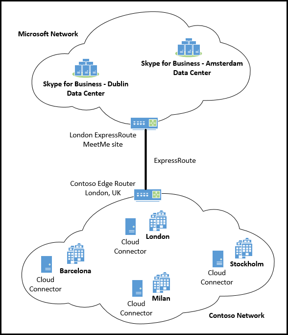
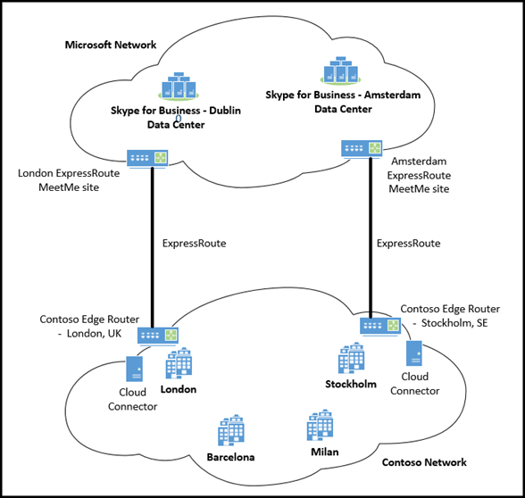

# Skype for Business Online におけるメディアの品質とネットワーク接続性のパフォーマンスMedia Quality and Network Connectivity Performance in Skype for Business Online

このトピックでは、Skype for Business Online サービスのネットワークパフォーマンス要件のセットと、ネットワークと Skype for Business Online との間の接続にインターネットまたは ExpressRoute を使用する方法を定義する方法について説明します。ネットワークの評価に基づいています。対する.This topic defines the set of network performance requirements for Skype for Business Online services and how you can choose to use the Internet or ExpressRoute for connectivity between your network and Skype for Business Online based your assessment of the network connectivity. Office 365 への専用接続用に Azure ExpressRoute を展開することにした場合、このドキュメントでは、さまざまな Skype for Business Online の展開シナリオで ExpressRoute 接続を計画する方法のガイダンスについて説明します。If you have decided to deploy Azure ExpressRoute for dedicated connectivity to Office 365, this document also provides guidance on how to plan your ExpressRoute connections in different Skype for Business Online deployment scenarios.
  
IP 経由のリアルタイムメディア (オーディオ、ビデオ、およびアプリケーション共有) の品質は、エンドツーエンドのネットワーク接続の品質に大きく影響します。The quality of Real-Time media (audio, video, and application sharing) over IP is greatly impacted by the quality of end-to-end network connectivity. Skype for Business Online メディアの最適な品質を得るために、会社のネットワークと Skype for Business Online 間の接続が高品質であることを確認することが重要です。For optimal Skype for Business Online media quality, it is important for you to make sure there is a high-quality connection between your company network and Skype for Business Online. これを達成するためには、内部ネットワークとクラウド接続を、接続全体にわたって Skype for Business Online のピーク時のトラフィック量を処理するネットワークのキャパシティに基づいて設定することが最善の方法になります。The best way to accomplish this is to set up your internal network and cloud connectivity based on the capacity of your network to accommodate for peak traffic volume for Skype for Business Online across all connections.
  
Azure ExpressRoute は、Skype for Business Online などの Office 365 サービスの要件ではありません。Azure ExpressRoute isn't a requirement for Office 365 services including Skype for Business Online. ただし、Azure ExpressRoute は、Office 365 への接続が Skype for Business ネットワークのパフォーマンス要件を満たし、最適な Skype for Business Online メディアを確実に満たすために使用できる展開オプションの1つです。音質が向上します。However, Azure ExpressRoute is one of the deployment options that are available that will help make sure that connectivity to Office 365 meets the Skype for Business network performance requirements and ensures the most optimal Skype for Business Online media quality experience.
  
> [!TIP]
> このトピックでは、全体的なネットワークパフォーマンスガイダンスについて説明していますが、ネットワークの評価に関する包括的なガイダンスは、このドキュメントの範囲外です。Although this topic provides you with overall networking performance guidance, complete guidance for network assessment is outside of the scope of this document. 綿密かつ完全なネットワーク評価の一環として、ネットワークパフォーマンスの測定に役立つ Skype for Business Online パートナーの一覧を見つけるには、 [skype For Business パートナーソリューション](http://partnersolutions.skypeforbusiness.com/)にアクセスしてください。To find a list of Skype for Business Online partners who can help you with the network performance measurements as part of a thorough and complete network assessment, please visit [Skype for Business Partner Solutions](http://partnersolutions.skypeforbusiness.com/). 
  
## Skype for Business Online へのネットワーク接続要件Network connectivity requirements to Skype for Business Online

### Skype for Business Online メディアの品質に影響する要因Factors that impact Skype for Business Online media quality

Skype for Business Online のリアルタイムメディア (オーディオ、ビデオ、およびアプリケーション共有) には、使用されているデバイス、環境、ネットワーク接続など、さまざまな要因があります。There are many different factors that contribute to Skype for Business Online Real-Time media (audio, video, and application sharing) quality that include the devices that are used, the environment, and the network connectivity. 
  
#### デバイスDevices

リアルタイムのメディアセッションでは、ヘッドセットや Web カメラなどすべての参加者によって使用されるメディアのキャプチャとレンダリングデバイスは、全体的な音声とビデオの品質に大きな影響を与えます。In a Real-Time media session, media capturing and rendering devices that are used by all participants such as headsets and Web cams have a great impact on the overall audio and video quality. 品質の低いデバイスや、デバイス ドライバが間違っているデバイスでは、全体的にオーディオの音質が下がり、ビデオの画質が下がります。Lower quality devices or devices with incorrect device drivers will produce lower overall sound quality for audio and lower image quality for video. 一方、認定デバイスまたは高品質なデバイスは、エコー キャンセル、ノイズ フィルタリング、ビデオ解像度、遅延低減に役立ちます。Certified devices or good quality devices, on the other hand, help with echo cancellation, noise filtering, video resolution and reduce latency.
  
認定されたオーディオおよびビデオメディアデバイスは必須ではありませんが、最適なメディアエクスペリエンスを実現するために Skype for Business で認定されているデバイスを強くお勧めします。Although certified audio and video media devices aren't required, it's highly recommended devices certified for Skype for Business for the most optimal media experience. すべての Skype for Business 認定デバイスの一覧については、「Skype for business[の電話とデバイス](https://technet.microsoft.com/en-us/office/dn947482)」を参照してください。For a list of all Skype for Business certified devices, see [Phones and Devices for Skype for Business](https://technet.microsoft.com/en-us/office/dn947482). Skype for business**管理センター**にある[Skype For Business Online 通話品質ダッシュボード](/microsoftteams/turning-on-and-using-call-quality-dashboard)を使用して、使用中のデバイスが正常に動作していることを確認し、オーディオとビデオのメディアの品質を監視することができます。You can use the [Skype for Business Online Call Quality Dashboard](/microsoftteams/turning-on-and-using-call-quality-dashboard), found in the **Skype for Business admin center**, to verify devices in use are working correctly and monitor audio and video media quality.
  
> [!TIP]
> **Skype For business で最適なメディア品質を得るには、認定デバイスが必要**です。**A certified device is required for the most optimal Skype for Business media quality experience**.
  
リアルタイムメディアを使用するメディアデバイス、Skype for business クライアント、および Skype for Business サーバーは、一定の時間がかかることを覚えておくことが重要です。It's important to remember that any media devices, Skype for Business clients, and Skype for Business Servers through which Real-Time media flows, introduce some amount of latency. デバイスとソフトウェアの処理待ち時間は、ネットワーク待ち時間と共に、エンドツーエンドの全体的な待ち時間とエンドユーザーエクスペリエンスに大きく影響します。The device and software processing latency, along with network latency, have a great impact on and contribute to the end-to-end overall latency and the end user's experience.
  
#### 環境Environment

ユーザーが会議を行い、オーディオ デバイスとビデオ デバイスを使用する環境と周辺領域は、オーディオとビデオの品質のもう 1 つの要因です。ノイズのある環境から通話しているユーザーのオーディオは、エコーがかかり、こもっていて、不明瞭です。暗くて照明が不十分な環境にいるユーザーは、ビデオで明るくクリアな画質を実現することができません。会議室の設定で、マイクとビデオ デバイスの場所は、参加者が受信する音声と画像の品質に直接影響します。The environment and surrounding area where users are meeting and using audio and video devices is another big factor for audio and video quality. Users calling from a noisy environment will have echoed, muffled and unclear audio. Users in a dark or low light environment won't be able to produce bright, clear image quality for video. In a conference room setting, the location of the microphone and video device have a direct impact on the sound and image quality that participants will receive.
  
ユーザーの音声とビデオのエクスペリエンスをより明確にするために、Skype for business アプリの [**ツール** > **]** > の [**オーディオデバイス**] または [**ビデオデバイス**] を使って、使用中のデバイスに変更を加え、その設定をカスタマイズします。To get a clearer picture of a user's audio and video experience use the Skype for Business app **Tools** > **Options** > **Audio Device** or **Video Device** to make changes to the device in use and customize its settings.

#### ネットワークNetwork

IP ネットワーク上のリアルタイムメディアの品質は、ネットワーク接続の品質に大きな影響を与えますが、特に次の量によって影響を受けます。The quality of the Real-Time media over IP network is greatly impacted by the quality of the network connectivity, but especially by the amount of:
  
- **待機時間**これは、IP パケットがネットワーク上のポイント A からポイント B に到達するまでにかかる時間です。**Latency** This is the time it takes to get an IP packet from point A to point B on the network. このネットワーク伝播遅延は、さまざまなルーターの間の追加のオーバーヘッドを含めて、2つのポイントとライトの速度の間の物理的な距離に関連しています。This network propagation delay is essentially tied to physical distance between the two points and the speed of light, including additional overhead taken by the various routers in between. 待ち時間は、一方向またはラウンドトリップ時間 (RTT) として測定されます。Latency is measured as one-way or Round-trip Time (RTT).
    
- **パケット損失**これは、多くの場合、特定の時間帯に消失したパケットの割合として定義されます。**Packet Loss** This is often defined as a percentage of packets that are lost in a given window of time. パケット損失は、オーディオの品質に直接影響を与えます。これは、完全に失われた小さいパケットによって、完全なオーディオのカットアウトを引き起こすバックツーバックのバースト損失になります。Packet loss directly affects audio quality—from small, individual lost packets having almost no impact, to back-to-back burst losses that cause complete audio cut-out.
    
- **パケット間の着信のジッターまたは単なるジッター**これは、連続するパケット間の遅延の平均変更です。**Inter-packet arrival jitter or simply jitter** This is the average change in delay between successive packets. Skype for Business などの最新の VoIP ソフトウェアは、バッファー処理によって一定レベルのジッターに対応できます。Most modern VoIP software including Skype for Business can adapt to some levels of jitter through buffering. これは、ジッタがジッターの効果に気付くというバッファリングを超える場合に限られます。It's only when the jitter exceeds the buffering that a participant will notice the effects of jitter.
    
> [!NOTE]
>  ジッタのバッファリングにより、エンドツーエンドの待ち時間が増加します。Buffering for jitter will increase end-to-end latency.
  
Skype for Business Online のリアルタイムメディアセッション、および他の Office 365 サービスやその他のビジネスアプリケーションによって生成されるその他のネットワークトラフィックによって、ネットワークパス全体に十分な帯域幅があることを確認します。ネットワークの輻輳を回避し、優れたメディアリアルタイムメディア (オーディオ、ビデオ、およびアプリケーション共有) の品質を確保するために、ネットワークを Skype for Business Online サービスに接続することが重要です。With many concurrent Skype for Business Online Real-Time media sessions, as well as other network traffic generated by other Office 365 services and other business applications, making sure that there is sufficient bandwidth over the entire network path that connects your network to the Skype for Business Online service is critical to avoid network congestion and ensure excellent media Real-Time media (audio, video, and application sharing) quality. 
  
#### 混雑したネットワーク全体でサービスの品質 (QoS) を実装するImplementing Quality of Service (QoS) across congested networks

また、ネットワーク全体のトラフィック渋滞は、メディアの品質に大きく影響します。In addition, traffic congestion across a network will greatly impact media quality. オーディオおよびビデオのパケットがネットワークをより迅速に移動できるようにし、輻輳ネットワーク内の他のネットワークトラフィックに優先順位を付けるには、QoS (Quality of Service) を使って、音声とビデオの通信に最適なエンドユーザーエクスペリエンスを提供することができます。To allow audio and video packets to travel the network quicker and to be prioritized over other network traffic in a congested network, Quality of Service (QoS) can be used to help provide an optimal end-user experience for audio and video communications.
  
QoS は、オーディオデータまたはビデオデータを伝送するネットワークパケットに優先順位を割り当てるための手段を提供します。QoS provides a way for you to assign higher priorities to network packets that are carrying audio or video data. これらのパケットに高い優先順位を割り当てることによって、音声とビデオの通信は、ファイル転送、web 閲覧、データベースバックアップなどのネットワークセッションよりも、ネットワークを介して高速かつ中断される可能性が高くなります。By assigning a higher priority to these packets, audio and video communications are likely to travel over the network faster, and with less interruption, than network sessions involving things like file transfers, web browsing, or database backups. これは、ファイル転送に使用されるネットワークパケット、または既定ではデータベースのバックアップに、優先度とネットワークの輻輳としては大きな影響を与えないためです。That's because the network packets used for file transfers or database backups by default are assigned "best effort" as a priority and network congestion won't have as large impact. メディア (オーディオ、ビデオ、およびアプリケーションの共有) パケットに優先度を割り当てずに、"ベストエフォート" として割り当てたままにすると、その他のすべてのネットワークトラフィックと共にそれらも処理されます。If you don't assign a higher priority to the media (audio, video, and application sharing) packets and leave them also assigned as "best effort", they too will be processed along with all other network traffic. ネットワーク輻輳の量によっては、ユーザーのために全体的な音質とビデオ品質のエクスペリエンスが低下する可能性があります。Depending on the amount of network congestion, this will potentially end up in a lower overall audio and video quality experience for your users.
  
ネットワーク内のネットワークの輻輳が影響を受けることがないように、QoS をネットワークに実装することを強くお勧めします。It is highly recommended that you implement QoS on your network to make sure that network congestion within your network won't have an impact. ただし、このような影響を最大にするために、すべてのネットワークエンドポイントは QoS をサポートしている必要があります。つまり、すべてのエンドポイントが QoS マーキングとパケットの優先順位を遵守する必要があります。However, for this to have the maximum impact, all networking endpoints must support QoS, meaning that all endpoints must honor QoS marking and packet prioritization. Skype for Business Online サービスは、Microsoft ネットワーク内での QoS マーキングと優先順位付けを受け入れます。Skype for Business Online services honor QoS marking and prioritization within the Microsoft network. ただし、社内ネットワークから Microsoft ネットワークへのインターネットなどのパブリック接続を経由してルーティングされるトラフィックは、QoS マーキングとパケットの優先順位を維持しません。However, traffic that is routed across a public connection like the Internet from your company network to the Microsoft network doesn't preserve QoS markings and packet prioritization. [Azure ExpressRoute](https://azure.microsoft.com/services/expressroute/)を使用したネットワークから Office 365 へのプライベート接続は、エンドユーザーの全体的な音声とビデオの品質を向上させるために、QoS マーキングとパケットの優先順位を維持する展開ソリューションを提供します。Private connections from your network to Office 365 using [Azure ExpressRoute](https://azure.microsoft.com/services/expressroute/) offer a deployment solution that preserves QoS markings and packet prioritization that will in turn increase overall audio and video quality for your end users.
  
## Skype for Business Online に接続するためのネットワークパフォーマンス要件Network performance requirements to connect to Skype for Business Online

Skype for Business のリアルタイムメディアは、さまざまなデバイス、クライアントアプリ、サーバーソフトウェア、および異なるネットワーク間で転送されます。Skype for Business Real-Time media travels through many different devices, client apps, server software, and across different networks. リアルタイムメディアのエンドツーエンドの待機時間は、すべてのコンポーネントとネットワークセグメントにわたって導入される待機時間の合計です。The end-to-end latency of Real-Time media is the total amount of latency that is introduced across all components and network segments. エンドツーエンドのネットワーク接続の品質は、最も品質の低いネットワークセグメントによって決まります。The quality of the end-to-end network connection is determined by the network segment with the worst quality. このセグメントは、このネットワークトラフィックのボトルネックとして機能します。This segment acts as a bottleneck for this network traffic.
  
次の図は、1つの Skype for Business の参加者から別の会議への一方向のオーディオフローを示しています。The following diagram illustrates one-way audio flow in a conference from one Skype for Business participant to another.
  

  
この会議シナリオでは、メディアパスは次のネットワークセグメントで構成されています。In this conferencing scenario, the media path consists across the following network segments:
  
1. **ユーザー1から Microsoft ネットワークの端への接続**通常、WiFi またはイーサネットなどのネットワーク接続、ユーザー1からインターネット出口ポイント (ネットワークエッジデバイス) への WAN 接続、ネットワークエッジから Microsoft ネットワークエッジへのインターネット接続などが含まれます。**Connection from User 1 to the edge of the Microsoft network** This usually includes a network connection such as WiFi or Ethernet, the WAN connection from User 1 to the Internet egress point (your network Edge device), and the Internet connection from your network Edge to Microsoft network Edge.
    
2. **Microsoft ネットワーク内の接続**これは、Microsoft Edge と Skype for Business Online データセンター間で、A/V 会議サーバーが使われています。**Connection within Microsoft network** This is between the Microsoft Edge to Skype for Business Online data center, where the A/V Conferencing servers are used.
    
3. **Microsoft ネットワーク内の接続**これは、Skype for Business Online データセンターと Microsoft ネットワークエッジの間にあります。**Connection within Microsoft Network** This is between the Skype for Business Online data center and Microsoft network Edge.
    
4. **Microsoft ネットワークエッジからユーザー2への接続**これには、ネットワークエッジから Microsoft ネットワークエッジへのインターネット接続、ユーザー2からインターネット出口ポイント (ネットワークエッジ) への WAN 接続、WiFi またはイーサネットなどのネットワーク接続が含まれます。**Connection from Microsoft network edge to User 2** This includes the Internet connection from your network Edge to Microsoft network Edge, the WAN connection from User 2 to the Internet egress point (your network Edge), and the network connection such as a WiFi or an Ethernet.
    
次の図は、Skype for Business Online PSTN 通話のコンポーネントとネットワークセグメントの内訳を示しています。The following diagram shows breakdown of components and network segments of a Skype for Business Online PSTN call:
  

  
PSTN 通話のシナリオでは、メディアパスは以下のネットワークセグメントを横断します。In a PSTN call scenario, the media path crosses the following network segments:
  
1. **Skype For business クライアントの発信者から Microsoft ネットワークの端への接続**これには通常、WiFi またはイーサネットなどのネットワーク接続、Skype for Business クライアントの発信者からインターネット出口ポイント (ネットワークエッジデバイス) への WAN 接続、ネットワークエッジから Microsoft ネットワークエッジへのインターネット接続などが含まれます。**Connection from a Skype for Business client caller to the edge of the Microsoft Network** This usually includes a network connection such as WiFi or Ethernet, the WAN connection from the Skype for Business client caller to the Internet egress point (your network Edge device), and the Internet connection from your network Edge to Microsoft network Edge.
    
2. **Microsoft ネットワーク内の接続**これは、Microsoft Edge と Skype for Business Online データセンターの間で、仲介サーバーが使用されます。**Connection within Microsoft network** This is between the Microsoft Edge to Skype for Business Online data center, where a Mediation Server is used.
    
3. **Microsoft ネットワーク内の接続**これは、Skype for Business Online データセンターと Microsoft ネットワークエッジの間にあります。**Connection within Microsoft Network** This is between the Skype for Business Online data center and Microsoft network Edge.
    
4. **Microsoft ネットワークと PSTN サービスプロバイダパートナーとの接続**これは、Microsoft ネットワークの外部にある Skype for Business クライアントから PSTN 通話を発信するために存在する接続です。**Connection between Microsoft Network and the PSTN service provider partners** This is the connection that exists to place a PSTN call from the Skype for Business client that is outside of the Microsoft network.
    
### Skype for Business クライアントから Microsoft ネットワークエッジへのネットワークパフォーマンス要件Network Performance requirements from a Skype for Business client to Microsoft network Edge

Skype for Business の最適なメディア品質を得るため、会社のネットワークから Microsoft ネットワークエッジへの接続には、次のネットワークパフォーマンスメトリックのターゲットまたはしきい値が必要です。For optimal Skype for Business media quality, the following network performance metrics targets or thresholds are required for a connection from your company's network to the Microsoft network Edge. ネットワークのこのセグメントには内部ネットワークが含まれています。これには、すべての WiFi とイーサネット接続、WAN 接続経由の会社のサイト間トラフィック (マルチプロトコルラベル切り替え (MPLS)、インターネットまたは ExpressRoute パートナーなど) が含まれます。Microsoft ネットワークエッジへの接続。This segment of the network includes your internal network, this includes all WiFi and Ethernet connections, any company site-to-site traffic over a WAN connection, for example Multiprotocol Label Switching (MPLS), as well as the Internet or ExpressRoute partner connections to the Microsoft network Edge.
  
> [!CAUTION]
> **会社のネットワーク上の Skype for Business クライアントと Office 365 サービス間の接続は、以下のネットワークパフォーマンス要件としきい値を満たす必要があります。****Connectivity between a Skype for Business client on your company network to Office 365 services must meet these following network performance requirements and thresholds.**
  
|||
|:-----|:-----|
|**指標****Metric**   |**Target****Target**   |
|遅延 (一方向)Latency (one way)    |< 50 ミリ秒< 50ms    |
|遅延 (RTT または往復時間)Latency (RTT or Round-trip Time)    |< 100 ミリ秒< 100ms    |
|バースト パケット損失Burst packet loss    |< 任意の 200 ミリ秒間隔で 10%<10% during any 200ms interval    |
|パケット損失Packet loss    |< 任意の 15 秒間隔で 1%<1% during any 15s interval    |
|パケット到着間ジッターPacket inter-arrival Jitter    |< 15 秒間隔で 30 ミリ秒<30ms during any 15s interval    |
|パケットの並べ替えPacket reorder    |< 順序が適切でないパケットが 0.05%<0.05% out-of-order packets    |
   
 **その他のパフォーマンスターゲット要件:****Other performance target requirements:**
  
- Microsoft ネットワークでは、世界中に160を超えるエッジの場所があります。The Microsoft network has over 160 Edge locations worldwide. このエッジサイトを通じて世界各地の主要インターネットサービスプロバイダ (Isp) と協力しています。We work with major Internet Service Providers (ISPs) worldwide through those Edge sites. 潜在期間の指標の目標は、会社のサイトまたはサイトを想定しており、Microsoft の端が同じ大陸にあることを前提としています。The latency metric target assumes your company site or sites and the Microsoft Edges are on the same continent.
    
- 会社のサイトまたは Microsoft ネットワークエッジ接続には、WiFi または別のワイヤレステクノロジとして使用できる最初のホップネットワークアクセスが含まれます。Your company site or sites to the Microsoft network Edge connection include first hop network access, which can be WiFi or another wireless technology. 
    
- ネットワークパフォーマンスターゲットは、適切な帯域幅とサービス品質の計画を前提としています。The network performance target assumes proper bandwidth and/or quality of service planning. つまり、これは、ネットワーク接続がピーク負荷の下にあるときに、Skype for Business のリアルタイムメディアトラフィックに直接適用されます。In other words, This applies directly to Skype for Business Real-Time media traffic when the network connection is under a peak load.
    
### ネットワークエッジから Microsoft ネットワークエッジへのネットワークパフォーマンス要件Network performance requirements from your network Edge to Microsoft network Edge

ネットワークエッジと Microsoft ネットワークエッジ間の接続に必要なネットワークパフォーマンスのターゲットまたはしきい値を次に示します。The following are the network performance targets or thresholds that are required for the connection between your network Edge and the Microsoft network Edge. このセグメントには、お客様の内部ネットワークまたは WAN が含まれていません。また、インターネット経由で送信されたネットワークトラフィックをテストするとき、または ExpressRoute パートナーネットワーク経由で送信されるネットワークトラフィックをテストする際のガイダンスとして、パフォーマンスをネゴシエートするときにも使うことができます。ExpressRoute プロバイダーとのサービスレベル契約 (SLA)。This segment of the network excludes the customer's internal network or WAN, and is intended as guidance when testing your network traffic that is sent over the Internet, or through an ExpressRoute partner network and can also be used when negotiating a performance Service Level Agreement (SLA) with your ExpressRoute provider.
  
> [!CAUTION]
> **会社のネットワークエッジと Microsoft ネットワークエッジ間の接続は、以下のネットワークパフォーマンス要件としきい値を満たす必要があります。****Connectivity between your company network Edge to the Microsoft network edge must meet these following network performance requirements and thresholds.**
  
|||
|:-----|:-----|
|**指標****Metric**   |**Target****Target**   |
|遅延 (一方向)Latency (one way)    |< 30 ミリ秒< 30ms    |
|待機時間 (RTT)Latency (RTT)    |< 60 ミリ秒< 60ms    |
|バースト パケット損失Burst packet loss    |<1% (任意の200ミリ秒)<1% during any 200 ms interval    |
|パケット損失Packet loss    |< 任意の 15 秒間隔で 0.1%<0.1% during any 15s interval    |
|パケット到着間ジッターPacket inter-arrival Jitter    |< 任意の 15 秒間隔で 15 ミリ秒<15ms during any 15s interval    |
|パケットの並べ替えPacket reorder    |< 順序が適切でないパケットが 0.01%<0.01% out-of-order packets    |
   
 **その他のパフォーマンスターゲット要件:****Other performance target requirements:**
  
- パフォーマンスターゲットでは、会社のいずれかのネットワークエッジと、それに最も近い Microsoft ネットワークエッジ間の接続が同じ大陸にあることが必要です。The performance target requires connection between any of your company's network Edge and its nearest Microsoft network Edge, to be on the same continent.
    
- ネットワークパフォーマンスターゲットは、適切な帯域幅とサービス品質の計画を前提としています。The network performance target assumes proper bandwidth and/or quality of service planning. これは、ネットワーク接続がピーク負荷の下にある場合の、Skype for Business のリアルタイムメディアトラフィックにも適用されます。This also applies to Skype for Business Real-Time media traffic when the network connection is under a peak load. 適切な帯域幅と QoS の計画については、「 [Skype For Business Online の ExpressRoute および qos」](https://support.office.com/en-us/article/ExpressRoute-and-QoS-in-Skype-for-Business-Online-20c654da-30ee-4e4f-a764-8b7d8844431d?ui=en-US&amp;rs=en-US&amp;ad=US)を参照してください。For proper bandwidth and QoS planning, please refer to [ExpressRoute and QoS in Skype for Business Online](https://support.office.com/en-us/article/ExpressRoute-and-QoS-in-Skype-for-Business-Online-20c654da-30ee-4e4f-a764-8b7d8844431d?ui=en-US&amp;rs=en-US&amp;ad=US).
    
## ネットワークパフォーマンスの測定Measuring network performance

実際のネットワークのパフォーマンスを測定するには (特に、会社のネットワークサイトからネットワークの端まで)、ping などのツールを使用して、Microsoft Edge とデータから実行されている一連の Skype for Business メディアリレーサービスをテストすることができます。センターサイト。To measure the actual network performance, especially for latency and packet loss, from any company network site to a network Edge, you can use tools such as ping, test against a set of Skype for Business media relay services running from the Microsoft Edge and data center sites. 
  
Microsoft ネットワークへのインターネット接続をテストするには、Skype for Business メディアリレーの次の Vip に対してテストすることをお勧めします。For testing Internet connections to the Microsoft network, it is recommended that you test against the following VIPs of the Skype for Business media relays. *エニーキャスト VIP*は、テストの場所に最も近い Microsoft ネットワークエッジサイトのメディアリレーの IP アドレスに解決されます。The *Anycast VIP*  will resolve to an IP address of a Media Relay in a Microsoft network Edge site that is closest to the testing location.
  
||||
|:-----|:-----|:-----|
|**IP アドレス****IP address**   |**型****Type**   |**場所****Location**   |
|13.107.8.213.107.8.2    |VIPVIP    |World Wide エニーキャスト IPWorld Wide Anycast IP    |
   
 **ネットワークパフォーマンスの評価については、次の高レベルの推奨事項を参照してください。****Here are some high level recommendations to follow for assessing network performance:**
  
- 内部ネットワークと Office 365 への接続を評価する必要があります。You should assess your internal network as well as the connections to Office 365.
    
- すべてのネットワークのデータを長期間にわたって評価して収集する必要があります。You should assess and gather data for all of your networks over a long period of time. 少なくとも1週間のネットワークパフォーマンスのテストを実施することをお勧めします。そのため、すべての営業日と時間の使用状況パターンを確認できます。We recommend for you to perform your testing of network performance for a minimum of a week, so that you can see usage patterns for all business days and hours. ピーク時間が表示されます。This will show you peak times.
    
- ネットワークパフォーマンスの測定の複数のサンプルを実行する必要があります。You should take multiple samples of network performance measurements. データを収集している間、会社のサイトから10分ごとに測定を行うことをお勧めします。We recommend taking a measurement every 10 minutes from a company site during the entire period of time you are gathering data. Skype for Business Online のネットワークパフォーマンス要件を比較するには、このサンプルデータセットから90th タイルの測定値を取得します。For comparing the Skype for Business Online network performance requirements, take the 90th percentile measurement value from this sample data set. 
    
- ネットワークのパフォーマンスを継続的に評価する必要があります。You should continuously assess the network's performance. ネットワーク使用率は、使用パターンの変更、大量の帯域幅を使用する新しいエンタープライズベースのアプリケーション、組織または物理的な会社の場所への変更などによって、時間の経過と共に変化します。Network utilization varies over time due to usage pattern changes, new enterprise-based applications that use a large amount of bandwidth, and changes to your organizational or physical company locations. これらのネットワークパフォーマンス要件とターゲット/しきい値に基づいてネットワークのパフォーマンスを継続的に監視し、最適なリアルタイムのメディア品質を確保するためにタイムリーに調整を行うことが重要です。It is important for you to continuously monitor your network performance against these network performance requirements and targets/thresholds and make timely adjustments to ensure the most optimal Real-Time media quality. 
    
## Azure Vm を使ったネットワークパフォーマンスの測定Measuring Network Performance using Azure VMs

Microsoft ネットワークエッジサイトに対するテストの代わりに、Skype for Business のお客様とパートナーが提供するネットワーク評価ソリューションを利用して、Microsoft Azure cloud でのサービスのセットアップのテストを活用してください。Instead of testing against the Microsoft network Edge sites, there are network assessment solutions from Skype for Business customers and partners that leverage testing setup for services in the Microsoft Azure cloud. これらのソリューションでは、ネットワーク評価ツールは、Azure cloud でサービスとしてセットアップされたカスタムエンドポイントに対して、待機時間、パケット損失、ジッタをテストします。In those solutions, the network assessment tools test latency, packet loss and jitter against custom endpoints set up as a service in the Azure cloud. このため、テストネットワークトラフィックは、ネットワーク評価サービスをホストするネットワークエッジと Azure データセンター間の Microsoft ネットワーク内の接続という、1つの追加のネットワークセグメントを経由して転送されます。As a result, the test network traffic travels through one additional network segment, which is the connection within the Microsoft network between the network edges and Azure data centers that hosts the network assessment service.
  
Azure でホストされているテストサービスに基づくネットワーク評価ソリューション。For those network assessment solutions based on Azure hosted testing services. 国または地域内でネットワーク評価を実施することをお勧めします。We recommend performing the network assessment within country and/or region. たとえば、米国東部の顧客サイトの場合、評価は、Azure の east US データセンター地域でホストされているテストサービスインスタンスに対して実行する必要があります。For example, for customer sites in east U.S., the assessment should be performed against a testing service instance hosted in Azure's east US data center region. 
  
以下は、Azure サービスベースのネットワーク評価のセットアップの待機時間 (RTT) のターゲットです。Below are the latency (RTT) targets for the Azure service based network assessment setup. 一方向の待ち時間のターゲットは、対応する RTT ターゲットの半分になります。The one-way latency targets will be half of the corresponding RTT targets. パケット損失とジッタの目標は、Skype メディアリレーベースのテスト用に定義されたものと同じままです。The packet loss and jitter goals stays the same as those defined for Skype Media Relay based testing.
  
|||||
|:-----|:-----|:-----|:-----|
|**顧客の地域****Customer region**   |**Azure の地域****Azure region**   |**ネットワークエッジ-Azure 間のラウンドトリップ時間 (RTT)****Your network Edge - Azure Round-trip Time (RTT)**   |**サイト-Azure のラウンドトリップ時間 (RTT)****Your Site - Azure Round-trip Time (RTT)**   |
|米国中央部Central US    |米国中央部Central US    |9999    |139139    |
|米国東部East US    |米国東部East US    |8686    |126126    |
|北中央アメリカNorth Central US    |北中央アメリカNorth Central US    |9797    |137137    |
|南部中央アメリカSouth Central US    |南部中央アメリカSouth Central US    |9494    |134134    |
|米国西部West US    |米国西部West US    |9494    |134134    |
|米国ハワイHawaii US    |米国西部West US    |116116    |156156    |
|カナダ中部Canada Central    |カナダ中部Canada Central    |138138    |178178    |
|カナダ東部Canada East    |カナダ東部Canada East    |131131    |171171    |
|北ヨーロッパNorth Europe    |北ヨーロッパNorth Europe    |9999    |139139    |
|西ヨーロッパWest Europe    |西ヨーロッパWest Europe    |9595    |135135    |
|東アジアEast Asia    |東アジアEast Asia    |118118    |158158    |
|東南アジアSoutheast Asia    |東南アジアSoutheast Asia    |9797    |137137    |
|日本東部Japan East    |日本東部Japan East    |111111    |151151    |
|西西部Japan West    |西西部Japan West    |118118    |158158    |
|ブラジル南部Brazil South    |ブラジル南部Brazil South    |7070    |110110    |
|オーストラリア東部Australia East    |オーストラリア東部Australia East    |124124    |164164    |
|オーストラリア南東Australia Southeast    |オーストラリア南東Australia Southeast    |124124    |164164    |
|インド中部Central India    |インド中部Central India    |103103    |143143    |
|インド南部South India    |インド南部South India    |103103    |143143    |
|インド西部West India    |インド西部West India    |103103    |143143    |
|中国東部China East    |中国東部China East    |120120    |160160    |
|中国北部China North    |中国北部China North    |120120    |160160    |
   
## メディアの品質と ExpressRouteMedia quality and ExpressRoute

Office 365 用 Azure ExpressRoute は、Office 365 に接続するための専用ネットワーク接続です。Azure ExpressRoute for Office 365 is a dedicated network connection for connecting to Office 365. Office 365 ネットワークトラフィックにかかるパスを管理する機能をユーザーに提供します。It offers customers the ability to have control over the path their Office 365 network traffic takes. インターネット上では、未知の配送業者、プロバイダー、および Isp によってデータが伝送される予期しないルーティングについて心配する必要はありません。They no longer have to be concerned with the unpredictable routing that happens on the Internet where data is carried by unknown carriers, providers and ISPs. ExpressRoute 経由で送信されるネットワークトラフィックは、ExpressRoute パートナーのネットワークを介して Microsoft のネットワークに直接送信されます。Network traffic that is sent through ExpressRoute is sent directly across the ExpressRoute partner's network to Microsoft's network. これにより、ユーザーは、専用の接続を備えた独自のオフサイトデータセンターにあるかのように Office 365 を扱うことができます。This allows customers to treat Office 365 as if it is located in their own off-site data center with a dedicated connection.
  
Azure ExpressRoute は、すべての Office 365 ライセンスサービスで利用できます。Azure ExpressRoute is available for all Office 365 licensing offerings. ただし、Office 365 でグローバルルーティングを有効にするには、Azure ExpressRoute Premium アドオンが必要です。However, the Azure ExpressRoute Premium Add-on is required for Office 365 to enable global routing. Office 365 では、ExpressRoute を実装している少なくとも500座席をお持ちのお客様は、必要な*Expressroute Premium アドオン*を追加料金なしで入手できます。Office 365 customers with at least 500 seats who are implementing ExpressRoute can get the required *ExpressRoute Premium Add-on* at no additional expense.
  
### 適切なメディア品質を使用するには ExpressRoute が必要ですか?Is ExpressRoute required for good media quality?

Azure ExpressRoute は、最適な Skype for Business Online メディア品質を得るための要件ではありません。Azure ExpressRoute isn't a requirement for getting the most optimal Skype for Business Online media quality. ただし、クラウド接続が Skype for Business ネットワークパフォーマンスのターゲットまたはしきい値を満たすようにするために役立つ展開オプションの1つです。It is, however, one of the deployment options that help you make sure that your cloud connectivity meets the Skype for Business network performance targets or thresholds.
  
Office 365 は、インターネットを使用する高パフォーマンスで安全なサービスです。Office 365 is a high performance and secure service that uses the Internet. セキュリティとパフォーマンスを継続的に向上させるために、新しいセキュリティ機能と地域の Edge ノードへの投資を継続しています。We continue to invest in new security capabilities and regional Edge nodes to continuously improve security and performance. Azure ExpressRoute は、Skype for Business Online などの Office 365 サービスの要件ではありません。Azure ExpressRoute isn't a requirement for Office 365 services including Skype for Business Online. Azure ExpressRoute は、Office 365 への接続が Skype for Business ネットワークパフォーマンス要件を満たしていることを確認し、最適な Skype for Business Online メディア品質を確保するために使用できる展開オプションの1つです。実感.Azure ExpressRoute is one of the deployment options that are available that will help make sure that connectivity to Office 365 meets the Skype for Business network performance requirements and ensures the most optimal Skype for Business Online media quality experience.
  
Skype for Business Online のメディアの品質を向上させるには、会社のサイトと Microsoft ネットワークのエッジ間の接続が、 [skype For business クライアントから microsoft ネットワークへのネットワークパフォーマンス要件の目標を満たしていることが重要です。Edge](media-quality-and-network-connectivity-performance.md#bkSfBClienttoEdge) 、ネットワークエッジと microsoft ネットワークエッジ間の接続は、ネットワークのパフォーマンス要件で、ネットワーク[エッジから Microsoft ネットワークエッジへ](media-quality-and-network-connectivity-performance.md#bkYourNetworkEdge)の接続の目標を満たしていることを前提としています。For Skype for Business Online media quality, it is important that the connection between your company sites and the Microsoft network Edges meets the performance targets in [Network Performance requirements from a Skype for Business client to Microsoft network Edge](media-quality-and-network-connectivity-performance.md#bkSfBClienttoEdge) and that the connection between your network Edges and the Microsoft network edges meets the performance targets in [Network performance requirements from your network Edge to Microsoft network Edge](media-quality-and-network-connectivity-performance.md#bkYourNetworkEdge).  
  
また、社内ネットワークやクラウドの接続性など、ピークメディアトラフィックのボリュームを含む、会社の物理ネットワーク接続も重要です。It is also important that your company's physical network connectivity, including your internal network and cloud connectivity capacity accommodate peak media traffic volume. Azure ExpressRoute は、お客様が Skype for Business Online クラウド接続をすべて満たしているかどうかを確認するためのさまざまな方法の1つです。Azure ExpressRoute is one of many ways that will help customers ensure their Skype for Business Online cloud connectivity meets all of these performance requirements.
  
### ExpressRoute は音声品質 SLA に必要ですか?Is ExpressRoute required for voice quality SLA?

いいえ。 Skype for Business Online の音声品質 SLA では、ExpressRoute は必要ありません。No, ExpressRoute isn't required for Skype for Business Online Voice Quality SLA. [Skype For Business online の音声品質の SLA](http://www.microsoftvolumelicensing.com/DocumentSearch.aspx?Mode=3&amp;DocumentTypeId=37)は、ユーザーがどのような種類の VoIP または PSTN 通話を行うことができるように、適切なライセンスとサブスクリプションで Skype For business online ボイスサービスユーザーが配置した有効な通話に適用されます。The [Skype for Business Online Voice Quality SLA](http://www.microsoftvolumelicensing.com/DocumentSearch.aspx?Mode=3&amp;DocumentTypeId=37) applies to any eligible call placed by any Skype for Business Online voice service user within the correct license and subscription that enables that user to make any type of VoIP or PSTN call. 音声品質の SLA には、次のすべての条件に対応する必要があります。A voice quality SLA should include that all of the following conditions are addressed:
  
- Microsoft 認定 IP 電話からの通話。Calls from Microsoft certified IP Phones.
    
- 有線イーサネット接続。Wired Ethernet connections.
    
- Microsoft ネットワークの問題が原因で発生する音声品質の問題。Voice quality issues due to Microsoft Network problems.
    
> [!NOTE]
> 音声品質 SLA では、ExpressRoute パートナーやその他のネットワークを含む Microsoft 以外のネットワークの問題によって通話品質の低下が発生している通話は除外されます。The voice quality SLA excludes those calls where the low call quality is caused by problems in non-Microsoft networks including ExpressRoute partner and other networks. 
  
### インターネットまたは Azure ExpressRoute?Internet or Azure ExpressRoute?

Skype for Business Online へのネットワーク接続オプションを決定する前に、お客様は、ネットワークのパフォーマンス要件について説明されているネットワークパフォーマンス要件に基づいて、ネットワークと現在のインターネット接続を評価する必要があります。 [Skype for Business Online に接続](media-quality-and-network-connectivity-performance.md#bkNetworkPerf)します。Before making a decision on network connectivity options to Skype for Business Online, customers must assess their network and current Internet connectivity based on the network performance requirements described in [Network performance requirements to connect to Skype for Business Online](media-quality-and-network-connectivity-performance.md#bkNetworkPerf).
  
現在のインターネット接続のネットワークパフォーマンスが、ピーク時に十分な容量に設定されていて、サイトから Microsoft ネットワークエッジに、またはネットワークエッジから Microsoft ネットワークエッジへのネットワークパフォーマンス要件を満たしている場合、引き続き既存のインターネット接続を使用して、Skype for Business Online に接続します。If network performance over the current Internet connection is set up for enough capacity during peak time and that it meets the network performance requirements from sites to Microsoft network Edges and from your network Edges to Microsoft network Edges, you can continue to use your existing Internet connectivity to connect to Skype for Business Online.
  
ネットワークパフォーマンス要件が満たされていない企業サイトの場合、最初に既存のネットワークサービスプロバイダーと連携して、全体的なネットワークのパフォーマンスを向上させることを強くお勧めします。For company sites where network performance requirements aren't being met, we strongly recommend that you first work with your existing network service providers to improve your overall network performance. ただし、まだ満たされていない場合は、Azure ExpressRoute を使用することで、ネットワークのパフォーマンス要件を満たすために Skype for Business Online クラウド接続を確実に行うことができます。However, if they aren't still being met, using Azure ExpressRoute can help ensure your Skype for Business Online cloud connectivity can help you meet the network performance requirements.
  
Azure ExpressRoute には、次のような追加の利点があります。Azure ExpressRoute offers the following additional benefits:
  
- ネットワークと Microsoft ネットワーク間の接続が利用可能かどうかを、サービスレベル契約 (SLA) で確認します。A service level agreement (SLA) on availability of the connection between your network and Microsoft network. ExpressRoute には、保証された可用性の SLA 99.9% があります。ExpressRoute has a guaranteed Availability SLA of 99.9%.
    
- Office 365 サービスに必要な計画と保証された帯域幅。Planned and guaranteed bandwidth required for Office 365 services. これを実現するには、Office 365 トラフィックまたは Skype for Business トラフィックのみを ExpressRoute を使って送信し、その他のすべてのインターネットトラフィックを、ネットワークの他のインターネット出口や入口ポイントを経由して送信します。You can achieve this by sending only Office 365 traffic or Skype for Business traffic using the ExpressRoute and then have all other Internet traffic go through other Internet egress/ingress points for your network.
    
- ExpressRoute は、ネットワークと Microsoft ネットワーク間の DSCP QoS マーキングを保持するように設計されています。ExpressRoute is designed to preserve DSCP QoS markings between your network and the Microsoft Network.
    
ExpressRoute の QoS とキャパシティの計画の詳細については、「 [Skype For Business Online の expressroute と QoS」](https://support.office.com/en-us/article/ExpressRoute-and-QoS-in-Skype-for-Business-Online-20c654da-30ee-4e4f-a764-8b7d8844431d?ui=en-US&amp;rs=en-US&amp;ad=US)を参照してください。For more information about ExpressRoute QoS and capacity planning, please refer to [ExpressRoute and QoS in Skype for Business Online](https://support.office.com/en-us/article/ExpressRoute-and-QoS-in-Skype-for-Business-Online-20c654da-30ee-4e4f-a764-8b7d8844431d?ui=en-US&amp;rs=en-US&amp;ad=US).
  
### Skype for Business Online 専用に Azure ExpressRoute を設定できますか?Can I setup Azure ExpressRoute for Skype for Business Online Only?

はい、会社のネットワークから Skype for Business Online のみに優れたネットワーク接続を実現するように Azure ExpressRoute を設定することができます。Yes, you can set up Azure ExpressRoute to ensure excellent network connectivity from your company's network to only Skype for Business Online. これにより、ユーザーに最適なリアルタイムのメディア品質が提供されますが、インターネット経由で他の Office 365 サービスへの接続を続けることができます。This will provide the most optimal Real-Time media quality for your users but you can then continue connecting to other Office 365 services over the Internet.
  
境界ゲートウェイプロトコル (BGP) は、インターネット上でネットワークトラフィックをルーティングするために使用されるインターネット上のルーティングプロトコルです。The Border Gateway Protocol (BGP) is a routing protocol on the Internet that is used to route network traffic across the Internet. インターネット上で検出された自律システム間でルーティング情報を交換することを目的としています。It is designed to exchange routing information between autonomous systems (AS) found across the Internet. BGP コミュニティの値は、入力ルートまたは送信ルートに適用できる属性タグです。BGP communities values are attribute tags that can be applied to incoming or outgoing routes. BGP コミュニティは、多くの場合、地理、サービスの種類、またはその他の条件に基づいて、特定の宛先に到達するために使用する送信リンクを受信に通知するために使われます。BGP communities are often used to signal to the receiving AS which outbound link to use to reach a given destination based on geography, service type or other criteria.
  
BGP コミュニティがサポートされている場合、Microsoft は、プレフィックスとルートに属しているサービスに基づいて適切な BGP コミュニティ値をタグ付けします。With BGP communities support, Microsoft will tag prefixes and routes with appropriate BGP community values based on the service they belong to. Microsoft では、公開ピアリングと Microsoft ピアによってアドバタイズされたプレフィックスに、プレフィックスがホストされている地域を示す適切な BGP コミュニティ値でタグ付けされます。Microsoft will tag prefixes advertised through public peering and Microsoft peering with appropriate BGP community values indicating the region the prefixes are hosted in. コミュニティの値に依存して、最適なルーティングを提供するために適切なルーティング決定を行うことができます。You can rely on the community values to make appropriate routing decisions to offer optimal routing. Skype for Business Online の BGP コミュニティの値を使用して、Skype for Business Online の ExpressRoute 接続のみをセットアップすることができます。You can use the Skype for Business Online BGP community value to setup up an ExpressRoute connection only for Skype for Business Online. 詳細については、「 [ExpressRoute ルーティング要件](https://azure.microsoft.com/documentation/articles/expressroute-routing/)」を参照してください。You can find out more at [ExpressRoute routing requirements](https://azure.microsoft.com/documentation/articles/expressroute-routing/).
  
## Skype for Business Online の ExpressRoute 接続シナリオExpressRoute connectivity scenarios for Skype for Business Online

上記の推奨事項に基づいて ExpressRoute を使用することにした場合は、次の推奨事項をお勧めします。If you have decided that ExpressRoute based on recommendations above is for you, here are the recommendations on where and how many ExpressRoute connections you should get.
  
### オンラインのみの展開-単一サイトOnline only deployment - Single site

すべてのユーザーが Skype for Business Online サービスを使用していて、オフィスが1つの物理的な場所を中心に配置されていて、かつ Azure ExpressRoute を展開する場合は、会社のサイト間の単一の ExpressRoute 接続を設定する必要があります。[ExpressRoute ピアリングの場所](https://azure.microsoft.com/documentation/articles/expressroute-locations/)。If all of your users use the Skype for Business Online service, and if your offices are centered around a single physical location and you decide to deploy Azure ExpressRoute, you should set up single ExpressRoute connection between your company site to the closest [ExpressRoute peering location](https://azure.microsoft.com/documentation/articles/expressroute-locations/).
  
次の図は、この種類の展開の例を示しています。The following graphic shows an example of this type of deployment. この例では、Contoso は FL オーランドである大学です。For this example, Contoso is a university located in Orlando, FL. Contoso には1万教職員のメンバーと学生がいます。Contoso has 10,000 faculty members and students. 自分の場所から Microsoft edge サイトへのインターネットテストは、最大のクラス時間に 5% を超えるパケット損失を示しました。The Internet tests from their location to Microsoft edge sites showed greater than 5% packet loss during peak class hours. は、特に Skype for Business Online のリアルタイムトラフィックについて、office 365 のネットワーク輻輳を回避するために、帯域幅を超えて、office 365 への専用接続を取得することを決定しました。The have decided to get a dedicated connection to Office 365 using ExpressRoute with over-provisioned bandwidth so they can avoid the network congestion for Office 365 especially for Skype for Business Online Real-Time traffic. これらのユーザーは、アトランタの GA MeetMe サイトで、ExpressRoute 経由で Microsoft cloud に接続します。They connect to the Microsoft cloud through ExpressRoute at the Atlanta, GA MeetMe site.
  

  
### オンラインのみの展開-同じ大陸上の複数のサイトOnline only deployment - Multiple sites on the same continent

会社が同じ地域または大陸の複数のオフィスから Skype for Business Online サービスを使用していて、Azure ExpressRoute を実装することを選んだ場合は、ExpressRoute 経由でメインサイトを接続し、必要に応じて追加することをお勧めします。推奨されるネットワークパフォーマンスターゲットを満たしていない他の場所の ExpressRoute ピアリング。If your company is using Skype for Business Online services from multiple offices in the same region or continent, and you chose to implement Azure ExpressRoute, it is recommended to connect your main site via ExpressRoute, and then optionally add additional ExpressRoute peering for other locations that do not meet the recommended network performance targets.
  
次の例では、Contoso は米国旅行サービス会社であり、米国内には他の支社があります。In the following example, Contoso is an US travel services company that is headquartered in New York but has other offices across the United States. オフィスは、Office 365 への接続に MPLS を使用する WAN 経由で接続されています。Their offices are inter-connected through an WAN that uses MPLS for connecting to Office 365. 最初は、Hoboken のインターネットルータから ExpressRoute 接続を設定して、ニューヨーク MeetMe サイトに追加しています。They initially set up an ExpressRoute connection from their Internet router in Hoboken, New Jersey to the New York MeetMe site. 
  
この設定では、ほとんどのサイトから Microsoft ネットワーク (ニューヨークエッジサイト) へのネットワークトラフィックは、「 [skype For business クライアントからのネットワークパフォーマンス要件」で説明されている skype For business クライアント接続ネットワークパフォーマンスターゲットを満たすことができます。Microsoft ネットワークエッジへ](media-quality-and-network-connectivity-performance.md#bkSfBClienttoEdge)With this setup, network traffic from most of their sites to the Microsoft Network (New York Edge site) can meet the Skype for Business client connection network performance targets described in [Network Performance requirements from a Skype for Business client to Microsoft network Edge](media-quality-and-network-connectivity-performance.md#bkSfBClienttoEdge). ただし、ニューヨークの西海岸オフィス間の遅延は、1方向以上50ミリ秒を超えています。However, latency between Contoso's west coast offices to New York is going over 50ms one-way. さらに、ホノルルは Contoso の第2の最大のオフィスであり、ホノルルからニューヨークまでの待ち時間は80ms の1方向を超えています。In addition, Honolulu is the second largest office for Contoso, latency from Honolulu to New York exceeds 80ms one-way. これらのオフィスのユーザーにとって良好なメディア品質を確保するために、Contoso は、お客様のサンノゼサイトとシリコンバレー ExpressRoute MeetMe サイトとの間に west coast ExpressRoute 接続を追加することを決定しました。To ensure good media quality for users in those offices, Contoso decided to add a west coast ExpressRoute connection between their San Jose site and the Silicon Valley ExpressRoute MeetMe site.
  

  
### オンラインのみの展開-複数のサイトに異なる大陸で対応Online only deployment - Multiple sites on different continents

すべてのユーザーが Skype for Business Online サービスを使用していて、オフィスが複数の大陸の複数の物理的な場所にいる場合、Azure ExpressRoute を展開する場合は、各大陸に少なくとも1つの ExpressRoute 接続を設定する必要があります。各大陸のメインサイト間で、最も近い[ExpressRoute ピアリングの場所](https://azure.microsoft.com/documentation/articles/expressroute-locations/)に移動します。If all of your users are using Skype for Business Online service, and if your offices are in multiple physical locations across multiple continents, if you decide to deploy Azure ExpressRoute, you should set up at least one ExpressRoute connection for each continent between each continent's main site to its closest [ExpressRoute peering location](https://azure.microsoft.com/documentation/articles/expressroute-locations/). コスト対利益に応じて、ネットワークパフォーマンスターゲットが満たされないサイトから追加の ExpressRoute 接続を展開することを選択できます。Depending on cost vs benefit, you can choose to deploy additional ExpressRoute connections from sites where network performance targets aren't met.
  
次の例では、Contoso は北米およびヨーロッパの主要都市にオフィスがある大企業法律事務所です。In the following example, Contoso is a large corporate law firm with offices in major cities across North America and Europe. Contoso は、インターネット接続と内部ネットワークパフォーマンスの評価に基づいて、北アメリカに2つの ExpressRoute 接続を展開し、すべてのヨーロッパ支社に1つの ExpressRoute 回線を導入することを決定しました。Based on their Internet connection and their internal network performance assessment, Contoso decided to deploy two ExpressRoute connections in North America and a single ExpressRoute circuit for all their European offices.
  

  
### ハイブリッド展開Hybrid deployment

オンプレミスの Lync または Skype for Business の展開を使用して、ハイブリッド Skype for Business Online 統合を実装することを選んだ場合、Azure ExpressRoute の展開を決定する場合は、それぞれに少なくとも1つの ExpressRoute 接続が必要です。オンプレミスの Lync または Skype for Business Edge サイトと、オフィスがある大陸ごとに少なくとも1つの ExpressRoute 接続。If you have an on-premises Lync or Skype for Business deployment and choose to implement a hybrid Skype for Business Online integration, we recommend that if you decide to deploy Azure ExpressRoute, you need to have at least one ExpressRoute connection for each on-premises Lync or Skype for Business Edge site and at least one ExpressRoute connection for each continent with offices. 各大陸のコストと利点に応じて、ネットワークパフォーマンスのターゲットが満たされていないオフィスから追加の ExpressRoute 接続を展開することを選択できます。Depending on cost vs benefit, for each continent you can choose to deploy additional ExpressRoute connections from offices where network performance targets aren't being met.
  
オンプレミスの Skype for Business をお持ちの場合は、 [Edge Server の計画と展開ガイド](https://technet.microsoft.com/en-us/library/mt346417.aspx)に従う必要があります。If you have an on-premises Skype for Business deployment, you must follow the [Edge Server Planning and Deployment Guide](https://technet.microsoft.com/en-us/library/mt346417.aspx). 特に、エッジサーバーはネットワークの外部から到達可能である必要があります。Specifically, the Edge servers must be reachable from outside of your network. 通常、これを実現するには、ルーティング可能なパブリック IP アドレスをエッジサーバーに割り当てるか、ネットワークアドレス変換 (NAT) を使用します。This is usually achieved either by assigning a routable public IP address to the Edge server, or by using network address translation (NAT).
  
次の例では、Contoso には既存のオンプレミス Skype for Business のエンタープライズボイス展開があります。In the following example, Contoso has an existing on-premises Skype for Business Enterprise Voice deployment. オンプレミスユーザーを Office 365 オンラインサービスに移行する必要があります。They want to migrate on-premises users to Office 365 online services. また、ハイブリッド展開を使用して、すべてのオンプレミスおよびオンラインのユーザーに対して既存の PSTN インフラストラクチャを引き続き使用できるようにしました。They also decided to use a hybrid deployment so that they can continue to use their existing PSTN infrastructure for all on-premises and online users. Contoso のオンプレミスデータセンターと Skype for Business Edge サーバーはシカゴにあります。Contoso's on-premises data center and Skype for Business Edge Servers are in Chicago. Contoso は、展開のために、シカゴのデータセンターとシカゴの ExpressRoute との間に1つの ExpressRoute 接続を設定することを決定しました。For their deployment, Contoso decided to set up one ExpressRoute connection between their Chicago data center and the Chicago ExpressRoute. また、ホノルル支社をさらに充実させるために、西海岸 ExpressRoute 接続も追加しました。They also added a west coast ExpressRoute connection to better serve their Honolulu office.
  

  
### Cloud Connector エディションを使用したオンライン展開Online deployment with Cloud Connector Edition

Skype for Business Online Cloud Connector エディションは、オンプレミスの PSTN 接続を実装する一連のパッケージ仮想マシン (Vm) で構成されるハイブリッドサービスです。Skype for Business Online Cloud Connector Edition is a hybrid offering that consists of a set of packaged Virtual Machines (VMs) that implement on-premises PSTN connectivity. 仮想化された環境に Skype for Business Server の最小トポロジを展開することで、既存のオンプレミス PSTN 音声インフラストラクチャを介して、固定電話と携帯電話で通話を送受信できるようになります。By deploying a minimal Skype for Business Server topology in a virtualized environment, you will be able to send and receive calls with landlines and mobile phones through the existing on-premises PSTN voice infrastructure.
  
Azure ExpressRoute および Cloud Connector エディションを展開する場合は、各大陸のメインサイト間の少なくとも1つの Express Route 接続を、各大陸の主要サイト間で設定することをお勧めします。If you decide to deploy Azure ExpressRoute and Cloud Connector Edition, we recommend for you to set up at least one Express Route connection for each continent between each continent's main site to it's closest [ExpressRoute peering location](https://azure.microsoft.com/documentation/articles/expressroute-locations/). 各大陸のコストと利点に応じて、ネットワークパフォーマンスのターゲットが満たされていないサイトから追加の ExpressRoute 接続を展開することを選択できます。Depending on cost vs benefit, for each continent you can choose to deploy additional ExpressRoute connections from sites where network performance targets aren't being met.
  
オンプレミスの Skype for business の展開を使用している場合は、 [skype For Business Cloud Connector Edition の計画ガイド](https://technet.microsoft.com/EN-US/library/mt605227.aspx)に従う必要があります。If you have an on-premises Skype for Business deployment, you must follow the [Planning Guide for Skype for Business Cloud Connector Edition](https://technet.microsoft.com/EN-US/library/mt605227.aspx). 特に、アクセスエッジサービスと A/V Edge サービスには、Office 365 データセンターからのパブリック IP アドレスとアクセス可能なアクセス許可が割り当てられている必要があります。Specifically, the Access Edge and A/V Edge services should be assigned public IP addresses and reachable from Office 365 data centers.
  
次の例では、Contoso はヨーロッパのいくつかの国と都市に存在するヨーロッパ会計会社です。In the following example, Contoso is a European accounting firm with presence in a few major European countries and cities. Skype for Business Online に対して、共同作業のニーズに合わせてサインアップすると、その国ごとにクラウドコネクタを配置して、既に存在する PSTN インフラストラクチャとキャリア契約を引き続き使用することにしました。When they sign up for Skype for Business Online for all their collaboration needs, they decided to put a Cloud Connector for each country they have a physical location to continue to use their PSTN infrastructure and carrier contracts that already exist. すべてのサイトと Microsoft ネットワークエッジからのテストに基づいて、London の1つの ExpressRoute 接続が、ネットワークパフォーマンスについて説明されている Skype for Business クライアント接続ネットワークパフォーマンスターゲットを満たすことができると判断しました。 [Skype for Business クライアントから Microsoft ネットワークエッジへの要件](media-quality-and-network-connectivity-performance.md#bkSfBClienttoEdge)。Based on their testing from all their sites and Microsoft network Edge, they determined that a single ExpressRoute connection in London will help meet the Skype for Business client connection network performance targets described in [Network Performance requirements from a Skype for Business client to Microsoft network Edge](media-quality-and-network-connectivity-performance.md#bkSfBClienttoEdge).
  

  
Contoso の別の展開オプションを以下に示します。Below is another deployment option for Contoso. この場合、クラウドコネクタが展開されている各サイトで ExpressRoute 接続を設定することにしました。In this case, they decided to set up an ExpressRoute connection at each site where a Cloud Connector is deployed. 
  

  
## 関連トピックRelated topics

[Skype for Business Online の ExpressRoute および QoSExpressRoute and QoS in Skype for Business Online](expressroute-and-qos-in-skype-for-business-online.md)

  
 