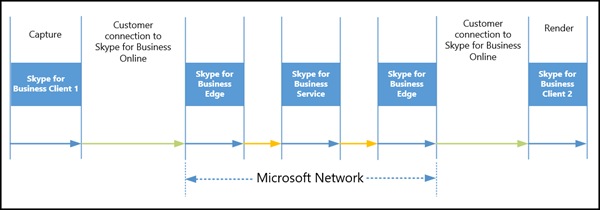

# メディアの品質と skype for Business Online のネットワーク接続パフォーマンス

このトピックは、Skype for Business Online サービスのためのネットワーク パフォーマンス要件のセットを定義し、ネットワークの評価に基づく方法 for Business Online ネットワークと Skype との接続のインターネットまたは ExpressRoute を使用できます。接続します。Office 365 に専用の接続の Azure ExpressRoute を展開する場合、別の Skype for Business Online の展開シナリオで ExpressRoute 接続を計画する方法のガイダンスも提供します。
  
リアルタイムのメディア (オーディオ、ビデオ、およびアプリケーションの共有) オーバー IP の品質は大幅に影響を受ける-エンドツー エンド ネットワーク接続の質します。最適な Skype for Business Online のメディアの品質では、それが、会社のネットワークと Skype for Business Online の間の高品質の接続があることを確認する重要です。これを行う最適な方法では、内部ネットワークとネットワークの容量を対応するために [最大使用数トラフィック ボリュームの skype for Business Online、すべての接続に基づくクラウド接続を設定します。
  
Azure ExpressRoute では、Office 365 サービス Skype for Business Online の要件はありません。ただし、展開のいずれかが Azure ExpressRoute に Office 365 への接続 Skype for Business ネットワーク パフォーマンスの要件を満たしていることを確認により、最適な Skype for Business Online のメディアを役立つ使用できるオプション音質します。
  
> [!TIP]
> このトピックで説明する全体的なネットワーク パフォーマンスの参考にして、ネットワークの評価の詳細なガイダンスこのドキュメントの範囲外です。For Business Online パートナーをサポートできるネットワーク パフォーマンスの測定値、完全なネットワーク評価の一部として Skype のリストを検索するには、 [Skype for Business パートナーのソリューション](http://partnersolutions.skypeforbusiness.com/)を参照してください。 
  
## Skype for Business Online のネットワーク接続要件

### Skype for Business Online のメディアの品質に影響する可能性のある要因

Skype Business Online リアルタイム メディア (オーディオ、ビデオ、およびアプリケーションの共有) の品質を使用するデバイスを含む、環境では、ネットワーク接続が保証された多くのさまざまな要素があります。 
  
#### デバイス

リアルタイム メディア セッションでは、メディアを把握して、ヘッドセットや Web カムなどのすべての参加者が使用されているデバイスの表示は、全体的なオーディオとビデオの品質にとても便利な影響を与えます。下の品質デバイスまたは正しくないデバイス ドライバーのデバイスのビデオとオーディオの下の画像の品質の下の全体的な音声品質が生成されます。認定済みのデバイスまたはデバイスの品質、に関するヘルプ一方で、[キャンセル通知をエコー、ノイズ フィルター処理、ビデオの解像度がし、待機時間を削減します。
  
メディアの音声とビデオ デバイスは必要ありません認定済み] では、メディア、最適な操作性のデバイスが Skype for Business の認定を強くお勧めします。すべての Skype for Business の一覧については、認定済みのデバイスには、 [Skype for Business の電話とデバイス](https://technet.microsoft.com/en-us/office/dn947482)が参照してください。[Skype for Business Online 通話品質のダッシュ ボード](../using-call-quality-in-your-organization/turning-on-and-using-call-quality-dashboard.md)を使用し、使用中のデバイスが正常に機能を確認するのには、 **Skype for Business 管理センター**] でが検出されるメディアの音声とビデオの品質を監視できます。
  
> [!TIP]
> **認定済みのデバイスが最適 Skype for Business メディアの品質に必要**です。
  
任意のメディア デバイス、Skype for Business のクライアントと Skype for Business リアルタイム メディア フロー、サーバーがある程度の待機時間を紹介して重要です。デバイスとソフトウェアとネットワークの待機時間の待機時間の処理にとても便利な影響があるし、-エンドツー エンド全体の待機時間とエンドユーザーのエクスペリエンスに投稿します。
  
#### 環境

環境とユーザーの会議とオーディオおよびビデオ デバイスを使用している配列を周囲の領域は、オーディオとビデオの品質を別の大きな要因です。ノイズの環境からダイヤルインするユーザーがいるエコー、こもった感じ不明確な音声されます。濃いまたは低簡易環境でのユーザーはビデオの消去、明るい画像の品質を作成することはできません。会議室では、マイクとビデオ デバイスの場所は、参加者が受信するサウンドと画像の品質に直接影響を与えます。
  
明確に把握するユーザーの音声とビデオのエクスペリエンスの使用の Skype for Business アプリ**ツール**に > **オプション** > **オーディオ デバイス**または**ビデオ デバイス**で使用するデバイスを変更するの設定をカスタマイズします。**通話品質の確認**] をクリックして、音声通話の品質を確認することもできます。**通話品質の確認**] をクリックした場合は、品質とテスト通話が検出された問題を報告ができます。
  

  
#### ネットワーク

ネットワークの接続性、品質ではなく量、特に IP ネットワーク経由でのリアルタイムのメディアの品質が大幅に影響を受けます。
  
- **待機時間**これは、b、ネットワーク上のポイント A からパケットを取得するまでの時間です。このネットワーク伝達の遅延時間は 2 つの点と追加頭上の間にさまざまなルーターでは、そこになどの光の速度の実際の間隔に基本的に関連付けられています。待機時間は、一方向またはラウンドト リップ時間 (RTT) で表されます。
    
- **パケット損失**これは多くの場合、時間の指定されたウィンドウで失われたパケットのパーセンテージとして定義されます。音声の品質向上に直接影響パケット損失-個人小さなから完全なオーディオ カット アウトにつながる連続してバーストお客様の損失を影響を与えることがないほぼパケットが失われます。
    
- **ジッター」または「だけジッター間パケット到達時**これは、連続するパケットの遅延時間の平均変更します。Skype for Business を含む最新の VoIP ソフトウェアをバッファーを通じてジッターのいくつかのレベルを調整できます。超えた場合にだけ、ジッター バッファー参加者がジッターの効果を確認することをお勧めします。
    
> [!NOTE]
>  ジッターのバッファー - エンドツー エンドの待機時間が大きくなります。
  
他の Office 365 サービスと他のビジネス アプリケーションによって生成された他のネットワーク トラフィックと同様に、ビジネスのオンライン リアルタイム メディア セッションの多くの同時 Skype で行う全体のネットワーク パス上に十分な帯域幅があることを確認します。Business Online のサービスがネットワークの混雑を回避することを優れたメディア (オーディオ、ビデオ、およびアプリケーションの共有) リアルタイム メディアの品質を確認するには、ネットワークを Skype に接続します。 
  
#### 混雑のネットワーク経由でサービスの品質 (QoS) を実装します。

さらに、ネットワーク経由でトラフィック混雑は、メディアの品質を大幅に影響があります。高速のネットワークを通過する混雑ネットワーク内の他のネットワーク トラフィックよりも優先に音声とビデオ パケットができるように、サービスの品質 (QoS) は、音声とビデオの通信の最適なエンド ユーザー エクスペリエンスを提供するために使用できます。
  
QoS には、音声やビデオのデータを保持するは、ネットワーク パケットに優先度の高いを割り当てる方法が用意されています。優先度の高いこれらのパケットを割り当てると、音声とビデオの通信と、ファイル転送や web を閲覧、データベースのバックアップのような項目に関連するネットワーク セッションよりも小さい継続より高速のネットワーク経由可能性があります。ファイル転送のネットワーク パケットを使用または既定のデータベースのバックアップが、優先度を「最適な残存作業時間」を割り当てられ、ネットワークの混雑必要はありません。 への影響が大きなとしてためにです。メディア (オーディオ、ビデオ、およびアプリケーションの共有) パケットに優先順位の高いを割り当てるし、「最適な残存作業時間」として指定してもそのまま残すしないも処理するその他のすべてのネットワーク トラフィックとします。ネットワークの混雑の量によって可能性のある終了ユーザー向けの下の全体的なオーディオとビデオの品質エクスペリエンスでします。
  
ネットワーク内のネットワークの混雑影響は いるかどうかを確認するネットワーク上の QoS を実装することを強くお勧めします。ただし、この最大の影響を与えるには、ネットワークのすべてのエンドポイントする必要があります QoS、すべてのエンドポイントにマークを付ける QoS を受け入れる必要があります意味およびサポート パケットの優先順位付けします。Skype for Business Online のサービスでは、QoS のマークと Microsoft ネットワーク内の優先順位付けを優先します。ただし、トラフィックを一般向けの Microsoft のネットワークに会社のネットワークからインターネットのような接続を介してルーティングされる QoS マーキングとパケット優先度の設定が保持されません。ネットワークから[Azure ExpressRoute](https://azure.microsoft.com/en-us/services/expressroute/)を使って Office 365 への接続をプライベートでは、エンドユーザーの展開ソリューションとを保った QoS マーキング パケットの優先順位付け全体を増やすに音声とビデオの品質を提供します。
  
## Skype for Business Online に接続するネットワーク パフォーマンスの要件

ビジネス リアルタイム メディアの Skype では、多くのさまざまなデバイス、クライアント アプリケーション、サーバーのソフトウェア、および異なるネットワーク間を移動します。リアルタイムのメディアの - エンドツー エンドの待機時間は、すべてのコンポーネントとネットワーク セグメント導入される待機時間の合計です。エンドツー エンド ネットワーク接続の質は、最も悪いデータの品質とネットワーク セグメントによって決定されます。このセグメントでは、このネットワーク トラフィックの障害として機能します。
  
次の図は、ビジネスの参加者の 1 つの Skype から別の会議で音声一方向のフローを示しています。
  

  
この会議の場合、メディア パスは、次のネットワーク セグメントで構成されます。
  
1. **Microsoft のネットワークの端に 1 をユーザーからの接続**通常 WiFi やイーサネット、インターネットの出口ポイント (ネットワーク エッジ デバイス) へのユーザーの 1 から WAN 接続とネットワーク端から Microsoft ネットワーク端にインターネット接続などのネットワーク接続が含まれます。
    
2. **Microsoft ネットワーク内の接続**これは、skype for Business Online のデータ センターの Microsoft Edge 間、A/V 会議サーバーを使用します。
    
3. **Microsoft ネットワーク内の接続**Skype for Business Online のデータ センターと Microsoft ネットワーク エッジ間です。
    
4. **ユーザー 2 に Microsoft ネットワークの端からの接続**これには、Microsoft ネットワーク エッジ、インターネットの出口ポイント (右端)、ネットワークに 2 をユーザーからの WAN 接続とネットワーク接続 WiFi やイーサネットなどに、ネットワークの端からインターネット接続が含まれます。
    
次の図は、コンポーネントの内訳と Skype for Business Online PSTN 通話のネットワーク セグメントが表示されます。
  

  
PSTN 通話のシナリオでは、メディア パスには、以下のネットワーク セグメントが交差します。
  
1. **Skype for Business クライアントの呼び出し元 Microsoft ネットワークの端にからの接続**通常 WiFi やイーサネット、Skype for Business クライアントの呼び出し元からインターネットの出口ポイント (ネットワーク エッジ デバイス) への WAN 接続とネットワーク端から Microsoft ネットワーク端にインターネット接続などのネットワーク接続が含まれます。
    
2. **Microsoft ネットワーク内の接続**Skype for Business Online のデータ センター、仲介サーバーが使用されている Microsoft エッジ間です。
    
3. **Microsoft ネットワーク内の接続**Skype for Business Online のデータ センターと Microsoft ネットワーク エッジ間です。
    
4. **Microsoft のネットワークと PSTN サービス プロバイダー パートナーの間の接続**これは、Skype for Business クライアントは、Microsoft ネットワークの外部でから PSTN 通話を行うために存在する接続します。
    
### Microsoft ネットワーク端に Skype for Business クライアントからネットワーク パフォーマンスの要件

最適なの skype for Business メディアの品質では、次のようなネットワーク パフォーマンスの基準ターゲットまたはしきい値は、Microsoft のネットワーク端に会社のネットワークからの接続を必要です。このセグメントのネットワークの内部ネットワークを含む、WAN 接続、たとえばマルチ プロトコル ラベルの切り替え (MPLS) と併せてインターネットまたは ExpressRoute パートナー経由ですべての接続の WiFi、イーサネット、会社のサイトにトラフィックが含まれますエッジ Microsoft のネットワークに接続します。
  
> [!CAUTION]
> **Skype for Business クライアントを Office 365 サービスの会社のネットワーク上の間の接続には、これらのネットワーク パフォーマンスの次の要件としきい値を満たす必要があります。**
  
|||
|:-----|:-----|
|**メートル法**   |**ターゲット**   |
|待機時間 (1 つの方法)    |< 往復    |
|待機時間 (RTT またはラウンドト リップ時間)    |< 100 ms    |
|バースト パケット損失    |< 200 ミリ秒間隔、10%    |
|パケット損失    |< 任意の 15 秒の中に 1% 間隔    |
|パケット間到着ジッター    |< 30ms 中、15 秒間隔    |
|パケットの並べ替え    |< 0.05% 順序のパケット    |
   
 **その他のパフォーマンス対象の要件:**
  
- Microsoft ネットワークでは、160 を超える端の位置を世界中にします。おを使用するメジャーのインターネット サービス プロバイダー (Isp) 世界中でそれらの端からサイトです。待機時間メートル法ターゲットでは、会社のサイトまたはサイトと、Microsoft が同じ大陸します。
    
- 会社のサイトまたはサイトには、Microsoft ネットワーク エッジ接続 WiFi またはワイヤレスの別の技術、最初のホップ ネットワーク アクセスが含まれます。 
    
- ネットワーク パフォーマンスの目標は、適切な帯域幅やサービスの計画の品質を想定しています。つまり、これに直接適用 Skype for Business リアルタイム メディア トラフィックが、ネットワーク接続を負荷が [最大使用数。
    
### Microsoft ネットワーク端に、ネットワークの端からのネットワーク パフォーマンスの要件

ネットワークのパフォーマンス目標またはエッジ ネットワークと Microsoft ネットワーク エッジ間の接続に必要なしきい値を次に示します。このセグメントのネットワークのユーザーの内部ネットワークまたは WAN、除外であり、ガイダンスとして、インターネット経由でまたは ExpressRoute パートナー ネットワークを介して送信され、パフォーマンスの調整するときにも使用できるネットワーク トラフィックをテストする場合サービス レベル契約 (SLA) して ExpressRoute プロバイダーにします。
  
> [!CAUTION]
> **会社のネットワーク エッジ Microsoft ネットワークの端までの間の接続には、これらのネットワーク パフォーマンスの次の要件としきい値を満たす必要があります。**
  
|||
|:-----|:-----|
|**メートル法**   |**ターゲット**   |
|待機時間 (1 つの方法)    |< 30ms    |
|待機時間 (RTT)    |< 60 ミリ秒    |
|バースト パケット損失    |< 任意 200 ms 期間中に 1%    |
|パケット損失    |< 任意の 15 秒の中に 0.1% 間隔    |
|パケット間到着ジッター    |< 任意の 15 秒の中に使う間隔    |
|パケットの並べ替え    |< 0.01% 順序のパケット    |
   
 **その他のパフォーマンス対象の要件:**
  
- パフォーマンスの対象には、最も近い Microsoft ネットワークに同じ大陸の端と、会社のネットワーク エッジのいずれかの間の接続が必要です。
    
- ネットワーク パフォーマンスの目標は、適切な帯域幅やサービスの計画の品質を想定しています。これにも該当 Skype ビジネス リアルタイム メディア トラフィック用が、ネットワーク接続を負荷が [最大使用数。適切な帯域幅、および QoS 計画、 [ExpressRoute と Skype for Business Online ネットワーク通信](https://support.office.com/en-us/article/ExpressRoute-and-QoS-in-Skype-for-Business-Online-20c654da-30ee-4e4f-a764-8b7d8844431d?ui=en-US&amp;rs=en-US&amp;ad=US)を参照してください。
    
## ネットワークのパフォーマンスを測定します。

遅延とエッジ、ネットワークに、会社のネットワーク サイトから、パケット損失のため、特に、実際のネットワーク パフォーマンスを測定するには、ping などのツールを使用して、ビジネス メディア リレー サービスが Microsoft Edge とデータから実行するには、Skype のセットに対してテストサイトを中央揃えします。 
  
Microsoft のネットワークにインターネット接続をテストするには、次の Skype for Business メディア リレー Vip をテストすることをお勧めします。*Anycast VIP*がテストの場所に最も近い Microsoft ネットワーク エッジ サイトでメディア リレーの IP アドレスに解決されます。
  
||||
|:-----|:-----|:-----|
|**IP アドレス**   |**種類**   |**場所**   |
|13.107.8.2    |VIP    |世界のさまざまな Anycast IP    |
   
 **ネットワークのパフォーマンスを評価するために高レベルの推奨事項を紹介します。**
  
- Office 365 への接続と同様に、内部ネットワークを評価する必要があります。
    
- 評価し、長期間のネットワークのすべてのデータを収集する必要があります。すべてのビジネス日と稼働時間の状況を確認できるように、1 週間のネットワーク パフォーマンスのテストの実行することをお勧めします。これは表示ピークします。
    
- ネットワークのパフォーマンス値の複数のサンプルを行う必要があります。会社のサイトからデータを収集する時間の全体の期間中に測定 10 分間隔を行うことをお勧めします。Skype for Business Online のネットワーク パフォーマンスの要件を比較するには、次のサンプル データのセットから 90 百分位測定値を実行します。 
    
- 継続的にネットワークのパフォーマンスを評価する必要があります。ネットワークの使用率は、使用パターンの変更、大量の帯域幅を使用する新しいエンタープライズ ベースのアプリケーションと、組織または物理の会社の場所への変更が原因で時間の経過によって異なります。継続的にこれらのネットワーク パフォーマンスの要件とターゲット/しきい値に対して、ネットワークのパフォーマンスを監視し、リアルタイム メディア、最適な品質を確認する適切なタイミングの調整することが重要です。 
    
## Azure 仮想マシンを使用して、ネットワークのパフォーマンスを測定します。

Microsoft ネットワーク エッジ サイトに対してテストではなく、ビジネスの顧客やパートナーに Microsoft Azure クラウド サービスのためのテストのセットアップを活用するため、Skype からネットワーク評価ソリューションがあります。これらのソリューションでは、ネットワークの評価ツールは、待機時間、パケット損失をテストし、ジッター Azure クラウド サービスとして設定するユーザー設定の端点をします。その結果、テストのネットワーク トラフィックがネットワークの端から端マイクロソフトのネットワークに接続では、1 つの他のネットワーク セグメントを通過し、Azure データ センター ネットワーク評価サービスをホストしています。
  
これらのネットワークの Azure ベースのソリューションを評価がテスト サービスをホストできます。ネットワークの評価国や地域内での操作を実行することをお勧めします。たとえば、米国の東部のお客様のサイトの評価を Azure の東米国データ センターの地域でホストされているサービス テスト インスタンスを実行してください。 
  
以下は、遅延時間 (RTT) ターゲット Azure サービス ベース ネットワーク評価の設定をします。一方向の待機時間の目標は、対応する RTT ターゲットの半分になります。テスト Skype メディア リレー用に定義されているものとして、パケット損失とジッター目標同じのままになります。
  
|||||
|:-----|:-----|:-----|:-----|
|**顧客の地域**   |**Azure 地域**   |**ネットワークのエッジ Azure ラウンドト リップ時間 (RTT)**   |**サイトの Azure ラウンドト リップ時間 (RTT)**   |
|中央アメリカ    |中央アメリカ    |99    |139    |
|東米国    |東米国    |86    |126    |
|北中央アメリカ    |北中央アメリカ    |97    |137    |
|南部中央アメリカ    |南部中央アメリカ    |94    |134    |
|西部米国    |西部米国    |94    |134    |
|ハワイ米国    |西部米国    |116    |156    |
|カナダ中央    |カナダ中央    |138    |178    |
|カナダ東    |カナダ東    |131    |171    |
|北米ヨーロッパ    |北米ヨーロッパ    |99    |139    |
|西ヨーロッパ    |西ヨーロッパ    |95    |135    |
|東アジア    |東アジア    |118    |158    |
|東南アジア    |東南アジア    |97    |137    |
|日本の東    |日本の東    |111    |151    |
|日本西部    |日本西部    |118    |158    |
|ブラジル南部    |ブラジル南部    |70    |110    |
|オーストラリア東    |オーストラリア東    |124    |164    |
|オーストラリア東南    |オーストラリア東南    |124    |164    |
|中央のインド    |中央のインド    |103    |143    |
|インド南部    |インド南部    |103    |143    |
|西インド    |西インド    |103    |143    |
|中国の東    |中国の東    |120    |160    |
|中国北    |中国北    |120    |160    |
   
## メディアの品質と ExpressRoute

Office 365 向け azure ExpressRoute では、Office 365 への接続の専用のネットワークへの接続です。ネットワーク トラフィックのでは、Office 365 のパスを制御する機能、顧客を提供します。予期しないルーティング インターネット上で発生するデータが不明な航空会社、プロバイダー Isp によって実行されるについて心配する必要が不要になったします。Microsoft のネットワークに ExpressRoute パートナーのネットワークで直接 ExpressRoute から送信されたネットワーク トラフィックが送信されます。これにより、お客様が自分専用の接続サイト外のデータ センターにある場合は、Office 365 を処理します。
  
Azure ExpressRoute は、すべての Office 365 ライセンスの製品を使用できます。ただし、Azure ExpressRoute Premium アドオンは、グローバルをルーティングする機能を有効にする Office 365 の必要があります。ExpressRoute を実装している、少なくとも 500 シートの office 365 のお客様は、経費明細なしで必要な*ExpressRoute Premium アドオン*を入手できます。
  
### 適切なメディアの品質の ExpressRoute が必要ですか。

Azure ExpressRoute では、Business Online のメディアの品質の最適 Skype を取得する必要はありません。ただし、いずれかの展開を支援するオプションを確認、クラウドの接続が Skype for Business ネットワーク パフォーマンスの目標またはしきい値を満たしています。
  
Office 365 は、パフォーマンスとインターネットを使用するサービスをセキュリティで保護されました。継続的にセキュリティとパフォーマンスを向上させるためには、新しいセキュリティ機能と地域のエッジ ノードへの投資は引き続きします。Azure ExpressRoute では、Office 365 サービス Skype for Business Online の要件はありません。Azure ExpressRoute では、展開の 1 つに Office 365 への接続 Skype for Business ネットワーク パフォーマンスの要件を満たしていることを確認、最適な Skype for Business Online のメディアの品質を確実を役立つ使用できるオプション発生します。
  
Skype for Business Online のメディアの品質、会社のサイトと、Microsoft ネットワーク間の接続がパフォーマンス目標では、Microsoft のネットワークに Skype for Business クライアントから[ネットワーク パフォーマンスの要件を満たしていることが重要です。エッジ](media-quality-and-network-connectivity-performance.md#bkSfBClienttoEdge)、ネットワークの端と、Microsoft ネットワーク間の接続が[ネットワーク Microsoft ネットワーク端に端からネットワーク パフォーマンスの要件](media-quality-and-network-connectivity-performance.md#bkYourNetworkEdge)のパフォーマンスの目標を満たしているとします。  
  
重要、内部ネットワークとクラウドの接続の容量を含む、会社の物理的なネットワーク接続が [最大使用数メディア トラフィック ボリュームを行うこともできます。Azure ExpressRoute はお客様が、Skype for Business Online のクラウド接続がすべてのパフォーマンス要件を満たしていることを確認するさまざまな方法です。
  
### 音声品質の SLA の ExpressRoute が必要ですか。

いいえ、ExpressRoute skype for Business Online の音声品質 SLA 必要はありません。[Skype for Business Online の音声品質 SLA](http://www.microsoftvolumelicensing.com/DocumentSearch.aspx?Mode=3&amp;DocumentTypeId=37)は、配置、Skype for Business Online の音声サービス ユーザー、内で正しいライセンス VoIP または PSTN 通話の種類を指定するには、そのユーザーを有効にするサブスクリプションを任意の対象になる呼び出しに適用されます。音声の品質 SLA では、次の条件のすべてを網羅したを含める必要があります。
  
- Microsoft からの通話には、IP 電話が認められています。
    
- イーサネットの有線接続します。
    
- Microsoft ネットワークの問題が原因で音声の品質に問題です。
    
> [!NOTE]
> 音声品質 SLA 低通話品質が ExpressRoute パートナーとその他のネットワークを含む Microsoft 以外のネットワークの問題をによる呼び出しを除外します。 
  
### インターネットまたは Azure ExpressRoute よいですか。

顧客の skype for Business Online の接続オプションのネットワーク上の意思決定を行う、前に、ネットワークとインターネットの現在の接続に[ネットワーク パフォーマンスの要件」で説明されているネットワーク パフォーマンスの要件に基づく評価する必要があります。Skype for Business Online に接続](media-quality-and-network-connectivity-performance.md#bkNetworkPerf)します。
  
現在のインターネット接続経由でネットワークのパフォーマンスが設定されている場合は、および [最大使用数時間中に十分な容量用に Microsoft ネットワークの端にサイトとネットワークのエッジを Microsoft に、ネットワークの端からは、ネットワーク パフォーマンスの要件を満たしている、実行できます。引き続き Skype for Business Online に接続する、既存のインターネット接続を使用します。
  
会社のネットワーク パフォーマンスの要件が満たされているサイト、まずで作業を行う、全体的なネットワークのパフォーマンスを向上させるために、既存のネットワーク サービス プロバイダーを強くお勧めします。ただし、これらはまだが満たされている、Azure ExpressRoute を使用してできることを確認する Skype for Business Online のクラウド接続を使用して、ネットワーク パフォーマンスの要件に対応できます。
  
Azure ExpressRoute には、次の他の利点が用意されています。
  
- サービス レベル契約 (SLA) の空き時間情報、ネットワークと Microsoft 間の接続します。ExpressRoute は、99.9% の保証可用性 SLA があります。
    
- Office 365 サービスに必要な帯域計画および保証します。ExpressRoute を使用してビジネス トラフィック用 Skype または Office 365 のトラフィックのみを送信して、これを実現し、その他のすべてのインターネット トラフィックがネットワークの他のインターネットの出口/入口ポイントを通ることができます。
    
- ExpressRoute は維持できますが、ネットワークと Microsoft ネットワーク間の DSCP QoS マーキングに設計されています。
    
ExpressRoute QoS と容量の計画についての詳細については、 [ExpressRoute と Skype for Business Online ネットワーク通信](https://support.office.com/en-us/article/ExpressRoute-and-QoS-in-Skype-for-Business-Online-20c654da-30ee-4e4f-a764-8b7d8844431d?ui=en-US&amp;rs=en-US&amp;ad=US)を参照してください。
  
### できます設定 Azure ExpressRoute Skype のオンラインのみビジネスのですか。

はい、接続を保護する優れたネットワーク会社のネットワークからのみ skype for Business Online Azure ExpressRoute を設定することができます。これには、ユーザーに対して、最適なリアルタイムのメディアの品質が提供されますが、インターネット経由で他の Office 365 サービスに接続するし続けることができます。
  
罫線ゲートウェイ プロトコル (BGP) は、インターネット経由でネットワーク トラフィックをルーティングするためのインターネット上でルーティング プロトコルです。独立したシステム (AS) 間で、インターネット経由でルーティング情報を交換する設計されています。BGP コミュニティ値は、受信または送信のルートに適用できる属性タグです。地理的なサービスの種類、またはその他の条件に基づいて、指定された宛先に到達するために送信するリンクとして受信に通知する BGP コミュニティが使用されます。
  
BGP コミュニティ サポートでは、Microsoft がプレフィックスおよびルートをタグ付けに属しているサービスに基づいて、適切な BGP コミュニティの値を持つされます。Microsoft がパブリック ピアリングを通じてプレフィックスをタグ付けされ、領域を示す、適切な BGP コミュニティの値を持つピアリング Microsoft プレフィックス内でホストされます。最適なルーティングを提供する適切なルーティングを決定するコミュニティ値を利用できます。のみ Skype for Business Online BGP コミュニティ値は ExpressRoute への接続をセットアップ、Skype を使用するには for Business Online します。[ExpressRoute ルーティング](https://azure.microsoft.com/en-us/documentation/articles/expressroute-routing/)要件の詳細が表示されます。
  
## Skype for Business Online の ExpressRoute 接続のシナリオ

場合は、そのことは、上記の推奨事項に基づいて ExpressRoute、ここではどこの推奨事項と ExpressRoute 接続の数が表示されます。
  
### オンラインのみ展開の 1 つのサイト

会社のサイトに最も近い間で 1 つの ExpressRoute 接続を設定する必要があります、Skype を使用して、ビジネスのオンライン サービスのすべてのユーザーと、オフィスが単一の場所の中心し、Azure ExpressRoute を展開することにした場合は、[ExpressRoute ピアリング場所](https://azure.microsoft.com/en-us/documentation/articles/expressroute-locations/)です。
  
次の図は、この種類の展開の例を示します。この例では、Contoso 大学オーランド内にあるは、(フロリダ) Contoso 10,000 の教職員と学生します。Microsoft edge サイトへの場所からのインターネット テストが表示されていたパケット損失を 5% を超えるクラス ピーク時にします。専用特に Skype for Business Online のリアルタイムのトラフィックを Office 365 のネットワークの混雑を回避するための帯域幅がプロビジョニングされる過剰 ExpressRoute を使って Office 365 に接続することができます。サイトで、アトランタ、GA MeetMe ExpressRoute を通じてマイクロソフト クラウドに接続します。
  

  
### オンラインのみ展開: 同じ大陸の複数のサイト

会社が同じ地域または、大陸の複数のオフィスからビジネスのオンライン サービスの Skype を使用して、Azure ExpressRoute を実装することを選んだ場合は、お勧め ExpressRoute] で、メインのサイトを接続して、[その他必要に応じて追加他の場所をお勧めネットワーク パフォーマンスの目標を満たしていないピアリング ExpressRoute します。
  
次の例では、Contoso は、ニューヨークには、米国内の他のオフィスがある米国旅行サービスの企業です。オフィスは MPLS を Office 365 に接続するために使用する、WAN を相互に接続されています。最初に接続をセットアップ ExpressRoute、インターネット ルーターからの Hoboken、山田千代田区 MeetMe サイトにします。 
  
この設定により、Microsoft のネットワーク (千代田区の端からサイト) に多くのサイトのネットワーク トラフィックが Skype for Business クライアント接続ネットワークのパフォーマンス ターゲット Skype for Business クライアントから[ネットワーク パフォーマンスの要件」で説明されているを満たすことができます。エッジをネットワークに Microsoft](media-quality-and-network-connectivity-performance.md#bkSfBClienttoEdge)します。ただし、New York に contoso 社の西海岸オフィス間の待機時間は一方向の往復の上に移動します。さらに、ホノルルは Contoso の 2 番目に大きな office、千代田区ホノルルからの待機時間が 80ms 一方向を超えています。そのオフィス内のユーザーの適切なメディアの品質を確認するには、Contoso を決定がサンノゼ サイトとサイト間で、シリコン谷 ExpressRoute MeetMe 西海岸 ExpressRoute 接続を追加します。
  

  
### オンラインのみ展開: 別の大陸で複数のサイト

Business Online サービスの Skype を使用しているすべてのユーザーと大陸ごとの ExpressRoute への接続を少なくとも 1 つを設定する場合は、オフィス物理的な複数の場所で複数の大陸 Azure ExpressRoute を展開する場合は、する必要がある場合間大陸ごとのメイン サイトの最も近い[ExpressRoute ピアリング場所](https://azure.microsoft.com/en-us/documentation/articles/expressroute-locations/)です。コストと利点、によっては、ネットワーク パフォーマンスの目標を満たしていない場所のサイトからその他の ExpressRoute 接続を展開することができます。
  
次の例では、Contoso は北米、ヨーロッパの主な都市のオフィス大規模企業法律事務所です。北米と、すべてのヨーロッパ オフィスの単一 ExpressRoute 回路の 2 つの ExpressRoute 接続を展開する、インターネット接続と、内部ネットワーク パフォーマンスの評価に基づいて、Contoso を決定します。
  

  
### ハイブリッド展開

場合に、内部設置型 Lync または Skype for Business の展開ハイブリッド Skype for Business Online の統合を実装する] を選びます Azure ExpressRoute を展開する場合は、それぞれの 1 つ以上の ExpressRoute 接続している必要があることをお勧めします。内部設置型 Lync または Skype ビジネス エッジ サイト] と [オフィス大陸ごとに 1 つ以上の ExpressRoute 接続します。コストと利点、によって大陸ごとに選べますネットワーク パフォーマンスの目標が満たされているオフィスからその他の ExpressRoute 接続を展開します。
  
ビジネスを展開用の内部設置型 Skype を使っている場合[エッジ サーバーの計画および展開ガイド](https://technet.microsoft.com/en-us/library/mt346417.aspx)に従ってください。具体的には、エッジ サーバーは、ネットワークの外部でからアクセスする必要があります。エッジ サーバーのパブリック IP アドレスを割り当てることによって、またはネットワークのアドレス変換 (NAT) を使用して、これは、通常はします。
  
次の例では、contoso 社には、ビジネス エンタープライズ ボイスの展開用の既存のオンプレミス Skype があります。オンプレミスのユーザーを Office 365 オンライン サービスに移行します。ハイブリッド展開を使用してすべてのオンプレミスとオンラインのユーザーに、既存の PSTN インフラストラクチャを使用することを続けることにもできます。新宿区は、contoso 社の内部設置型のデータ センターと Skype for Business のエッジ サーバーの一覧です。展開、Contoso は、シカゴのデータ センターとシカゴ ExpressRoute 間の 1 つの ExpressRoute 接続を設定すること。西海岸 ExpressRoute の接続、ホノルル office の機能を追加します。
  

  
### クラウド コネクタのエディションでオンラインの展開

ビジネス オンラインのクラウド コネクタ版の Skype は、一連のパッケージ化された仮想マシン) オンプレミス PSTN への接続を実装するので構成されるハイブリッドを提供します。最低限 Skype for Business サーバー トポロジの仮想化された環境で展開、して、通話と既存のオンプレミス PSTN ボイス インフラストラクチャを携帯電話で通話を送受信できるようになります。
  
Azure ExpressRoute およびクラウド コネクタ Edition を展開すると、各大陸の最も近い[ExpressRoute ピアリング場所](https://azure.microsoft.com/en-us/documentation/articles/expressroute-locations/)に大陸ごとのメイン サイト間の高速ルーティングへの接続を少なくとも 1 つを設定することをお勧めします。コストと利点、によって大陸ごとに選べますネットワーク パフォーマンスの目標が満たされているサイトからその他の ExpressRoute 接続を展開します。
  
ビジネスを展開用の内部設置型 Skype を使っている場合は、 [skype for Business クラウド コネクタ エディションの計画ガイド」](https://technet.microsoft.com/EN-US/library/mt605227.aspx)に従ってください。具体的には、アクセス エッジ、A/V エッジ サービスのパブリック IP アドレスを割り当てる必要がありますと Office 365 のデータ センターからアクセスできません。
  
次の例では、Contoso は、いくつかの主要なヨーロッパの国と都市のプレゼンスとヨーロッパ会計企業です。サインアップ Skype for Business Online のすべてのグループ作業のニーズに、引き続き PSTN インフラストラクチャを使用する実際の場所がある国および既に存在している carrier 契約クラウド コネクタを配置することにします。大阪の 1 つの ExpressRoute 接続が対応の Skype for Business クライアント接続ネットワークのパフォーマンス ターゲット[ネットワークのパフォーマンスで説明する役立つことが決定からすべてのサイトや Microsoft ネットワーク エッジ テストに基づき、Microsoft に Skype for Business クライアントから要件ネットワーク エッジ](media-quality-and-network-connectivity-performance.md#bkSfBClienttoEdge)します。
  

  
Contoso の別の配置オプションを以下に示します。この例では、クラウド コネクタが展開されているそれぞれのサイトにある ExpressRoute 接続を設定することにしました。 
  

  
## 関連トピック

[ExpressRoute と Skype for Business Online ネットワーク通信](expressroute-and-qos-in-skype-for-business-online.md)

