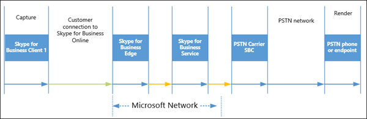

# Skype for Business Online におけるメディアの品質とネットワーク接続性のパフォーマンスMedia Quality and Network Connectivity Performance in Skype for Business Online

[!INCLUDE [sfbo-retirement](../../Hub/includes/sfbo-retirement.md)]

このトピックでは、Skype for Business Online サービスのネットワーク パフォーマンス要件のセットと、ネットワーク接続の評価に基づいて、ネットワークと Skype for Business Online の間の接続にインターネットまたは ExpressRoute を使用する方法について説明します。This topic defines the set of network performance requirements for Skype for Business Online services and how you can choose to use the Internet or ExpressRoute for connectivity between your network and Skype for Business Online based your assessment of the network connectivity. Microsoft 365 または Office 365 への専用接続用に Azure ExpressRoute をデプロイすることを決定した場合、このドキュメントでは、さまざまな Skype for Business Online 展開シナリオで ExpressRoute 接続を計画する方法に関するガイダンスも提供します。If you have decided to deploy Azure ExpressRoute for dedicated connectivity to Microsoft 365 or Office 365, this document also provides guidance on how to plan your ExpressRoute connections in different Skype for Business Online deployment scenarios.
  
IP を使用Real-Timeメディア (オーディオ、ビデオ、アプリケーション共有) の品質は、エンドツーエンドのネットワーク接続の品質の影響を大きく受け取っています。The quality of Real-Time media (audio, video, and application sharing) over IP is greatly impacted by the quality of end-to-end network connectivity. Skype for Business Online メディアの最適な品質を得るために、会社のネットワークと Skype for Business Online 間の接続が高品質であることを確認することが重要です。For optimal Skype for Business Online media quality, it is important for you to make sure there is a high-quality connection between your company network and Skype for Business Online. これを達成するためには、内部ネットワークとクラウド接続を、接続全体にわたって Skype for Business Online のピーク時のトラフィック量を処理するネットワークのキャパシティに基づいて設定することが最善の方法になります。The best way to accomplish this is to set up your internal network and cloud connectivity based on the capacity of your network to accommodate for peak traffic volume for Skype for Business Online across all connections.
  
Azure ExpressRoute は、Skype for Business Online を含む Microsoft 365 および Office 365 サービスの要件ではない。Azure ExpressRoute isn't a requirement for Microsoft 365 and Office 365 services including Skype for Business Online. ただし、Azure ExpressRoute は、Microsoft 365 または Office 365 への接続が Skype for Business のネットワーク パフォーマンス要件を満たしていることを確認し、最適な Skype for Business Online メディア品質エクスペリエンスを保証するのに役立つ展開オプションの 1 つです。However, Azure ExpressRoute is one of the deployment options that are available that will help make sure that connectivity to Microsoft 365 or Office 365 meets the Skype for Business network performance requirements and ensures the most optimal Skype for Business Online media quality experience.
  
> [!TIP]
> このトピックでは全体的なネットワーク パフォーマンス ガイダンスを提供しますが、ネットワーク評価の完全なガイダンスは、このドキュメントの範囲を外しています。Although this topic provides you with overall networking performance guidance, complete guidance for network assessment is outside of the scope of this document. 徹底的で完全なネットワーク評価の一環としてネットワーク パフォーマンス測定を支援できる Skype for Business Online パートナーの一覧については [、「Skype for Business パートナー](http://partnersolutions.skypeforbusiness.com/)ソリューション」を参照してください。To find a list of Skype for Business Online partners who can help you with the network performance measurements as part of a thorough and complete network assessment, please visit [Skype for Business Partner Solutions](http://partnersolutions.skypeforbusiness.com/). 
  
## Skype for Business Online へのネットワーク接続の要件Network connectivity requirements to Skype for Business Online

### Skype for Business Online のメディア品質に影響する要因Factors that impact Skype for Business Online media quality

Skype for Business Online Real-Time メディア (オーディオ、ビデオ、アプリケーション共有) の品質には、使用されているデバイス、環境、ネットワーク接続など、さまざまな要因が含まれます。There are many different factors that contribute to Skype for Business Online Real-Time media (audio, video, and application sharing) quality that include the devices that are used, the environment, and the network connectivity. 
  
#### デバイスDevices

Real-Time メディア セッションでは、ヘッドセットや Web カメラなどのすべての参加者が使用するメディア キャプチャおよびレンダリング デバイスは、オーディオとビデオの品質全体に大きな影響を与えます。In a Real-Time media session, media capturing and rendering devices that are used by all participants such as headsets and Web cams have a great impact on the overall audio and video quality. 品質の低いデバイスや、デバイス ドライバが間違っているデバイスでは、全体的にオーディオの音質が下がり、ビデオの画質が下がります。Lower quality devices or devices with incorrect device drivers will produce lower overall sound quality for audio and lower image quality for video. 一方、認定デバイスまたは高品質なデバイスは、エコー キャンセル、ノイズ フィルタリング、ビデオ解像度、遅延低減に役立ちます。Certified devices or good quality devices, on the other hand, help with echo cancellation, noise filtering, video resolution and reduce latency.
  
認定されたオーディオ およびビデオ メディア デバイスは必要ありませんが、最適なメディア エクスペリエンスを実現するには、Skype for Business の認定を受けたデバイスを強くお勧めします。Although certified audio and video media devices aren't required, it's highly recommended devices certified for Skype for Business for the most optimal media experience. Skype for Business 認定デバイスの一覧については [、「Skype for Business](../../SfbPartnerCertification/certification/devices-ip-phones.md)の電話とデバイス」を参照してください。For a list of all Skype for Business certified devices, see [Phones and Devices for Skype for Business](../../SfbPartnerCertification/certification/devices-ip-phones.md). **Skype for** [Business](/microsoftteams/turning-on-and-using-call-quality-dashboard)管理センターにある Skype for Business Online 通話品質ダッシュボード を使用して、使用されているデバイスが正しく動作し、オーディオおよびビデオ メディア品質を監視できます。You can use the [Skype for Business Online Call Quality Dashboard](/microsoftteams/turning-on-and-using-call-quality-dashboard), found in the **Skype for Business admin center**, to verify devices in use are working correctly and monitor audio and video media quality.
  
> [!TIP]
> **最も最適な Skype for Business メディア品質エクスペリエンスには、認定デバイスが必要です**。**A certified device is required for the most optimal Skype for Business media quality experience**.
  
メディア デバイス、Skype for Business クライアント、および Skype for Business サーバーがメディア フローを経由する場合は、Real-Time待機時間が発生する点に注意してください。It's important to remember that any media devices, Skype for Business clients, and Skype for Business Servers through which Real-Time media flows, introduce some amount of latency. デバイスとソフトウェアの処理待ち時間とネットワーク待ち時間は、エンド to エンドの全体的な待機時間とエンド ユーザーのエクスペリエンスに大きな影響を与え、それに貢献します。The device and software processing latency, along with network latency, have a great impact on and contribute to the end-to-end overall latency and the end user's experience.
  
#### 環境Environment

ユーザーが会議を行い、オーディオ デバイスとビデオ デバイスを使用する環境と周辺領域は、オーディオとビデオの品質のもう 1 つの要因です。ノイズのある環境から通話しているユーザーのオーディオは、エコーがかかり、こもっていて、不明瞭です。暗くて照明が不十分な環境にいるユーザーは、ビデオで明るくクリアな画質を実現することができません。会議室の設定で、マイクとビデオ デバイスの場所は、参加者が受信する音声と画像の品質に直接影響します。The environment and surrounding area where users are meeting and using audio and video devices is another big factor for audio and video quality. Users calling from a noisy environment will have echoed, muffled and unclear audio. Users in a dark or low light environment won't be able to produce bright, clear image quality for video. In a conference room setting, the location of the microphone and video device have a direct impact on the sound and image quality that participants will receive.
  
ユーザーのオーディオとビデオのエクスペリエンスのより明確な画像を取得するには、Skype for Businessアプリの [ツール] の [オーディオ デバイス] または [ビデオ デバイス] を使用して、使用しているデバイスに変更を加え、設定をカスタマイズします。  >    >   To get a clearer picture of a user's audio and video experience use the Skype for Business app **Tools** > **Options** > **Audio Device** or **Video Device** to make changes to the device in use and customize its settings.

#### ネットワークNetwork

IP ネットワーク上のReal-Timeの品質は、ネットワーク接続の品質の影響を受け、特に以下の量によって大きく影響されます。The quality of the Real-Time media over IP network is greatly impacted by the quality of the network connectivity, but especially by the amount of:
  
- **待機時間** これは、ネットワーク上のポイント A からポイント B への IP パケットの取得にかかる時間です。**Latency** This is the time it takes to get an IP packet from point A to point B on the network. このネットワーク伝達遅延は、さまざまなルーターの間の追加のオーバーヘッドを含めて、2 つのポイントの間の物理的な距離と光速度に関連しています。This network propagation delay is essentially tied to physical distance between the two points and the speed of light, including additional overhead taken by the various routers in between. 待機時間は、一方通行時間またはラウンドトリップ時間 (RTT) として測定されます。Latency is measured as one-way or Round-trip Time (RTT).
    
- **パケット損失** これは、多くの場合、特定の時間内に失われたパケットの割合として定義されます。**Packet Loss** This is often defined as a percentage of packets that are lost in a given window of time. パケット損失は、オーディオの品質に直接影響を与えます。ほとんど影響を及ぼすことのない小規模のパケット損失から、音声が完全に途切れる原因となる連続したバースト損失まで存在します。Packet loss directly affects audio quality—from small, individual lost packets having almost no impact, to back-to-back burst losses that cause complete audio cut-out.
    
- **パケット間到着ジッターまたは単なるジッター** これは、連続するパケット間の遅延の平均変化です。**Inter-packet arrival jitter or simply jitter** This is the average change in delay between successive packets. Skype for Business を含むほとんどの最新の VoIP ソフトウェアは、バッファリングを通じて一部のレベルのジッターに適応できます。Most modern VoIP software including Skype for Business can adapt to some levels of jitter through buffering. これは、参加者がジッターの影響に気付くほど、ジッターがバッファリングを超える場合に限定されます。It's only when the jitter exceeds the buffering that a participant will notice the effects of jitter.
    
> [!NOTE]
>  ジッターのバッファー処理により、エンドツーエンドの待ち時間が増加します。Buffering for jitter will increase end-to-end latency.
  
多くの同時 Skype for Business Online Real-Time メディア セッションと、他の Microsoft 365 または Office 365 サービスや他のビジネス アプリケーションによって生成されるその他のネットワーク トラフィックでは、ネットワークを Skype for Business Online サービスに接続するネットワーク パス全体で十分な帯域幅が確保され、ネットワークの輻輳を回避し、優れたメディア Real-Time メディア (オーディオ、ビデオ、アプリケーション共有) の品質を確保するために重要です。With many concurrent Skype for Business Online Real-Time media sessions, as well as other network traffic generated by other Microsoft 365 or Office 365 services and other business applications, making sure that there is sufficient bandwidth over the entire network path that connects your network to the Skype for Business Online service is critical to avoid network congestion and ensure excellent media Real-Time media (audio, video, and application sharing) quality. 
  
#### 混雑したネットワーク間でのサービス品質 (QoS) の実装Implementing Quality of Service (QoS) across congested networks

さらに、ネットワーク全体のトラフィックの輻輳はメディアの品質に大きく影響します。In addition, traffic congestion across a network will greatly impact media quality. 音声パケットとビデオ パケットがネットワークを速く移動し、混雑したネットワーク内の他のネットワーク トラフィックよりも優先順位を付けるために、サービス品質 (QoS) を使用して、オーディオおよびビデオ通信に最適なエンド ユーザー エクスペリエンスを提供できます。To allow audio and video packets to travel the network quicker and to be prioritized over other network traffic in a congested network, Quality of Service (QoS) can be used to help provide an optimal end-user experience for audio and video communications.
  
QoS は、音声またはビデオ データを転送するネットワーク パケットに優先順位を高く割り当てる方法を提供します。QoS provides a way for you to assign higher priorities to network packets that are carrying audio or video data. これらのパケットに優先順位を高く割り当てると、オーディオおよびビデオ通信は、ファイル転送、Web ブラウズ、データベース バックアップなどのネットワーク セッションよりも、ネットワーク上を移動する速度が速く、中断が少ない可能性があります。By assigning a higher priority to these packets, audio and video communications are likely to travel over the network faster, and with less interruption, than network sessions involving things like file transfers, web browsing, or database backups. これは、既定でファイル転送またはデータベース バックアップに使用されるネットワーク パケットには優先度として "ベスト ベスト インベスト" が割り当て、ネットワークの輻輳は大きな影響を及ぼすためです。That's because the network packets used for file transfers or database backups by default are assigned "best effort" as a priority and network congestion won't have as large impact. メディア (オーディオ、ビデオ、アプリケーション共有) パケットに優先順位を高く割り当てずに、それらを "ベスト 努力" として割り当てたままにした場合、そのパケットも他のすべてのネットワーク トラフィックと共に処理されます。If you don't assign a higher priority to the media (audio, video, and application sharing) packets and leave them also assigned as "best effort", they too will be processed along with all other network traffic. ネットワークの輻輳の量によっては、ユーザーの全体的なオーディオおよびビデオ品質のエクスペリエンスが低下する可能性があります。Depending on the amount of network congestion, this will potentially end up in a lower overall audio and video quality experience for your users.
  
ネットワーク内のネットワークの輻輳が影響を受けずにいけずに、ネットワークに QoS を実装することを強くお勧めします。It is highly recommended that you implement QoS on your network to make sure that network congestion within your network won't have an impact. ただし、これが最大の影響を及ぼすには、すべてのネットワーク エンドポイントが QoS をサポートする必要があります。つまり、すべてのエンドポイントが QoS マーキングとパケット優先順位付けを尊重する必要があります。However, for this to have the maximum impact, all networking endpoints must support QoS, meaning that all endpoints must honor QoS marking and packet prioritization. Skype for Business Online サービスは、Microsoft ネットワーク内での QoS マーキングと優先順位付けを尊重します。Skype for Business Online services honor QoS marking and prioritization within the Microsoft network. ただし、会社のネットワークから Microsoft ネットワークへのインターネットのようなパブリック接続を通してルーティングされるトラフィックでは、QoS マーキングとパケット優先順位付けは保持されません。However, traffic that is routed across a public connection like the Internet from your company network to the Microsoft network doesn't preserve QoS markings and packet prioritization. [Azure ExpressRoute](https://azure.microsoft.com/services/expressroute/)を使用したネットワークから Microsoft 365 または Office 365 へのプライベート接続では、QoS マーキングとパケット優先順位を保持するデプロイ ソリューションが提供され、エンド ユーザーの全体的なオーディオとビデオの品質が向上します。Private connections from your network to Microsoft 365 or Office 365 using [Azure ExpressRoute](https://azure.microsoft.com/services/expressroute/) offer a deployment solution that preserves QoS markings and packet prioritization that will in turn increase overall audio and video quality for your end users.
  
## Skype for Business Online に接続するためのネットワーク パフォーマンス要件Network performance requirements to connect to Skype for Business Online

Skype for Business Real-Timeメディアは、さまざまなデバイス、クライアント アプリ、サーバー ソフトウェア、さまざまなネットワークを経由して移動します。Skype for Business Real-Time media travels through many different devices, client apps, server software, and across different networks. メディアのエンド Real-Timeは、すべてのコンポーネントとネットワーク セグメントで発生する待機時間の合計量です。The end-to-end latency of Real-Time media is the total amount of latency that is introduced across all components and network segments. エンドツーエンド ネットワーク接続の品質は、品質が最も悪いネットワーク セグメントによって決まります。The quality of the end-to-end network connection is determined by the network segment with the worst quality. このセグメントは、このネットワーク トラフィックのボトルネックとして機能します。This segment acts as a bottleneck for this network traffic.
  
次の図は、ある Skype for Business 参加者から別の Skype for Business 参加者への会議での一方向の音声フローを示しています。The following diagram illustrates one-way audio flow in a conference from one Skype for Business participant to another.
  

  
この会議シナリオでは、メディア パスは次のネットワーク セグメントで構成されます。In this conferencing scenario, the media path consists across the following network segments:
  
1. **ユーザー 1 から Microsoft ネットワークのエッジへの接続** これには通常、WiFi やイーサネットなどのネットワーク接続、ユーザー 1 からインターネット出口ポイント (ネットワーク エッジ デバイス) への WAN 接続、ネットワーク エッジから Microsoft ネットワーク エッジへのインターネット接続が含まれます。**Connection from User 1 to the edge of the Microsoft network** This usually includes a network connection such as WiFi or Ethernet, the WAN connection from User 1 to the Internet egress point (your network Edge device), and the Internet connection from your network Edge to Microsoft network Edge.
    
2. **Microsoft ネットワーク内の接続** これは、A/V 会議サーバーが使用される Microsoft Edge から Skype for Business Online データ センターの間です。**Connection within Microsoft network** This is between the Microsoft Edge to Skype for Business Online data center, where the A/V Conferencing servers are used.
    
3. **Microsoft Network 内の接続** これは、Skype for Business Online データ センターと Microsoft ネットワーク Edge の間にあります。**Connection within Microsoft Network** This is between the Skype for Business Online data center and Microsoft network Edge.
    
4. **Microsoft ネットワーク エッジからユーザー 2 への接続** これには、ネットワーク エッジから Microsoft ネットワーク エッジへのインターネット接続、ユーザー 2 からインターネット出口ポイント (ネットワーク エッジ) への WAN 接続、WiFi やイーサネットなどのネットワーク接続が含まれます。**Connection from Microsoft network edge to User 2** This includes the Internet connection from your network Edge to Microsoft network Edge, the WAN connection from User 2 to the Internet egress point (your network Edge), and the network connection such as a WiFi or an Ethernet.
    
次の図は、Skype for Business Online PSTN 通話のコンポーネントとネットワーク セグメントの内訳を示しています。The following diagram shows breakdown of components and network segments of a Skype for Business Online PSTN call:
  

  
PSTN 通話シナリオでは、メディア パスは次のネットワーク セグメントをまたがっています。In a PSTN call scenario, the media path crosses the following network segments:
  
1. **Skype for Business クライアント呼び出し元から Microsoft ネットワークの端への接続** これには通常、WiFi やイーサネットなどのネットワーク接続、Skype for Business クライアントの呼び出し元からインターネット出口ポイント (ネットワーク エッジ デバイス) への WAN 接続、ネットワーク エッジから Microsoft ネットワーク エッジへのインターネット接続が含まれます。**Connection from a Skype for Business client caller to the edge of the Microsoft Network** This usually includes a network connection such as WiFi or Ethernet, the WAN connection from the Skype for Business client caller to the Internet egress point (your network Edge device), and the Internet connection from your network Edge to Microsoft network Edge.
    
2. **Microsoft ネットワーク内の接続** これは、仲介サーバーが使用される Microsoft Edge から Skype for Business Online データ センターの間です。**Connection within Microsoft network** This is between the Microsoft Edge to Skype for Business Online data center, where a Mediation Server is used.
    
3. **Microsoft Network 内の接続** これは、Skype for Business Online データ センターと Microsoft ネットワーク Edge の間にあります。**Connection within Microsoft Network** This is between the Skype for Business Online data center and Microsoft network Edge.
    
4. **Microsoft Network と PSTN サービス プロバイダー パートナー間の接続** これは、Microsoft ネットワークの外部にある Skype for Business クライアントから PSTN 通話を発信するために存在する接続です。**Connection between Microsoft Network and the PSTN service provider partners** This is the connection that exists to place a PSTN call from the Skype for Business client that is outside of the Microsoft network.
    
### Skype for Business クライアントから Microsoft ネットワーク エッジへのネットワーク パフォーマンス要件Network Performance requirements from a Skype for Business client to Microsoft network Edge

Skype for Business メディア品質を最適にするために、会社のネットワークから Microsoft ネットワーク Edge への接続には、次のネットワーク パフォーマンス メトリックのターゲットまたはしきい値が必要です。For optimal Skype for Business media quality, the following network performance metrics targets or thresholds are required for a connection from your company's network to the Microsoft network Edge. ネットワークのこのセグメントには、内部ネットワークが含まれます。これには、すべての WiFi およびイーサネット接続、WAN 接続経由の会社のサイト間トラフィック (Multiprotocol Label Switching (MPLS) など) と、Microsoft ネットワーク Edge へのインターネットまたは ExpressRoute パートナー接続が含まれます。This segment of the network includes your internal network, this includes all WiFi and Ethernet connections, any company site-to-site traffic over a WAN connection, for example Multiprotocol Label Switching (MPLS), as well as the Internet or ExpressRoute partner connections to the Microsoft network Edge.
  
> [!CAUTION]
> **会社のネットワーク上の Skype for Business クライアントから Microsoft 365 または Office 365 サービスへの接続は、以下のネットワーク パフォーマンス要件としきい値を満たしている必要があります。****Connectivity between a Skype for Business client on your company network to Microsoft 365 or Office 365 services must meet these following network performance requirements and thresholds.**
  
|||
|:-----|:-----|
|**測定基準****Metric**   |**Target****Target**   |
|遅延 (一方向)Latency (one way)    |< 50 ミリ秒< 50ms    |
|遅延 (RTT または往復時間)Latency (RTT or Round-trip Time)    |< 100 ミリ秒< 100ms    |
|バースト パケット損失Burst packet loss    |< 任意の 200 ミリ秒間隔で 10%<10% during any 200ms interval    |
|パケット損失Packet loss    |< 任意の 15 秒間隔で 1%<1% during any 15s interval    |
|パケット到着間ジッターPacket inter-arrival Jitter    |< 15 秒間隔で 30 ミリ秒<30ms during any 15s interval    |
|パケットの並べ替えPacket reorder    |< 順序が適切でないパケットが 0.05%<0.05% out-of-order packets    |
   
 **その他のパフォーマンス ターゲット要件:****Other performance target requirements:**
  
- Microsoft ネットワークには、世界中に 160 を超える Edge の場所があります。The Microsoft network has over 160 Edge locations worldwide. これらのエッジ サイトを通じて、世界中の主要なインターネット サービス プロバイダー (ISP) と取り組んでいます。We work with major Internet Service Providers (ISPs) worldwide through those Edge sites. 待機時間メトリック ターゲットは、会社のサイトまたはサイトと Microsoft Edges が同じ大陸上にあることを前提とします。The latency metric target assumes your company site or sites and the Microsoft Edges are on the same continent.
    
- 会社のサイトまたは Microsoft ネットワーク エッジ接続へのサイトには、最初のホップ ネットワーク アクセスが含まれます。このアクセスには、WiFi または別のワイヤレス テクノロジを使用できます。Your company site or sites to the Microsoft network Edge connection include first hop network access, which can be WiFi or another wireless technology. 
    
- ネットワーク パフォーマンス ターゲットは、適切な帯域幅やサービス品質の計画を前提とします。The network performance target assumes proper bandwidth and/or quality of service planning. つまり、これは、ネットワーク接続がピーク時にReal-Timeメディア トラフィックを送信する Skype for Business に直接適用されます。In other words, This applies directly to Skype for Business Real-Time media traffic when the network connection is under a peak load.
    
### ネットワーク エッジから Microsoft ネットワーク エッジへのネットワーク パフォーマンス要件Network performance requirements from your network Edge to Microsoft network Edge

ネットワーク エッジと Microsoft ネットワーク エッジ間の接続に必要なネットワーク パフォーマンスのターゲットまたはしきい値を次に示します。The following are the network performance targets or thresholds that are required for the connection between your network Edge and the Microsoft network Edge. ネットワークのこのセグメントは、顧客の内部ネットワークまたは WAN を除外し、インターネット経由または ExpressRoute パートナー ネットワーク経由で送信されるネットワーク トラフィックをテストする際のガイダンスとして意図され、ExpressRoute プロバイダーとパフォーマンス サービス レベル アグリーメント (SLA) をネゴシエートするときにも使用できます。This segment of the network excludes the customer's internal network or WAN, and is intended as guidance when testing your network traffic that is sent over the Internet, or through an ExpressRoute partner network and can also be used when negotiating a performance Service Level Agreement (SLA) with your ExpressRoute provider.
  
> [!CAUTION]
> **会社のネットワーク Edge から Microsoft ネットワーク エッジへの接続は、以下のネットワーク パフォーマンス要件としきい値を満たしている必要があります。****Connectivity between your company network Edge to the Microsoft network edge must meet these following network performance requirements and thresholds.**
  
|||
|:-----|:-----|
|**測定基準****Metric**   |**Target****Target**   |
|遅延 (一方向)Latency (one way)    |< 30 ミリ秒< 30ms    |
|遅延 (RTT)Latency (RTT)    |< 60 ミリ秒< 60ms    |
|バースト パケット損失Burst packet loss    |<200 ミリ秒間隔で 1% を超える<1% during any 200 ms interval    |
|パケット損失Packet loss    |< 任意の 15 秒間隔で 0.1%<0.1% during any 15s interval    |
|パケット到着間ジッターPacket inter-arrival Jitter    |< 任意の 15 秒間隔で 15 ミリ秒<15ms during any 15s interval    |
|パケットの並べ替えPacket reorder    |< 順序が適切でないパケットが 0.01%<0.01% out-of-order packets    |
   
 **その他のパフォーマンス ターゲット要件:****Other performance target requirements:**
  
- パフォーマンス ターゲットでは、会社のネットワーク エッジとその最も近い Microsoft ネットワーク エッジの間の接続が同じ大陸上に必要です。The performance target requires connection between any of your company's network Edge and its nearest Microsoft network Edge, to be on the same continent.
    
- ネットワーク パフォーマンス ターゲットは、適切な帯域幅やサービス品質の計画を前提とします。The network performance target assumes proper bandwidth and/or quality of service planning. これは、ネットワーク接続の負荷がピークReal-Time、Skype for Business のメディア トラフィックにも適用されます。This also applies to Skype for Business Real-Time media traffic when the network connection is under a peak load. 適切な帯域幅と QoS の計画については、「Skype for Business Online の ExpressRoute と [QoS」を参照してください](https://support.office.com/article/ExpressRoute-and-QoS-in-Skype-for-Business-Online-20c654da-30ee-4e4f-a764-8b7d8844431d)。For proper bandwidth and QoS planning, please refer to [ExpressRoute and QoS in Skype for Business Online](https://support.office.com/article/ExpressRoute-and-QoS-in-Skype-for-Business-Online-20c654da-30ee-4e4f-a764-8b7d8844431d).
    
## ネットワーク パフォーマンスの測定Measuring network performance

会社のネットワーク サイトからネットワーク エッジへの実際のネットワーク パフォーマンス (特に待機時間とパケット損失) を測定するには、ping などのツールを使用し、Microsoft Edge サイトとデータ センター サイトから実行されている一連の Skype for Business メディア リレー サービスに対してテストできます。To measure the actual network performance, especially for latency and packet loss, from any company network site to a network Edge, you can use tools such as ping, test against a set of Skype for Business media relay services running from the Microsoft Edge and data center sites. 

>[!NOTE]
> ping (ICMP) によるネットワーク パフォーマンスの測定は有効ではありません。Measuring network performance through ping (ICMP) is not effective. このため、以下で公開されている anycast IP は、2020 年 1 月から ICMP 要求への応答を停止します。For that reason, the anycast IP expose below will stop answering to ICMP requests starting in Jan, 2020. ネットワークパフォーマンスを効果的に測定するために、Microsoft では [Network Assesment Tool をお勧めします](https://www.microsoft.com/download/details.aspx?id=53885)。To measure network performace effectively, Microsoft recommends the [Network Assesment Tool](https://www.microsoft.com/download/details.aspx?id=53885).
  
Microsoft ネットワークへのインターネット接続をテストするには、Skype for Business メディア リレーの次の VIP に対してテストをお勧めします。For testing Internet connections to the Microsoft network, it is recommended that you test against the following VIPs of the Skype for Business media relays. *Anycast VIP* は、テストの場所に最も近い Microsoft ネットワーク エッジ サイトの Media Relay の IP アドレスに解決されます。The *Anycast VIP*  will resolve to an IP address of a Media Relay in a Microsoft network Edge site that is closest to the testing location.
  
||||
|:-----|:-----|:-----|
|**IP アドレス****IP address**   |**Type****Type**   |**場所****Location**   |
|13.107.8.213.107.8.2    |VIPVIP    |World Wide Anycast IPWorld Wide Anycast IP    |
   
 **ネットワーク パフォーマンスを評価するために従う推奨事項の一部を次に示します。****Here are some high level recommendations to follow for assessing network performance:**
  
- 内部ネットワークと、Microsoft 365 または Office 365 への接続を評価する必要があります。You should assess your internal network as well as the connections to Microsoft 365 or Office 365.
    
- すべてのネットワークのデータを長時間評価して収集する必要があります。You should assess and gather data for all of your networks over a long period of time. すべての営業日と時間の使用パターンを確認できるよう、ネットワーク パフォーマンスのテストを少なくとも 1 週間実行することをお勧めします。We recommend for you to perform your testing of network performance for a minimum of a week, so that you can see usage patterns for all business days and hours. これにより、ピーク時間が表示されます。This will show you peak times.
    
- ネットワーク パフォーマンス測定の複数のサンプルを使用する必要があります。You should take multiple samples of network performance measurements. データを収集する期間中は、会社のサイトから 10 分ごとに測定することをお勧めします。We recommend taking a measurement every 10 minutes from a company site during the entire period of time you are gathering data. Skype for Business Online のネットワーク パフォーマンス要件を比較するには、このサンプル データ セットから 90 パーセンタイルの測定値を取得します。For comparing the Skype for Business Online network performance requirements, take the 90th percentile measurement value from this sample data set. 
    
- ネットワークのパフォーマンスを継続的に評価する必要があります。You should continuously assess the network's performance. ネットワーク使用率は、使用パターンの変更、大量の帯域幅を使用する新しいエンタープライズ ベースのアプリケーション、組織または物理的な会社の場所の変更により、時間の長い間変化します。Network utilization varies over time due to usage pattern changes, new enterprise-based applications that use a large amount of bandwidth, and changes to your organizational or physical company locations. これらのネットワーク パフォーマンス要件とターゲット/しきい値に対してネットワーク パフォーマンスを継続的に監視し、メディア品質を最適な状態にReal-Timeすることが重要です。It is important for you to continuously monitor your network performance against these network performance requirements and targets/thresholds and make timely adjustments to ensure the most optimal Real-Time media quality. 
    
## Azure VM を使用したネットワーク パフォーマンスの測定Measuring Network Performance using Azure VMs

Microsoft ネットワーク Edge サイトに対してテストする代わりに、Microsoft Azure クラウド内のサービスのテスト セットアップを活用する Skype for Business のお客様とパートナーからのネットワーク評価ソリューションがあります。Instead of testing against the Microsoft network Edge sites, there are network assessment solutions from Skype for Business customers and partners that leverage testing setup for services in the Microsoft Azure cloud. これらのソリューションでは、ネットワーク評価ツールは、Azure クラウドでサービスとして設定されたカスタム エンドポイントに対して待機時間、パケット損失、ジッターをテストします。In those solutions, the network assessment tools test latency, packet loss and jitter against custom endpoints set up as a service in the Azure cloud. その結果、テスト ネットワーク トラフィックは、ネットワーク アセスメント サービスをホストするネットワーク エッジと Azure データ センター間の Microsoft ネットワーク内の接続である、1 つの追加のネットワーク セグメントを通過します。As a result, the test network traffic travels through one additional network segment, which is the connection within the Microsoft network between the network edges and Azure data centers that hosts the network assessment service.
  
Azure でホストされているテスト サービスに基づくネットワーク評価ソリューションの場合。For those network assessment solutions based on Azure hosted testing services. 国または地域内でネットワーク評価を実行することをお勧めします。We recommend performing the network assessment within country and/or region. たとえば、米国東部の顧客サイトの場合、評価は、Azure の米国東部データ センター リージョンでホストされているテスト サービス インスタンスに対して実行する必要があります。For example, for customer sites in east U.S., the assessment should be performed against a testing service instance hosted in Azure's east US data center region. 
  
Azure サービス ベースのネットワーク評価セットアップの待機時間 (RTT) ターゲットを次に示します。Below are the latency (RTT) targets for the Azure service based network assessment setup. 一方通行の待機時間ターゲットは、対応する RTT ターゲットの半分です。The one-way latency targets will be half of the corresponding RTT targets. パケット損失とジッターの目標は、Skype Media Relay ベースのテストで定義されている目標と同じままです。The packet loss and jitter goals stays the same as those defined for Skype Media Relay based testing.
  
|||||
|:-----|:-----|:-----|:-----|
|**顧客リージョン****Customer region**   |**Azure リージョン****Azure region**   |**ネットワーク エッジ - Azure ラウンドトリップ時間 (RTT)****Your network Edge - Azure Round-trip Time (RTT)**   |**サイト - Azure ラウンドトリップ時間 (RTT)****Your Site - Azure Round-trip Time (RTT)**   |
|米国中部Central US    |米国中部Central US    |9999    |139139    |
|米国東部East US    |米国東部East US    |8686    |126126    |
|米国中北部North Central US    |米国中北部North Central US    |9797    |137137    |
|米国中南部South Central US    |米国中南部South Central US    |9494    |134134    |
|米国西部West US    |米国西部West US    |9494    |134134    |
|米国ハワイHawaii US    |米国西部West US    |116116    |156156    |
|カナダ中部Canada Central    |カナダ中部Canada Central    |138138    |178178    |
|カナダ東部Canada East    |カナダ東部Canada East    |131131    |171171    |
|北ヨーロッパNorth Europe    |北ヨーロッパNorth Europe    |9999    |139139    |
|西ヨーロッパWest Europe    |西ヨーロッパWest Europe    |9595    |135135    |
|東アジアEast Asia    |東アジアEast Asia    |118118    |158158    |
|東南アジアSoutheast Asia    |東南アジアSoutheast Asia    |9797    |137137    |
|東日本Japan East    |東日本Japan East    |111111    |151151    |
|西日本Japan West    |西日本Japan West    |118118    |158158    |
|ブラジル南部Brazil South    |ブラジル南部Brazil South    |7070    |110110    |
|オーストラリア東部Australia East    |オーストラリア東部Australia East    |124124    |164164    |
|オーストラリア南東部Australia Southeast    |オーストラリア南東部Australia Southeast    |124124    |164164    |
|インド中部Central India    |インド中部Central India    |103103    |143143    |
|インド南部South India    |インド南部South India    |103103    |143143    |
|インド西部West India    |インド西部West India    |103103    |143143    |
|中国東部China East    |中国東部China East    |120120    |160160    |
|中国北部China North    |中国北部China North    |120120    |160160    |
   
## メディア品質と ExpressRouteMedia quality and ExpressRoute

Azure ExpressRoute for Microsoft 365 または Office 365 は、Microsoft 365 または Office 365 に接続するための専用ネットワーク接続です。Azure ExpressRoute for Microsoft 365 or Office 365 is a dedicated network connection for connecting to Microsoft 365 or Office 365. お客様は、ネットワーク トラフィックが受け取るパスを制御できます。It offers customers the ability to have control over the path their network traffic takes. 不明な通信事業者、プロバイダー、ISP によってデータが運び出されるインターネット上で発生する予測不可能なルーティングについて心配する必要はなくなりました。They no longer have to be concerned with the unpredictable routing that happens on the Internet where data is carried by unknown carriers, providers and ISPs. ExpressRoute を介して送信されるネットワーク トラフィックは、ExpressRoute パートナーのネットワークを介して Microsoft のネットワークに直接送信されます。Network traffic that is sent through ExpressRoute is sent directly across the ExpressRoute partner's network to Microsoft's network. これにより、お客様は Microsoft 365 または Office 365 を、専用の接続を持つ独自のオフサイト データ センターにある場合と同様に扱えます。This allows customers to treat Microsoft 365 or Office 365 as if it is located in their own off-site data center with a dedicated connection.
  
Azure ExpressRoute は、すべての Microsoft 365 および Office 365 ライセンス 製品で利用できます。Azure ExpressRoute is available for all Microsoft 365 and Office 365 licensing offerings. ただし、グローバル ルーティングを有効にするには、Microsoft 365 および Office 365 に Azure ExpressRoute Premium アドオンが必要です。However, the Azure ExpressRoute Premium Add-on is required for Microsoft 365 and Office 365 to enable global routing. ExpressRoute を実装している 500 以上のシートをお持ちのお客様は、必要な *ExpressRoute Premium アドオン* を追加費用不要で利用できます。Customers with at least 500 seats who are implementing ExpressRoute can get the required *ExpressRoute Premium Add-on* at no additional expense.
  
### 優れたメディア品質を実現するには ExpressRoute が必要ですか?Is ExpressRoute required for good media quality?

Azure ExpressRoute は、最適な Skype for Business Online メディア品質を得る要件ではありません。Azure ExpressRoute isn't a requirement for getting the most optimal Skype for Business Online media quality. ただし、クラウド接続が Skype for Business のネットワーク パフォーマンス の目標またはしきい値を満たした場合に役立つ展開オプションの 1 つになります。It is, however, one of the deployment options that help you make sure that your cloud connectivity meets the Skype for Business network performance targets or thresholds.
  
Microsoft 365 および Office 365 は、インターネットを使用する高パフォーマンスでセキュリティで保護されたサービスです。Microsoft 365 and Office 365 are high performance and secure services that use the Internet. セキュリティとパフォーマンスを継続的に向上させるために、新しいセキュリティ機能と地域のエッジ ノードに投資し続けます。We continue to invest in new security capabilities and regional Edge nodes to continuously improve security and performance. Azure ExpressRoute は、Skype for Business Online を含む Microsoft 365 または Office 365 サービスの要件ではない。Azure ExpressRoute isn't a requirement for Microsoft 365 or Office 365 services including Skype for Business Online. Azure ExpressRoute は、Microsoft 365 または Office 365 への接続が Skype for Business のネットワーク パフォーマンス要件を満たしていることを確認し、最適な Skype for Business Online メディア品質エクスペリエンスを保証するのに役立つ展開オプションの 1 つです。Azure ExpressRoute is one of the deployment options that are available that will help make sure that connectivity to Microsoft 365 or Office 365 meets the Skype for Business network performance requirements and ensures the most optimal Skype for Business Online media quality experience.
  
Skype for Business Online メディア品質の場合、会社のサイトと Microsoft ネットワーク エッジの間の接続が [、Skype for Business](media-quality-and-network-connectivity-performance.md#bkSfBClienttoEdge) クライアントから Microsoft ネットワーク エッジへのネットワーク パフォーマンス要件のパフォーマンス 目標を満たしている必要があります。また、ネットワーク エッジと Microsoft ネットワーク エッジ間の接続が、ネットワーク エッジから [Microsoft](media-quality-and-network-connectivity-performance.md#bkYourNetworkEdge)ネットワーク エッジへのネットワーク パフォーマンス要件のパフォーマンス 目標を満たしていることを確認することが重要です。For Skype for Business Online media quality, it is important that the connection between your company sites and the Microsoft network Edges meets the performance targets in [Network Performance requirements from a Skype for Business client to Microsoft network Edge](media-quality-and-network-connectivity-performance.md#bkSfBClienttoEdge) and that the connection between your network Edges and the Microsoft network edges meets the performance targets in [Network performance requirements from your network Edge to Microsoft network Edge](media-quality-and-network-connectivity-performance.md#bkYourNetworkEdge).  
  
また、社内ネットワークやクラウド接続容量など、会社の物理ネットワーク接続が、メディア トラフィックのピーク量に対応することが重要です。It is also important that your company's physical network connectivity, including your internal network and cloud connectivity capacity accommodate peak media traffic volume. Azure ExpressRoute は、お客様が Skype for Business Online クラウド接続がこれらのすべてのパフォーマンス要件を満たしていることを保証するのに役立つさまざまな方法の 1 つです。Azure ExpressRoute is one of many ways that will help customers ensure their Skype for Business Online cloud connectivity meets all of these performance requirements.
  
### ExpressRoute は音声品質の SLA に必要ですか?Is ExpressRoute required for voice quality SLA?

いいえ。ExpressRoute は Skype for Business Online の音声品質 SLA には必要ありません。No, ExpressRoute isn't required for Skype for Business Online Voice Quality SLA. [Skype for Business Online の](http://www.microsoftvolumelicensing.com/DocumentSearch.aspx?Mode=3&amp;DocumentTypeId=37)音声品質 SLA は、そのユーザーが任意の種類の VoIP または PSTN 通話を行える適切なライセンスおよびサブスクリプション内で Skype for Business Online 音声サービス ユーザーが発信した対象通話に適用されます。The [Skype for Business Online Voice Quality SLA](http://www.microsoftvolumelicensing.com/DocumentSearch.aspx?Mode=3&amp;DocumentTypeId=37) applies to any eligible call placed by any Skype for Business Online voice service user within the correct license and subscription that enables that user to make any type of VoIP or PSTN call. 音声品質の SLA には、次のすべての条件に対処する必要があります。A voice quality SLA should include that all of the following conditions are addressed:
  
- Microsoft 認定 IP Phone からの呼び出し。Calls from Microsoft certified IP Phones.
    
- 有線イーサネット接続。Wired Ethernet connections.
    
- Microsoft Network の問題による音声品質の問題。Voice quality issues due to Microsoft Network problems.
    
> [!NOTE]
> 音声品質 SLA は、低い通話品質が、ExpressRoute パートナーや他のネットワークを含む Microsoft 以外のネットワークの問題によって引き起こされた通話を除外します。The voice quality SLA excludes those calls where the low call quality is caused by problems in non-Microsoft networks including ExpressRoute partner and other networks. 
  
### インターネットまたは Azure ExpressRouteInternet or Azure ExpressRoute?

Skype for Business Online へのネットワーク接続オプションを決定する前に [、「Skype for Business Online](media-quality-and-network-connectivity-performance.md#bkNetworkPerf)に接続するためのネットワーク パフォーマンス要件」で説明されているネットワーク パフォーマンス要件に基づいて、ネットワークと現在のインターネット接続を評価する必要があります。Before making a decision on network connectivity options to Skype for Business Online, customers must assess their network and current Internet connectivity based on the network performance requirements described in [Network performance requirements to connect to Skype for Business Online](media-quality-and-network-connectivity-performance.md#bkNetworkPerf).
  
現在のインターネット接続上のネットワーク パフォーマンスがピーク時に十分な容量に設定され、サイトから Microsoft ネットワーク エッジ、ネットワーク エッジから Microsoft ネットワーク エッジへのネットワーク パフォーマンス要件を満たしている場合は、既存のインターネット接続を使用して Skype for Business Online に接続できます。If network performance over the current Internet connection is set up for enough capacity during peak time and that it meets the network performance requirements from sites to Microsoft network Edges and from your network Edges to Microsoft network Edges, you can continue to use your existing Internet connectivity to connect to Skype for Business Online.
  
ネットワーク パフォーマンス要件が満たされていない企業サイトの場合は、まず既存のネットワーク サービス プロバイダーと一緒に作業し、全体的なネットワーク パフォーマンスを向上することを強く推奨します。For company sites where network performance requirements aren't being met, we strongly recommend that you first work with your existing network service providers to improve your overall network performance. ただし、まだ満たされていない場合は、Azure ExpressRoute を使用すると、Skype for Business Online クラウド接続がネットワーク パフォーマンス要件を満たすのに役立ちます。However, if they aren't still being met, using Azure ExpressRoute can help ensure your Skype for Business Online cloud connectivity can help you meet the network performance requirements.
  
Azure ExpressRoute には、次の追加の利点があります。Azure ExpressRoute offers the following additional benefits:
  
- ネットワークと Microsoft ネットワーク間の接続の可用性に関するサービス レベル アグリーメント (SLA)。A service level agreement (SLA) on availability of the connection between your network and Microsoft network. ExpressRoute の可用性 SLA は 99.9% が保証されています。ExpressRoute has a guaranteed Availability SLA of 99.9%.
    
- Microsoft 365 および 365 サービスに必要なOffice帯域幅。Planned and guaranteed bandwidth required for Microsoft 365 and Office 365 services. これを実現するには、ExpressRoute を使用して Microsoft 365、Office 365、または Skype for Business トラフィックのみを送信し、その他のすべてのインターネット トラフィックがネットワークの他のインターネットエグレス/イングレス ポイントを経由します。You can achieve this by sending only Microsoft 365, Office 365, or Skype for Business traffic using the ExpressRoute and then have all other Internet traffic go through other Internet egress/ingress points for your network.
    
- ExpressRoute は、ネットワークと Microsoft ネットワーク間の DSCP QoS マーキングを保持するように設計されています。ExpressRoute is designed to preserve DSCP QoS markings between your network and the Microsoft Network.
    
ExpressRoute QoS と容量計画の詳細については、「Skype for Business Online の ExpressRoute と [QoS」を参照してください](https://support.office.com/article/ExpressRoute-and-QoS-in-Skype-for-Business-Online-20c654da-30ee-4e4f-a764-8b7d8844431d)。For more information about ExpressRoute QoS and capacity planning, please refer to [ExpressRoute and QoS in Skype for Business Online](https://support.office.com/article/ExpressRoute-and-QoS-in-Skype-for-Business-Online-20c654da-30ee-4e4f-a764-8b7d8844431d).
  
### Skype for Business Online 専用の Azure ExpressRoute をセットアップできますか?Can I setup Azure ExpressRoute for Skype for Business Online Only?

はい。会社のネットワークから Skype for Business Online への優れたネットワーク接続を確保するように Azure ExpressRoute を設定できます。Yes, you can set up Azure ExpressRoute to ensure excellent network connectivity from your company's network to only Skype for Business Online. これにより、ユーザーに最適な Real-Time メディア品質が提供されますが、引き続きインターネットを使用して他の Microsoft 365 または Office 365 サービスに接続できます。This will provide the most optimal Real-Time media quality for your users but you can then continue connecting to other Microsoft 365 or Office 365 services over the Internet.
  
Border Gateway Protocol (BGP) は、インターネット上のネットワーク トラフィックをインターネットにルーティングするために使用される、インターネット上のルーティング プロトコルです。The Border Gateway Protocol (BGP) is a routing protocol on the Internet that is used to route network traffic across the Internet. これは、インターネット上で検出された自律システム (AS) 間でルーティング情報を交換するように設計されています。It is designed to exchange routing information between autonomous systems (AS) found across the Internet. BGP コミュニティの値は、着信ルートまたは送信ルートに適用できる属性タグです。BGP communities values are attribute tags that can be applied to incoming or outgoing routes. BGP コミュニティは、多くの場合、地理的、サービスの種類、その他の条件に基づいて、特定の宛先に到達するために使用する送信リンクを受信側 AS に通知するために使用されます。BGP communities are often used to signal to the receiving AS which outbound link to use to reach a given destination based on geography, service type or other criteria.
  
BGP コミュニティのサポートにより、Microsoft はプレフィックスとルートに、属するサービスに基づいて適切な BGP コミュニティ値でタグ付けします。With BGP communities support, Microsoft will tag prefixes and routes with appropriate BGP community values based on the service they belong to. Microsoft は、パブリック ピアリングと Microsoft ピアリングを通じてアドバタイズされたプレフィックスに、プレフィックスがホストされているリージョンを示す適切な BGP コミュニティ値でタグ付けします。Microsoft will tag prefixes advertised through public peering and Microsoft peering with appropriate BGP community values indicating the region the prefixes are hosted in. コミュニティの値に依存して、最適なルーティングを提供するために適切なルーティングの決定を行います。You can rely on the community values to make appropriate routing decisions to offer optimal routing. Skype for Business Online BGP コミュニティ値を使用して、Skype for Business Online の ExpressRoute 接続のみをセットアップできます。You can use the Skype for Business Online BGP community value to setup up an ExpressRoute connection only for Skype for Business Online. 詳細については [、「ExpressRoute のルーティング要件」を参照してください](/azure/expressroute/expressroute-routing)。You can find out more at [ExpressRoute routing requirements](/azure/expressroute/expressroute-routing).
  
## Skype for Business Online の ExpressRoute 接続シナリオExpressRoute connectivity scenarios for Skype for Business Online

上記の推奨事項に基づいて ExpressRoute を使用することを決定した場合は、取得する必要がある ExpressRoute 接続の場所と数に関する推奨事項を次に示します。If you have decided that ExpressRoute based on recommendations above is for you, here are the recommendations on where and how many ExpressRoute connections you should get.
  
### オンラインのみ展開 - 単一サイトOnline only deployment - Single site

すべてのユーザーが Skype for Business Online サービスを使用し、オフィスが 1 つの物理的な場所を中心に配置され、Azure ExpressRoute を展開する場合は、会社サイト間の ExpressRoute 接続を最も近い ExpressRoute ピアリングの場所に設定する [必要があります](/azure/expressroute/expressroute-locations)。If all of your users use the Skype for Business Online service, and if your offices are centered around a single physical location and you decide to deploy Azure ExpressRoute, you should set up single ExpressRoute connection between your company site to the closest [ExpressRoute peering location](/azure/expressroute/expressroute-locations).
  
次の図は、この種類のデプロイの例を示しています。The following graphic shows an example of this type of deployment. この例では、Contoso はフロリダ州オーランドにある大学です。For this example, Contoso is a university located in Orlando, FL. Contoso には 10,000 人の教職員と学生がいます。Contoso has 10,000 faculty members and students. その場所から Microsoft エッジ サイトへのインターネット テストでは、ピーク時にパケット損失が 5% を超えました。The Internet tests from their location to Microsoft edge sites showed greater than 5% packet loss during peak class hours. 特に Skype for Business Online Real-Time トラフィックの Microsoft 365 または Office 365 のネットワーク輻輳を回避するために、ExpressRoute と過剰にプロビジョニングされた帯域幅を使用して、Microsoft 365 または Office 365 への専用接続を取得することを決定しました。They have decided to get a dedicated connection to Microsoft 365 or Office 365 using ExpressRoute with over-provisioned bandwidth so they can avoid the network congestion for Microsoft 365 or Office 365 especially for Skype for Business Online Real-Time traffic. Ga MeetMe サイトのアトランタにある ExpressRoute を介して Microsoft クラウドに接続します。They connect to the Microsoft cloud through ExpressRoute at the Atlanta, GA MeetMe site.
  

  
### オンラインのみ展開 - 同じ大陸上の複数のサイトOnline only deployment - Multiple sites on the same continent

会社が同じ地域または大陸にある複数のオフィスから Skype for Business Online サービスを使用している場合に、Azure ExpressRoute を実装することを選択した場合は、ExpressRoute 経由でメイン サイトを接続し、必要に応じて、推奨されるネットワーク パフォーマンス ターゲットを満たしていない他の場所に ExpressRoute ピアリングを追加することを推奨します。If your company is using Skype for Business Online services from multiple offices in the same region or continent, and you chose to implement Azure ExpressRoute, it is recommended to connect your main site via ExpressRoute, and then optionally add additional ExpressRoute peering for other locations that do not meet the recommended network performance targets.
  
次の例では、Contoso はニューヨークに本社を置き、米国全体に他のオフィスを持つ米国旅行サービス会社です。In the following example, Contoso is an US travel services company that is headquartered in New York but has other offices across the United States. オフィスは、Microsoft 365 または 365 への接続に MPLS を使用する WAN を介Officeされます。Their offices are inter-connected through an WAN that uses MPLS for connecting to Microsoft 365 or Office 365. 最初に、ニュージャージー州ホボーケンのインターネット ルーターからニューヨーク MeetMe サイトへの ExpressRoute 接続を設定しました。They initially set up an ExpressRoute connection from their Internet router in Hoboken, New Jersey to the New York MeetMe site. 
  
この設定により、ほとんどのサイトから Microsoft Network (New York Edge サイト) へのネットワーク トラフィックは [、「Skype for Business](media-quality-and-network-connectivity-performance.md#bkSfBClienttoEdge)クライアントから Microsoft ネットワーク エッジへのネットワーク パフォーマンス要件」で説明されている Skype for Business クライアント接続ネットワーク パフォーマンス ターゲットを満たします。With this setup, network traffic from most of their sites to the Microsoft Network (New York Edge site) can meet the Skype for Business client connection network performance targets described in [Network Performance requirements from a Skype for Business client to Microsoft network Edge](media-quality-and-network-connectivity-performance.md#bkSfBClienttoEdge). ただし、Contoso の西海岸のオフィスからニューヨークへの間の待ち時間は、一方通行で 50ms を超え続け、However, latency between Contoso's west coast offices to New York is going over 50ms one-way. さらに、Contoso の 2 番目に大きなオフィスである、80ms を超える一方通行のオフィスです。In addition, Honolulu is the second largest office for Contoso, latency from Honolulu to New York exceeds 80ms one-way. これらのオフィスのユーザーに優れたメディア品質を確保するために、Contoso は、San Jose サイトとシリコン バレー ExpressRoute MeetMe サイトの間に西海岸 ExpressRoute 接続を追加することを決定しました。To ensure good media quality for users in those offices, Contoso decided to add a west coast ExpressRoute connection between their San Jose site and the Silicon Valley ExpressRoute MeetMe site.
  

  
### オンラインのみ展開 - 異なる大陸上の複数のサイトOnline only deployment - Multiple sites on different continents

すべてのユーザーが Skype for Business Online サービスを使用している場合、オフィスが複数の大陸にわたって複数の物理的な場所にある場合は、Azure ExpressRoute を展開する場合は、各大陸のメイン サイト間の各大陸の ExpressRoute 接続を、最も近い [ExpressRoute](/azure/expressroute/expressroute-locations)ピアリングの場所に設定する必要があります。If all of your users are using Skype for Business Online service, and if your offices are in multiple physical locations across multiple continents, if you decide to deploy Azure ExpressRoute, you should set up at least one ExpressRoute connection for each continent between each continent's main site to its closest [ExpressRoute peering location](/azure/expressroute/expressroute-locations). コストとメリットに応じて、ネットワーク パフォーマンス ターゲットが満たされていないサイトから追加の ExpressRoute 接続をデプロイすることができます。Depending on cost vs benefit, you can choose to deploy additional ExpressRoute connections from sites where network performance targets aren't met.
  
次の例では、Contoso は、北米とヨーロッパの主要都市にオフィスを持つ大規模な企業の法律事務所です。In the following example, Contoso is a large corporate law firm with offices in major cities across North America and Europe. Contoso は、インターネット接続と内部ネットワーク パフォーマンス評価に基づいて、北米に 2 つの ExpressRoute 接続をデプロイし、ヨーロッパのすべてのオフィスに 1 つの ExpressRoute 回線をデプロイすることを決定しました。Based on their Internet connection and their internal network performance assessment, Contoso decided to deploy two ExpressRoute connections in North America and a single ExpressRoute circuit for all their European offices.
  

  
### ハイブリッドデプロイHybrid deployment

オンプレミスの Lync または Skype for Business を展開し、ハイブリッド Skype for Business Online 統合の実装を選択する場合は、Azure ExpressRoute をデプロイする場合は、オンプレミスの Lync または Skype for Business Edge サイトごとに少なくとも 1 つの ExpressRoute 接続と、オフィスがある大陸ごとに少なくとも 1 つの ExpressRoute 接続が必要です。If you have an on-premises Lync or Skype for Business deployment and choose to implement a hybrid Skype for Business Online integration, we recommend that if you decide to deploy Azure ExpressRoute, you need to have at least one ExpressRoute connection for each on-premises Lync or Skype for Business Edge site and at least one ExpressRoute connection for each continent with offices. コストとメリットに応じて、大陸ごとに、ネットワーク パフォーマンス ターゲットが満たされていないオフィスから追加の ExpressRoute 接続をデプロイできます。Depending on cost vs benefit, for each continent you can choose to deploy additional ExpressRoute connections from offices where network performance targets aren't being met.
  
オンプレミスの Skype for Business 展開がある場合は、Edge Server の計画と展開に関するガイド [に従う必要があります](../../SfbServer/plan-your-deployment/edge-server-deployments/edge-server-deployments.md)。If you have an on-premises Skype for Business deployment, you must follow the [Edge Server Planning and Deployment Guide](../../SfbServer/plan-your-deployment/edge-server-deployments/edge-server-deployments.md). 具体的には、ネットワークの外部から Edge サーバーに到達できる必要があります。Specifically, the Edge servers must be reachable from outside of your network. これは通常、Routable パブリック IP アドレスを Edge サーバーに割り当てるか、ネットワーク アドレス変換 (NAT) を使用して実現されます。This is usually achieved either by assigning a routable public IP address to the Edge server, or by using network address translation (NAT).
  
次の例では、Contoso は既存のオンプレミスの Skype for Business エンタープライズ VoIPしています。In the following example, Contoso has an existing on-premises Skype for Business Enterprise Voice deployment. オンプレミスユーザーを Microsoft 365 または 365 オンライン サービスOffice移行したいと思っています。They want to migrate on-premises users to Microsoft 365 or Office 365 online services. また、すべてのオンプレミスユーザーとオンライン ユーザーに対して既存の PSTN インフラストラクチャを引き続き使用できるよう、ハイブリッド展開を使用することを決定しました。They also decided to use a hybrid deployment so that they can continue to use their existing PSTN infrastructure for all on-premises and online users. Contoso のオンプレミス データ センターと Skype for Business Edge Servers はシカゴにあります。Contoso's on-premises data center and Skype for Business Edge Servers are in Chicago. Contoso はデプロイのために、シカゴのデータ センターとシカゴ ExpressRoute の間に 1 つの ExpressRoute 接続を設定することを決定しました。For their deployment, Contoso decided to set up one ExpressRoute connection between their Chicago data center and the Chicago ExpressRoute. また、西海岸の ExpressRoute 接続を追加して、より良いサービスを提供しています。They also added a west coast ExpressRoute connection to better serve their Honolulu office.
  

  
### Cloud Connector Edition を使用したオンライン デプロイOnline deployment with Cloud Connector Edition

Skype for Business Online Cloud Connector Edition は、オンプレミスの PSTN 接続を実装するパッケージ化された仮想マシン (VM) のセットで構成されるハイブリッド サービスです。Skype for Business Online Cloud Connector Edition is a hybrid offering that consists of a set of packaged Virtual Machines (VMs) that implement on-premises PSTN connectivity. 仮想化された環境に最小限の Skype for Business Server トポロジを展開することで、既存のオンプレミス PSTN 音声インフラストラクチャを介して固定電話と携帯電話で通話を送受信できます。By deploying a minimal Skype for Business Server topology in a virtualized environment, you will be able to send and receive calls with landlines and mobile phones through the existing on-premises PSTN voice infrastructure.
  
Azure ExpressRoute と Cloud Connector Edition をデプロイする場合は、各大陸のメイン サイト間の大陸ごとに少なくとも 1 つの ExpressRoute 接続を、最も近い ExpressRoute ピアリングの場所に設定することをお [勧めします](/azure/expressroute/expressroute-locations)。If you decide to deploy Azure ExpressRoute and Cloud Connector Edition, we recommend for you to set up at least one Express Route connection for each continent between each continent's main site to it's closest [ExpressRoute peering location](/azure/expressroute/expressroute-locations). コストとメリットに応じて、大陸ごとに、ネットワーク パフォーマンス ターゲットが満たされていないサイトから追加の ExpressRoute 接続をデプロイできます。Depending on cost vs benefit, for each continent you can choose to deploy additional ExpressRoute connections from sites where network performance targets aren't being met.
  
オンプレミスの Skype for Business 展開がある場合は、「Skype for Business Cloud Connector Edition の計画ガイド」 [に従う必要があります](../../SfbServer/skype-for-business-hybrid-solutions/plan-your-phone-system-cloud-pbx-solution/plan-skype-for-business-cloud-connector-edition.md)。If you have an on-premises Skype for Business deployment, you must follow the [Planning Guide for Skype for Business Cloud Connector Edition](../../SfbServer/skype-for-business-hybrid-solutions/plan-your-phone-system-cloud-pbx-solution/plan-skype-for-business-cloud-connector-edition.md). 具体的には、Access Edge サービスと A/V Edge サービスにパブリック IP アドレスを割り当て、Microsoft 365 または 365 Office 365 データ センターに到達できる必要があります。Specifically, the Access Edge and A/V Edge services should be assigned public IP addresses and reachable Microsoft 365 or Office 365 data centers.
  
次の例では、Contoso はヨーロッパのいくつかの主要な国と都市にプレゼンスを持つヨーロッパの会計会社です。In the following example, Contoso is a European accounting firm with presence in a few major European countries and cities. すべてのコラボレーション ニーズに合った Skype for Business Online にサインアップするときに、既に存在する PSTN インフラストラクチャと通信事業者の契約を引き続き使用するために、物理的な場所を持つ国ごとにクラウド コネクタを設定することを決定しました。When they sign up for Skype for Business Online for all their collaboration needs, they decided to put a Cloud Connector for each country they have a physical location to continue to use their PSTN infrastructure and carrier contracts that already exist. すべてのサイトと Microsoft ネットワーク エッジからのテストに基づいて、ロンドンの 1 つの ExpressRoute 接続が [、「Skype for Business](media-quality-and-network-connectivity-performance.md#bkSfBClienttoEdge)クライアントから Microsoft ネットワーク エッジへのネットワーク パフォーマンス要件」で説明されている Skype for Business クライアント接続ネットワーク パフォーマンス ターゲットを満たすのに役立つと判断しました。Based on their testing from all their sites and Microsoft network Edge, they determined that a single ExpressRoute connection in London will help meet the Skype for Business client connection network performance targets described in [Network Performance requirements from a Skype for Business client to Microsoft network Edge](media-quality-and-network-connectivity-performance.md#bkSfBClienttoEdge).
  

  
Contoso のもう 1 つのデプロイ オプションを次に示します。Below is another deployment option for Contoso. この場合、クラウド コネクタがデプロイされている各サイトで ExpressRoute 接続を設定することを決定しました。In this case, they decided to set up an ExpressRoute connection at each site where a Cloud Connector is deployed. 
  

  
## 関連項目Related topics

[Skype for Business Online の ExpressRoute および QoSExpressRoute and QoS in Skype for Business Online](expressroute-and-qos-in-skype-for-business-online.md)

  
