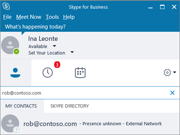

# ユーザーが外部の Skype for Business ユーザーに連絡できるようにする

> [!NOTE]
> Skype for Business のフェデレーションは、21Vianet および Office 365 ドイツの組織が運用している Office 365 では使用できません。 
  
次の場合、この記事で説明する手順をご利用ください。
  
- 会社のさまざまなドメインにユーザーがいる。 たとえば、Rob@ContosoEast.com と Ann@ContosoWest.com のような場合。
    
- 組織内のユーザーが Skype for Business を使用して、組織外の特定の企業のユーザーに連絡できるようにする場合。
    
- Skype for Business を使用している他のユーザーが、自分のメールアドレスを使用して、あなたを検索して連絡できるようにする必要があります。 Skype for Business の既定の設定を使用している場合は、これが自動的に有効になります。 そうでない場合は、その構成でドメインがブロックされていないことを確認する必要があります。
    
## ユーザーに対する企業間の通信を有効にする

この操作を行うには、両方の組織の Office 365 で[管理者権限](https://support.office.com/en-us/article/da585eea-f576-4f55-a1e0-87090b6aaa9d)を持っている必要があります。

 **Teams 管理センターを使用した**teams-logo-30x30
  
1. Office 365 管理者アカウントでサインインします。 
    
2. Office 365 管理センターで、[**管理センター** > **チーム**] に移動します。
    
    
  
3. **Teams センター**で、「 **Skype** > **レガシーポータル** 
 
 
4. **Skype for business 管理センター**で、[**組織** > の**外部通信**] を選びます。
5. 特定の会社や別のドメインのユーザーとの通信を設定するには、ドロップダウン ボックスで [**許可したドメインに対してのみオンにする**] を選択します。
    
    または、Skype for Business のポリシーを開いている世界中のすべてのユーザーとの通信を有効にする場合は、 **[禁止したドメインを除いてオンに**する] を選びます。 これは、既定の設定です。
    
6. [**禁止したドメインまたは許可したドメイン**] の下で [**+**] を選択し、許可するドメイン名を追加します。
    
7. 他の組織の管理者が、 **Skype For business 管理センター**でこれらと同じ手順を実行していることを確認します。 たとえば、相手の組織の管理者は、その組織の**許可されたドメイン** のリストにお客様の会社のドメインを入力する必要があります。
    
8. Windows ファイアウォールを使用している場合、Skype for Business は必要なポートを自動的に開きます。
    
    組織で別のファイアウォールソリューションを使用していて、ネットワーク上のコンピューターがインターネットに接続されないように制限する場合は、クライアントコンピューターが次の[Office 365 url と IP アドレス範囲](https://docs.microsoft.com/microsoftteams/office-365-urls-ip-address-ranges)にアクセスできることを確認します。 ファイアウォールまたは\*プロキシインフラストラクチャ構成** \*** の送信許可リストに fqdn を追加する必要がある場合があります。 api.skype.com、 **users.storage.live.com**、 **graph.skype.com**。 ファイアウォールでこれらのポートを開く方法については、付属のマニュアルを確認してください。
    
    開く必要があるすべてのポートの一覧については、「 [Office 365 の url と IP アドレスの範囲](https://docs.microsoft.com/microsoftteams/office-365-urls-ip-address-ranges)」を参照してください。

9. 組織の管理者が次の手順も実行していることを確認します。
    
10. **テストに最大24時間待機**します。 外部通信設定を変更すると、すべてのデータセンターに変更が反映されるまでに最大24時間かかることがあります。
    
では、無料のコンシューマーアプリである skype を使用しているすべてのユーザーに対して、検索と IM を許可することができます。 詳細については、「 [skype For business ユーザーが skype の連絡先を追加できる](let-skype-for-business-users-add-skype-contacts.md)ようにする」を参照してください。
  
## テストとトラブルシューティング

 **企業間の通信を設定する場合に最もよく発生する問題は、[Office 365 の URL と IP アドレスの範囲](https://docs.microsoft.com/microsoftteams/office-365-urls-ip-address-ranges)の設定ミスによるものです。**
  
セットアップをテストするには、会社のファイアウォールの背後にない Skype for Business の連絡先が必要です。
  
1. 外部通信設定を変更したら、**最大24時間待機**してテストします。
    
2. Skype for Business で、Skype for Business で連絡先を検索し、チャットのリクエストを送信します。
    
    会社のポリシーのために送信できなかったというメッセージが表示された場合は、 [Office 365 の url と IP アドレスの範囲](https://docs.microsoft.com/microsoftteams/office-365-urls-ip-address-ranges)を再確認する必要があります。
    
3. Skype for Business の連絡先に、チャットのリクエストを送信するように依頼します。 相手からの要求を受信できない場合は、お客様のファイアウォールの設定に問題があります (相手のファイアウォールの設定が正しいことが確認済みであることが前提)。
    
4. ファイアウォールで問題があるかどうかをテストするには、喫茶店など、ファイアウォールの背後にない wifi 上の場所にアクセスすることと、Skype for Business を使って、コンタクトに要求を送信してチャットする方法もあります。 メッセージをその場所からは送信できる一方、職場からは送信できない場合は、問題の原因は職場のファイアウォールであることが特定できます。
    
## 他のビジネスに接続しているときに、他のユーザーを検索して見つける方法

他の Skype for Business ユーザーとの外部通信を有効にすると、ユーザーはサインイン名 (たとえば、Rob@contoso.com) を検索して、フェデレーションされた Skype for Business ユーザーを見つけることができます。 次に、ユーザーを連絡先リストに追加する必要があります。
  

  
## フェデレーションされたビジネスとの通信をセットアップするためのヒント

- Skype for Business 2015 と Skype for Business Online の間のフェデレーションを構成するには、「 [skype For Business online とのフェデレーションを構成](https://technet.microsoft.com/en-us/library/jj205126.aspx)する」の記事を参照してください。
    
- Lync と Skype for Business Online の間のフェデレーションを構成するには、次の記事を参照してください。 [Lync online の顧客のためのフェデレーションサポートの構成](https://technet.microsoft.com/en-us/library/hh202193.aspx)
    
- Office 365 の2つの Skype for Business ユーザーが別々のドメインで相互に通信している場合は、両方の組織でオンになっている Skype for Business の機能 (たとえば、ビデオの会話やデスクトップ共有など) のみを使用できます。
    
- 組織内の Skype for Business ユーザーがインプレースまたは訴訟ホールドに設定されている場合、そのユーザーと他の Skype for Business または Skype ユーザー間の IM 会話は、そのユーザーのメールボックスの**回復可能なアイテム**に保存されます。 これらの会話は、自分のメールボックスの [**会話履歴**] フォルダーには保存されません。
    
## 特定の個人の外部通信をオフにする

組織全体の外部通信を有効にした後は、特定の個人に対してのみオフにすることができます。
  
1. Office 365 管理者アカウントでサインインします。
    
2. Office 365 管理センターで、[**アクティブな****ユーザー** > ] に移動します。
    
3. ユーザーの一覧でユーザーを選び、[**詳細設定**] で [ **Skype for business のプロパティの編集**] をクリックします。
    
    
  
4. **Skype For business 管理センター**で、[**外部通信**] を選びます。
    
    [**オプション**] ページで、すべての選択肢が選択されます。 無効にする通信をオフにします。 次の画像は、Jakob が他の Skype ユーザとは関係なく、他の信頼できる会社のユーザと通信できることを示しています。
    
    
  
5. [ **保存**] を選びます。
    
> [!NOTE]
> 変更が有効になるまで最長で24時間かかる場合があります。 
  

[!INCLUDE [LinkedIn Learning Info](../../common/office/linkedin-learning-info.md)]
   
   
## 関連トピック

[Skype for Business Online のセットアップ](set-up-skype-for-business-online.md)
  
[Skype for Business ユーザーが Skype の連絡先を追加できるようにする](let-skype-for-business-users-add-skype-contacts.md)
  
  
 
