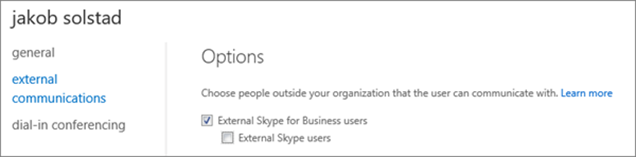

# ビジネス ユーザー向けの Skype の外部の連絡先にユーザーを許可します。

> [!NOTE]
> Skype for Business フェデレーションのは Office 365 ドイツの組織と 21 vianet が運営する Office 365 を利用できません。 
  
ときの記事: 次の手順を使用します。
  
- ビジネスに別のドメインでユーザーがあります。たとえば、Rob@ContosoEast.com と Ann@ContosoWest.com します。
    
- 組織外の特定の企業内のユーザーに連絡する Skype for Business を使用する組織の他のユーザーしたいです。
    
見つけて、メール アドレスを使用して、あなたに連絡できる Skype for Business を使用している、世界中で、他のユーザー-します。既定の Skype for Business 設定を使う場合は、このが自動的に実行されます。しない場合は、自分のドメインの構成によってブロックされていないことを確認する必要があります。
    
## ユーザーの企業との通信を有効にします。

これを行う Office 365 の[管理者権限](https://support.office.com/en-us/article/da585eea-f576-4f55-a1e0-87090b6aaa9d)が必要です。
  
1. Office 365 の管理者アカウントでサインインします。 
    
2. Office 365 管理センターで、**管理センター**に移動 > **Skype for Business**します。
    
    ![Skype for Business 管理センター] を選びます。](../images/376a7a45-e6e3-4716-be09-d2f294d885a2.png)
  
3. **Skype for Business 管理センター**で、[**組織**] を選びます > **外部通信**します。
    
4. 設定するのには、特定のビジネスまたは、ドロップ ダウン ボックスで、別のドメインのユーザーとの通信は、 **[許可ドメインのみ**] を選びます。
    
    または、Skype for Business のポリシーの選択を開くには、世界中に他のすべてのユーザーとの通信を有効にするかどうかは**の禁止ドメイン以外**します。これは、既定の設定です。
    
5. [**ブロックまたは許可ドメイン**] で選択**+**入力できるようにするドメインの名前を追加します。
    
6. その他の組織の管理者は、 **Skype for Business 管理センター**で同じ手順を確認します。たとえば、 **[許可ドメイン**リスト管理者は、業務用のドメインを入力する必要があります。
    
7. Windows ファイアウォールを使っている場合は、Skype for Business が自動的に必要なポートを開きます。
    
    組織がインターネットに接続するネットワーク上のコンピューターを制限するソリューションを別のファイアウォールを使用している場合は、クライアント コンピューターは、次の[Office 365 の Url と IP アドレスの範囲](https://docs.microsoft.com/en-us/microsoftteams/office-365-urls-ip-address-ranges)にアクセスできるようにことを確認します。Fqdn、送信を許可する、ファイアウォールまたはプロキシのリスト インフラストラクチャ構成の追加が必要: ** \*. api.skype.com**、 \* **. users.storage.live.com**、 **graph.skype.com**とします。ファイアウォールでこれらのポートを開く方法については、それに付属しているドキュメントを確認してください。
    
    すべてのポートを開きたいのリストは、 [Office 365 の Url と IP アドレスの範囲](https://docs.microsoft.com/en-us/microsoftteams/office-365-urls-ip-address-ranges)を参照してください。
    
8. **テストするのには、最大 24 時間かかる**。外部通信] 設定を変更するには、すべてのデータ センターで設定を変更するには、最大 24 時間がかかることができます。
    
 Skype、無料のコンシューマー アプリを使用しているすべてのユーザーとユーザーを検索して IM を許可していることができます。詳細については、 [Skype for Business ユーザーに許可 Skype の連絡先を追加する](let-skype-for-business-users-add-skype-contacts.md)を参照してください。
  
## テスト、トラブルシューティングする.

 **企業間の通信を設定する際に発生する最も一般的な問題は、作業[Office 365 の Url と IP アドレスの範囲](https://docs.microsoft.com/en-us/microsoftteams/office-365-urls-ip-address-ranges)右します。**
  
設定をテストするには、ビジネス、会社のファイアウォールの背後にない人の Skype の連絡先が必要です。
  
1. した後、 **24 まで待機する時間にテスト**の外部通信設定を変更します。
    
2. Skype for Business] では、Skype for Business] で、連絡先を検索し、チャット出席依頼を送信します。
    
    会社のポリシーが原因で送信できなかったことをメッセージが表示される場合[Office 365 の Url と IP アドレスの範囲](https://docs.microsoft.com/en-us/microsoftteams/office-365-urls-ip-address-ranges)を再確認する必要があります。
    
3. チャットの出席依頼を送信するビジネス用連絡先の Skype を依頼します。場合は、出席依頼を受信していない、問題は、(そのファイアウォール設定が正しいが既にわかっている場合)、ファイアウォールの設定です。
    
4. 問題が、ファイアウォールであるかどうかをテストする別の方法では、: 喫茶店など、ファイアウォールの背後にない wifi 場所に移動し、Skype for Business を使ってチャットするのには、連絡先に、出席依頼を送信します。メッセージを通過のにいないしたら職場で、[問題の場合は、ファイアウォールです。
    
## 他のユーザーを検索し、別のビジネスに接続しているときに検出する方法

他の Skype for Business ユーザーとの外部通信を有効にした後にユーザーくださいフェデレーション Skype ビジネス ユーザーのサインイン名を検索して: Rob@contoso.com などです。な連絡先リストにユーザーを追加する必要があります。
  

  
## フェデレーション企業との通信設定のヒント

- Skype for Business 2015 と Skype for Business Online のフェデレーションを構成するには、この TechNet の記事を参照してください: [Skype for Business Online のフェデレーションを構成](https://technet.microsoft.com/en-us/library/jj205126.aspx)します。
    
- Lync と Skype for Business Online のフェデレーションを構成するには、この TechNet 記事を参照してください: [Lync Online の顧客のためのフェデレーション サポートの構成](https://technet.microsoft.com/en-us/library/hh202193.aspx)します。
    
- 2 つの Skype for Office 365 のビジネス ユーザーが別のドメインの相互通信している場合は、両方の組織でオンになっているビジネス機能 (たとえば、ビデオによる会話やデスクトップ共有) Skype のみ使用できます。
    
- 場合は、組織内のビジネス ユーザーの Skype がインプレースまたは訴訟したままで、そのユーザーと他の Skype for Business または Skype のユーザーの IM 会話を自分のメールボックスで**回復できるアイテム**に保存されます。これらの会話は、自分のメールボックスで**の会話履歴**] フォルダーに保存されていません。
    
## 特定のユーザーに対して外部通信をオフにします。

全体向けの外部通信を有効にした後は、のみ具体的な個人の無効にすることができます。
  
1. Office 365 の管理者アカウントでサインインします。
    
2. Office 365 管理センターで、[**ユーザー**] に移動 > **アクティブなユーザー**。
    
3. 、ユーザーの一覧で、ユーザーを選択し、[**詳細設定**] で**ビジネスのプロパティの Skype の編集**] をクリックします。
    
    
  
4. **Skype for Business 管理センター**で、[**外部通信**] を選びます。
    
    [**オプション**] ページで、すべての選択肢が選択されます。無効に通信をオフにします。次の図は、Jakob が他の Skype ユーザーではなく、信頼できる企業他のユーザーと通信できることを示しています。
    
    
  
5. [**保存**] を選びます。
    
> [!NOTE]
> 最大 24 時間、変更内容を有効になるまで待つ必要があります。 
  

[!INCLUDE [LinkedIn Learning Info](../../common/office/linkedin-learning-info.md)]
   
   
## 関連トピック

[Skype for Business Online をセットアップします。](set-up-skype-for-business-online.md)
  
[ビジネス ユーザー向けの Skype Skype の連絡先を追加できるようにします。](let-skype-for-business-users-add-skype-contacts.md)
  

