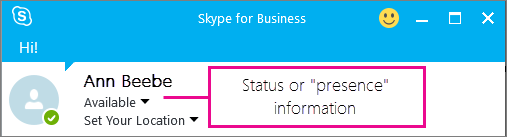

# Skype for Business Online でプレゼンスを設定するConfigure presence in Skype for Business Online

既定では、Skype for Business を使用して組織内のいずれかのユーザーと通信できるユーザーは誰でも、そのユーザーがオンラインかどうかを確認することができます。By default, anyone who can communicate with one of the people in your organization using Skype for Business can also see whether that person is online. Skype for Business では、ユーザーがオンライン、会議、オフライン、または別のインジケーターであるかどうかが表示されます。Skype for Business shows whether a person is available online, in a meeting, offline, or another indicator.

組織内のすべてのユーザーの**[管理者](https://support.office.com/article/eac4d046-1afd-4f1a-85fc-8219c79e1504)** として、Skype for business でオンラインプレゼンスを表示できるユーザーを選ぶことができます。As the **[admin](https://support.office.com/article/eac4d046-1afd-4f1a-85fc-8219c79e1504)** for everyone in your business, you can choose who sees their online presence in Skype for Business.

 **Skype for business 管理センターを使用し**た skype for business ロゴを示すアイコン **Using the Skype for Business admin center**

1. 管理センター >**管理センター** > **Skype for business**に移動します。Go to the admin center > **Admin centers** > **Skype for Business**.

2. **Skype For business 管理センター**で、[**組織**] を選びます。In the **Skype for Business admin center**, choose **organization**.

3. [**プレゼンスプライバシーモード**] で、次の設定のいずれかを選択し、[**保存**] を選択します。Under **presence privacy mode**, select one of the following settings, and then choose **Save**.

|**]****Setting**|**ユーザーのプレゼンスを表示できるユーザー****Who can view a user's presence**|
|:-----|:-----|
|**プレゼンス情報を自動的に表示する****Automatically display presence information**   |ユーザーの**外部**または**ブロック**リストに追加されていない会社の Skype for business ユーザーは、そのユーザーのオンラインプレゼンス情報を表示できます。Any Skype for Business user in your business who has not been added to a person's **External** or **Blocked** list will be able to see that person's online presence.   |
|**プレゼンス情報をユーザーの連絡先にのみ表示する****Display presence information only to a user's contacts**   |他のユーザーの連絡先リストに含まれているすべてのユーザーが、**外部**または**ブロック**されたリストに追加されていない。Anyone in a person's Contacts list who they have not added to their **External** or **Blocked** list.   ユーザーは、Skype for business アプリの既定の設定を上書きすることができます。 [**設定** > **ツール** > **] オプション**。Individuals can override your default settings in their Skype for Business app: **Settings** > **Tools** > **Options**.   |

Skype for Business でユーザーが変更できる操作については、次の記事を参照してください。For information about what your users can change in Skype for Business, see these articles:

- [Skype for Business のプレゼンス情報へのアクセスを制御するControl access to your presence information in Skype for Business](https://support.office.com/en-us/article/fea86e34-60cf-4dd0-bfb2-169a42afd92c)

- [Skype for Business のステータスオプションを設定するSet Status options in Skype for Business](https://support.office.com/en-us/article/efd25395-c8ef-4510-b9cb-6f70e2fff8a0)

## 関連トピックRelated topics

[Skype for Business Online のセットアップSet up Skype for Business Online](set-up-skype-for-business-online.md)

[Skype for Business ユーザーが Skype の連絡先を追加できるようにするLet Skype for Business users add Skype contacts](let-skype-for-business-users-add-skype-contacts.md)

