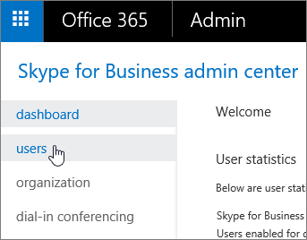

# 管理者: 個別のユーザーの Skype for Business の設定を構成するAdmins: Configure Skype for Business settings for individual users

この記事では、管理者が Skype for Business を少数のユーザーに対して構成する方法について説明します。This article explains how admins configure Skype for Business for a small number of users. これらの手順をまとめて実行するには、使用できる Windows PowerShell コマンドレットへのリンクが含まれています。To do these steps in bulk, we've included links to the Windows PowerShell cmdlets you can use.
  
組織内のすべてのユーザーが外部ユーザーと通信できるようにする (またはブロックする) には、以下を参照してください。To allow (or block) everyone in your business to communicate with external people, see:
  
- [ユーザーが外部の skype For business ユーザーに連絡できるよう](allow-users-to-contact-external-skype-for-business-users.md)にする: Skype for business の高度な機能 (デスクトップの共有、オンラインのユーザーの検索など) を使用して、特定の信頼できる (フェデレーションされた) ビジネスのユーザーと通信できるようにします。[Allow users to contact external Skype for Business users](allow-users-to-contact-external-skype-for-business-users.md): You can let your organization use advanced Skype for Business features (share desktops, look for who's online, etc.) to communicate with people in a specific trusted (federated) business. この記事では、特定のドメインとの通信をブロックする方法についても説明します。The article also explains how to block communication with specific domains.
    
- [Skype For business ユーザーが skype の連絡先を追加できるように](let-skype-for-business-users-add-skype-contacts.md)します。[Let Skype for Business users add Skype contacts](let-skype-for-business-users-add-skype-contacts.md). Skype for Business を使用して、無料のアプリである Skype を使用しているユーザーを検索したり、IM を送信したりすることができます。You can let your organization use Skype for Business to search for and IM people who use Skype, the free app.
    
## 1人のユーザーの全般設定を構成するConfigure general settings for one user

これらの手順を実行するには、[管理者権限](https://support.office.com/en-us/article/da585eea-f576-4f55-a1e0-87090b6aaa9d)が必要です。You must have [admin permissions](https://support.office.com/en-us/article/da585eea-f576-4f55-a1e0-87090b6aaa9d) to perform these steps.

 **Skype for Business 管理センターを使用する** **Using the Skype for Business admin center**
  
1. 職場または学校のアカウントを使用して、Office 365 にサインインします。Sign in to Office 365 with your work or school account.
    
2. [**管理センター**]  >  [**Skype for Business**]を選択します。Choose **Admin centers** > **Skype for Business**.
    
3. [ **ユーザー**] を選びます。Choose **Users**.
    
    
  
4. 編集するユーザーを選びます。Choose which users you want to edit.
    
5. 右側のウィンドウで、[ **編集**] を選びます。In the right panel, choose **Edit**.
    
    
  
6. [**全般**] オプションページで、変更する機能の横のチェックボックスをオンまたはオフにして、[**保存**] を選択します。On the **General** options page, select or clear the check box next to the features you want to change, and then choose **Save**.
    
|**オプション****Option**|**詳細****Details**|
|:-----|:-----|
|オーディオと HD ビデオAudio and HD video    |このユーザーが音声会議、音声会議、ビデオ会議を記録したり、会議のスケジュールを設定したりできないようにします (なし)。Allow this person to record audio meetings, audio and video meetings, or don't allow them to schedule any meetings (none).    |
|会話と会議を記録するRecord conversations and meetings    |このユーザーが記録できる内容を選びます。Choose what this person is allowed to record.    このオプションは、Skype for Business Basic では使用できません。This option is not available with Skype for Business Basic.    |
|コンプライアンスのため、アーカイブされていない機能をオフにするFor compliance, turn off non-archived features    | 電子的に保存された情報を維持する必要がある場合は、このオプションを選択します。Choose this option if you're legally required to preserve electronically stored information.    このオプションを選択すると、Exchange 管理センターで[インプレースホールド](https://technet.microsoft.com/en-us/library/ff637980%28v=exchg.150%29.aspx)が設定されているときにキャプチャされていない機能は無効になります。Selecting this option turns off features that aren't captured when you have an [In-Place Hold](https://technet.microsoft.com/en-us/library/ff637980%28v=exchg.150%29.aspx) set up in the Exchange admin center. 次の機能がオフになります。It turns off the following features:    インスタント メッセージングを使用したファイルの転送File transfer using instant messaging    OneNote の共有ページShared OneNote pages    PowerPoint のコメントPowerPoint annotations   |
   
これらの設定をまとめて構成するには、PowerShell を使用します。To configure these settings in bulk, use PowerShell. 「 [Windows PowerShell 用にコンピューターをセットアップする」を](../set-up-your-computer-for-windows-powershell/set-up-your-computer-for-windows-powershell.md)参照してください。See [Set up your computer for Windows PowerShell](../set-up-your-computer-for-windows-powershell/set-up-your-computer-for-windows-powershell.md).
  
## 外部通信をブロックするBlock external communications

[Skype For business ユーザー](let-skype-for-business-users-add-skype-contacts.md)が会社のすべてのユーザーに skype 連絡先を追加できるようにすると、次の手順を使用して、特定のユーザーの外部通信を個別にブロックすることができます。After you [Let Skype for Business users add Skype contacts](let-skype-for-business-users-add-skype-contacts.md) for everyone in your company, you can selectively block external communications for specific individuals using these steps.
  
1. [**ユーザー**] を選び、設定を無効にするユーザーを選択して\*\*\*\* 編集] を選びます。Choose **Users**, select the users whose settings you want to disable, and then choose **Edit** .
    
2. [**外部通信**] を選択し、必要に応じてオプションをオフにします。Choose **External communications**, and then clear the options as appropriate:
    
   - **外部の skype For business ユーザー**: フェデレーションドメインの Skype for business ユーザーとの通信を可能にしない場合は、このボックスをオフにします。**External Skype for Business users**: Clear this box if you don't want the user to be able to communicate with Skype for Business users in federated domains.
    
   - **外部の Skype ユーザー**: freeSkype アプリを使用しているユーザーとの通信を可能にしない場合は、このボックスをオフにします。**External Skype users**: Clear this box if you don't want the user to be able to communicate with people who are using the freeSkype app.
    
3. [**保存**] をクリックします。Click **Save**.
    
これらの設定をまとめて構成するには、PowerShell を使用します。To configure these settings in bulk, use PowerShell. 「 [Windows PowerShell 用にコンピューターをセットアップする」を](../set-up-your-computer-for-windows-powershell/set-up-your-computer-for-windows-powershell.md)参照してください。See [Set up your computer for Windows PowerShell](../set-up-your-computer-for-windows-powershell/set-up-your-computer-for-windows-powershell.md).
  
## 1人のユーザーの電話会議の設定を編集するEdit audio conferencing settings for one user

1. [**ユーザー**] を選び、電話会議の設定を編集するユーザーを選び、[編集\*\*\*\* ![] を](../images/2f8948c1-e4f3-4022-b9cd-37fed066056e.png)選びます。Choose **Users**, select the user whose audio conferencing settings you wan to edit, ,and then choose **Edit** .
    
2. [**電話会議**] を選び、電話会議プロバイダーを選んで、要求された情報を入力または変更し、[**保存**] をクリックします。Choose **Audio conferencing**, select your audio conferencing provider, type or change the requested information, and then click **Save**.
    
|**電話会議の設定****Audio conferencing setting**|**説明****Description**|
|:-----|:-----|
|**プロバイダー名****Provider name**   |リストからプロバイダーを選択します。Choose your provider from the list.    |
|**有料電話番号** (必須)**Toll number** (required)   |サードパーティ ACP の場合、これらの電話番号は、電話会議プロバイダーから受け取った電話番号です。For a third-party ACP, these phone numbers are the ones you received from the audio conferencing provider. ユーザーが、Microsoft を電話会議プロバイダーとして使用している場合は、これらは電話会議ブリッジで設定されている番号となります。If the user is using Microsoft as the audio conferencing provider, these will be numbers that are set on the audio conferencing bridge. Skype for Business および Microsoft Teams の会議出席依頼に表示する番号の書式を設定します。Format the numbers as you want them to appear in Skype for Business and Microsoft Teams meeting requests.    |
|**フリー ダイヤル番号****Toll-free number**   |サードパーティ ACP の場合、これらの電話番号は、電話会議プロバイダーから受け取った電話番号です。For a third-party ACP, these phone numbers are the ones you received from the audio conferencing provider. ユーザーが、Microsoft を電話会議プロバイダーとして使用している場合は、これらは電話会議ブリッジで設定されている番号となります。If the user is using Microsoft as the audio conferencing provider, these will be numbers that are set on the audio conferencing bridge. Skype for Business および Microsoft Teams の会議出席依頼に表示する番号の書式を設定します。Format the numbers as you want them to appear in Skype for Business and Microsoft Teams meeting requests.    |
|**会議 ID と PIN**任意**Conference ID and PIN** (required)   |このユーザーによってスケジュールされ、サードパーティの電話会議プロバイダーから提供された会議に参加するために使用される、参加者の PIN (会議コード) です。The participant PIN, or conference code, used to join meetings that are scheduled by this user and are provided from a third-party audio conferencing provider. ユーザーが Microsoft を電話会議プロバイダーとして使用している場合は、この操作は必要ありません。If the user is using Microsoft as the audio conferencing provider, this won't be required.    |
   
これらの設定をまとめて構成するには、PowerShell を使用します。To configure these settings in bulk, use PowerShell. 「[招待に含まれている電話番号を設定する](../audio-conferencing-in-office-365/set-the-phone-numbers-included-on-invites.md) 」を参照してください。See [Set the phone numbers included on invites](../audio-conferencing-in-office-365/set-the-phone-numbers-included-on-invites.md) [Set up your computer for Windows PowerShell](../set-up-your-computer-for-windows-powershell/set-up-your-computer-for-windows-powershell.md).

[!INCLUDE [LinkedIn Learning Info](../../common/office/linkedin-learning-info.md)]
  
   
## 関連トピックRelated topics 

[Skype for Business Online のセットアップSet up Skype for Business Online](set-up-skype-for-business-online.md)

[Skype for Business と Microsoft Teams のアドオン ライセンスSkype for Business and Microsoft Teams add-on licensing](../skype-for-business-and-microsoft-teams-add-on-licensing/skype-for-business-and-microsoft-teams-add-on-licensing.md)
  
  
 
