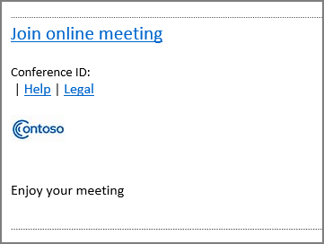

# 会議への招待状をカスタマイズする

管理者は、すべての Skype for Business の会議出席依頼にサポート Web サイトへのリンクや法的免責事項、会社のロゴ、その他のテキスト、記載したいその他の情報が含まれていることを確認できます。 
  
## 会議出席依頼のロゴを作成するためのヒント

1. 幅 188 ピクセル未満、高さ 30 ピクセルの(非常に小さい)イメージを作成します。
    
2. イメージを JPG 形式で保存します。
    
3. ネットワークの共有、ビジネスフォルダ用の共有 OneDrive、Dropboxなど、お客様のビジネスのすべてのユーザーがアクセスできる中央の場所にイメージを保存します。
    
    会議出席依頼に追加できるようになります。 方法については、次の手順を参照してください。
    
## 会議の招待状をカスタマイズする

 **Skype for Business 管理センターの使用**

1. 職場または学校のアカウントを使用して、Office 365 にサインインします。
    
2. 管理センターで、[**管理センター** > ]**の [Skype for business**] を選びます。
    
3. Skype for Business 管理センターで、[**オンライン会議**] を選択します。 
    
4. 以下のボックスに入力してください:
    
     

   **ロゴの URL:** ロゴを保存する場所の URL を入力します。 JPG フォーマットにする必要があることに留意してください！ 
 
   **ヘルプ URL:** ユーザーが問題を抱えている場合に訪問するサポート ウェブサイトがお客様の組織にある場合、こちらに URL を入力してください。 

   **法的 URL:**  ユーザーに法的な懸念がある場合に訪問する法的ウェブサイトがお客様の組織にある場合、こちらに URL を入力してください。
    
   **フッター テキスト:** ユーザーに適切なテキストのみの脚注を入力します。  
  
   
5. [ **保存**] を選びます。
    
6. Office 365 サービス全体に変更が反映されるまで 1 時間ほど待ちます。 その後 Outlook に移動し、Skype 会議をスケジュールし、変更がどのように反映されるか確認します。 
    
    
  
## 関連トピック

[Office 365 での電話会議を試用または購入する](../audio-conferencing-in-office-365/try-or-purchase-audio-conferencing-in-office-365.md)

  
 
