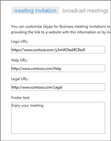

# 会議の出席依頼をカスタマイズするCustomize meeting invitations

管理者は、すべての Skype for Business の会議出席依頼にサポート Web サイトへのリンクや法的免責事項、会社のロゴ、その他のテキスト、記載したいその他の情報が含まれていることを確認できます。As an admin, you can ensure that all Skype for Business meeting invitations include some helpful information your users might need, such as links to your support website and legal disclaimer, your company logo, and other text you want to include. 
  
## 会議出席依頼のロゴを作成するためのヒントTips for creating a logo for meeting invitations

1. 幅 188 ピクセル未満、高さ 30 ピクセルの(非常に小さい)イメージを作成します。Create an image that is no more than 188 pixels wide by 30 pixels tall (it's quite small).
    
2. イメージを JPG 形式で保存します。Save the image in JPG format.
    
3. ネットワークの共有、ビジネスフォルダ用の共有 OneDrive、Dropboxなど、お客様のビジネスのすべてのユーザーがアクセスできる中央の場所にイメージを保存します。Store the image in a central location that everyone in your business can access, such as a network share, shared OneDrive for Business folder, Dropbox, etc.
    
    会議出席依頼に追加できるようになります。Now you can add it to your meeting invitations. 次の手順を参照してください。See the next steps.
    
## 会議出席依頼をカスタマイズするCustomize your meeting invitations

 **Skype for Business 管理センターを使用する** **Using the Skype for Business admin center**

1. 職場または学校のアカウントを使用して、Office 365 にサインインします。Sign in to Office 365 with your work or school account.
    
2. Office 365 管理センターで、 **管理センター** > **Skype for Business**を選択します。From the Office 365 admin center, choose **Admin centers** > **Skype for Business**.
    
3. Skype for Business 管理センターで、[**オンライン会議**] を選択します。In the Skype for Business admin center, choose **online meetings**. 
    
4. 以下のボックスに入力してください:Complete the following boxes:
    
     

   **ロゴの URL:** ロゴを保存する場所の URL を入力します。**Logo URL:** Enter the URL where your logo is stored. JPG フォーマットにする必要があることに留意してください！Remember that it must be in JPG format! 
 
   **ヘルプ URL:** ユーザーが問題を抱えている場合に訪問するサポート ウェブサイトがお客様の組織にある場合、こちらに URL を入力してください。**Help URL:** If your organization has a support website you want people to go to if they have problems, enter the URL here. 

   **法的 URL:**  ユーザーに法的な懸念がある場合に訪問する法的ウェブサイトがお客様の組織にある場合、こちらに URL を入力してください。**Legal URL:** If your organization has a legal website you want people to go to if they have legal concerns, enter the URL here.
    
   **フッター テキスト:** ユーザーに適切なテキストのみの脚注を入力します。**Footer text:** Enter a text-only footnote that will be appropriate for your users.  
  
   
5. [ **保存**] を選びます。Choose **Save**.
    
6. Office 365 サービス全体に変更が反映されるまで 1 時間ほど待ちます。Wait an hour or so for the changes to get populated across all Office 365 services. その後 Outlook に移動し、Skype 会議をスケジュールし、変更がどのように反映されるか確認します。Then go to Outlook and schedule a Skype meeting to see what your changes look like. 
    
    
  
## 関連トピックRelated topics

[Office 365 での電話会議を試用または購入するTry or purchase Audio Conferencing in Office 365](../audio-conferencing-in-office-365/try-or-purchase-audio-conferencing-in-office-365.md)

  
 
