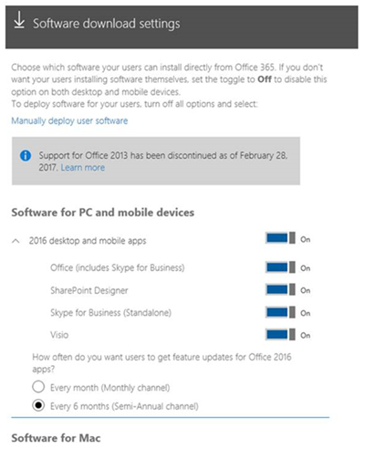
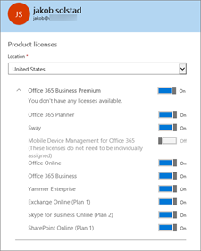

# Office 365 で Skype for Business クライアントを展開するDeploy the Skype for Business client in Office 365

この資料は、**[管理者](https://support.office.com/en-us/article/eac4d046-1afd-4f1a-85fc-8219c79e1504?ui=en-US&rs=en-US&ad=US)**では、配置方法ビジネス アプリケーションの Skype ユーザーに、組織内のオプションについて説明します。This article explains options for how you, the **[admin](https://support.office.com/en-us/article/eac4d046-1afd-4f1a-85fc-8219c79e1504?ui=en-US&rs=en-US&ad=US)**, can deploy the Skype for Business app to the people in your organization.
  
ビジネス ユーザーは、Skype を展開する前に、[オンライン ビジネスの Skype の設定](set-up-skype-for-business-online.md)資料では、手順 1 ~ 3 を行っています。Before you deploy Skype for Business to your users, make sure you've done steps 1-3 in the article [Set up Skype for Business Online](set-up-skype-for-business-online.md). これによって、ご使用のドメインで Skype for Business がセットアップされ、すべてのユーザーにライセンスが割り当てられ、組織用に IM と[Skype for Business Online でプレゼンスを設定する](configure-presence-in-skype-for-business-online.md)が構成されます。This way, Skype for Business will be set up with your domain, everyone will have their licenses, and you will have configured IM and [Configure presence in Skype for Business Online](configure-presence-in-skype-for-business-online.md) for your organization.
  
> [!NOTE]
> ユーザーが Skype for Business アプリをインストールするためには、PC またはデバイス上のローカル管理者である必要があります。For users to install the Skype for Business app, they need to be local admins on their PC or device. または、PC またはデバイスにアプリをインストールできるローカル グループのメンバーであることが必要です。Or they will need to be part of a local group that can install apps on their PC or devices. ユーザーが自分のデバイスにソフトウェアをインストールするのには許可されていない場合は、それらのビジネス アプリケーションの Skype をインストールする必要があります。If your users aren't allowed to install software on their devices, you'll need to install the Skype for Business app for them. 
  
## ほとんどの中小規模の企業の場合For most small and medium-sized businesses

 **ステップ バイ ステップのインストール手順:**小規模または中規模のビジネスがある場合は、単に自分の PC 上のビジネス アプリケーションの Skype をインストールするのには、ユーザーに依頼することをお勧めします。**Step-by-step installation instructions:** If you have a small or medium-sized business, we recommend that you simply ask your users to install the Skype for Business app on their PC. 次の手順を参照するように:[ビジネスの Skype をインストール](https://support.office.com/en-us/article/8a0d4da8-9d58-44f9-9759-5c8f340cb3fb?ui=en-US&rs=en-US&ad=US)します。Point them to these instructions: [Install Skype for Business](https://support.office.com/en-us/article/8a0d4da8-9d58-44f9-9759-5c8f340cb3fb?ui=en-US&rs=en-US&ad=US). Mac を使用している場合は、 [Office 365 の Mac の 2011 年の Lync をセットアップ](https://support.office.com/en-us/article/ae3ebd0e-a1a7-48cf-9350-36b144dc5f88?ui=en-US&rs=en-US&ad=US)することをポイントします。If they are using Macs, point them to [Set up Lync for Mac 2011 for Office 365](https://support.office.com/en-us/article/ae3ebd0e-a1a7-48cf-9350-36b144dc5f88?ui=en-US&rs=en-US&ad=US). ビジネス アプリケーションの Skype は、Office アプリケーションの残りの部分から個別にインストールします。The Skype for Business app is installed separately from the rest of the Office apps.
  
 **Office 365 ProPlus のお客様:** お客様の会社で E3 プランなどの Office 365 ProPlus が含まれる Office 365 プランを使用している場合、ユーザーが Word、Excel、PowerPoint などをダウンロードしてインストールすると、同時に Skype for Business アプリがインストールされます。つまり、Office をすべてアンインストールしないと Skype for Business をアンインストールできません。**Office 365 ProPlus customers:** If your business is using an Office 365 plan that includes Office 365 ProPlus, such as the E3 plan, the Skype for Business app is installed at the same time your users download and install Word, Excel, PowerPoint, etc. This also means they can't uninstall Skype for Business unless they uninstall all of Office.
  
### ユーザーが Skype for Business を利用できるようにするかどうかを選択するChoose whether to make Skype for Business available to your users

[管理者](https://support.office.com/en-us/article/eac4d046-1afd-4f1a-85fc-8219c79e1504?ui=en-US&rs=en-US&ad=US)として、ユーザーがビジネス アプリケーションの Skype を使用できるようにするかどうかを選択できます。As the [admin](https://support.office.com/en-us/article/eac4d046-1afd-4f1a-85fc-8219c79e1504?ui=en-US&rs=en-US&ad=US) you can choose whether to make the Skype for Business app available to your users.
  
- **ソフトウェアを取得するかどうか、社内のすべてのユーザーを制御する**: にサインインするのに、Office 365 の管理センター、**ソフトウェアをインストール**するには、およびユーザーの利用可能にソフトウェアを選択します。**To control whether everyone in your company gets the software**: Sign in to the Office 365 admin center, go to **Install my software**, and then select the software you want to be available for users.
    
    
  
- **制御するかどうか、会社内の特定のユーザー ソフトウェアを入手する**: にサインインするのに、Office 365 の管理センターは、**ユーザー**に > 、**アクティブなユーザー**が、ソフトウェアにアクセスできるようにし人を選択し、し、[**編集**] をクリックして**製品ライセンス**の横にあるし、ライセンスを有効または無効にします。**To control whether specific people in your company get the software**: Sign in to the Office 365 admin center, go to **Users** > **Active users**, select the person who you want to give access to the software, and then click **Edit** next to **Product licenses** and turn the license on or off.
    
    
  
> [!NOTE]
> どのような計画は、組織内のユーザーに割り当てられているを確認する場合が新しい Office 365 管理センターにサインイン >**ユーザー** > **アクティブなユーザー**です。リストからユーザーを選択し、**製品のライセンス**の下を確認します。従来の Office 365 管理センターを使用する場合は、**割り当てられたライセンス**の下で確認します。If you need to see what plans are assigned to people in your organization, sign in to the new Office 365 admin center > **Users** > **Active users**. Select the person from the list then look under **Product licenses**. If you are using the classic Office 365 admin center, look under **Assigned license**. 
  
### ユーザーに Skype for Business を手動で展開するManually deploying Skype for Business to your users

If you want your users to install the Skype for Business app from a location on your network instead of from the Internet, you can download the setup files. To do this go to the **Manually deploy user software** section of the Office 365 admin center. You can then select **Install** and save the setup .exe file to a network location.If you want your users to install the Skype for Business app from a location on your network instead of from the Internet, you can download the setup files. To do this go to the **Manually deploy user software** section of the Office 365 admin center. You can then select **Install** and save the setup .exe file to a network location.
  
別のオプションでは、ユーザーのビジネスの基本的なアプリケーションの Skype をダウンロードします。Another option is to download the Skype for Business Basic app for your users. [ビジネス基本 (32 または 64 ビット) 用の Microsoft の Skype](https://www.microsoft.com/en-us/download/details.aspx?id=49440)をダウンロードすることができます。You can download [Microsoft Skype for Business Basic (32 or 64 Bit)](https://www.microsoft.com/en-us/download/details.aspx?id=49440).
  
Skype for Business アプリのフル バージョンの場合も Basic バージョンの場合も、セットアップ ファイルをダウンロードしたら、セットアップ プログラムを実行してコンピューターにアプリをインストールできるよう、ネットワーク パスをユーザーに手動で (たとえばメールなどで) 送信する必要があります。For both the full and basic Skype for Business apps, after you have downloaded the setup files, you will need to manually send (for example, in email) the network path to the users so they can run the setup program to install the app on their computer.
  
また、既存のソフトウェア展開ツールとプロセスを使用することで、これらのダウンロードを使用して Skype for Business アプリをユーザーに展開することもできます。You can also use these downloads to deploy the Skype for Business app to your users by using your existing software deployment tools and processes.
  
## 大規模組織と企業の場合For larger and enterprise organizations

> [!NOTE]
> このセクションの内容が該当するのは、Office 365 プランで使用可能な Skype for Business アプリのみです。組織で、Windows インストーラー ベース (MSI) である、Skype for Business アプリのボリューム ライセンス バージョンを使用している場合は、「[Skype for Business Server 2015 でクライアント インストールをカスタマイズする](https://technet.microsoft.com/en-us/library/jj204934.aspx)」をご覧ください。This section only applies to the Skype for Business app available through Office 365 plans. If your organization is using a volume licensed version of the Skype for Business app, which is Windows Installer-based (MSI), see [Customize client installation in Skype for Business Server 2015](https://technet.microsoft.com/en-us/library/jj204934.aspx). 
  
多くの大企業や大規模な組織では、ユーザーは自分のコンピューターにソフトウェアをインストールすることを許可されていません。代わりに、IT 部門が必要なソフトウェアをユーザーのコンピューターに展開します。また IT 部門は、組織で使用されるインターネットまたはネットワークの帯域幅を制御するために、遠くのインターネットや企業ネットワークからではなく、ネットワーク上の近くの場所からソフトウェアをインストールする必要があります。In many enterprises or large organizations, users aren't allowed to install software on their computers. Instead, the IT departments deploy the necessary software to the users' computers. IT departments also might want to control the amount of Internet or network bandwidth used in their organization, so they want to install software from a nearby location on their network instead of from across the Internet or across the corporate network.
  
Office 365 からインストールされているかを制御する場合は、Skype のビジネス アプリケーションを展開するためのいくつかのオプションがあります。これらのオプションの一部を以下に示します。With Office 365, you have several options for deploying the Skype for Business app if you want to control where it's installed from. Some of those options include the following:
  
- 「[ユーザーに Skype for Business を手動で展開する](deploy-the-skype-for-business-client-in-office-365.md#bkmk_manual_1)」に記載されているように、Office 365 管理センターからローカル ネットワークに Skype for Business アプリをダウンロードします。Download the Skype for Business app to your local network from the Office 365 admin center, as described in [Manually deploying Skype for Business to your users](deploy-the-skype-for-business-client-in-office-365.md#bkmk_manual_1).
    
- **[Office 展開ツール](https://go.microsoft.com/fwlink/p/?LinkID=626065)** を使用して、Office 365 ProPlus または Skype for Business アプリをローカル ネットワークにダウンロードします。次に、Office 展開ツールを使用してユーザーにアプリを展開します。Office 展開ツールでは、言語やバージョン (32 ビット/64 ビット) など、展開の特定の側面を制御できます。Use the **[Office Deployment Tool](https://go.microsoft.com/fwlink/p/?LinkID=626065)** to download either Office 365 ProPlus or the Skype for Business app to your local network. Then, use the Office Deployment Tool to deploy the app to your users. The Office Deployment Tool gives you the ability to control certain aspects of the deployment, such as languages and version (32-bit or 64-bit).
    
- System Center Configuration Manager などの既存のソフトウェア展開ツールやプロセスを使用して、Office 365 ProPlus または Skype for Business アプリをユーザーに展開します。[Office 展開ツール](https://go.microsoft.com/fwlink/p/?LinkID=626065)や、Office 365 管理センターからダウンロードしたソフトウェアと、既存のツールおよびプロセスを併用できます。Use your existing software deployment tools and processes, such as System Center Configuration Manager, to deploy Office 365 ProPlus or the Skype for Business app to your users. You can use your existing tools and processes with the [Office Deployment Tool](https://go.microsoft.com/fwlink/p/?LinkID=626065) or with the software that you've downloaded from the Office 365 admin center.
    
### Office 展開ツールの使用法に関する詳細情報More info on using the Office Deployment Tool

Office 展開ツールのダウンロードの詳細および Skype for Business アプリとその他の Office 365 クライアント アプリのインストールの詳細については、「[Office 365 でユーザーのソフトウェアを管理する](https://support.office.com/en-us/article/c13051e6-f75c-4737-bc0d-7685dcedf360)」を参照してください。For details on downloading the Office Deployment Tool and more information on installing the Skype for Business app and other Office 365 client apps, see [Manage user software in Office 365](https://support.office.com/en-us/article/c13051e6-f75c-4737-bc0d-7685dcedf360).
  
Office の展開ツールを使用してアプリケーションを展開するに関連する手順の概要を以下に示します。Here's an overview of the steps involved in using the Office Deployment Tool to deploy an app:
  
1. **[最新の Office 展開ツールをダウンロード](https://www.microsoft.com/en-us/download/details.aspx?id=49117)** します。**[Download the newest Office Deployment Tool](https://www.microsoft.com/en-us/download/details.aspx?id=49117)** from the Microsoft Download Center.
    
2. Office 展開ツールで使用する configuration.xml ファイルを作成します。設定やバージョン (32 ビットまたは 64 ビット)、インストール言語など、必要なクライアント アプリの設定を指定します。Create the configuration.xml file to be used with the Office Deployment Tool that has the client app settings you want, such as setting the version (32-bit or 64-bit), the installation language, etc.
    
3. Office 展開ツールと configuration.xml ファイルを使用して、Office コンテンツ配信ネットワーク (CDN) からセットアップ ファイルをローカルまたは社内のネットワークにダウンロードします。Use the Office Deployment Tool and the configuration.xml file to download the setup files to your local or internal network from the Office Content Delivery Network (CDN).
    
4. Office 展開ツールと configuration.xml を使用して、Skype for Business アプリなど Office クライアント アプリをインストールします。Use Office Deployment Tool and the configuration.xml to install the Office client apps, including the Skype for Business app.
    
Office 展開ツールおよび configuration.xml ファイルの使用法の詳細については、次の記事を参照してください。For details on using the Office Deployment Tool and configuration.xml file, see the following articles:
  
- [クイック実行用 Office 展開ツールOffice Deployment Tool overview](https://technet.microsoft.com/library/jj219422.aspx)
    
- [クイック実行 configuration.xml ファイルのリファレンスConfiguration.xml settings](https://technet.microsoft.com/library/jj219426.aspx)
    
### System Center Configuration Manager の使用法に関する詳細情報More info on using System Center Configuration Manager

System Center Configuration Manager など、既存のソフトウェア展開ツールおよびプロセスを使用して、Skype for Business アプリを展開することができます。これらのツールおよびプロセスと、Office 365 管理センターからダウンロードしたソフトウェアや、Office 展開ツールを併用できます。You can use your existing software deployment tools and processes, such as System Center Configuration Manager, to deploy the Skype for Business app. You can use these tools and processes with either the software that you download from the Office 365 admin center or with the Office Deployment Tool.
  
Configuration Manager を使用したソフトウェアの展開の詳細については、次の記事を参照してください。For more information about using Configuration Manager to deploy software, see the following articles:
  
- [Configuration Manager でのアプリケーションの作成方法How to Create Applications in Configuration Manager](https://technet.microsoft.com/en-us/library/gg682159.aspx)
    
- [Configuration Manager でのアプリケーションの展開方法How to Deploy Applications in Configuration Manager](https://technet.microsoft.com/en-us/library/gg682082.aspx)
    
Office 365 ProPlus の展開の一環として Skype for Business アプリを展開する場合は、「[System Center Configuration Manager を使用して Office 365 ProPlus を展開する](https://technet.microsoft.com/en-us/library/dn708063.aspx)」をご覧ください。If you're deploying the Skype for Business app as part of deploying Office 365 ProPlus, see [Deploy Office 365 ProPlus by using the System Center Configuration Manager](https://technet.microsoft.com/en-us/library/dn708063.aspx).
  
## Skype for Business アプリに対する更新プログラムの計画Planning for updates to the Skype for Business app

Skype for Business アプリの展開の一環として、Skype for Business のインストール後に更新プログラムを取得する方法を考慮する必要があります。これらの更新プログラムには、新機能、セキュリティ更新プログラム、安定性やパフォーマンスを改善するセキュリティ以外の更新プログラムが含まれます。考慮する必要がある 2 つの主な事項は、次のとおりです。As part of deploying the Skype for Business app, you need to consider how you want to get updates after Skype for Business is installed. These updates can include new features, security updates, or non-security updates, such as updates that provide stability or performance improvements. The two primary things you need to consider are :
  
- 更新プログラムを取得する場所Where do you want to get updates from
    
- 機能の更新プログラムを取得する頻度How often do you want to get feature updates
    
更新プログラムの取得元、および機能の更新プログラムを取得する頻度は制御できますが、取得する特定のセキュリティ更新プログラムやセキュリティ以外の更新プログラムを選ぶことはできません。While you can control where you get updates from and how often you get feature updates, you can't choose which specific security updates or non-security updates you get.
  
 **更新プログラムの取得元****Where to get updates from**
  
既定では、Skype for Business アプリがインストールされると、更新プログラムが Microsoft から提供されていれば、インターネットから自動的にダウンロードされます。更新プログラムを適用する頻度または更新プログラムのインストール元をより詳細に制御したい場合は、Office 展開ツールまたはグループ ポリシーを使用して構成することができます。By default, after the Skype for Business app is installed, updates will be automatically downloaded from the Internet when they are available from Microsoft. If you want more control over when updates occur or where the updates are installed from, you can use the Office Deployment Tool or Group Policy to configure that.
  
たとえば、多くの組織では、組織全体に展開する前にユーザー グループで更新プログラムをテストする必要があります。これを行うには、Office 展開ツールまたはグループ ポリシーを使用して、インターネットから自動で取得する代わりにネットワーク上の特定の場所から更新プログラムを取得するように、Skype for Business アプリを構成する方法があります。次に、Office 展開ツールを使用して、ローカル ネットワークに更新プログラムを毎月ダウンロードできます。For example, many organizations want to test updates with a group of users before deploying them throughout the organization. You can do this by using the Office Deployment Tool or Group Policy to configure the Skype for Business app to get updates from a specific location on your network, instead of automatically from the Internet. Then, you can use the Office Deployment Tool to download the updates every month to your local network.
  
Office 365 ソフトウェアに対する更新プログラムの動作の詳細については、次の記事をご覧ください。For more information about how updates work for Office 365 software, see these articles:
  
- [Office 365 ProPlus の更新プロセスの概要Overview of the update process for Office 365 ProPlus](https://technet.microsoft.com/en-us/library/dn761709.aspx)
    
- [Office 365 用リソースへの更新を管理する方法を選択します。Choose how to manage updates to Office 365 ProPlus](https://technet.microsoft.com/en-us/library/dn761707.aspx)
    
- [Office 365 ProPlus の更新設定を構成するConfigure update settings for Office 365 ProPlus](https://technet.microsoft.com/en-us/library/dn761708.aspx)
    
 **機能の更新プログラムを取得する頻度****How often to get feature updates**
  
更新プログラムの取得元に加えて、Skype for Business クライアントの新機能を取得する頻度を制御することもできます。次の 2 つの選択肢があります。In addition to where you get updates from, you can also control how often you get new features for the Skype for Business client. The two choices are the following:
  
- 新機能がある場合に、月ごとに機能の更新プログラムを取得するGet feature updates every month, if there are new features
    
- 6 か月ごとに機能の更新プログラムを取得するGet features updates every six months
    
組織によっては、新機能をテストする必要があるため、機能の更新プログラムの取得を毎月ではなく年 2 回に限定しています。For some organizations, they want time to test new features, so they want to get feature updates only twice a year instead of every month.
  
Office 展開ツールまたはグループ ポリシーを使用して更新チャネルを構成することで、機能の更新プログラムを取得する頻度を制御できます。月次チャネルでは機能の更新プログラムが毎月提供されますが、半期チャネルではおよそ 6 か月ごとに機能の更新プログラムが提供されます。チャネルの詳細については、「[Office 365 ProPlus 更新プログラム チャネルの概要](https://support.office.com/article/9ccf0f13-28ff-4975-9bd2-7e4ea2fefef4)」をご覧ください。You can control how often you get feature updates by using the Office Deployment Tool or Group Policy to configure the update channel. The Monthly Channel gives you feature updates monthly (approximately), while the Semi-Annual Channel gives you feature updates every six months. For more information about channels, see [Overview of update channels for Office 365 ProPlus](https://support.office.com/article/9ccf0f13-28ff-4975-9bd2-7e4ea2fefef4).
  
## 関連トピックRelated topics

[Skype for Business Online のセットアップSet up Skype for Business Online](set-up-skype-for-business-online.md)
  
[Skype for Business と Microsoft Teams のアドオン ライセンスSkype for Business and Microsoft Teams add-on licensing](../skype-for-business-and-microsoft-teams-add-on-licensing/skype-for-business-and-microsoft-teams-add-on-licensing.md)
  
  
 
