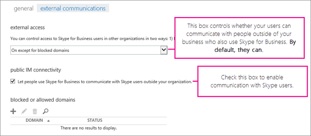

# Skype for Business ユーザーが Skype 連絡先を追加できるようにする

[] Skype for Business では、ユーザーは無料アプリの Skype を使用しているすべての人に対して検索したり、IM で連絡することもできます。この記事では、Skype の連絡先を追加するために必要なことを説明します。 
  
Office 365 でこれを行うには、[Office 365 の管理者ロールについて](https://support.office.com/en-us/article/da585eea-f576-4f55-a1e0-87090b6aaa9d?ui=en-US&rs=en-US&ad=US)が必要です。
  
1. Office 365 の管理者アカウントを使用してサインイン[https://portal.office.com/adminportal/home](https://portal.office.com/adminportal/home#/homepage)。
    
2. Office 365 管理センターで、[**管理センター**]  >  [**Skype for Business**] に移動します。 
    
    
  
3. [**Skype for Business 管理センター**] で、[**組織**]  >  [**外部通信**] を選びます。 
    
4. 既定では、自分の組織のユーザーは Skype for Business を使用する世界中の他のユーザーと通信することができます (お使いのファイアウォールが通信を許可するよう構成されていることが前提です)。 
    
    
  
    自分の組織のユーザーが Skype ユーザーとチャットするようにして、Skype for Business を使用する他のユーザーとはチャットしないようにする場合は、[ **許可したドメインに対してのみオンにする**] を選択します。Skype ユーザーとの連絡を有効にすると、skype.com はバックグラウンドで許可されたドメインとして自動的に追加されます。 
    
    Skype for Business を使用する世界中の他のすべての企業からの連絡を許可する場合は、[ **禁止したドメインを除いてオンにする**] を選び、[ **+**] を選んで該当するドメインを追加します。これらの特定のドメイン上のユーザーを除くすべてのユーザーが自分に連絡できるようになります。(企業によっては、訴訟中で他の企業と連絡を取ることがないようにする必要がある場合などに、このオプションを選択する可能性があります。)
    
5. [ **他のユーザーに Skype for Business の使用を許可して、組織外の Skype ユーザーと通信します**] を選びます。 
    
6.  Windows Firewall を使用している場合は、Skype for Business が必要なポートを自動的に開きます。
    
    組織でネットワーク上のコンピューターがインターネットに接続するのを制限するために別のソリューションを使用している場合は、お使いのクライアント コンピューターが Skype 接続と Skype ディレクトリ検索用のすべての [Office 365 URL および IP アドレス範囲](https://support.office.com/en-us/article/8548a211-3fe7-47cb-abb1-355ea5aa88a2) にアクセスできることを確認してください。これにより、ファイアウォールまたはプロキシのインフラストラクチャ構成の発信許可リストに、これらの IP アドレスと URL を追加する必要がある場合があります。
    
7. **テストのために最大 24 時間待機します** 。外部通信設定を変更したときはいつでも、変更がデータ　センター全体に行き渡るまでに最大 24 時間かかる場合があります。
    
8. Skype 連絡先を見つけて Skype for Business 連絡先の一覧に追加する方法をユーザーに示します。ユーザーに、「[Skype for Business で知り合いを検索する](https://support.office.com/en-us/article/b12500ef-e37f-4d22-aade-c11277e53f19)」を参照するよう指示します。
    
## テストとトラブルシューティング

セットアップをテストするには、会社のファイアウォールの背後にない Skype 上の連絡先が必要です。Gmail アカウント、Outlook.com アカウント、またはその他の種類の電子メール アカウントを使用して Skype にサインインできます。
  
1. 外部通信設定を変更した後、 **テストのために最大 24 時間待機** します。
    
2. Skype for Business からサイン アウトして、再びサイン インすると、Skype ディレクトリを検索するオプションが表示されます。 
    
    
  
3. Skype for Business で、Skype の連絡先を検索し、チャットのリクエストを送信します。 
    
    会社のポリシーのために送信できなかったというメッセージを受信する場合は、お使いの[Office 365 URL および IP アドレス範囲](https://support.office.com/en-us/article/8548a211-3fe7-47cb-abb1-355ea5aa88a2)をダブルチェックする必要があります。 
    
4. 問題がファイアウォールであるかどうかをテストするもう 1 つの方法は、お使いのファイアウォールの背後ではないコーヒー ショップなどの wifi の場所に移動して、Skype for Business を使用して Skype 連絡先にチャットするリクエストを送信します。 
    
  - **Skype 連絡先にリクエストを送信したのに、受信されていない場合** は、チャットするためのリクエストを自分宛てに送信してもらいます。Skype と Skype for Business との間の接続に問題がある場合は、これにより問題が解決する可能性が高いです。
    
  - メッセージがコーヒー ショップでは送られるのに職場では送られない場合は、ファイアウォールが問題であることが分かります。 
    
## できることとできないこと

- **Skype for BusinessMac 版** には Skype の連絡先を検索して通信相手とする機能がありません。
    
- Skype ユーザーを検索して見つけることはできますが、Skype for Business ユーザーの検索はできません。彼らと IM で連絡できるようにするには、連絡先追加のリクエストを彼らに送信し、彼らは Skype にサインインしてリクエストを承諾する必要があります。 
    
- Google や Facebook などの他の IM プロバイダーとの IM の接続を許可することはできません。Skype for Business を使用して携帯電話のテキスト メッセージを送信することはできません。

- Skype 連絡先を追加するときに、どの機能を使用できますか。
    
## Microsoft アカウント (旧称 Windows Live ID) でサインインした Skype 連絡先は、Skype for Business ユーザーと話すときに一部の機能を使用できますが、すべての機能を使用できるわけではありません。

Microsoft アカウント (旧称 Windows Live ID) でサインインした Skype 連絡先は、Skype for Business ユーザーと話すときに一部の機能を使用できますが、すべての機能を使用できるわけではありません。
  
|**Skype 連絡先との間では使用不可**|ビデオ会話|
|:-----|:-----|
| ユーザー間のインスタント メッセージング    プレゼンス    マルチパーティの IM での会話   | 3 人以上での音声会話やビデオ会話    デスクトップとプログラムの共有    デスクトップおよびプログラムの共有   |
   
[!INCLUDE [LinkedIn Learning Info](../../common/office/linkedin-learning-info.md)]
   
## See also

[ユーザーが外部の Skype for Business ユーザーに連絡できるようにする](allow-users-to-contact-external-skype-for-business-users.md)
  
[Skype for Business Online のセットアップ](set-up-skype-for-business-online.md)

  
 