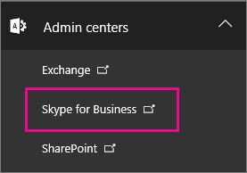
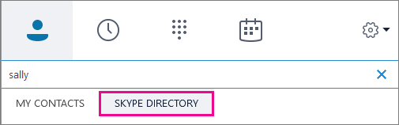

# Skype for Business ユーザーが Skype の連絡先を追加できるようにする

Skype for Business では、無料アプリの Skype を使用しているすべてのユーザーが、お客さまとの間で IM を検索して IM を行うことができます。 この記事では、Skype の連絡先を追加できるようにするために必要な操作について説明します。 
  
この操作を行うには、Microsoft 365 または Office 365 の[管理者権限](https://support.office.com/article/da585eea-f576-4f55-a1e0-87090b6aaa9d?ui=en-US&rs=en-US&ad=US)が必要です。

 **Skype for Business 管理センターの使用**
  
1. Microsoft 365 または Office 365 の管理者アカウントでサインイン[https://portal.office.com/adminportal/home](https://portal.office.com/adminportal/home#/homepage)します。
    
2. 管理センターで、[**管理センター** > ]**の [Skype for business**] に移動します。 
    
    
  
3. **Skype for Business 管理センター**で、[**組織**]  >  [**外部通信**] の順に選択します。 
    
4. 既定では、ユーザーは Skype for Business を使用する世界中の他のすべてのユーザーと通信できます (ファイアウォールがこれを許可するように構成されていることを前提としています)。 
    
    ![[Skype for Business を使用して Skype と通信できるようにする] を選択します。](../images/333789f8-2ea6-4bbd-805b-18130f427999.png)
  
    ユーザーが Skype ユーザーとチャットする必要があるが、Skype for Business を使用している他のユーザーとチャットしたくない場合は、[許可した**ドメインに対してのみオンに**する] を選びます。 Skype ユーザーとの連絡を有効にすると、skype.com は、バックグラウンドで許可されたドメインとして自動的に追加されます。 
    
    Skype for Business を使って世界中の他のすべての企業の連絡先を許可する場合は、[**禁止**したドメイン**+** を除いてオンにする] を選んで、これらのドメインを追加します。 これらの特定のドメインのユーザーを除き、すべてのユーザーがあなたに連絡できるようになります。 (場合によっては、このオプションを選択することがあります。たとえば、訴訟の際に、他の会社との連絡が不要であることを確認する必要があります)。
    
5. [**ユーザーが skype For business を使って組織外の skype ユーザーと通信できるように**します] を選びます。 
    
6.  Windows ファイアウォールを使用している場合、Skype for Business は必要なポートを自動的に開きます。
    
    組織で別のソリューションを使用して、ネットワーク上のコンピューターがインターネットに接続されないように制限する場合は、クライアントコンピューターが Skype 接続と Skype ディレクトリ検索のすべての[IP アドレスと url](https://support.office.com/article/8548a211-3fe7-47cb-abb1-355ea5aa88a2)にアクセスできることを確認します。 これには、ファイアウォールまたはプロキシインフラストラクチャ構成の送信許可リストへの追加が必要な場合があります。
    
7. **テストに最大24時間待機**します。 外部通信設定を変更すると、すべてのデータセンターに変更が反映されるまでに最大24時間かかることがあります。
    
8. Skype for Business の連絡先リストに Skype の連絡先を検索して追加する方法をユーザーに示します。 [Skype For business で連絡先を検索](https://support.office.com/article/b12500ef-e37f-4d22-aade-c11277e53f19)するようにユーザーに伝えます。
    
## テストとトラブルシューティング

セットアップをテストするには、会社のファイアウォールの背後にない Skype 上の連絡先が必要です。 Gmail アカウント、Outlook.com アカウント、またはその他の種類のメールアカウントを使用して、Skype にサインインできます。
  
1. 外部通信設定を変更したら、**最大24時間待機**してテストします。
    
2. Skype for Business からサインアウトしてから、もう一度サインインすると、Skype ディレクトリを検索するオプションが表示されます。 
    
    
  
3. Skype for Business で、Skype で連絡先を検索し、チャットのリクエストを送信します。 
    
    会社のポリシーのために送信できないというメッセージが表示された場合は、[ファイアウォールの設定](https://support.office.com/article/8548a211-3fe7-47cb-abb1-355ea5aa88a2)を再確認する必要があります。 
    
4. ファイアウォールで問題があるかどうかをテストするもう1つの方法は、喫茶店などのファイアウォールの背後にない wifi 上の場所に接続することです。 Skype for Business を使って、Skype の連絡先に要求を送信してチャットすることもできます。 
    
   - **Skype コンタクトにリクエストを送信し**たが、それを受信したことがない場合は、チャットのリクエストを送信してください。 問題が Skype と Skype for business の間の接続を確立していた場合は、この問題が解決されることがよくあります。
    
   - メッセージがコーヒーショップで処理されているのに、仕事中にいない場合は、ファイアウォールに問題があることがわかります。 
    
## できることとできないこと

- **Mac 版 skype For business**には、skype の連絡先を検索して通信する機能がありません。
    
- ディレクトリ検索が有効になっている場合は、Skype と Skype for business のユーザーを検索して見つけることができます。 何らかの理由でディレクトリを検索しても見つからない場合は、コンタクト要求を送信して、Skype にサインインして同意してもらうことができます。 
    
- Google や Facebook などの他の IM プロバイダーとの IM 接続を許可することはできません。 携帯電話のテキストメッセージの送信に Skype for Business を使用することはできません。

- Skype コンタクトと Skype for Business の連絡先との間で音声通話やビデオ通話を録音することはできません。
    
## Skype の連絡先を追加するときに使用できる機能は何ですか?

Microsoft アカウント (旧称 Windows Live ID) でサインインした skype 連絡先は、Skype for Business ユーザーと話すときに一部の機能を使用できますが、一部の機能は利用できません。
  
|**Skype の連絡先との間で利用可能**|**Skype の連絡先との間で利用できない機能**|
|:-----|:-----|
| ビデオ通話    個人間のインスタントメッセージング    プレゼンス   | マルチパーティの IM 会話    3人以上のユーザーとの音声およびビデオによる会話    デスクトップとプログラムの共有   |
   
[!INCLUDE [LinkedIn Learning Info](../../common/office/linkedin-learning-info.md)]
   
## 関連トピック

[外部の Skype for Business ユーザーに連絡できるようにする](allow-users-to-contact-external-skype-for-business-users.md)
  
[Skype for Business Online のセットアップ](set-up-skype-for-business-online.md)

  
 
