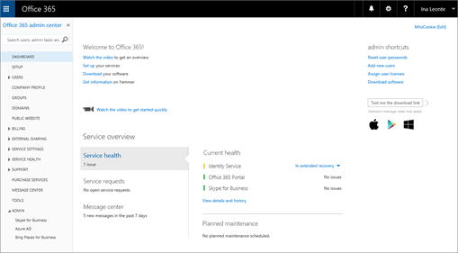

# ビジネス オンラインの Skype を設定します。
  
ビジネス用の Skype を設定するのには Office 365 のグローバル管理者の権限が必要です。 Web パーツへのアクセスを制限するファイアウォールまたはプロキシ サーバーがある場合は、ビジネス用の Skype を設定するには、[マイクロソフト パートナー](https://go.microsoft.com/fwlink/?linkid=391089)の採用を検討してください。
  
## Skype を設定します。

Office 365 サブスクリプションの場合、Skype の設定を支援する必要があるようですね。 セットアップを完了させるには、この資料の手順に従うことができます。
  
## 1. Skype のビジネスを計画します。

**[Office 365 のビジネス プレミアム](https://products.office.com/en-us/business/office-365-business-premium)**または**ビジネスの基礎**があれば、お客様のビジネス ユーザーは、サブスクリプションの他のユーザーにオンラインの呼び出しを行うビジネスの Skype を使用できます。 たとえば、10 人では、ことができます[IM やオンライン会議のためにビジネス用の Skype を使用](http://support.office.com/article/cc05afa6-1894-4a82-9dd9-6222061f50fd)する、および 2-6 以下の手順を実行した後、ビジネスの Skype を使用して[ビジネスの Skype での会議](https://support.office.com/article/2eed8424-581a-4497-b505-c08c152e5851)。 [Skype の Outlook で会議を設定](https://support.office.com/article/b8305620-d16e-4667-989d-4a977aad6556#bkmk_OWA)すると、オンライン会議は、すぎます!
  
ビジネス用の Skype を使用し、ビジネス ユーザーから*外部*の**呼び出し**を受信する場合はします。
  
- **オプション 1。無料の [Skype アプリ](https://www.skype.com/)** を使用します。 非常に小規模なビジネスでは、(1-2 のユーザーなど) がある場合は、Skype のアプリケーションを使用してが移動する場合に適してします。 国内通話と国際通話で利用する場合は、より安価な手段となります。 まだ会議通話を押しながら、ビデオ通話は、してプレゼンテーション用にデスクトップを共有できます。 [レートと支払オプションをチェック アウト](https://secure.skype.com/en/calling-rates?wt.mc_id=legacy&amp;expo365=bundled)します。
    
- **オプション 2 です。計画をアップグレードし、Office 365 の電話システムとの呼び出しのプランを購入する**です。 どれだけこのコストは、スイッチを確認、[ビジネス製品の管理のヘルプのサポートに問い合わせてください](https://support.office.com/article/32a17ca7-6fa0-4870-8a8d-e25ba4ccfd4b)するにはし、すべての処理をすることがあるを確認する最も簡単な方法です。
    
詳細については、[ビジネス向けの Office 365 のセットアップの計画](https://support.office.com/article/eb926624-018b-4486-bf11-5fba6ee4d645#bkmk_skype)を参照してください。
  
## 2. 記号で Office 365 に

ビジネス オンラインの Skype は、Office 365 のサービス群の一部です。 オンライン ビジネスでは、Skype を設定するには Office 365 にサインインする必要があります。 その方法を以下に示します。
  
1. Office 365 ユーザー ID ( *rob@fourthcoffee.com*など) を検索します。 ビジネス オンラインの Skype を購入したときに作成した Office 365 のユーザー ID を含む Microsoft Online Services チームから電子メールを受信しました。 メールは、これのようになります。
    
    
  
2. Office 365 の管理センターにサインインして、Office 365 のユーザー ID とパスワードを入力します。 サインイン後、Office 365 の管理ページが表示されます。
    
    
  
## 3. ドメインおよびユーザーを設定します。

Office 365 にサインインしていることビジネス オンラインの Skype を使用する、組織のドメインとユーザーを設定できます。
  
1. [ドメインの追加とユーザーが Office 365](https://support.office.com/article/6383f56d-3d09-4dcb-9b41-b5f5a5efd611): Office 365 のセットアップ ウィザードを使用して、Office 365 でカスタム ドメイン ( *fourthcoffee.com*) などを設定します。 **既定では、Office 365 のセットアップ ウィザードには、ビジネス オンラインの Skype を設定し、Skype をビジネス ユーザー Id の作成が含まれています。** 既に Office 365 のドメインを設定するウィザードを使用した場合は、この手順を完了しました。
    
2. [ドメインと DNS の接続を確認する](https://support.office.com/article/2b54e1b0-47a7-4018-a1e4-c2b924e7c5a0): ドメインと DNS の設定が正しいことを確認するのには、ツール ・ ドメインのトラブルシューティング ツールでを使用します。 ようになりましたこれで、将来の問題の原因として、DNS の設定を排除することができますので後で、セットアップの問題を把握するためにずっとを移動します。
    
3. [Office 365 の Url と IP アドレスの範囲](https://support.office.com/article/8548a211-3fe7-47cb-abb1-355ea5aa88a2#BKMK_LYO): ほとんどの小規模企業はこの手順を行う必要はありません。 **Web パーツへのアクセスを制限しているファイアウォールまたはプロキシ サーバーがある場合は**、オンライン ビジネスのエンドポイントに対して、Skype へのアクセスを許可する規則を作成してください。 これは、数々 のファイアウォールやプロキシ サーバーを構成する他のユーザーによって実行される最適な高度な手順です。 いない場合はこれまで、ビジネス用の Skype を設定するには、[マイクロソフト パートナー](https://go.microsoft.com/fwlink/?linkid=391089)の採用を検討してください。
    
## 4. IM およびプレゼンスを、組織内の場合に設定します。

インスタント メッセージング (IM) とプレゼンス ([ビジネス用の Skype で自分のプレゼンス情報へのアクセス制御](https://support.office.com/article/fea86e34-60cf-4dd0-bfb2-169a42afd92c)) は、ビジネスの Skype に含まれている、基本的な機能です。 既定では、自社内のユーザーは、互いに Skype や IM をできます。
  
1. **他のビジネス ユーザー向けに、Skype 通信できるメンバーを選択します。**
    
  - [ビジネス ユーザー向けの外部の Skype に連絡を許可します。](allow-users-to-contact-external-skype-for-business-users.md)両方*および*その他のビジネス システムを構成する必要があります。
    
    **重要**: rob@contosowest.com、ina@contosoeast.com など、お客様のビジネスに 2 つのドメインがある場合は、すべてのユーザーが相互に通信できるように、この手順を実行する必要があります。
    
  - お客様のビジネスの外の[ビジネス ユーザー向けの Skype は、Skype 連絡先を追加します。](let-skype-for-business-users-add-skype-contacts.md)
    
2. **を同僚がオンラインかどうかを確認を選択してください:**プレゼンス機能は、オンラインになっていると、利用可能時間は、使用可能な使用中、退席中、またはプレゼンテーションなどを示しています。
    
    
  
    お客様のビジネスでは、すべてのユーザーの既定の設定を選択できます。
    
  - 組織内のすべてのユーザーに、ユーザーのオンライン プレゼンスを自動的に表示します。
    
  - そのメンバーにのみ、ユーザーのオンライン プレゼンスを表示します。
    
手順については、[ビジネス オンラインの Skype のプレゼンスを構成する](configure-presence-in-skype-for-business-online.md)を参照してください。
  
## 5. ダウンロードし、ビジネスの Skype をインストール

ビジネス、PC、Mac、またはモバイル デバイス上の Skype を使用するにし、お客様のビジネスの他のユーザーは、ビジネス ダウンロード Skype をデバイスにインストールする必要があります。
  
- [ビジネス用の Skype のインストール](http://support.office.com/article/8a0d4da8-9d58-44f9-9759-5c8f340cb3fb): Office 365 ポータルからアプリケーションをダウンロードし、ファルダ、PC にインストールする方法について
    
- [ビジネス クライアントを Office 365 での Skype の展開](deploy-the-skype-for-business-client-in-office-365.md): 大規模な企業でアプリケーションを展開する手順について。
    
- [ビジネス用の Skype のインストール](https://support.office.com/article/8a0d4da8-9d58-44f9-9759-5c8f340cb3fb): ダウンロード、インストール、および Android デバイス、iOS デバイス、および Windows の電話でビジネス用の Skype にサインインします。
    
- [オンまたはオフ、携帯電話の通知](turn-on-or-off-mobile-phone-notifications.md): とお客様のビジネスがインスタント メッセージを受信および失敗したに関する警告を表示することができますモバイル デバイスにインストールされているビジネス用の Skype を使用すると、します。
    
## 6. すべてが動作しているかどうかを確認するテストします。

ほかのユーザーがお客様のビジネスができるかどうかを最初に、テスト[ビデオ: ビジネスの Skype との間で署名を](https://support.office.com/article/8abed4b3-ac48-493e-9d76-0e10140e9451)。 互いの存在を参照するくださいと、短時間のミーティングを実行するくださいと、その他の IM をすることができますを確認します。
  
問題でしょうか。 次の操作を実行します。
  
- [ビジネス用の Skype にサインインのヘルプが必要ですか?](https://support.office.com/article/448b8ea7-5b33-444a-afd4-175fc9930d05)一般的な記号に問題があります。
    
- [ビジネス製品 - 管理者ヘルプのサポートに問い合わせてください](https://support.office.com/article/32a17ca7-6fa0-4870-8a8d-e25ba4ccfd4b)。 私たちはここに役立つ!
    
## 使用可能なその他の機能を設定しますか。

多くの機能をセットアップする前にそれらのライセンスを持っていることを確認します。 [Skype for Business と Microsoft Teams のアドオン ライセンス](../skype-for-business-and-microsoft-teams-add-on-licensing/skype-for-business-and-microsoft-teams-add-on-licensing.md)
  
### 電話会議をセットアップする

組織内のユーザーは電話を使って会議に参加する必要が生じることがあります。 ビジネス用の Skype には、これだけの電話会議機能が含まれています! 参加者は、モバイル デバイスや PC で Skype for Business アプリを使用する代わりに、電話を使って Skype for Business 会議にコールインできます。
  
### 電話システムと Office 365 の通話プランを設定します。

Office 365 の電話システムの機能を使用すると、お客様のビジネス電話システムです。 ビジネスに携わる人々、組織内の他の Skype への呼び出しは、自由、および呼び出し元の内外から他の従業員がボイスメールを受け取ることができます。 電話システムで取得するにはここです。
  
計画を呼び出してサービスを追加すると、従業員は、ビジネスの Skype で基本の電話番号を取得します。 組織外からの電話呼び出しを受信できます。 VoIP 電話、Pc、およびモバイル デバイスの間で音声通話をようにします。 事態が発生した場合については 911 を呼び出すことができます。
  
ステップ バイ ステップのセットアップ手順については、表示を呼び出すことを計画します。
  
### Skype 会議のブロードキャストの設定します。

Skype の会議のブロードキャストは、ホストを作成して、最大 10000 個までの参加者との会議をブロードキャストできるようにする機能です。 **そのしくみの詳細についてを参照してください[Skype の会議のブロードキャストとは何ですか?](http://support.office.com/article/c472c76b-21f1-4e4b-ab58-329a6c33757d)**
  
Skype 会議のブロードキャストを設定する手順の概要を以下に示します。
  
1. [割り当てまたはビジネスのための Office 365 のライセンスを削除する](http://support.office.com/article/997596b5-4173-4627-b915-36abac6786dc): すべてのブロードキャストの会議**のホスト**にいる人に**Skype** 、または**エンタープライズ**のライセンスを割り当てます。
    
2. [Skype 会議のブロードキャストを有効にする](../set-up-your-network-for-skype-meeting-broadcast/enable-skype-meeting-broadcast.md): 既定では、この機能が有効になっています。 有効にした後ことをユーザーは、組織内の他のユーザーと会議をブロードキャストをホストすることになります。
    
3. [Skype 会議をブロードキャストするためにネットワークを設定します](../set-up-your-network-for-skype-meeting-broadcast/set-up-your-network-for-skype-meeting-broadcast.md): ウェビナーをホストし、他の放送参加者と別の組織をする場合、ネットワークを構成する必要があります。
    
4. [Skype 会議のブロードキャストのスケジュール](http://support.office.com/article/c3995bc9-4d32-4f75-a004-3bc5c477e553) [、Skype の会議のブロードキャストの結合](http://support.office.com/article/14689da0-821d-48d4-9035-ea762de80ebe)があると: 会議のブロードキャストを確認の作業で、Skype の会議のブロードキャストをスケジュールすることによって作成*https://portal.broadcast.skype.com*ミーティングに参加しようとする者が、必要とします。
    
## ネットワーク接続の要件についてください。

品質のオーディオ、ビデオ、およびアプリケーション共有のビジネス用の Skype では、エンド ・ ツー ・ エンドのネットワーク接続の品質が大幅に影響があります。 最適なエクスペリエンスでは、ことが会社のネットワークとオンライン ビジネスの Skype の高品質の接続があるかどうかを確認するのには重要です。 ネットワークとチューニングについては、[オンライン ビジネスのパフォーマンスのための Skype のチューニング](http://support.office.com/article/beec23c2-c5d6-4e84-a8af-e82aefca7802)を参照してください。
  
## すべて実行を設定しますか。 ビジネスの Skype を使用して作業の開始

[業務トレーニング用 Skype](http://support.office.com/article/8a3491a3-c095-4718-80cf-cbbe4afe4eba): 簡単に開始するためのトレーニング ・ トピックの一覧をチェック!
  
[Skype の電話会議のビジネスを開始します。](http://support.office.com/article/8dc8ac52-91ac-4db9-8672-11551fdaf997)
  
[ビジネス用の Skype でビデオ デバイス オプションを設定します。](http://support.office.com/article/d09017c0-deba-4f6c-a122-9eca6604f50c)
  
[ビジネスの Skype を使用してビデオ通話を受信し、](http://support.office.com/article/abf62493-670f-4b0d-b2cf-fe03b49caf42)
  
[!INCLUDE [LinkedIn Learning Info](../../common/office/linkedin-learning-info.md)]
   
## このモジュールは、64 ビットのコンピューターでのみサポートされ、Microsoft ダウンロード センターの「Skype for Business Online 用 Windows PowerShell モジュール」からダウンロードできます。

[Skype ビジネス サーバーとビジネス オンラインの Skype との間のハイブリッド接続を計画します。](https://go.microsoft.com/fwlink/p/?linkid=400791)
  
  
 
