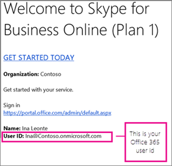

# Skype for Business Online をセットアップする

Skype for Business をセットアップするには、グローバル管理者の権限が必要です。 Web パーツへのアクセスを制限するファイアウォールまたはプロキシサーバーがある場合は、 [Microsoft パートナー](https://go.microsoft.com/fwlink/?linkid=391089)を採用して Skype for business をセットアップすることを検討してください。

## Skype のセットアップ

Microsoft 365 または Office 365 サブスクリプションでの Skype のセットアップに関するヘルプが必要なようです。 この記事の手順に従って、セットアップを完了することができます。

## 1. Skype for Business を計画する

**[Microsoft 365 Business Premium Standard](https://products.office.com/business/office-365-business-premium)** または**business Essentials**を使用している場合は、Skype for business を使用して、月額プランに参加している他のユーザーとのオンライン通話を行うことができます。 たとえば、ユーザーが10人いる組織では、以下の手順2-6 を実行した後に skype for business[を使用し](https://support.office.com/article/2eed8424-581a-4497-b505-c08c152e5851)て skype for business を使用して通話を[開始](https://support.office.com/article/cc05afa6-1894-4a82-9dd9-6222061f50fd)することができます。 また、 [Outlook で Skype For business 会議を設定](https://support.office.com/article/b8305620-d16e-4667-989d-4a977aad6556#bkmk_OWA)することもできます。

Skype for Business を使用して*社外*のユーザーとの**通話を発信**および受信するには、次の操作を行います。

- **オプション 1。無料の [Skype アプリ](https://www.skype.com/)** を使用します。 非常に小さなビジネス (1-2 ユーザーなど) を使用している場合は、Skype アプリを使う方が便利です。 国内通話と国際通話で利用する場合は、より安価な手段となります。 会議通話を保留したり、ビデオ通話を発信したり、デスクトップを共有してプレゼンテーションを行ったりすることができます。 [料金と支払オプションを確認](https://secure.skype.com/en/calling-rates?wt.mc_id=legacy&amp;expo365=bundled)してください。

- **オプション2。プランをアップグレードし、電話システムと、Office 365 の通話プランを購入**します。 このコストを確認してから、切り替えを行う最も簡単な方法は、[ビジネス製品のサポートにお問い合わせください。管理者向けヘルプ](https://support.office.com/article/32a17ca7-6fa0-4870-8a8d-e25ba4ccfd4b)。

詳細については、「一般[法人向け Office 365 のセットアップを計画](https://support.office.com/article/eb926624-018b-4486-bf11-5fba6ee4d645#bkmk_skype)する」を参照してください。

## 2. Office 365 にサインインする

Skype for Business Online は、Office 365 スイートのサービスの一部です。 Skype for Business Online をセットアップするには、Office 365 にサインインする必要があります。 その方法は次のとおりです。

1. Microsoft 365 または Office 365 のユーザー ID (たとえば、 <em>rob@fourthcoffee.com</em> ) を探します。 Skype for Business Online を購入したときに作成した Microsoft 365 または Office 365 のユーザー ID が含まれている Microsoft Online Services チームからメールを受信しました。 次のようなメッセージが表示されます。

    

2. [管理センター](https://admin.microsoft.com)にサインインし、Microsoft 365 または Office 365 のユーザー ID とパスワードを入力します。 

## 3. ドメインとユーザーをセットアップする

Office 365 にサインインしたら、ドメインと組織内のユーザーが Skype for Business Online を使用するようにセットアップすることができます。

1. [Office 365 にドメインとユーザーを追加](https://support.office.com/article/6383f56d-3d09-4dcb-9b41-b5f5a5efd611)する: office 365 セットアップウィザードを使用して、office 365 でカスタムドメイン ( *fourthcoffee.com*など) をセットアップします。 **既定では、Office 365 セットアップウィザードには、Skype for business Online のセットアップと Skype for Business のユーザー Id の作成が含まれています。** 既にウィザードを使用して Office 365 用にドメインをセットアップした場合は、この手順を完了します。

2. [ドメインと dns の接続を確認](https://support.office.com/article/2b54e1b0-47a7-4018-a1e4-c2b924e7c5a0)します。「ツール」「ドメインのトラブルシューティング-ドメインと dns の設定が正しいことを確認する」を参照してください。 これを行うと、今後の問題のソースとして DNS 設定を削除できるため、後でセットアップの問題を簡単に解決できるようになります。

3. [Office 365 の url と IP アドレスの範囲](https://support.office.com/article/8548a211-3fe7-47cb-abb1-355ea5aa88a2#BKMK_LYO): ほとんどの小規模企業は、この手順を実行する必要はありません。 **ただし、web の一部へのアクセスを制限するファイアウォールまたはプロキシサーバーがある場合**は、そのルールを作成して、Skype For business Online エンドポイントへのアクセスを許可する必要があります。 これは、ファイアウォールとプロキシサーバーの構成で経験したユーザーによって実行される高度な手順です。 この作業をまだ行っていない場合は、 [Microsoft パートナー](https://go.microsoft.com/fwlink/?linkid=391089)を雇用して Skype for business をセットアップすることを検討してください。

## 4. 組織で IM とプレゼンスを設定する

インスタントメッセージング (IM) とプレゼンス ([skype For business のプレゼンス情報へのアクセスの制御](https://support.office.com/article/fea86e34-60cf-4dd0-bfb2-169a42afd92c)) は、skype for business に組み込まれている基本的な機能です。 既定では、会社内のユーザーは互いに Skype と IM を使用できます。

1. **Skype for Business ユーザーが通信できるユーザーを次の中から選びます。**

   - [ユーザーが外部の Skype For business ユーザーに連絡できるように](allow-users-to-contact-external-skype-for-business-users.md)する自分*と*その両方のビジネスがシステムを構成する必要があります。

     **重要**: rob@contosowest.com や ina@contosoeast.com などの2つのドメインがある場合は、この手順を実行して、すべてのユーザーが相互に通信できるようにする必要があります。

   - [Skype For business ユーザーが社外の skype 連絡先を追加できる](let-skype-for-business-users-add-skype-contacts.md)ようにする

2. **同僚がオンラインであるかどうかを確認できるユーザーを選択します。** プレゼンス機能は、誰がオンライン状態かを表示し、連絡可能、取り込み中、退席中、プレゼンテーション中などの状態を示します。

    

    組織内のすべてのユーザーに対して既定の設定を選ぶことができます。

   - 組織内のすべてのユーザーにオンラインプレゼンスを自動的に表示する

   - 連絡先に対してのみ自分のオンラインプレゼンスを表示する

手順については、「 [Skype For Business Online でプレゼンスを設定する](configure-presence-in-skype-for-business-online.md)」を参照してください。

## 5. Skype for Business をダウンロードしてインストールする

Skype for Business を PC、Mac、またはモバイルデバイスで使用するには、組織内の自分または他のユーザーがまず、デバイスに Skype for Business ダウンロードをインストールする必要があります。

- [Skype For business をインストール](https://support.office.com/article/8a0d4da8-9d58-44f9-9759-5c8f340cb3fb)する: Microsoft 365 管理センターからアプリをダウンロードして、PC または Mac にインストールする方法については、こちらをご覧ください。

- [Office 365 で Skype For business クライアントを展開](deploy-the-skype-for-business-client-in-office-365.md)する: 大企業でアプリを展開するための手順。

- [Skype For business をインストール](https://support.office.com/article/8a0d4da8-9d58-44f9-9759-5c8f340cb3fb)する: Android デバイス、iOS デバイス、Windows Phone で Skype for business をダウンロードしてインストールし、サインインします。

- [携帯電話の通知をオンまたはオフ](turn-on-or-off-mobile-phone-notifications.md)にする: モバイルデバイスに Skype for business がインストールされている場合、組織内の他のユーザーが、受信または不在着信したインスタントメッセージに関する通知を受け取ることができます。

## 6. すべての機能が動作していることをテストして確認する

まず、自分とビジネス上の他のユーザーがビデオを利用できるかどうかをテストし[ます。 Skype For business のサインインとサインアウト](https://support.office.com/article/8abed4b3-ac48-493e-9d76-0e10140e9451)。 お互いに IM を送信して、お互いのプレゼンスを確認して、簡単に会議を試すことができることを確認します。

問題? 以下の操作を行います。

- [Skype For business のサインインでヘルプが必要ですか?](https://support.office.com/article/448b8ea7-5b33-444a-afd4-175fc9930d05)サインインに関する一般的な問題の場合。

- [ビジネス製品のサポートについては、「管理者向けヘルプ」を参照してください](https://support.office.com/article/32a17ca7-6fa0-4870-8a8d-e25ba4ccfd4b)。 ここでは、ご意見をお待ちしています。

## 他の機能をセットアップしますか?

その他の機能を設定する前に、ライセンスがあることを確認してください。 [Skype for Business と Microsoft Teams のアドオン ライセンス](../skype-for-business-and-microsoft-teams-add-on-licensing/skype-for-business-and-microsoft-teams-add-on-licensing.md)

### 電話会議をセットアップする

組織内のユーザーは電話を使って会議に参加する必要が生じることがあります。 Skype for Business には、このような状況での電話会議機能が含まれています。 参加者は、モバイル デバイスや PC で Skype for Business アプリを使用する代わりに、電話を使って Skype for Business 会議にコールインできます。

### Office 365 で電話システムと通話プランをセットアップする

Office 365 の電話システム機能により、ビジネス用の電話システムが提供されます。 組織内の他の Skype for Business ユーザーへの通話は無料であり、従業員はお互いの発信者や外部からのボイスメールを受信することができます。 電話システムで利用できる機能は次のとおりです。

通話プランサービスを追加すると、従業員は Skype for Business で主要な電話番号を取得できます。 組織外での通話の発信と受信を行うことができます。 VoIP 電話、Pc、モバイルデバイスを介して音声通話を発信できます。 緊急事態が発生した場合は、911に連絡してサポートを受けてください。

詳細な手順については、「通話プランのセットアップ」をご覧ください。

### Skype 会議ブロードキャストをセットアップする

Skype 会議ブロードキャストは、最大1万人の出席者との会議を作成、主催、ブロードキャストできる機能です。 **機能の詳細については、「 [Skype 会議ブロードキャストとは](https://support.office.com/article/c472c76b-21f1-4e4b-ab58-329a6c33757d)」を参照してください。**

次に、Skype 会議ブロードキャストをセットアップする手順の概要を示します。

1. 一般[法人向け Office 365 のライセンスの割り当てまたは削除](https://support.office.com/article/997596b5-4173-4627-b915-36abac6786dc): ブロードキャスト会議を**開催**するすべてのユーザーに、 **Skype For Business Online**または**Enterprise プラン**のライセンスを割り当てます。

2. [Skype 会議ブロードキャストを有効にする](../set-up-your-network-for-skype-meeting-broadcast/enable-skype-meeting-broadcast.md): 既定では、この機能は有効ではありません。 有効にすると、ユーザーは、組織内の他のユーザーとブロードキャスト会議をホストできるようになります。

3. [Skype 会議ブロードキャスト用にネットワーク](../set-up-your-network-for-skype-meeting-broadcast/set-up-your-network-for-skype-meeting-broadcast.md)をセットアップする: 組織外の出席者とウェビナーやその他のブロードキャストをホストする場合は、ネットワークを構成する必要があります。

4. Skype[会議ブロードキャストをスケジュール](https://support.office.com/article/c3995bc9-4d32-4f75-a004-3bc5c477e553)して、 [skype 会議ブロードキャストに参加](https://support.office.com/article/14689da0-821d-48d4-9035-ea762de80ebe)します。ブロードキャスト会議が有効になっていることを*https://portal.broadcast.skype.com*確認するには、skype 会議ブロードキャストをスケジュールして、他のユーザーに会議への参加を試みます。

## ネットワーク接続要件について

Skype for Business の音声、ビデオ、およびアプリケーション共有の品質は、エンドツーエンドのネットワーク接続の品質に大きく影響されます。 最適なエクスペリエンスを実現するには、会社のネットワークと Skype for Business Online の間に高品質の接続があることを確認することが重要です。 ネットワークとチューニングに関する情報については、「 [Skype For Business Online のパフォーマンスのチューニング](https://support.office.com/article/beec23c2-c5d6-4e84-a8af-e82aefca7802)」を参照してください。

## すべての設定が完了しましたか? Skype for Business の使用を開始する

[Skype For business のトレーニング](https://support.office.com/article/8a3491a3-c095-4718-80cf-cbbe4afe4eba): このトレーニングトピックの一覧を確認して、すぐに使い始めることができます。

[Skype for Business 電話会議を開始する](https://support.office.com/article/8dc8ac52-91ac-4db9-8672-11551fdaf997)

[Skype for Business のビデオデバイスオプションを設定する](https://support.office.com/article/d09017c0-deba-4f6c-a122-9eca6604f50c)

[Skype for Business を使ってビデオ通話の発信と受信を行う](https://support.office.com/article/abf62493-670f-4b0d-b2cf-fe03b49caf42)

[!INCLUDE [LinkedIn Learning Info](../../common/office/linkedin-learning-info.md)]

## 関連トピック

[Skype for Business Server と Skype for Business Online 間のハイブリッド接続を計画する](https://go.microsoft.com/fwlink/p/?linkid=400791)

