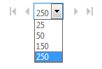

# Skype ビジネス オンライン管理センターのユーザーの制限事項をページします。

パフォーマンス上の理由は、**ビジネス管理センターの Skype**は、[ユーザー] ボックスの一覧で最初の 1,000 ユーザーを表示します。 1,000 人以上のユーザーがある場合は、**フィルター**を使用します。と**検索**を探している特定の人を検索します。
  
## 一括編集

1. 最初の 1,000 ユーザーを選択、または、フィルターや検索によって返されるすべてのユーザー-リストの上部にある**表示名**の横のボックスをチェックしています。
    
2. [**編集**] をクリックして。
    
一覧の下部にあるコントロールには、各ページに表示されているユーザーの数を変更できます。
  

  
## 関連トピック
[Skype for Business Online のセットアップ](set-up-skype-for-business-online.md)

[Skype for Business ユーザーが Skype 連絡先を追加できるようにする](let-skype-for-business-users-add-skype-contacts.md)
