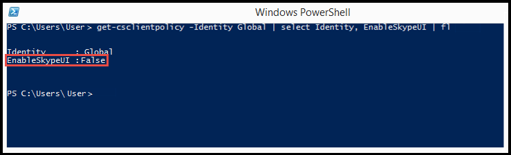
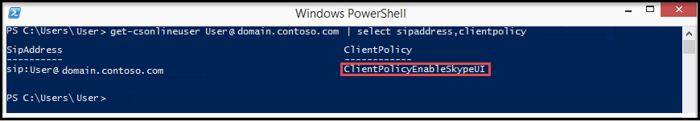
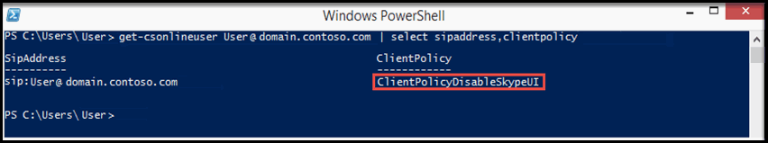

# <a name="switching-between-the-skype-for-business-and-the-lync-client-user-interfaces"></a><span data-ttu-id="75cbe-103">Skype for Business と Lync クライアントのユーザー インターフェイスを切り替える</span><span class="sxs-lookup"><span data-stu-id="75cbe-103">Switching between the Skype for Business and the Lync client user interfaces</span></span>

<span data-ttu-id="75cbe-104">Skype for Business Online 組織の場合、Microsoft 365 または Office 365 のリモート PowerShell を使用して、Skype for Business ユーザーが Skype for Business クライアントまたは Skype for Business (Lync) クライアントのユーザー インターフェイスを使用できます。</span><span class="sxs-lookup"><span data-stu-id="75cbe-104">For Skype for Business Online organizations, you can use the Remote PowerShell in Microsoft 365 or Office 365 to enable your Skype for Business users to use the Skype for Business client or the Skype for Business (Lync) client user interface.</span></span> <span data-ttu-id="75cbe-105">既定では、Skype for Business クライアントのユーザー インターフェイスを使用するように設定されています。</span><span class="sxs-lookup"><span data-stu-id="75cbe-105">The default setting is for users to use the Skype for Business client user interface.</span></span> <span data-ttu-id="75cbe-106">Lync クライアント エクスペリエンスを使用する場合は、このトピックの後半の手順に従って、最初の起動クライアントの動作を管理して Lync ユーザー インターフェイスを表示できます。</span><span class="sxs-lookup"><span data-stu-id="75cbe-106">If you'd prefer to use the Lync client experience, you can manage the first launch client behavior to display the Lync user interface by following the steps later in this topic.</span></span>
  
> [!NOTE]
> <span data-ttu-id="75cbe-p102">Lync 2013 クライアント エクスペリエンスは、Skype for Business 2016 クライアント バージョンのオプションではありません。 Lync 2013 クライアントを使用するようにクライアント環境を構成する前に、クライアント バージョンを調べて、バージョンの先頭が 16 ではない (16.x.x.x などではない) ことを確認してください。</span><span class="sxs-lookup"><span data-stu-id="75cbe-p102">The Lync 2013 client experience isn't an option for Skype for Business 2016 client versions. Before you attempt to configure your client environment to use the Lync 2013 client, please check the client version to ensure it does not start with the number 16; for example: 16.x.x.x.</span></span> 
  
> [!TIP]
> <span data-ttu-id="75cbe-109">ユーザー インターフェイスを簡単に切り替えて、手動の手順を実行したくない場合は [、PowerShell](https://go.microsoft.com/fwlink/?LinkId=532431) スクリプトの Microsoft ダウンロード センターを参照して、簡単に操作を行うことができます。</span><span class="sxs-lookup"><span data-stu-id="75cbe-109">If you want to easily switch the user interface and don't want to do the manual steps, see the [Microsoft Download Center](https://go.microsoft.com/fwlink/?LinkId=532431) for a PowerShell script to make it easier.</span></span>
  
## <a name="switching-the-skype-for-business-user-interface-for-users"></a><span data-ttu-id="75cbe-110">ユーザー向けに Skype for Business のユーザー インターフェイスを切り替える</span><span class="sxs-lookup"><span data-stu-id="75cbe-110">Switching the Skype for Business user interface for users</span></span>

<span data-ttu-id="75cbe-p103">Skype for Business Online 用 Windows PowerShell モジュールでは、Skype for Business Online に接続するリモート Windows PowerShell セッションを作成できます。 このモジュールは、64 ビットのコンピューターでのみサポートされ、Microsoft ダウンロード センターの「[Skype for Business Online 用 Windows PowerShell モジュール](https://go.microsoft.com/fwlink/?LinkId=294688)」からダウンロードできます。 その他の情報については、「[Skype for Business Online 管理用のコンピューターの構成](../set-up-your-computer-for-windows-powershell/set-up-your-computer-for-windows-powershell.md)」を参照してください。</span><span class="sxs-lookup"><span data-stu-id="75cbe-p103">The Windows PowerShell module for Skype for Business Online enables you to create a remote Windows PowerShell session that connects to Skype for Business Online. This module, which is supported only on 64-bit computers can be downloaded from the Microsoft Download Center at [Windows PowerShell Module for Skype for Business Online](https://go.microsoft.com/fwlink/?LinkId=294688). For other information, see [Configuring your computer for Skype for Business Online management](../set-up-your-computer-for-windows-powershell/set-up-your-computer-for-windows-powershell.md).</span></span>
  
> [!IMPORTANT]
> <span data-ttu-id="75cbe-p104">ユーザー インターフェイスの切り替えに関する _Global_ ポリシー設定は、カスタム ポリシーが既に設定されているユーザーには適用されません。 ユーザー インターフェイスを変更できるようにするには、カスタム ポリシーが適用されているユーザーそれぞれについて、次のコマンドを実行する必要があります。</span><span class="sxs-lookup"><span data-stu-id="75cbe-p104">The  _Global_ policy setting for switching the user interface won't be applied to a user that already has a custom policy applied. To be able to change the user interface, you will need to run the following for each user that has a custom policy applied:</span></span>
  
```PowerShell
Grant-CsClientPolicy -PolicyName ClientPolicyEnableSkypeUI -Identity <username>
```

> [!CAUTION]
> <span data-ttu-id="75cbe-116">_ClientPolicyEnableSkypeUI_ ポリシーによって、ユーザーに設定されている既存のカスタム ポリシーは置き換えられます。</span><span class="sxs-lookup"><span data-stu-id="75cbe-116">The  _ClientPolicyEnableSkypeUI_ policy will replace the existing custom policy setting for the user.</span></span>
  
<span data-ttu-id="75cbe-117">組織内のすべてのユーザーが Skype for Business クライアントを使用できるようにするには、リモート PowerShell を開いて、次のように入力します。</span><span class="sxs-lookup"><span data-stu-id="75cbe-117">To enable all of the users in your organization to use the Skype for Business client, open the Remote PowerShell and type the following:</span></span>
  
```PowerShell
Grant-CsClientPolicy -PolicyName ClientPolicyEnableSkypeUI
```

<span data-ttu-id="75cbe-118">ポリシーを正しく設定すると、次のように表示されます。</span><span class="sxs-lookup"><span data-stu-id="75cbe-118">If you set the policy right, you will see:</span></span>
  

  
<span data-ttu-id="75cbe-120">組織内のすべてのユーザーが Skype for Business (Lync) クライアントを使用できるようにするには、リモート PowerShell を開いて、次のように入力します。</span><span class="sxs-lookup"><span data-stu-id="75cbe-120">To enable all of the users in your organization to use the Skype for Business (Lync) client, open the Remote PowerShell and type the following:</span></span> 
  
```PowerShell
Grant-CsClientPolicy -PolicyName ClientPolicyDisableSkypeUI
```

<span data-ttu-id="75cbe-121">ポリシーを正しく設定すると、次のように表示されます。</span><span class="sxs-lookup"><span data-stu-id="75cbe-121">If you set the policy right, you will see:</span></span>
  

  
<span data-ttu-id="75cbe-123">組織内の 1 人のユーザーが Skype for Business クライアントを使用できるようにするには、リモート PowerShell を開いて、次のように入力します。</span><span class="sxs-lookup"><span data-stu-id="75cbe-123">To allow a single user in your organization to use the Skype for Business client, open the Remote PowerShell and type the following:</span></span>
  
```PowerShell
Grant-CsClientPolicy -PolicyName ClientPolicyEnableSkypeUI -Identity <username>
```

<span data-ttu-id="75cbe-124">ポリシーを正しく設定すると、次のように表示されます。</span><span class="sxs-lookup"><span data-stu-id="75cbe-124">If you set the policy right, you will see:</span></span>
  

  
<span data-ttu-id="75cbe-126">組織内の 1 人のユーザーが Skype for Business (Lync) クライアントを使用できるようにするには、リモート PowerShell を開いて、次のように入力します。</span><span class="sxs-lookup"><span data-stu-id="75cbe-126">To allow a single user in your organization to use the Skype for Business (Lync) client, open the Remote PowerShell and type the following:</span></span>
  
```PowerShell
Grant-CsClientPolicy -PolicyName ClientPolicyDisableSkypeUI -Identity <username>
```

<span data-ttu-id="75cbe-127">ポリシーを正しく設定すると、次のように表示されます。</span><span class="sxs-lookup"><span data-stu-id="75cbe-127">If you set the policy right, you will see:</span></span>
  

  
<span data-ttu-id="75cbe-129">組織内の複数のユーザーが Skype for Business クライアントを使用できるようにするには、リモート PowerShell を開いて、次のように入力します。</span><span class="sxs-lookup"><span data-stu-id="75cbe-129">To allow multiple users in your organization to use the Skype for Business client, open the Remote PowerShell and type the following:</span></span>
  

```PowerShell
$users = @("sip:bob@contoso.com","sip:fred@contoso.com") 

$users | Grant-CsClientPolicy -PolicyName ClientPolicyEnableSkypeUI
```

<span data-ttu-id="75cbe-130">組織内の複数のユーザーが Skype for Business (Lync) クライアントを使用できるようにするには、リモート PowerShell を開いて、次のように入力します。</span><span class="sxs-lookup"><span data-stu-id="75cbe-130">To allow multiple users in your organization to use the Skype for Business (Lync) client, open the Remote PowerShell and type the following:</span></span>
  
```PowerShell
$users = @("sip:bob@contoso.com","sip:fred@contoso.com")

$users | Grant-CsClientPolicy -PolicyName ClientPolicyDisableSkypeUI
```

<span data-ttu-id="75cbe-131">組織内のユーザー グループが Skype for Business クライアントを使用できるようにするには、リモート PowerShell を開いて、次のように入力します。</span><span class="sxs-lookup"><span data-stu-id="75cbe-131">To allow a group of users in your organization to use the Skype for Business client, open the Remote PowerShell and type the following:</span></span>
  
```PowerShell
Get-CsOnlineUser -Filter {Department -eq "Sales"} | Grant-CsClientPolicy -PolicyName ClientPolicyEnableSkypeUI
```

<span data-ttu-id="75cbe-132">組織内のユーザー グループが Skype for Business (Lync) クライアントを使用できるようにするには、リモート PowerShell を開いて、次のように入力します。</span><span class="sxs-lookup"><span data-stu-id="75cbe-132">To allow a group of users in your organization to use the Skype for Business (Lync) client, open the Remote PowerShell and type the following:</span></span>
  
```PowerShell
Get-CsOnlineUser -Filter {Department -eq "Sales"} | Grant-CsClientPolicy -PolicyName ClientPolicyDisableSkypeUI
```

> [!NOTE]
>  <span data-ttu-id="75cbe-p105">ユーザーの名前は、ポリシーを割り当てるユーザーのアカウント名です。 ユーザーのアカウント名は、次のいずれかの形式で入力できます。>  ユーザーの SIP アドレス>  ユーザーのユーザー プリンシパル名 (UPN)>  ユーザーのドメイン\\ユーザー名>  ユーザーの Active Directory 表示名</span><span class="sxs-lookup"><span data-stu-id="75cbe-p105">The user's name is the name of the user's account that the policy should be assigned to. The user's account name can be entered in one of the following formats:>  SIP address of the user>  User Principal name (UPN) of the user>  Domain\\username of the user>  Active Directory display name of the user</span></span>
  
[<span data-ttu-id="75cbe-135">Windows PowerShell による Lync Online の管理</span><span class="sxs-lookup"><span data-stu-id="75cbe-135">Using Windows PowerShell to manage Lync Online</span></span>](../set-up-your-computer-for-windows-powershell/set-up-your-computer-for-windows-powershell.md)
  
## <a name="skype-for-business-online-policy-settings"></a><span data-ttu-id="75cbe-136">Skype for Business Online のポリシー設定</span><span class="sxs-lookup"><span data-stu-id="75cbe-136">Skype for Business Online policy settings</span></span>

<span data-ttu-id="75cbe-137">次の表は、ポリシーが最初にユーザーに適用されたときのユーザー エクスペリエンスを示しています。</span><span class="sxs-lookup"><span data-stu-id="75cbe-137">This table shows the user experience when the policy is first applied to users:</span></span>
  
|<span data-ttu-id="75cbe-138">**管理ポリシー設定**</span><span class="sxs-lookup"><span data-stu-id="75cbe-138">**Admin policy setting**</span></span>|<span data-ttu-id="75cbe-139">**表示されるユーザー インターフェイス**</span><span class="sxs-lookup"><span data-stu-id="75cbe-139">**User interface displayed**</span></span>|
|:-----|:-----|
|<span data-ttu-id="75cbe-140">ポリシーが設定されていない場合</span><span class="sxs-lookup"><span data-stu-id="75cbe-140">The policy isn't set.</span></span> |<span data-ttu-id="75cbe-141">ユーザーは、引き続き Skype for Business クライアントのユーザー インターフェイスを使うことになります。</span><span class="sxs-lookup"><span data-stu-id="75cbe-141">The user will continue using the Skype for Business client user interface.</span></span>|
|`Grant-CsClientPolicy -PolicyName ClientPolicyEnableSkypeUI`<br/>|<span data-ttu-id="75cbe-142">ユーザーは、引き続き Skype for Business クライアントのユーザー インターフェイスを使うことになります。</span><span class="sxs-lookup"><span data-stu-id="75cbe-142">The user will continue using the Skype for Business client user interface.</span></span>|
|`Grant-CsClientPolicy -PolicyName ClientPolicyDisableSkypeUI`<br/>|<span data-ttu-id="75cbe-143">ユーザーは Skype for Business (Lync) クライアントのユーザー インターフェイスに切り替える必要があります。</span><span class="sxs-lookup"><span data-stu-id="75cbe-143">The user will be asked to switch to the Skype for Business (Lync) client user interface.</span></span> <span data-ttu-id="75cbe-144">後で切り替えることもできます。</span><span class="sxs-lookup"><span data-stu-id="75cbe-144">They can switch later.</span></span>|
|`Grant-CsClientPolicy -PolicyName ClientPolicyEnableSkypeUI -Identity <username>`|<span data-ttu-id="75cbe-145">ユーザーは Skype for Business クライアントのユーザー インターフェイスを使用します。</span><span class="sxs-lookup"><span data-stu-id="75cbe-145">The user will be using the Skype for Business client user interface.</span></span> |
`Grant-CsClientPolicy-PolicyName ClientPolicyDisableSkypeUI -Identity <username>`|<span data-ttu-id="75cbe-146">ユーザーは Skype for Business (Lync) クライアントのユーザー インターフェイスに切り替える必要があります。</span><span class="sxs-lookup"><span data-stu-id="75cbe-146">The user will be asked to switch to the Skype for Business (Lync) client user interface.</span></span> <span data-ttu-id="75cbe-147">管理者は、Skype for Business クライアントのユーザー インターフェイスに切り替える設定を、後で変更することができます。</span><span class="sxs-lookup"><span data-stu-id="75cbe-147">An admin can change the setting in the future that will switch them to the Skype for Business client user interface.</span></span> |
   
<span data-ttu-id="75cbe-148">次の表は、ポリシーが変更されたときのユーザー エクスペリエンスを示しています。</span><span class="sxs-lookup"><span data-stu-id="75cbe-148">This table shows the user experience when the policy is changed:</span></span>
  
|<span data-ttu-id="75cbe-149">**管理ポリシー設定**</span><span class="sxs-lookup"><span data-stu-id="75cbe-149">**Admin policy setting**</span></span>|<span data-ttu-id="75cbe-150">**Skype for Business (Lync) のユーザー インターフェイス**</span><span class="sxs-lookup"><span data-stu-id="75cbe-150">**Skype for Business (Lync) user interface**</span></span>|<span data-ttu-id="75cbe-151">**Skype for Business のユーザー インターフェイス**</span><span class="sxs-lookup"><span data-stu-id="75cbe-151">**Skype for Business user interface**</span></span>|
|:-----|:-----|:-----|
|`Grant-CsClientPolicy -PolicyName ClientPolicyEnableSkypeUI`|<span data-ttu-id="75cbe-152">ユーザーは Skype for Business クライアントのユーザー インターフェイスに切り替える必要があります。</span><span class="sxs-lookup"><span data-stu-id="75cbe-152">The user will be asked to switch to the Skype for Business client user interface.</span></span>  <br/> |<span data-ttu-id="75cbe-153">ユーザーは引き続き Skype for Business クライアントのユーザー インターフェイスを使用します。</span><span class="sxs-lookup"><span data-stu-id="75cbe-153">The user will continue to use the Skype for Business client user interface.</span></span>  <br/> |
|`Grant-CsClientPolicy -PolicyName ClientPolicyDisableSkypeUI`|<span data-ttu-id="75cbe-154">ユーザーは引き続き Skype for Business (Lync) インターフェイスを使用します。</span><span class="sxs-lookup"><span data-stu-id="75cbe-154">The user will continue to use the Skype for Business (Lync) interface.</span></span>  <br/> |<span data-ttu-id="75cbe-155">ユーザーは Skype for Business (Lync) クライアントのユーザー インターフェイスに切り替える必要があります。</span><span class="sxs-lookup"><span data-stu-id="75cbe-155">The user will be asked to switch to the Skype for Business (Lync) client user interface.</span></span>  <br/> |
|<span data-ttu-id="75cbe-156">ポリシーが設定されていない場合</span><span class="sxs-lookup"><span data-stu-id="75cbe-156">The policy isn't set.</span></span>  <br/> |<span data-ttu-id="75cbe-157">ポリシーが設定されていない場合、ユーザーには Skype for Business (Lync) クライアントのユーザー インターフェイスは表示されません。</span><span class="sxs-lookup"><span data-stu-id="75cbe-157">Users will never see the Skype for Business (Lync) client user interface if the policy is not set.</span></span> <span data-ttu-id="75cbe-158">ユーザーは、常に Skype for Business クライアントのユーザー インターフェイスを使うことになります。</span><span class="sxs-lookup"><span data-stu-id="75cbe-158">They will always use the Skype for Business client user interface.</span></span>  <br/> |<span data-ttu-id="75cbe-159">ユーザーは引き続き Skype for Business クライアントのユーザー インターフェイスを使用します。</span><span class="sxs-lookup"><span data-stu-id="75cbe-159">The user will continue to use the Skype for Business client user interface.</span></span>  <br/> |
   
<span data-ttu-id="75cbe-p109">次の表は、利用できるすべての Online カスタム ポリシーを示しています。 これには、管理者が古いカスタム ポリシーを保持しながら、EnableSkypeUI フラグを切り替えられるように、柔軟性を考慮して作成された新しいポリシーが含まれています。 上のコマンドレットを使って、下のポリシーの 1 つをユーザーに付与してください。</span><span class="sxs-lookup"><span data-stu-id="75cbe-p109">This table shows all the Online custom policies available. There are new policies created to give admins flexibility in retaining the old custom policy while switching between the EnableSkypeUI flags. Please use the cmdlets from above to grant one of the below policies to your users.</span></span>
  
|<span data-ttu-id="75cbe-163">**ポリシー名**</span><span class="sxs-lookup"><span data-stu-id="75cbe-163">**Policy name**</span></span>|<span data-ttu-id="75cbe-164">**EnableSkypeUI**</span><span class="sxs-lookup"><span data-stu-id="75cbe-164">**EnableSkypeUI**</span></span>|
|:-----|:-----|
`ClientPolicyDefaultPhoto`||
`ClientPolicyDefaultPhotoDisableSkypeUI` |<span data-ttu-id="75cbe-165">False</span><span class="sxs-lookup"><span data-stu-id="75cbe-165">False</span></span>|
`ClientPolicyNoIMURL`||
`ClientPolicyNoIMURLDisableSkypeUI` |<span data-ttu-id="75cbe-166">False</span><span class="sxs-lookup"><span data-stu-id="75cbe-166">False</span></span>|
`ClientPolicyNoIMURLPhoto`||
`ClientPolicyNoIMURLPhotoDisableSkypeUI` |<span data-ttu-id="75cbe-167">False</span><span class="sxs-lookup"><span data-stu-id="75cbe-167">False</span></span>|
`ClientPolicyNoSaveIMNoArchivingI`||
`ClientPolicyNoSaveIMNoArchivingDisableSkypeUI` |<span data-ttu-id="75cbe-168">False</span><span class="sxs-lookup"><span data-stu-id="75cbe-168">False</span></span>|
`ClientPolicyNoSaveIMNoArchivingNoIMURL`||
`ClientPolicyNoSaveIMNoArchivingNoIMURLDisableSkypeUI` |<span data-ttu-id="75cbe-169">False</span><span class="sxs-lookup"><span data-stu-id="75cbe-169">False</span></span>|
`ClientPolicyNoSaveIMNoArchivingNoIMURLPhoto` ||
`ClientPolicyNoSaveIMNoArchivingNoIMURLPhotoDisableSkypeUI`|<span data-ttu-id="75cbe-170">False</span><span class="sxs-lookup"><span data-stu-id="75cbe-170">False</span></span>|
`ClientPolicyNoSaveIMNoArchivingPhoto`||
`ClientPolicyNoSaveIMNoArchivingPhotoDisableSkypeUI` |<span data-ttu-id="75cbe-171">False</span><span class="sxs-lookup"><span data-stu-id="75cbe-171">False</span></span>|

   
<span data-ttu-id="75cbe-172">Windows PowerShell の使用を開始するには、次のトピックを参照してください。</span><span class="sxs-lookup"><span data-stu-id="75cbe-172">To get started with Windows PowerShell, see these topics:</span></span>
  
- [<span data-ttu-id="75cbe-173">Microsoft 365 または Office 365 PowerShell を使用する必要がある理由</span><span class="sxs-lookup"><span data-stu-id="75cbe-173">Why you need to use Microsoft 365 or Office 365 PowerShell</span></span>](/microsoft-365/enterprise/why-you-need-to-use-microsoft-365-powershell)
    
- <span data-ttu-id="75cbe-174">[Microsoft 365 または Office 365 を管理するための最適Windows PowerShell](/previous-versions//dn568025(v=technet.10))</span><span class="sxs-lookup"><span data-stu-id="75cbe-174">[Best ways to manage Microsoft 365 or Office 365 with Windows PowerShell](/previous-versions//dn568025(v=technet.10))</span></span>
    
## <a name="first-launch-client-behaviors"></a><span data-ttu-id="75cbe-175">最初の起動クライアントの動作</span><span class="sxs-lookup"><span data-stu-id="75cbe-175">First launch client behaviors</span></span>

<span data-ttu-id="75cbe-176">既定では、ユーザーが初めて Skype for Business を起動すると、前述のようにクライアント ポリシーを Lync クライアント エクスペリエンス () に設定して Lync クライアント エクスペリエンスを選択した場合でも、常に Skype for Business ユーザー インターフェイスが表示されます。 `Grant-CsClientPolicy -PolicyName ClientPolicyDisableSkypeUI`</span><span class="sxs-lookup"><span data-stu-id="75cbe-176">By default, when users launch Skype for Business for the first time, they will always see the Skype for Business user interface--even if you have selected the Lync client experience by setting the client policy to the Lync client experience (`Grant-CsClientPolicy -PolicyName ClientPolicyDisableSkypeUI`) as described previously.</span></span> <span data-ttu-id="75cbe-177">起動から数分後に、Lync モードに切り替えるかどうかを確認するメッセージが表示されます。</span><span class="sxs-lookup"><span data-stu-id="75cbe-177">After several minutes, users will then be asked to switch to Lync mode.</span></span>
  
<span data-ttu-id="75cbe-178">ユーザーが初めて Skype for Business クライアントを起動したときに、Lync ユーザー インターフェイスを表示したい場合は、クライアントを更新後に初めて開始する前に、以下の手順を行います。</span><span class="sxs-lookup"><span data-stu-id="75cbe-178">If you want to display the Lync user interface when users launch the Skype for Business client for the first time, follow these steps before the client is started for the first time after being updated:</span></span>
  
1. <span data-ttu-id="75cbe-179">このトピックの最初に説明している手順に従って、クライアント ポリシーで Skype for Business ユーザー インターフェイスが無効に設定されていることを確認します。</span><span class="sxs-lookup"><span data-stu-id="75cbe-179">Follow the steps earlier in this topic and confirm that the client policy is set to disable the Skype for Business user interface.</span></span>
    
2. <span data-ttu-id="75cbe-p111">ユーザーのコンピューターで、システム レジストリを更新します。 レジストリの更新は、ユーザーが初めて Skype for Business クライアントを起動する前に 1 回だけ行う必要があります。 ドメインに参加しているコンピューターでレジストリを更新するグループ ポリシー オブジェクトを作成する方法については、このトピックの後半のセクションを参照してください。</span><span class="sxs-lookup"><span data-stu-id="75cbe-p111">Update the system registry on the user's computer. You should do this before the first time users launch the Skype for Business client, and you should do this only once. For information about how to create a Group Policy Object to update the registry on a domain joined computer, see the section later in the topic.</span></span>
    
    <span data-ttu-id="75cbe-183">In the **[HKEY_CURRENT_USER\\Software\\Microsoft\\Office\\Lync]** key, create a new **Binary** value.</span><span class="sxs-lookup"><span data-stu-id="75cbe-183">In the **[HKEY_CURRENT_USER\\Software\\Microsoft\\Office\\Lync]** key, create a new **Binary** value.</span></span>
    
    <span data-ttu-id="75cbe-184">The **Value name** must be **EnableSkypeUI**, and the **Value data** must be set to **00 00 00 00**.</span><span class="sxs-lookup"><span data-stu-id="75cbe-184">The **Value name** must be **EnableSkypeUI**, and the **Value data** must be set to **00 00 00 00**.</span></span>
    
    <span data-ttu-id="75cbe-185">キーは、以下のようになります。</span><span class="sxs-lookup"><span data-stu-id="75cbe-185">The key should look like the following:</span></span>
    
    <span data-ttu-id="75cbe-186">[HKEY_CURRENT_USER \\ソフトウェア \\ Microsoft \\ Office \\ Lync]</span><span class="sxs-lookup"><span data-stu-id="75cbe-186">[HKEY_CURRENT_USER\\Software\\Microsoft\\Office\\Lync]</span></span>
    
    <span data-ttu-id="75cbe-187">"CanSharePptInCollab"=dword:00000001</span><span class="sxs-lookup"><span data-stu-id="75cbe-187">"CanSharePptInCollab"=dword:00000001</span></span>
    
    <span data-ttu-id="75cbe-188">"CanShareOneNoteInCollab"=dword:00000001</span><span class="sxs-lookup"><span data-stu-id="75cbe-188">"CanShareOneNoteInCollab"=dword:00000001</span></span>
    
    <span data-ttu-id="75cbe-189">"CanAppShareInCollab"=dword:00000001</span><span class="sxs-lookup"><span data-stu-id="75cbe-189">"CanAppShareInCollab"=dword:00000001</span></span>
    
    <span data-ttu-id="75cbe-190">"EnableSkypeUI"=hex:00,00,00,00</span><span class="sxs-lookup"><span data-stu-id="75cbe-190">"EnableSkypeUI"=hex:00,00,00,00</span></span>
    
<span data-ttu-id="75cbe-191">これで、ユーザーが初めて Skype for Business クライアントを起動したときに、Lync ユーザー インターフェイスが表示されるようになります。</span><span class="sxs-lookup"><span data-stu-id="75cbe-191">The Lync user interface will now be displayed when users launch the Skype for Business client for the first time.</span></span>
  
### <a name="control-the-display-of-the-welcome-screen-tutorial"></a><span data-ttu-id="75cbe-192">ようこそ画面のチュートリアルの表示を制御する</span><span class="sxs-lookup"><span data-stu-id="75cbe-192">Control the display of the Welcome screen tutorial</span></span>

<span data-ttu-id="75cbe-193">ユーザーが Skype for Business クライアントを開いた場合、既定の動作では、ほとんどのユーザーが求める 7 つのクイック ヒントを含む [ようこそ] *画面が表示されます*。</span><span class="sxs-lookup"><span data-stu-id="75cbe-193">When users open the Skype for Business client, the default behavior is to display a Welcome screen that includes *7 Quick tips most people ask for*.</span></span> <span data-ttu-id="75cbe-194">You can turn off the display of the Welcome screen but still allow users to access the tutorial by adding the following Registry value on the client computer:</span><span class="sxs-lookup"><span data-stu-id="75cbe-194">You can turn off the display of the Welcome screen but still allow users to access the tutorial by adding the following Registry value on the client computer:</span></span>
  
<span data-ttu-id="75cbe-p113">In the **[HKEY_CURRENT_USER\\Software\\Microsoft\\Office\\15.0\\Lync]** key, create a new **DWORD (32-bit) Value**. The **Value name** must be **IsBasicTutorialSeenByUser**, and the **Value data** must be set to **1**.</span><span class="sxs-lookup"><span data-stu-id="75cbe-p113">In the **[HKEY_CURRENT_USER\\Software\\Microsoft\\Office\\15.0\\Lync]** key, create a new **DWORD (32-bit) Value**. The **Value name** must be **IsBasicTutorialSeenByUser**, and the **Value data** must be set to **1**.</span></span>
  
<span data-ttu-id="75cbe-197">キーは、以下のようになります。</span><span class="sxs-lookup"><span data-stu-id="75cbe-197">The key should look like the following:</span></span>
  
`"IsBasicTutorialSeenByUser"=dword:00000001`

### <a name="turn-off-the-client-tutorial"></a><span data-ttu-id="75cbe-198">クライアント チュートリアルをオフにする</span><span class="sxs-lookup"><span data-stu-id="75cbe-198">Turn off the client tutorial</span></span>

<span data-ttu-id="75cbe-199">ユーザーがチュートリアルにアクセスできないようにするには、以下のレジストリ値を指定して、クライアント チュートリアルをオフにします。</span><span class="sxs-lookup"><span data-stu-id="75cbe-199">If you do not want your users to be able to access the tutorial, you can turn off the client tutorial with the following Registry value:</span></span>
  
<span data-ttu-id="75cbe-p114">In the **[HKEY_CURRENT_USER\\Software\\Microsoft\\Office\\15.0\\Lync]** key, create a new **DWORD (32-bit) Value**. The **Value name** must be **TutorialFeatureEnabled**, and the **Value data** must be set to **0**.</span><span class="sxs-lookup"><span data-stu-id="75cbe-p114">In the **[HKEY_CURRENT_USER\\Software\\Microsoft\\Office\\15.0\\Lync]** key, create a new **DWORD (32-bit) Value**. The **Value name** must be **TutorialFeatureEnabled**, and the **Value data** must be set to **0**.</span></span>
  
```PowerShell
"TutorialFeatureEnabled"=dword:00000000
```

<span data-ttu-id="75cbe-202">You can turn the tutorial back on by setting the **Value data** to **1**.</span><span class="sxs-lookup"><span data-stu-id="75cbe-202">You can turn the tutorial back on by setting the **Value data** to **1**.</span></span>
  
## <a name="create-a-group-policy-object-to-modify-the-registry-on-a-domain-joined-computer"></a><span data-ttu-id="75cbe-203">ドメインに参加しているコンピューターのレジストリを変更するグループ ポリシー オブジェクトを作成する</span><span class="sxs-lookup"><span data-stu-id="75cbe-203">Create a Group Policy Object to modify the registry on a domain joined computer</span></span>

<span data-ttu-id="75cbe-p115">ユーザーが初めて Skype for Business クライアントを起動したときに、Lync クライアント エクスペリエンスを表示するためのレジストリの更新は、1 回だけ行う必要があります。 グループ ポリシー オブジェクト (GPO) を使ってレジストリを更新する場合は、値のデータを更新するのではなく、新しい値を作成するオブジェクトを定義する必要があります。 GPO を適用した場合、新しい値が存在しないと、その値が作成され、値のデータに 0 が設定されます。</span><span class="sxs-lookup"><span data-stu-id="75cbe-p115">The registry update to display the Lync client experience the first time a user launches the Skype for Business client should be done only once. If you use a Group Policy Object (GPO) to update the registry, you need to define the object to create a new value rather than update the Value data. When the GPO is applied, if the new value does not exist, the GPO will create it and set the Value data to 0.</span></span>
  
<span data-ttu-id="75cbe-p116">以下の手順では、ユーザーが初めて Skype for Business を起動したときに、Lync クライアント エクスペリエンスが表示されるようにレジストリを変更する方法について説明します。 この手順を使って、前述のように [ようこそ] 画面のチュートリアルを無効にするために、レジストリを更新することもできます。</span><span class="sxs-lookup"><span data-stu-id="75cbe-p116">The following procedure describes how to modify the registry so that the Lync client experience is displayed the first time a user launches the Skype for Business. You can also use this procedure to update the registry to disable the Welcome screen tutorial as described earlier.</span></span>
  
 <span data-ttu-id="75cbe-209">**GPO を作成するには**</span><span class="sxs-lookup"><span data-stu-id="75cbe-209">**To create the GPO**</span></span>
  
1. <span data-ttu-id="75cbe-210">**グループ ポリシー管理コンソール** を起動します。</span><span class="sxs-lookup"><span data-stu-id="75cbe-210">Start the **Group Policy Management console**.</span></span>
    
    <span data-ttu-id="75cbe-211">グループ ポリシー管理コンソールの使い方については、「[グループ ポリシー管理コンソール](/previous-versions/windows/it-pro/windows-server-2012-R2-and-2012/dn265969(v=ws.11))」を参照してください。</span><span class="sxs-lookup"><span data-stu-id="75cbe-211">For information about how to use the Group Policy Management Console, see [Group Policy Management Console](/previous-versions/windows/it-pro/windows-server-2012-R2-and-2012/dn265969(v=ws.11)).</span></span>
    
2. <span data-ttu-id="75cbe-212">[ **グループ ポリシー オブジェクト**] ノードを右クリックして、メニューから [ **新規作成**] を選びます。</span><span class="sxs-lookup"><span data-stu-id="75cbe-212">Right-click the **Group Policy Objects** node and select **New** on the menu.</span></span>
    
3. <span data-ttu-id="75cbe-213">[ **新しい GPO**] ダイアログ ボックスに、「MakeLyncDefaultUI」などの GPO 名を入力して、[ **OK**] をクリックします。</span><span class="sxs-lookup"><span data-stu-id="75cbe-213">In the **New GPO** dialog, enter a name for the GPO, for example,MakeLyncDefaultUI, and then click **OK**.</span></span>
    
4. <span data-ttu-id="75cbe-214">作成した新しい GPO を右クリックして、メニューから [ **編集**] を選びます。</span><span class="sxs-lookup"><span data-stu-id="75cbe-214">Right-click on the new GPO you just created and then select **Edit** from the menu.</span></span>
    
5. <span data-ttu-id="75cbe-215">[ **グループ ポリシー管理エディター**] で、[ **ユーザーの構成**]、[ **ユーザー設定**]、[ **Windows 設定**] の順に展開して、[ **レジストリ**] ノードを選びます。</span><span class="sxs-lookup"><span data-stu-id="75cbe-215">In the **Group Policy Management Editor**, expand **User Configuration**, expand **Preferences**, expand **Windows Settings**, and then select the **Registry** node.</span></span>
    
6. <span data-ttu-id="75cbe-216">Right-click on the **Registry** node, and then select **New** > **Registry Item**.</span><span class="sxs-lookup"><span data-stu-id="75cbe-216">Right-click on the **Registry** node, and then select **New** > **Registry Item**.</span></span>
    
7. <span data-ttu-id="75cbe-217">[ **新しいレジストリのプロパティ**] ダイアログ ボックスで、以下のように項目を更新します。</span><span class="sxs-lookup"><span data-stu-id="75cbe-217">On the **New Registry Properties** dialog, update the following:</span></span>
    
|<span data-ttu-id="75cbe-218">**フィールド**</span><span class="sxs-lookup"><span data-stu-id="75cbe-218">**Field**</span></span>|<span data-ttu-id="75cbe-219">**選択または入力する値**</span><span class="sxs-lookup"><span data-stu-id="75cbe-219">**Value to select or enter**</span></span>|
|:-----|:-----|
|<span data-ttu-id="75cbe-220">**操作**</span><span class="sxs-lookup"><span data-stu-id="75cbe-220">**Action**</span></span> <br/> |<span data-ttu-id="75cbe-221">**作成**</span><span class="sxs-lookup"><span data-stu-id="75cbe-221">**Create**</span></span> <br/> |
|<span data-ttu-id="75cbe-222">**ハイブ**</span><span class="sxs-lookup"><span data-stu-id="75cbe-222">**Hive**</span></span> <br/> | <span data-ttu-id="75cbe-223">HKEY_CURRENT_USER</span><span class="sxs-lookup"><span data-stu-id="75cbe-223">HKEY_CURRENT_USER</span></span> <br/> |
|<span data-ttu-id="75cbe-224">**キー パス**</span><span class="sxs-lookup"><span data-stu-id="75cbe-224">**Key Path**</span></span> <br/> |<span data-ttu-id="75cbe-225">ソフトウェア \\ Microsoft \\ Office \\ Lync</span><span class="sxs-lookup"><span data-stu-id="75cbe-225">Software\\Microsoft\\Office\\Lync</span></span>  <br/> |
|<span data-ttu-id="75cbe-226">**値の名前**</span><span class="sxs-lookup"><span data-stu-id="75cbe-226">**Value name**</span></span> <br/> |<span data-ttu-id="75cbe-227">EnableSkypeUI</span><span class="sxs-lookup"><span data-stu-id="75cbe-227">EnableSkypeUI</span></span>  <br/> |
|<span data-ttu-id="75cbe-228">**値の種類**</span><span class="sxs-lookup"><span data-stu-id="75cbe-228">**Value type**</span></span> <br/> |<span data-ttu-id="75cbe-229">REG_BINARY</span><span class="sxs-lookup"><span data-stu-id="75cbe-229">REG_BINARY</span></span>  <br/> |
|<span data-ttu-id="75cbe-230">**値のデータ**</span><span class="sxs-lookup"><span data-stu-id="75cbe-230">**Value data**</span></span> <br/> |<span data-ttu-id="75cbe-231">00000000</span><span class="sxs-lookup"><span data-stu-id="75cbe-231">00000000</span></span>  <br/> |
   
<span data-ttu-id="75cbe-232">[ **OK**] をクリックして変更を保存し、GPO を閉じます。</span><span class="sxs-lookup"><span data-stu-id="75cbe-232">Click **OK** to save your changes, and then close the GPO.</span></span>
    
<span data-ttu-id="75cbe-233">次に、ポリシーを割り当てる OU などのユーザー グループに、作成した GPO を接続する必要があります。</span><span class="sxs-lookup"><span data-stu-id="75cbe-233">Next, you'll need to link the GPO you created to the group of users that you want to assign the policy to, such as an OU.</span></span>
  
 <span data-ttu-id="75cbe-234">**GPO を使用してポリシーを割り当てるには**</span><span class="sxs-lookup"><span data-stu-id="75cbe-234">**To use the GPO to assign the policy**</span></span>
  
1. <span data-ttu-id="75cbe-235">[グループ ポリシー管理コンソール] で、ポリシーを割り当てる OU を右クリックして、[ **既存の GPO にリンクする**] を選びます。</span><span class="sxs-lookup"><span data-stu-id="75cbe-235">In the Group Policy Management Console, right-click on the OU you want to assign the policy to, and then select **Link to an existing GPO**.</span></span>
    
2. <span data-ttu-id="75cbe-236">[ **GPO の選択**] ダイアログ ボックスで、作成済みの GPO を選んで、[ **OK**] を選びます。</span><span class="sxs-lookup"><span data-stu-id="75cbe-236">On the **Select GPO** dialog, select the GPO you created, and then select **OK**.</span></span>
    
3. <span data-ttu-id="75cbe-237">ターゲット ユーザーのコンピューターで、コマンド プロンプトを開いて、以下のコマンドを入力します。</span><span class="sxs-lookup"><span data-stu-id="75cbe-237">On the target user's computer, open a command prompt and type the following command:</span></span>
    
    <span data-ttu-id="75cbe-238">**gpupdate /target:user**</span><span class="sxs-lookup"><span data-stu-id="75cbe-238">**gpupdate /target:user**</span></span>
    
    <span data-ttu-id="75cbe-p117">GPO の適用中、"ポリシーを更新しています..." というメッセージが表示されます。 処理が完了すると、"ユーザー ポリシーの更新が正常に完了しました" というメッセージが表示されます。</span><span class="sxs-lookup"><span data-stu-id="75cbe-p117">The message "Updating policy..." is displayed while the GPO is applied. When it is completed, the message "User Policy update has completed successfully" is displayed.</span></span>
    
4. <span data-ttu-id="75cbe-241">コマンド プロンプトに、以下のコマンドを入力します。</span><span class="sxs-lookup"><span data-stu-id="75cbe-241">At the command prompt, type the following command:</span></span>
    
    <span data-ttu-id="75cbe-242">**gpresult /r**</span><span class="sxs-lookup"><span data-stu-id="75cbe-242">**gpresult /r**</span></span>
    
    <span data-ttu-id="75cbe-243">"割り当て済みのグループ ポリシー オブジェクト" と表示され、その下に作成済みの GPO の名前が表示されます。</span><span class="sxs-lookup"><span data-stu-id="75cbe-243">You should see "Assigned Group Policy Objects" with the name of the GPO you created displayed below.</span></span>
    
<span data-ttu-id="75cbe-p118">You can also verify that the GPO has successfully updated the registry on a user's computer by examining the registry. Open Registry Editor and navigate to the **[HKEY_CURRENT_USER\\Software\\Microsoft\\Office\\Lync]** key. If the GPO successfully updated the registry you will see a value named EnableSkypeUI with a value of 0.</span><span class="sxs-lookup"><span data-stu-id="75cbe-p118">You can also verify that the GPO has successfully updated the registry on a user's computer by examining the registry. Open Registry Editor and navigate to the **[HKEY_CURRENT_USER\\Software\\Microsoft\\Office\\Lync]** key. If the GPO successfully updated the registry you will see a value named EnableSkypeUI with a value of 0.</span></span>
  
## <a name="related-topics"></a><span data-ttu-id="75cbe-247">関連項目</span><span class="sxs-lookup"><span data-stu-id="75cbe-247">Related topics</span></span>
[<span data-ttu-id="75cbe-248">Skype for Business Online をセットアップする</span><span class="sxs-lookup"><span data-stu-id="75cbe-248">Set up Skype for Business Online</span></span>](set-up-skype-for-business-online.md)

[<span data-ttu-id="75cbe-249">Skype for Business ユーザーが Skype の連絡先を追加できるようにする</span><span class="sxs-lookup"><span data-stu-id="75cbe-249">Let Skype for Business users add Skype contacts</span></span>](let-skype-for-business-users-add-skype-contacts.md)

  
