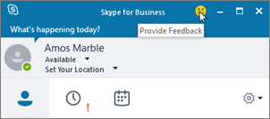
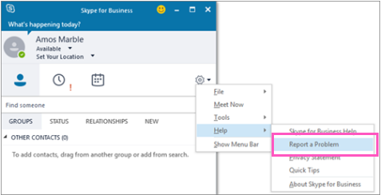

# <a name="turn-on-or-off-skype-for-business-client-feedback-reporting"></a><span data-ttu-id="32dba-103">Skype for Business クライアントのフィードバック レポートをオンまたはオフにする</span><span class="sxs-lookup"><span data-stu-id="32dba-103">Turn on or off Skype for Business client feedback reporting</span></span>

<span data-ttu-id="32dba-104">Skype for Business Online ユーザーが組み込みの Skype for Business アプリのフィードバックツールを使用できるようにして、ユーザーが問題を報告したり、ユーザーのエクスペリエンスについて Microsoft に直接フィードバックを提供したりできるようにします。</span><span class="sxs-lookup"><span data-stu-id="32dba-104">You can enable your Skype for Business Online users to use the built-in Skype for Business app feedback tool to let users report issues and provide feedback directly to Microsoft about their experience.</span></span> 
  

  
<span data-ttu-id="32dba-106">このツールを使用すると、ユーザーはデバイス上のアプリからログをコピーして、Microsoft が問題の調査とトラブルシューティングを改善するのに役立ちます。</span><span class="sxs-lookup"><span data-stu-id="32dba-106">Using this tool, a user can copy the logs from the app on their device to help Microsoft better investigate and troubleshoot problems that they might have.</span></span> 
  

  
<span data-ttu-id="32dba-108">デバイスのスクリーンショットをユーザーのフィードバックに含めるために  _EnableOnlineFeedbackScreenshot_ の設定を使用することもできます。</span><span class="sxs-lookup"><span data-stu-id="32dba-108">You can also use the  _EnableOnlineFeedbackScreenshot_ setting so users can include a screenshot of their device as a part of their feedback.</span></span>
  

  
> [!IMPORTANT]
> <span data-ttu-id="32dba-110">この問題が調査されている間、アプリのフィードバックツールによって収集されたログは、米国内で最大90日間保存されます。</span><span class="sxs-lookup"><span data-stu-id="32dba-110">The logs collected by the app's feedback tool will be stored for up to a maximum of 90 days in the United States while the issue is being investigated.</span></span> <span data-ttu-id="32dba-111">これが所属する組織のデータ保護ポリシーに抵触する場合は、このフィードバック ツールを有効にしないでください。</span><span class="sxs-lookup"><span data-stu-id="32dba-111">Because of this, please don't enable this feedback tool if this violates your organization's data protection policy.</span></span> 
  
## <a name="verify-and-start-windows-powershell"></a><span data-ttu-id="32dba-112">Windows PowerShell を検証および開始する</span><span class="sxs-lookup"><span data-stu-id="32dba-112">Verify and start Windows PowerShell</span></span>

- <span data-ttu-id="32dba-113">**Windows PowerShell バージョン 3.0 以降を実行していることを確認する**</span><span class="sxs-lookup"><span data-stu-id="32dba-113">**Check that you are running Windows PowerShell version 3.0 or higher**</span></span>
    
1. <span data-ttu-id="32dba-114">3.0 以降のバージョンが実行されていることを確認する場合: **[スタート] メニュー** > **[Windows PowerShell]**。</span><span class="sxs-lookup"><span data-stu-id="32dba-114">To verify that you are running version 3.0 or higher: **Start Menu** > **Windows PowerShell**.</span></span>
    
2. <span data-ttu-id="32dba-115">[ _Windows PowerShell_] ウィンドウに「 **Get-Host**」と入力して、バージョンを確認します。</span><span class="sxs-lookup"><span data-stu-id="32dba-115">Check the version by typing  _Get-Host_ in the **Windows PowerShell** window.</span></span>
    
3. <span data-ttu-id="32dba-116">バージョン 3.0 以降を使用していない場合は、Windows PowerShell の更新プログラムをダウンロードおよびインストールする必要があります。</span><span class="sxs-lookup"><span data-stu-id="32dba-116">If you don't have version 3.0 or higher, you need to download and install updates to Windows PowerShell.</span></span> <span data-ttu-id="32dba-117">Windows PowerShell をバージョン4.0 にダウンロードして更新するには、「 [Windows Management Framework 4.0](https://go.microsoft.com/fwlink/?LinkId=716845) 」を参照してください。</span><span class="sxs-lookup"><span data-stu-id="32dba-117">See [Windows Management Framework 4.0](https://go.microsoft.com/fwlink/?LinkId=716845) to download and update Windows PowerShell to version 4.0.</span></span> <span data-ttu-id="32dba-118">メッセージが表示されたら、コンピューターを再起動します。</span><span class="sxs-lookup"><span data-stu-id="32dba-118">Restart your computer when you are prompted.</span></span>
    
4. <span data-ttu-id="32dba-p103">Skype for Business Online に接続するリモートの Windows PowerShell セッションを作成できるように、Skype for Business Online の Windows PowerShell モジュールもインストールする必要があります。このモジュールは、64 ビット版のコンピューターでのみサポートされており、「[Windows PowerShell Module for Skype for Business Online](https://go.microsoft.com/fwlink/?LinkId=294688)」の Microsoft ダウンロード センターからダウンロードできます。メッセージが表示されたら、コンピューターを再起動します。</span><span class="sxs-lookup"><span data-stu-id="32dba-p103">You will also need to install the Windows PowerShell module for Skype for Business Online that enables you to create a remote Windows PowerShell session that connects to Skype for Business Online. This module, which is supported only on 64-bit computers, can be downloaded from the Microsoft Download Center at [Windows PowerShell Module for Skype for Business Online](https://go.microsoft.com/fwlink/?LinkId=294688). Restart your computer if you are prompted.</span></span>
    
<span data-ttu-id="32dba-122">詳細については、「[単一の Windows PowerShell ウィンドウですべての Office 365 サービスに接続する](https://technet.microsoft.com/library/dn568015.aspx)」を参照してください。</span><span class="sxs-lookup"><span data-stu-id="32dba-122">If you need to know more, see [Connect to all Office 365 services in a single Windows PowerShell window](https://technet.microsoft.com/library/dn568015.aspx).</span></span>
    
- <span data-ttu-id="32dba-123">**Windows PowerShell セッションを開始する**</span><span class="sxs-lookup"><span data-stu-id="32dba-123">**Start a Windows PowerShell session**</span></span>
    
1. <span data-ttu-id="32dba-124">From the **Start Menu** > **Windows PowerShell**.</span><span class="sxs-lookup"><span data-stu-id="32dba-124">From the **Start Menu** > **Windows PowerShell**.</span></span>
    
2. <span data-ttu-id="32dba-125">[ **Windows PowerShell**] ウィンドウで、次を実行して、Office 365 の組織に接続します。</span><span class="sxs-lookup"><span data-stu-id="32dba-125">In the **Windows PowerShell** window, connect to your Office 365 organization by running:</span></span>
    
    > [!NOTE]
    > <span data-ttu-id="32dba-126">Skype for Business Online Windows PowerShell モジュールを初めて使用するときに、 **Import-Module** コマンドを実行するだけです。</span><span class="sxs-lookup"><span data-stu-id="32dba-126">You only have to run the **Import-Module** command the first time you use the Skype for Business Online Windows PowerShell module.</span></span>
 
   ```PowerShell
    Import-Module "C:\\Program Files\\Common Files\\Skype for Business Online\\Modules\\SkypeOnlineConnector\\SkypeOnlineConnector.psd1"
    $credential = Get-Credential
    $session = New-CsOnlineSession -Credential $credential
    Import-PSSession $session
   ```
   <span data-ttu-id="32dba-127">Windows PowerShell の起動の詳細については、「[単一の Windows powershell ウィンドウですべての Office 365 サービスに接続](https://technet.microsoft.com/library/dn568015.aspx)する」または「[windows powershell 用のコンピューターをセットアップ](../set-up-your-computer-for-windows-powershell/set-up-your-computer-for-windows-powershell.md)する」を参照してください。</span><span class="sxs-lookup"><span data-stu-id="32dba-127">If you want more information about starting Windows PowerShell, see [Connect to all Office 365 services in a single Windows PowerShell window](https://technet.microsoft.com/library/dn568015.aspx) or[Set up your computer for Windows PowerShell](../set-up-your-computer-for-windows-powershell/set-up-your-computer-for-windows-powershell.md).</span></span>
    
## <a name="turn-on-client-app-feedback-reporting-for-all-the-users-in-your-organization"></a><span data-ttu-id="32dba-128">組織のすべてのユーザーに対してクライアント アプリのフィードバック レポートをオンにする</span><span class="sxs-lookup"><span data-stu-id="32dba-128">Turn on client app feedback reporting for all the users in your organization</span></span>

<span data-ttu-id="32dba-129">組織内のユーザーに対してフィードバックレポートを有効にし、デバイスのスクリーンショットを送信できるようにするには、次を実行します。</span><span class="sxs-lookup"><span data-stu-id="32dba-129">To enable feedback reporting for users in your organization and allow them to submit device screen shots, run:</span></span>
 
  ```PowerShell
  Set-CsClientPolicy -Identity EnableOnlineFeedback -EnableOnlineFeedback $true -EnableOnlineFeedbackScreenshots $true
  ```
## <a name="want-to-know-more-about-windows-powershell"></a><span data-ttu-id="32dba-130">Windows PowerShell の詳細情報</span><span class="sxs-lookup"><span data-stu-id="32dba-130">Want to know more about Windows PowerShell?</span></span>
- <span data-ttu-id="32dba-131">Windows PowerShell では、ユーザーの管理と、許可または許可されていないユーザーの操作について説明します。</span><span class="sxs-lookup"><span data-stu-id="32dba-131">Windows PowerShell is all about managing users and what users are allowed or not allowed to do.</span></span> <span data-ttu-id="32dba-132">Windows PowerShell を利用すると、Office 365 と Skype for Business Online の管理を 1 か所で行うことができるので、複数のタスクを担当する管理者の日常業務を単純化できます。</span><span class="sxs-lookup"><span data-stu-id="32dba-132">With Windows PowerShell, you can manage Office 365 and Skype for Business Online using a single point of administration that can simplify your daily work, when you have multiple tasks to do.</span></span> <span data-ttu-id="32dba-133">Windows PowerShell の使用を開始するには、次のトピックを参照してください。</span><span class="sxs-lookup"><span data-stu-id="32dba-133">To get started with Windows PowerShell, see these topics:</span></span>
    
  - [<span data-ttu-id="32dba-134">Windows PowerShell と Skype for Business Online の概要</span><span class="sxs-lookup"><span data-stu-id="32dba-134">An introduction to Windows PowerShell and Skype for Business Online</span></span>](https://go.microsoft.com/fwlink/?LinkId=525039)
    
  - [<span data-ttu-id="32dba-135">Windows PowerShell を使用して Office 365 を管理する6つの理由</span><span class="sxs-lookup"><span data-stu-id="32dba-135">Six Reasons Why You Might Want to Use Windows PowerShell to Manage Office 365</span></span>](https://go.microsoft.com/fwlink/?LinkId=525041)
    
- <span data-ttu-id="32dba-136">Windows PowerShell には、多くのユーザーについて同時に設定を変更する場合など、Microsoft 365 管理センターを使用する場合にのみ、速度、シンプルさ、生産性を高めることができます。</span><span class="sxs-lookup"><span data-stu-id="32dba-136">Windows PowerShell has many advantages in speed, simplicity, and productivity over only using the Microsoft 365 admin center such as when you are making setting changes for many users at one time.</span></span> <span data-ttu-id="32dba-137">次のトピックでこれらの利点について説明します。</span><span class="sxs-lookup"><span data-stu-id="32dba-137">Learn about these advantages in the following topics:</span></span>
    
  - [<span data-ttu-id="32dba-138">Windows PowerShell で Office 365 を管理するための最善の方法</span><span class="sxs-lookup"><span data-stu-id="32dba-138">Best ways to manage Office 365 with Windows PowerShell</span></span>](https://go.microsoft.com/fwlink/?LinkId=525142)
    
  - [<span data-ttu-id="32dba-139">Windows PowerShell による Skype for Business Online の管理</span><span class="sxs-lookup"><span data-stu-id="32dba-139">Using Windows PowerShell to manage Skype for Business Online</span></span>](https://go.microsoft.com/fwlink/?LinkId=525453)
    
  - [<span data-ttu-id="32dba-140">Windows PowerShell を使用した一般的な Skype for Business Online の管理タスクの実行</span><span class="sxs-lookup"><span data-stu-id="32dba-140">Using Windows PowerShell to do common Skype for Business Online management tasks</span></span>](https://go.microsoft.com/fwlink/?LinkId=525038)

## <a name="related-topics"></a><span data-ttu-id="32dba-141">関連トピック</span><span class="sxs-lookup"><span data-stu-id="32dba-141">Related topics</span></span>
[<span data-ttu-id="32dba-142">Skype for Business Online をセットアップする</span><span class="sxs-lookup"><span data-stu-id="32dba-142">Set up Skype for Business Online</span></span>](set-up-skype-for-business-online.md)

[<span data-ttu-id="32dba-143">Skype for Business ユーザーが Skype の連絡先を追加できるようにする</span><span class="sxs-lookup"><span data-stu-id="32dba-143">Let Skype for Business users add Skype contacts</span></span>](let-skype-for-business-users-add-skype-contacts.md)

  
 
