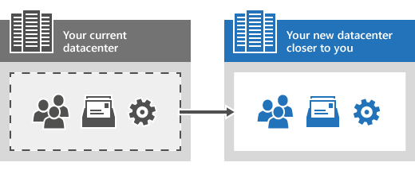

# 今すぐ Skype for Business Online 管理センターを使用できないのはなぜですか?Why can't I use the Skype for Business Online admin center right now?

作業を完了できないことがわかっているため、ここでは何が起こっているのかを説明します。We know it's frustrating when you can't get your work done, so we're going to explain what's happening here and why it'll be worth the wait. 
  
まず、次の技術的な説明について説明します。First, here's the technical explanation:
  
Skype for Business Online サービス (ユーザーと組織の設定) を別の Microsoft データセンターに移行しています。We're migrating your Skype for Business Online service (meaning your users and organizational settings) to another Microsoft datacenter that's closer to you. これにより、サービスが向上し、待機時間が短縮されます。This will improve your service and reduce latency. 
  
技術的な詳細については、「[データの移動中および移行後]( https://go.microsoft.com/fwlink/?LinkId=526418)」を参照してください。For more technical details, see [During and after your data move]( https://go.microsoft.com/fwlink/?LinkId=526418).
  
## これはどういう意味ですか?OK, so what does that mean?

まず、いくつかの用語について説明します。First, let's break down a few terms.
  
- **データセンター**これは、ファイルやメールメッセージなど、Microsoft 365 または Office 365 からの情報が保存されている物理的な場所です。**Data center** This is the physical location where the information from your Microsoft 365 or Office 365 is stored, such as your files and email messages. Microsoft 365 と Office 365 のデータセンターについて詳しく調べたい場合は、こちらの[記事](https://www.microsoft.com/online/legal/v2/?docid=25)を参照してください。If you really want to dig in to what Microsoft 365 and Office 365 datacenters are, check out[this article](https://www.microsoft.com/online/legal/v2/?docid=25).
    
- **移行**これは、"移動" とほぼ同じです。**Migrating** This is pretty much the same as "moving." この場合、お客様の Skype for Business Online のユーザーと設定を、あるデータセンターから別のデータセンターに移動し、サービスの向上に向けてより近いものにしていることを意味します。In this case, it means we're moving your Skype for Business Online users and settings from one datacenter to another that's closer to you to improve your service.
    
- **待機時間**これは、Microsoft 365 管理センターにアクセスし、設定を変更して、それらの変更を保存するために必要な時間の長さです。**Latency** This is amount of time it takes you to access the Microsoft 365 admin center, make a settings change, and then save those changes.
    
- **関連付け ID**これは、先ほど送信したメッセージの一覧に表示されていた可能性があります。**Correlation ID** You might have seen this listed in the message you just came from. この情報は、Microsoft サポートエンジニアがエラーのトラブルシューティングを行うために使用されます。This information is used by Microsoft support engineers to help you troubleshoot an error. Microsoft サポートに連絡する場合は、関連付け ID の確認を求められる場合があります。If you contact Microsoft support, you might be asked for the Correlation ID.
    
これまでの意味では、Skype for Business Online のすべてのユーザーとサービス設定を、お客様により近い場所に移動するプロセスを進めています。So what this all means is we're in the process of moving all your Skype for Business Online users and service settings to another location that's closer to you. もっとうまくいきます。The closer the better. この短時間の間、Skype for Business Online サービスの品質が向上します。The good news is that after this short period of time, your Skype for Business Online service will improve.
  

  
## Skype for Business Online の機能について教えてください。What Skype for Business Online features will still work?

Skype for Business Online 管理センターにアクセスすることはできませんが、移行中に次の Skype for Business Online の機能は引き続き機能します。Although you won't be able to access the Skype for Business Online admin center, the following Skype for Business Online features will still work during the migration:
  
- オンライン会議Online meetings
    
- プレゼンス情報Presence information
    
## 他の作業を行うことはできますか?Can I get other work done?

もちろん。Sure. Skype for Business Online サービスを移行している間も、Microsoft 365 の他の管理センター (たとえば、Microsoft 365 と Exchange 管理センター) を使用できます。While we're migrating your Skype for Business Online service, you can still use the other admin centers in Microsoft 365 (for example, the Microsoft 365 and Exchange admin centers). ただし、Skype for Business Online 管理センターと共に、移行中に Skype for Business Online リモート PowerShell コマンドレットを使用することはできません。However, along with the Skype for Business Online admin center, you won't be able to use the Skype for Business Online Remote PowerShell cmdlets during the migration. 
  
## 関連項目Related topics
[Skype for Business Online をセットアップするSet up Skype for Business Online](set-up-skype-for-business-online.md)

[Skype for Business ユーザーが Skype の連絡先を追加できるようにするLet Skype for Business users add Skype contacts](let-skype-for-business-users-add-skype-contacts.md)

  
 
