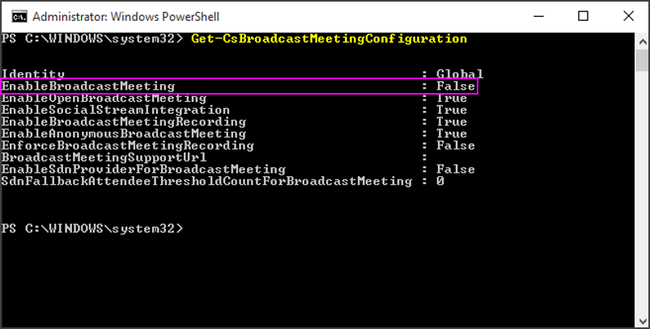
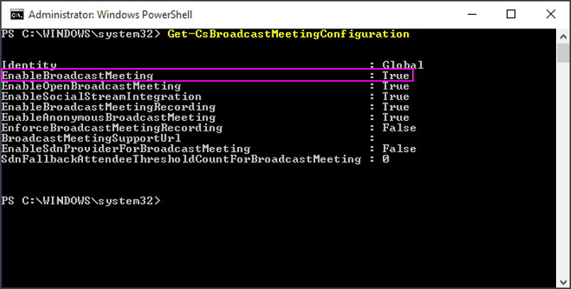

# <a name="enable-skype-meeting-broadcast"></a><span data-ttu-id="6b7cd-105">Skype 会議ブロードキャストを有効にする</span><span class="sxs-lookup"><span data-stu-id="6b7cd-105">Enable Skype Meeting Broadcast</span></span>

<span data-ttu-id="6b7cd-p102">[] 組織のユーザーが Skype 会議ブロードキャストを使用できるようにする前に、それを有効にしておく必要があります。この手順を実行するには、Windows PowerShell の使い方を知っておく必要があります。Windows PowerShell に慣れていない場合は、[マイクロソフトのパートナー](https://go.microsoft.com/fwlink/?linkid=391089)に依頼してこの手順を実行することを考慮してください。</span><span class="sxs-lookup"><span data-stu-id="6b7cd-p102">Before the people in your organization can use Skype Meeting Broadcast, you need to enable it. To do this, you need to know how to use Windows PowerShell. If you don't know Windows PowerShell, consider hiring a [Microsoft partner](https://go.microsoft.com/fwlink/?linkid=391089) to do this step for you.</span></span>

  
## <a name="enable-skype-meeting-broadcast-using-the-skype-for-business-admin-center"></a><span data-ttu-id="6b7cd-109">Skype for Business 管理センターを使用して Skype 会議ブロードキャストを有効にする</span><span class="sxs-lookup"><span data-stu-id="6b7cd-109">Enable Skype Meeting Broadcast using the Skype for Business admin center</span></span>

<span data-ttu-id="6b7cd-110"> **Skype for Business の管理センターを使用する**</span><span class="sxs-lookup"><span data-stu-id="6b7cd-110"> **Using the Skype for Business admin center**</span></span>

1. <span data-ttu-id="6b7cd-111">Office 365 のグローバル管理者アカウントを使用してサインイン[https://portal.office.com/adminportal/home](https://portal.office.com/adminportal/home)。</span><span class="sxs-lookup"><span data-stu-id="6b7cd-111">Sign in with your Office 365 global admin account at [https://portal.office.com/adminportal/home](https://portal.office.com/adminportal/home).</span></span>
    
2. <span data-ttu-id="6b7cd-112">Office 365 の管理センターで**管理センター**に移動する > **ビジネス用の Skype**です。</span><span class="sxs-lookup"><span data-stu-id="6b7cd-112">In the Office 365 Admin center go to **Admin centers** > **Skype for Business**.</span></span>
    
3. <span data-ttu-id="6b7cd-113">**ビジネス管理センターの Skype**では、**オンライン会議**に移動 > **会議のブロードキャスト**、および、 **Skype 会議のブロードキャストを有効にする**] を選択をします。</span><span class="sxs-lookup"><span data-stu-id="6b7cd-113">In the **Skype for Business admin center**, go to **Online meetings** > **Broadcast meetings**, and then select **Enable Skype Meeting Broadcast**.</span></span>
    
## <a name="enable-skype-meeting-broadcast-using-powershell"></a><span data-ttu-id="6b7cd-114">PowerShell を使用して Skype 会議ブロードキャストを有効にする</span><span class="sxs-lookup"><span data-stu-id="6b7cd-114">Enable Skype Meeting Broadcast using PowerShell</span></span>

1. <span data-ttu-id="6b7cd-115">Windows PowerShell のバージョン 3.0 以上を実行していることを確認します。</span><span class="sxs-lookup"><span data-stu-id="6b7cd-115">Verify that you are running version 3.0 or higher of Windows PowerShell.</span></span>
    
1. <span data-ttu-id="6b7cd-116">3.0 以降のバージョンが実行されていることを確認する場合: **[スタート] メニュー** > **[Windows PowerShell]**。</span><span class="sxs-lookup"><span data-stu-id="6b7cd-116">To verify that you are running version 3.0 or higher: **Start Menu** > **Windows PowerShell**.</span></span>
    
2. <span data-ttu-id="6b7cd-117">[ _Windows PowerShell_] ウィンドウに「 **Get-Host**」と入力して、バージョンを確認します。</span><span class="sxs-lookup"><span data-stu-id="6b7cd-117">Check the version by typing  _Get-Host_ in the **Windows PowerShell** window.</span></span>
    
3. <span data-ttu-id="6b7cd-p103">バージョン 3.0 以降を使用していない場合は、Windows PowerShell の更新プログラムをダウンロードおよびインストールする必要があります。Windows PowerShell をダウンロードして、バージョン 4.0 に更新するには、「[Windows Management Framework 4.0 ](https://go.microsoft.com/fwlink/?LinkId=716845)」を参照してください。メッセージが表示されたら、コンピューターを再起動します。</span><span class="sxs-lookup"><span data-stu-id="6b7cd-p103">If you don't have version 3.0 or higher, you need to download and install updates to Windows PowerShell. See [Windows Management Framework 4.0 ](https://go.microsoft.com/fwlink/?LinkId=716845) to download and update Windows PowerShell to version 4.0. Restart your computer when you are prompted.</span></span>
    
4. <span data-ttu-id="6b7cd-p104">Skype for Business Online 用の Windows PowerShell モジュールもインストールする必要があります。このモジュールでは、リモート Windows PowerShell セッションを作成して Skype for Business Online に接続できます。このモジュールは、64 ビット版のコンピューターでのみサポートされており、Microsoft ダウンロード センターの「[Windows PowerShell Module for Skype for Business Online](https://go.microsoft.com/fwlink/?LinkId=294688)」からダウンロードできます。再起動を求めるメッセージが表示されたら、コンピューターを再起動します。</span><span class="sxs-lookup"><span data-stu-id="6b7cd-p104">You will also need to install the Windows PowerShell module for Skype for Business Online that enables you to create a remote Windows PowerShell session that connects to Skype for Business Online. This module, which is supported only on 64-bit computers, can be downloaded from the Microsoft Download Center at [Windows PowerShell Module for Skype for Business Online](https://go.microsoft.com/fwlink/?LinkId=294688). Restart your computer if you are prompted.</span></span>
    
2. <span data-ttu-id="6b7cd-124">[ **スタート**] メニューで [ **Windows PowerShell**] をクリックします。</span><span class="sxs-lookup"><span data-stu-id="6b7cd-124">From the **Start Menu**, choose **Windows PowerShell**.</span></span>
    
3. <span data-ttu-id="6b7cd-125">[ **Windows PowerShell**] ウィンドウで、以下のコマンドを実行して、Office 365 の組織に接続します。</span><span class="sxs-lookup"><span data-stu-id="6b7cd-125">In the **Windows PowerShell** window, connect to your Office 365 organization by running:</span></span>
    
  ```
  $Credential = get-credential
  $O365Session = New-CsOnlineSession -Credential $credential
  Import-PSSession $O365Session
  ```

4. <span data-ttu-id="6b7cd-126">以下のコマンドを実行して、現在の Skype 会議ブロードキャストの構成を確認します。</span><span class="sxs-lookup"><span data-stu-id="6b7cd-126">Confirm your current Skype Meeting Broadcast configuration by running:</span></span>
    
  ```
  Get-CsBroadcastMeetingConfiguration
  ```

    <span data-ttu-id="6b7cd-127">_EnableBroadcastMeeting_ パラメーターが `False` に設定されていることを確認します。</span><span class="sxs-lookup"><span data-stu-id="6b7cd-127">Verify that the parameter  _EnableBroadcastMeeting_ is set to `False`.</span></span>
    
     
  
5. <span data-ttu-id="6b7cd-129">以下のコマンドを実行して、組織の Skype 会議ブロードキャストを有効にします。</span><span class="sxs-lookup"><span data-stu-id="6b7cd-129">Enable Skype Meeting Broadcast for your organization by running:</span></span>
    
  ```
  Set-CsBroadcastMeetingConfiguration -EnableBroadcastMeeting $True
  ```

    <span data-ttu-id="6b7cd-130">`Get-CsBroadcastMeetingConfiguration` をもう一度実行すると、設定が有効になっていることを確認できます。</span><span class="sxs-lookup"><span data-stu-id="6b7cd-130">You can confirm that the setting is enabled by running  `Get-CsBroadcastMeetingConfiguration` again.</span></span>
    
     
  
    > [!TIP]
    > <span data-ttu-id="6b7cd-132">変更後は、Skype 会議ブロードキャストのポータルに変更が反映されるまでに最長で 1 時間かかる場合があります。</span><span class="sxs-lookup"><span data-stu-id="6b7cd-132">After you make the change, it may take up to an hour to take effect in the Skype Meeting Broadcast portal.</span></span> 
  
6. <span data-ttu-id="6b7cd-p105">これで、ユーザーは組織の他のユーザーとブロードキャスト会議を開催できます。会議を開催するには、ユーザーに「[Skype 会議ブロードキャストとは](https://support.office.com/en-us/article/c472c76b-21f1-4e4b-ab58-329a6c33757d)」を参照するように指示してください。</span><span class="sxs-lookup"><span data-stu-id="6b7cd-p105">Your users can now hold broadcast meetings with other users in your business. To get them started, point them to [What is a Skype Meeting Broadcast?](https://support.office.com/en-us/article/c472c76b-21f1-4e4b-ab58-329a6c33757d)</span></span>
    
## <a name="configure-your-network-to-broadcast-meetings-with-external-attendees"></a><span data-ttu-id="6b7cd-135">ネットワークを構成して、外部の出席者に会議をブロードキャストする</span><span class="sxs-lookup"><span data-stu-id="6b7cd-135">Configure your network to broadcast meetings with external attendees</span></span>

<span data-ttu-id="6b7cd-136">ファイアウォールが構成されている場合に組織外 (フェデレーションされていない組織) の参加者とブロードキャストを開催する場合は、「[Skype 会議ブロードキャスト用にネットワークをセットアップする](set-up-your-network-for-skype-meeting-broadcast.md)」の手順に従ってネットワークを構成する必要があります。</span><span class="sxs-lookup"><span data-stu-id="6b7cd-136">If you have a firewall, and you want to hold broadcasts with people outside of your business (who are not a federated business), you need to configure your network using these instructions: [Set up your network for Skype Meeting Broadcast](set-up-your-network-for-skype-meeting-broadcast.md).</span></span> 
  
<span data-ttu-id="6b7cd-137">ファイアウォールの構成に慣れていない場合は、[マイクロソフトのパートナー](https://go.microsoft.com/fwlink/?linkid=391089)に依頼してこの手順を実行することを考慮してください。</span><span class="sxs-lookup"><span data-stu-id="6b7cd-137">If you aren't experienced with configuring your firewall, consider hiring a [Microsoft partner](https://go.microsoft.com/fwlink/?linkid=391089) to do this step for you.</span></span>
  
<span data-ttu-id="6b7cd-138">この手順をスキップして、代わりに別の組織をフェデレーションに追加する場合は、「[ユーザーが外部の Skype for Business ユーザーに連絡できるようにする](../set-up-skype-for-business-online/allow-users-to-contact-external-skype-for-business-users.md)」をご覧ください。</span><span class="sxs-lookup"><span data-stu-id="6b7cd-138">To skip this step and instead add another business to your federation, see [Allow users to contact external Skype for Business users](../set-up-skype-for-business-online/allow-users-to-contact-external-skype-for-business-users.md).</span></span> 
  
## <a name="related-topics"></a><span data-ttu-id="6b7cd-139">See also</span><span class="sxs-lookup"><span data-stu-id="6b7cd-139">Related topics</span></span>

[<span data-ttu-id="6b7cd-140">Windows PowerShell と Skype for Business Online の概要</span><span class="sxs-lookup"><span data-stu-id="6b7cd-140">An introduction to Windows PowerShell and Skype for Business Online</span></span>](https://go.microsoft.com/fwlink/?LinkId=525039)
  
[<span data-ttu-id="6b7cd-141">Skype for Business Online のセットアップ</span><span class="sxs-lookup"><span data-stu-id="6b7cd-141">Set up Skype for Business Online</span></span>](../set-up-skype-for-business-online/set-up-skype-for-business-online.md)

  
 