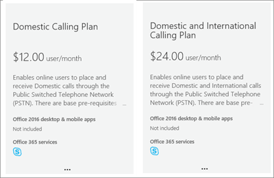

# Office 365 プランの呼び出しCalling Plans for Office 365

その他の Skype for Business や Microsoft チームのユーザーの呼び出しは、無料のユーザーを [標準の携帯電話をかけることができるようにする、音声通話の発信にサービス プロバイダーをまだ持っていない場合は、する必要しますが、ありますされた通話プランを購入します。[Office 365 のプランの呼び出しとは何ですか?](../what-are-calling-plans-in-office-365/what-are-calling-plans-in-office-365.md)Calls to other Skype for Business and Microsoft Teams users are free, but if you want your users to be able to call regular phones, and you don't already have a service provider to make voice calls, you need to buy a Calling Plan. [What are Calling Plans in Office 365?](../what-are-calling-plans-in-office-365/what-are-calling-plans-in-office-365.md)
  
プランの呼び出し] オプションを以下に示します。Here are the Calling Plans option:
  
- **国内通話計画**: ユーザーのライセンスを呼び出す番号を国/地域内にある Office 365 で割り当てられます。**Domestic Calling Plan**: Licensed users can call out to numbers located in the country/region where they are assigned in Office 365.
    
- **国内と国際通話プラン**: ライセンス付与されたユーザーを呼び出す番号を国/地域内にある、Office 365 のライセンスが割り当てられていると、ユーザーの所在地に基づいて、ユーザーを[196 国/地域で国際番号を場所](../country-and-region-availability-for-audio-conferencing-and-calling-plans/users-can-make-outbound-calls-to-these-countries-and-regions.md).**Domestic and International Calling Plan**: Licensed users can call out to numbers located in the country/region where their Office 365 license is assigned to the user based on the user's location, and to international numbers in [196 countries/regions](../country-and-region-availability-for-audio-conferencing-and-calling-plans/users-can-make-outbound-calls-to-these-countries-and-regions.md).
    
それぞれの組織とそれぞれの国/地域の利用可能な月間分は、[次のとおり](../country-and-region-availability-for-audio-conferencing-and-calling-plans/country-and-region-availability-for-audio-conferencing-and-calling-plans.md)です。Monthly minutes available for each organization and each country/region are located [here](../country-and-region-availability-for-audio-conferencing-and-calling-plans/country-and-region-availability-for-audio-conferencing-and-calling-plans.md).
  
> [!IMPORTANT]
> 国/地域、場所を基に、 **Office 365 管理センター**で、ユーザーのライセンスの > 請求先住所が**Office 365 管理センターで**組織プロファイル**の下に表示される**アクティブなユーザー**では**なく****.The country/region is based on the location of the user's license in the **Office 365 admin center** > **Active users** and **NOT** the billing address listed under the **Organization Profile** in the **Office 365 admin center**.   

  
使用制限と使用条件の詳細については、[無料のダイヤルアウト期間の電話会議](../accessibility-and-regulatory/complimentary-dial-out-period.md)を参照してください。For detailed information about usage limits and terms of use, see [Audio Conferencing complimentary dial-out period](../accessibility-and-regulatory/complimentary-dial-out-period.md).
  
## 通話プランを購入する方法How to buy a Calling Plan

1. **まず、**電話システムで**アドオン ライセンスを購入する必要があります**します。[Office 365 管理センターにサインイン](https://portal.office.com/adminportal/home?add=sub&amp;adminportal=1#/catalog)して、**課金** > **サービスを購入** > **アドオン サブスクリプション** > **を今すぐ購入**します。**You must first purchase a **Phone System** add-on license**. To do that, [sign into the Office 365 admin center](https://portal.office.com/adminportal/home?add=sub&amp;adminportal=1#/catalog) and choose **Billing** > **Purchase services** > **Add-on subscriptions** > **Buy now**.
    
    
  
    > [!NOTE]
    > によっては、プランでは、電話システムでのライセンスを購入する前に、複数のアドオンを購入する必要があります。詳細については、次を参照してください[を購入すると、その他の機能を取得するにはアドオン ライセンスが必要ですか?](skype-for-business-and-microsoft-teams-add-on-licensing.md#bkmk_whichaddons) 。Depending on your plan, you may need to buy more add-ons before you can buy Phone System licenses. To learn more, see [Which add-on licenses do I need to buy to get more features?](skype-for-business-and-microsoft-teams-add-on-licensing.md#bkmk_whichaddons)
  
2. 電話システムでのライセンスを購入した後にする、 **Office 365 管理センター**にサインインして、通話プランを購入するか、**課金** > **サービスを購入** > **サブスクリプションのアドオン**] と [**今すぐ購入**] をクリックします。[通話プランがありますが表示されます。After you buy Phone System licenses, you can buy the Calling Plan by signing in to the **Office 365 admin center**, choose **Billing** > **Purchase services** > **Add-on subscriptions**, and then clicking **Buy now**. You'll see the Calling Plans there.
    
    
  
購入し、組織のニーズに応じて、別のユーザーに別の通話プランを割り当てることがことができます。選択した後、呼び出しを計画する必要がある、チェック アウトする手順に進みます。プランを Office 365 管理センターでは、各ユーザーに割り当てます。については、[ビジネスや Microsoft チームのライセンスを割り当てる Skype](assign-skype-for-business-and-microsoft-teams-licenses.md)を参照してください。You can buy and assign different Calling Plans to different users, depending on the needs of your organization. After you select the Calling Plan you need, proceed to checkout. You assign a plan to each user in the Office 365 admin center. To learn how, see [Assign Skype for Business and Microsoft Teams licenses](assign-skype-for-business-and-microsoft-teams-licenses.md).
  
## サービス プロバイダー ハイブリッド ユーザーの内部設置型 PSTN への接続を提供していますか。Do you have a service provider that provides on-premises PSTN connectivity for hybrid users?

必要な場合は、通話プランを購入する必要はありません。Office 365 Enterprise E5 には、チェック アウトに進むので、**電話システムで**アドオンが含まれています。If so, you don't need to buy a Calling Plan. Office 365 Enterprise E5 includes the **Phone System** add-on, so you can proceed to checkout.
  
次に、Office 365 管理センターのユーザーにエンタープライズ E5 または**電話システムで**のアドオン ライセンスを割り当てます。については、[ビジネスや Microsoft チームのライセンスを割り当てる Skype](assign-skype-for-business-and-microsoft-teams-licenses.md)を参照してください。Then, assign the Enterprise E5 or **Phone System** add-on licenses to users in the Office 365 admin center. To learn how, see [Assign Skype for Business and Microsoft Teams licenses](assign-skype-for-business-and-microsoft-teams-licenses.md).
  
## 価格情報Pricing information

- [通話プランの価格Pricing for Calling Plans](https://go.microsoft.com/fwlink/?LinkId=799761)
    
- [電話システムでの価格Pricing for Phone System](https://go.microsoft.com/fwlink/?linkid=799763)
    
- [電話会議向けの価格サービスPricing for Audio Conferencing](https://go.microsoft.com/fwlink/?linkid=799762)
    
## 詳細情報For more information

プランの呼び出しを設定する方法を説明するその他の記事を紹介します。Here are more articles that explain how to set up your Calling Plans:
  
- [プランの呼び出しを設定します。Set up Calling Plans](../what-are-calling-plans-in-office-365/set-up-calling-plans.md)
    
- [Skype Business および Microsoft チーム アドオン ライセンスを許可します。Skype for Business and Microsoft Teams add-on licensing](skype-for-business-and-microsoft-teams-add-on-licensing.md)
    
- [Skype for Business クラウド コネクタ Edition を計画する](https://technet.microsoft.com/EN-US/library/Mt605227.aspx): この記事では、独自の PSTN 接続、電話システムで Office 365 をセットアップする方法について説明します。[Plan for Skype for Business Cloud Connector Edition](https://technet.microsoft.com/EN-US/library/Mt605227.aspx): This article explains how to set up Office 365 Phone System with your own PSTN connectivity.
    
- [Office 365 (クラウド PBX) ソリューションの電話システムの計画します。Plan your Phone System in Office 365 (Cloud PBX) solution](https://go.microsoft.com/fwlink/p/?LinkId=717926)
    
## 

[!INCLUDE [LinkedIn Learning Info](../../common/office/linkedin-learning-info.md)]
   
## 関連トピックRelated topics

- [Skype for Business Online をセットアップします。Set up Skype for Business Online](../set-up-skype-for-business-online/set-up-skype-for-business-online.md)
    
- [Skype for Business とチームの Microsoft の音声会議をセットアップする設定します。Set up Audio Conferencing for Skype for Business and Microsoft Teams](../audio-conferencing-in-office-365/set-up-audio-conferencing.md)
    
- [管理者のヘルプ - 電話システムでのボイス メールを設定します。Set up Phone System voicemail - Admin help](../what-is-phone-system-in-office-365/phone-system-voicemail/set-up-phone-system-voicemail.md)
    
- [プランの呼び出しを設定します。Set up Calling Plans](../what-are-calling-plans-in-office-365/set-up-calling-plans.md)
    
- [金を追加およびクレジットの通信を管理します。Add funds and manage Communications Credits](add-funds-and-manage-communications-credits.md)
    
- [クラウド コネクタを構成して](https://technet.microsoft.com/en-us/library/mt605228.aspx)、[クラウド コネクタのダウンロード](https://aka.ms/CloudConnectorInstaller)[Configure the Cloud Connector](https://technet.microsoft.com/en-us/library/mt605228.aspx) and [Download the Cloud Connector](https://aka.ms/CloudConnectorInstaller)
  

