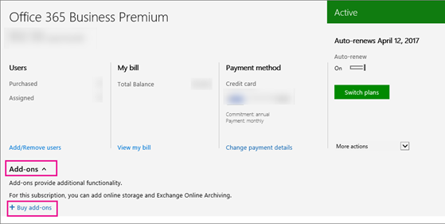

# Office 365 Business PremiumOffice 365 Business Premium 

[Office 365 Business Premium](https://products.office.com/en-us/business/office-365-business-premium) をお持ちの場合は、Skype for Business を使用して、該当のサブスクリプションが適用される会社内の他のユーザーに通話を発信することができます。たとえば、会社に 10 人の社員がいる場合は、Skype for Business を使用してお互いに通話したりインスタント メッセージを送ることができます。If you have [Office 365 Business Premium](https://products.office.com/en-us/business/office-365-business-premium), you can use Skype for Business to make calls to other people in your business who are on your subscription. For example, if your business has 10 people, you can call and IM each other using Skype for Business.
  
 **社外のユーザーとの通話を発着信するには、次の 2 つのオプションがあります** 。**To make and receive calls from people external to your business, you have two options**:
  
- **オプション 1。無料の [Skype アプリ](https://www.skype.com/)** を使用します。**Option 1. Use the free [Skype app](https://www.skype.com/)**. 非常に小規模なビジネスでは、(1-2 のユーザーなど) がある場合は、Skype のアプリケーションを使用してが移動する場合に適してします。If you have a very small business (for example, 1-2 people), using the Skype app is the better way to go. 国内通話と国際通話で利用する場合は、より安価な手段となります。It's less expensive to use for domestic and international calls. まだ会議通話を押しながら、ビデオ通話は、してプレゼンテーション用にデスクトップを共有できます。You can still hold conference calls, make video calls, and share your desktop for presentations. [レートと支払オプションをチェック アウト](https://secure.skype.com/en/calling-rates?wt.mc_id=legacy&amp;expo365=bundled)します。[Check out the rates and payment options](https://secure.skype.com/en/calling-rates?wt.mc_id=legacy&amp;expo365=bundled).
    
    Skype アプリは Office 365 スイートの一部ではないため、Skype for Business のように Outlook 2016 に統合されることはありません。このため、Outlook 2016 の連絡先は Skype に表示されませんので、Skype に連絡先を追加する必要があります。Note that the Skype app isn't part of the Office 365 suite, so it won't be integrated with Outlook 2016 the way Skype for Business is. This means your contacts in Outlook 2016 won't show up in Skype; you'll need to add your contacts to Skype.
    
    最初は Skype アプリをご使用いただいて、お客様のニーズに合うものかご確認いただくことをお勧めします。ニーズに合わない場合は、次のオプションでご利用のプランをアップグレードすることをご検討ください。We recommend starting with the Skype app to see if it meets your needs. If it doesn't, then consider the next option, to upgrade your plan.
    
    **重要**: 従業員が Skype for Business を使用して Skype ユーザーを検索できるようにトグルを設定する必要があります。**IMPORTANT**: You have to set a toggle to allow your employees to use Skype for Business to search for Skype users. [ビジネス ユーザー向けの Skype は、Skype 連絡先を追加する](../../set-up-skype-for-business-online/let-skype-for-business-users-add-skype-contacts.md)を参照してください。See [Let Skype for Business users add Skype contacts](../../set-up-skype-for-business-online/let-skype-for-business-users-add-skype-contacts.md).
    
- **オプション 2 です。計画をアップグレードし、電話システムと国内または国内および国際呼び出しのプランを購入する**です。**Option 2. Upgrade your plan, and buy a Phone System and a Domestic or Domestic and International Calling Plan**.

    > [!Important]
    > Skype のビジネス オンライン計画 2 では、Office ビジネス プレミアム サブスクリプションの場合、**クラウドの音声機能の呼び出しを追加することはできません**が含まれています。Although Skype for Business Online Plan 2 is included with the Office Business Premium subscription, **you can’t add cloud voice calling features**. そのためよりコスト効率の高いかどうかをエンタープライズ E5 (またはエンタープライズ E3) の計画を評価することをお勧めします。So, we recommend that you evaluate an Enterprise E5 (or Enterprise E3) plan to see if it is more cost effective.
    
1. [別の一般法人向け Office 365 プランに切り替える](http://support.office.com/article/73318661-8f33-478b-bcc7-fb8d69dbb22a)。[Switch to a different Office 365 for business plan](http://support.office.com/article/73318661-8f33-478b-bcc7-fb8d69dbb22a). コスト効率の高いかどうかをエンタープライズの E5 の計画を評価することをお勧めします。We recommend that you evaluate an Enterprise E5 plan to see if it is more cost effective.
    
2. **電話システム** アドオンを購入します。Buy the **Phone System** add-on.
    
3. [Office 365 のプランを呼び出すこと](../../skype-for-business-and-microsoft-teams-add-on-licensing/calling-plans-for-office-365.md)を購入: のみを購入できるこの**電話システム**のアドオンを購入した後です。Buy a [Calling Plan for Office 365](../../skype-for-business-and-microsoft-teams-add-on-licensing/calling-plans-for-office-365.md): you can only buy this after you buy the **Phone System** add-on.
    
    この 2 番目のオプションは、外部との通話の発着信を行うユーザーを何人か抱えている会社に適しています。This second option is ideal for businesses with several people who make and receive external phone calls.

## 参照してください価格と購入方法How to see prices and buy

 **電話会議と通信クレジットを取得するには:****To get Audio Conferencing and Communication Credits:**
  
1. Office 365 管理センターにサインインします。Sign in to the Office 365 admin center.
    
2. Go to **Billing** > **Subscriptions** > **Add-ons** > **Buy add-ons**.Go to **Billing** > **Subscriptions** > **Add-ons** > **Buy add-ons**.
    
   
  
3. 電話会議を購入して通信クレジットをセットアップするための価格とオプションが表示されるようになります。You'll now see the prices and option to buy Audio Conferencing, and setup Communications Credits.
    
**電話システムと通話プランを取得するには:****To get Phone System and a Calling Plan:**
  
1. E1 か E3 プランに切り替えます。Switch to the E1 or E3 plan.
    
2. Go to Office 365 admin center > **Billing** > **Subscriptions**.Go to Office 365 admin center > **Billing** > **Subscriptions**.
    
3. [ **アドオン**] を選択します。これで、電話システムの価格と、それを購入するためのオプションが表示されます。Choose **Add-ons**. You'll now see the prices for Phone System, and the option to buy it.
    
4. **電話システム** ライセンスを購入すると、通話プランを購入するオプションと価格が表示されます。After you buy a **Phone System** license, you'll see the price and option to buy a Calling Plan.