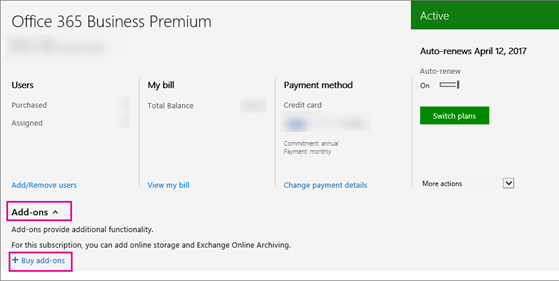

# Office 365 Enterprise E1、E3、E4

すでに [Office 365 Enterprise E1](https://products.office.com/en-us/business/office-365-enterprise-e1-business-software)、[E3](https://products.office.com/en-us/business/office-365-enterprise-e3-business-software)、または E4 プランを購入済みの場合、Skype for Business および Microsoft Teams のその他の機能を利用するために購入する必要があるアドオン ライセンスは次のとおりです。
  
|||
|:-----|:-----|
|**この機能を追加するには**   |**購入する必要のあるもの**   |
|**電話会議**   スケジュールまたはダイヤルイン会議をホストする各ユーザーに対して 1 つ**のオーディオ会議**のライセンスを購入します。 Attendees do not need licenses.   |**オーディオ会議**のアドオン  ライセンスを購入すると、Microsoft が電話会議プロバイダーになります。 |
|**世界中の任意の電話番号を呼び出すことによって他のユーザーを追加するのには、会議、および会議から発信する機能には、ダイヤルインのアクセスのフリー ダイヤルの番号**   |[通信のクレジット](../../skype-for-business-and-microsoft-teams-add-on-licensing/add-funds-and-manage-communications-credits.md)|
|**電話システム**   |1 **office 365 の電話システム**のアドオン。   2. 通話プラン: の購入から Office 365[を呼び出すことを計画](../../skype-for-business-and-microsoft-teams-add-on-licensing/calling-plans-for-office-365.md)します。    または、[既存のプロバイダーからの電話サービス](../../skype-for-business-and-microsoft-teams-add-on-licensing/skype-for-business-and-microsoft-teams-add-on-licensing.md#bkmk_existing)を使用します。    |
|**電話システム ボイスメール**   |E1 と E4 プランの場合は、Exchange Online Plan 2 を購入します。  または、Office 365 E3 などの Exchange Online Plan 2 に同梱されてくる Office Suite に切り替えます。 |
|**通話プラン**   |1**電話システム**のアドオン。   2。[通話プラン](../../skype-for-business-and-microsoft-teams-add-on-licensing/calling-plans-for-office-365.md): のみを購入できるこの**電話システム**のアドオンを購入した後です。   |
   
  
## E1 と E3 のお客様: 価格の表示方法と購入方法

1. Office 365 管理センターにサインインします。
    
2. Go to **Billing** > **Subscriptions** > **Add-ons** > **Buy add-ons**.
    
   
  
3. **電話システム** ライセンスを購入すると、通話プランを購入するオプションと価格が表示されます。
    
### パートナー: 価格の表示方法と購入方法

E3 プランはお持ちの Action Pack に含まれています。 **電話システム**と **電話会議**のアドオンを購入するには、次を実行します。
  
1. [マーケティング用 web サイト](https://go.microsoft.com/fwlink/?LinkId=24393)から E3 の 1 つの座席を購入してください。 既存のテナントにシートに追加するためのオプションを選択します。
    
2. Sign in to the Office 365 admin center and go to **Billing** > **Subscriptions** > **Add-ons**.
    
    これにより、 **電話システム**と **電話会議**のアドオンを購入するためのオプションと価格が表示されます。
    
## アドオンを購入するオプションが表示されないのはどうしてですか?

特定の状況において、Skype for Business および Microsoft Teams のアドオンを購入するオプションが Office 365 管理センター に表示されません。
  
- **Office 365 Business Premium を GoDaddy** から購入されています。 この場合は、Skype for Business および Microsoft Teams のアドオンはご購入いただけません。 (これは、GoDaddy を販売しません)、E3 計画に切り替えるには必要し、し、それらを購入できます。 [ビジネス製品 - 管理者ヘルプのサポートに問い合わせてください](http://support.office.com/article/32a17ca7-6fa0-4870-8a8d-e25ba4ccfd4b)。
    
- **年間契約ではなく月単位の契約を結んでいます** 。 場合によっては、月単位の契約のユーザーはアドオンを購入いただけません (支払方法が月単位の場合は該当しません)。 これは、既知の問題を修正しています。 [ビジネス製品 - 管理者ヘルプのサポートに問い合わせてください](http://support.office.com/article/32a17ca7-6fa0-4870-8a8d-e25ba4ccfd4b)。
    
    
  