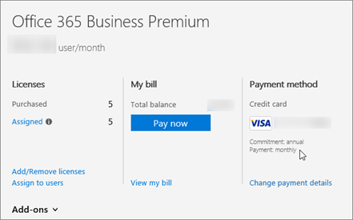

# Skype Business および Microsoft チーム アドオン ライセンスを許可します。

すべてのアドオン オプションについてユーザーに必要ですか。[ビジネス製品 - 管理者向けヘルプのサポートに問い合わせてください](http://support.office.com/article/32a17ca7-6fa0-4870-8a8d-e25ba4ccfd4b)。
  
柔軟性の最大値を指定するには、Skype for Business とライセンス Microsoft チームは設計されています。たとえば、間をビジネス機能の基本的な Skype を使用した後、Office 365 で音声会議、または電話などの他の機能を使用する準備ができたらアドオン ライセンスを購入できます。
  
 **価格をお探しですか?**[価格し、アドオン ライセンスを購入する方法](skype-for-business-and-microsoft-teams-add-on-licensing.md#bkmk_how)または、次のいずれかを参照してください。
  
- [電話会議向けの価格サービス](https://products.office.com/en-us/skype-for-business/audio-conferencing#requirements)
    
- [電話システムでの価格](https://products.office.com/en-us/skype-for-business/phone-system#requirements)
    
- [通話プランの価格](https://products.office.com/en-us/skype-for-business/calling-plans#requirements)
    
## アドオン ライセンスを購入とは

アドオン ライセンスは、ライセンスで特定の skype for Business や Microsoft チームの機能です。企業によっては、特定の競合価格で特定の機能のみを購入します。機能を追加するには、それを使用するユーザーはユーザーごとに 1 つのアドオン ライセンスを購入します。
  
 **方法アドオン ライセンスには影響コストですか?**多くのビジネス エンタープライズ計画でソフトウェアのバンドルを購入すると、低い総コストが発生します。通常のプランの一部として個別の代わりに、いくつかのアドオン ライセンスを購入したしまう合計コストが高いです。
  
## アドオン ライセンスにどのような機能で入手できますか。

既にする計画によって、アドオン ライセンスを購入するには次の skype for Business や Microsoft チームの機能。
  
|||
|:-----|:-----|
|**機能**   |**{Description}**   |
|**電話会議**   |組織のユーザーを電話を使用して、Skype for Business または Microsoft チーム会議、自分のコンピューターを使う代わりにコールインする必要があります。この場合、電話会議機能を使用します。  電話会議が該当する国または地域で利用可能なでかどうかを検索して、[音声会議や通話プランの国と地域の空き時間情報](../country-and-region-availability-for-audio-conferencing-and-calling-plans/country-and-region-availability-for-audio-conferencing-and-calling-plans.md)を参照してください。   探している場合についてはるかにコスト、[電話会議の要件](https://products.office.com/en-us/skype-for-business/audio-conferencing#requirements)を参照してください。    |
|**有料ダイヤルインへのアクセスを自分の会議や電話会議のダイヤルアウトする世界中の任意の電話番号を使用して他のユーザーを追加する無料の番号**   |電話会議を追加する場合は、ことをお勧め[クレジットの通信を設定](skype-for-business-and-microsoft-teams-add-on-licensing.md#bkmk_billing)します。   |
|**電話システム**   |PBX は、電話システムでは、ビジネスです。電話システムで Office 365 では、Office 365 でホストされている電話サービスです。従来と画期的な機能の両方の PBX 機能を示しますが、複雑なより安価機器を持っていません。[ここではされた電話システムで Office 365 で表示](../what-is-phone-system-in-office-365/here-s-what-you-get-with-phone-system.md)します。  探している場合についてはるかにコスト、[電話システムの要件](https://products.office.com/en-us/skype-for-business/cloud-pbx#requirements)を参照してください。    |
|**通話プラン**   |その他の Skype for Business ユーザーの呼び出しは、無料が、ユーザーが、組織外の任意の電話番号を呼び出すことができる場合は、[呼び出しを計画](calling-plans-for-office-365.md)します。国内通話プランし、国際通話プランの Office 365 で国内があります。  探している場合についてはるかにコスト、[プランの呼び出しの要件](https://products.office.com/en-us/skype-for-business/pstn-calling-plans#requirements)を参照してください。    |
|**Skype ミーティング システム v2**   |これは、アドオンが、会議室、ビデオ、オーディオ、および共有コンテンツを表示する機能はありません。参照してください[ライセンス Skype ミーティング システム v2](skype-for-business-and-microsoft-teams-add-on-licensing.md#bkmk_srs)します。  |
   
## 顧客の Office 365 Business Premium を計画するためのガイダンス

[Office 365 Business Premium](https://products.office.com/en-us/business/office-365-business-premium)を使っている場合は、ユーザーのサブスクリプションでは、ビジネスでの他のユーザーに通話に Skype for Business を使ってことができます。たとえば、ビジネスの 10 個の連絡先が呼び出すことができますと IM 向けの Skype を使用します。
  
 **ユーザーは、ビジネスの外部からの発信や受信に 2 つのオプションがある**:
  
- **オプション 1 です。無料の[Skype アプリ](https://www.skype.com/)を使用して**します。非常に小規模企業 (たとえば、1 と 2 人) を使っている場合は、移動する場合に適しては Skype アプリを使ってます。国内/国際通話に使用安価はできます。電話会議を押したまま、ビデオ通話、およびプレゼンテーション用にデスクトップを共有するもことができます。[単価と [お支払い方法を確認](https://secure.skype.com/en/calling-rates?wt.mc_id=legacy&amp;expo365=bundled)してください。
    
    Skype アプリ、Office 365 スイートの一部でないと Outlook 2016 に統合するされないため、Skype for Business はことに注意してください。Outlook 2016 で連絡先が Skype に表示されなくなりますskype の連絡先を追加する必要があります。
    
    お客様のニーズを満たしていることを確認する Skype アプリを起動することをお勧めします。いない場合は、現在のプランをアップグレードすると次のオプションを検討します。
    
    **重要**: する Skype ユーザーを検索する Skype for Business を使用する従業員を許可する切り替えを設定する必要があります。[Skype for Business ユーザーに許可 Skype の連絡先を追加する](../set-up-skype-for-business-online/let-skype-for-business-users-add-skype-contacts.md)を参照してください。
    
- **オプション 2 です。、プランをアップグレードして、電話システムで、国内または国内と国際通話プランを購入する**します。
    
1. [異なる Office 365 for business プランに切り替える](http://support.office.com/article/73318661-8f33-478b-bcc7-fb8d69dbb22a)。E3 プランに切り替えるには、ボイス メールも表示されます。
    
2. **電話システムで**アドオンを購入します。
    
3. [Office 365 のプランの呼び出し](calling-plans-for-office-365.md)を購入する: のみを購入できます。 この**電話システムで**アドオンを購入した後です。
    
    2 番目のオプションは、外部の電話の発信や受信をいくつかのユーザーとビジネスに最適です。
    
## その他の機能を購入する必要があるアドオン ライセンスですか。

アドオン ライセンスには、さまざまなオプションは、実際に混乱を招くことができますがあります。[ビジネス製品 - 管理者向けヘルプのサポートに連絡](http://support.office.com/article/32a17ca7-6fa0-4870-8a8d-e25ba4ccfd4b)し、おされます記載した説明が、オプションを選択します。
  
計画する必要があるの下にあるアドオンのライセンスを購入できます。 ビジネスや Microsoft チームの機能の追加の Skype を取得するを参照してください] を選択します。
  
### Office 365 Premium、Office 365 ProPlus、または Skype for Business Online プラン 2

場合は、 [Office 365 Business Premium](https://products.office.com/en-us/business/office-365-business-premium)、 [Office 365 ProPlus](https://products.office.com/en-us/business/office-365-proplus-business-software)、または[Skype for Business Online プラン 2](https://products.office.com/en-us/skype-for-business/online)プランを購入済みビジネス機能の他の Skype を購入する必要がありますアドオン ライセンスを紹介します。
  
|||
|:-----|:-----|
|**この機能を追加するには**   |**ここでは、購入する必要があります。**   |
|**電話会議**   スケジュールを設定するか、またはダイヤルイン会議をホストするユーザーごとの 1 つの**電話会議**ライセンスを購入します。出席者には、ライセンスは必要ありません。  |**電話会議**のアドオン  ライセンスを購入すると Microsoft は、電話会議プロバイダーになります。 |
|**世界中の任意の電話番号を使用して他のユーザーを追加する、会議、や電話会議から発信するには、ダイヤルイン アクセスのフリー ダイヤルの番号**   |[通信を加算したもの](skype-for-business-and-microsoft-teams-add-on-licensing.md#bkmk_billing)|
|**電話システム**   |1。 [E1 または E3 プランに切り替える](http://support.office.com/article/73318661-8f33-478b-bcc7-fb8d69dbb22a)。E3 に切り替えると、ボイス メールも表示されます。   サブスクリプションを更新すると、**電話システムで**アドオンを購入するオプションが表示されます。   2**電話システムで**アドオン。    3[プランの呼び出し](calling-plans-for-office-365.md)を購入する Office 365 から通話プラン: します。    または、[既存のプロバイダーからの電話のサービス](skype-for-business-and-microsoft-teams-add-on-licensing.md#bkmk_existing)を使用します。    |
|**通話プラン**   |1。[さまざまな Office 365 for business プランに切り替える](http://support.office.com/article/73318661-8f33-478b-bcc7-fb8d69dbb22a)。    2**電話システムで**アドオン。   3。[通話プラン](calling-plans-for-office-365.md): のみを購入できます。 この後に、**電話システムで**アドオンを購入します。   |
   
> [!NOTE]
> Skype for Business Online プラン 2 または**電話会議**アドオンを購入するのではなく、エンタープライズ プランを使っている場合は、サードパーティ電話会議プロバイダーを使用することもできます。そのプロバイダーは、電話会議ブリッジをホストします。
  
### Office 365 Enterprise E1、E3、E4

か、 [Office 365 Enterprise E1](https://products.office.com/en-us/business/office-365-enterprise-e1-business-software)、 [E3](https://products.office.com/en-us/business/office-365-enterprise-e3-business-software)、E4 プランを購入済みの場合、購入 Business および Microsoft チームの機能の他の Skype を取得する必要がありますアドオン ライセンスを紹介します。
  
|||
|:-----|:-----|
|**この機能を追加するには**   |**ここでは、購入する必要があります。**   |
|**電話会議**   スケジュールを設定するか、またはダイヤルイン会議をホストするユーザーごとの 1 つの**電話会議**ライセンスを購入します。出席者には、ライセンスは必要ありません。  |**電話会議**のアドオン  ライセンスを購入すると Microsoft は、電話会議プロバイダーになります。 |
|**世界中の任意の電話番号を使用して他のユーザーを追加する、会議や会議から発信するには、ダイヤルイン アクセスのフリー ダイヤルの番号**   |[通信を加算したもの](skype-for-business-and-microsoft-teams-add-on-licensing.md#bkmk_billing)|
|**電話システム**   |1**電話システムで office 365**アドオン。   2[プランの呼び出し](calling-plans-for-office-365.md)を購入する Office 365 から通話プラン: します。    または、[既存のプロバイダーからの電話のサービス](skype-for-business-and-microsoft-teams-add-on-licensing.md#bkmk_existing)を使用します。    |
|**電話システムのボイス メール**   |E1 および E4 プランの Exchange Online プラン 2 を購入します。  または、Exchange Online プラン 2] など、Office 365 E3 に付属している Office スイートに切り替えます。 |
|**通話プラン**   |1**電話システムで**アドオン。   2。[通話プラン](calling-plans-for-office-365.md): のみを購入できます。 この後に、**電話システムで**アドオンを購入します。   |
   
> [!NOTE]
> 法人向けプラン Skype を含む for Business Online プラン 2、**電話会議**のアドオンを購入するのではなく、サードパーティ電話会議プロバイダーを使用できます。そのプロバイダーは、会議ブリッジをホストします。
  
### Office 365 Enterprise の E5 (せずに電話会議の場合)

既に Office 365 のエンタープライズ E5 (せずに電話会議) のプランを購入した場合、Skype for Business や Microsoft チーム アドオン ライセンスを購入するには、その他の機能を購入する必要がありますを紹介します。
  
|||
|:-----|:-----|
|**この機能を追加するには**   |**ここでは、購入する必要があります。**   |
|**電話会議**   | このアドオンを移動するには、次の操作を行います。    1. 場合、E5 プランを既に購入した場合は、該当する国または地域の電話会議の機能は使用できませんが、サードパーティ電話会議プロバイダーを使用する必要があります。[Microsoft PinPoint](https://go.microsoft.com/fwlink/?LinkId=797530)では、サードパーティ電話会議プロバイダーを検索します。    電話会議は、該当する国または地域で利用可能なかどうかに表示するには、この記事の確認:[電話会議とプランの呼び出しの国と地域の空き時間情報](../country-and-region-availability-for-audio-conferencing-and-calling-plans/country-and-region-availability-for-audio-conferencing-and-calling-plans.md)    ある場合は、[切り替えるプラン] ボタン](http://support.office.com/article/73318661-8f33-478b-bcc7-fb8d69dbb22a)を使用して、含む、Office 365 Enterprise E5 に移動します。その他の機能が戻されます。  |
|**電話システムでユーザーが含まれているします。**   | [プランの呼び出し](calling-plans-for-office-365.md)を購入する Office 365 から通話プラン: します。    または、[既存のプロバイダーからの電話のサービス](skype-for-business-and-microsoft-teams-add-on-licensing.md#bkmk_existing)を使用します。    |
|**電話システムのボイス メールが含まれているします。**   |それ以外のものは必要ありません。    |
   
### Office 365 Enterprise E5

[Office 365 Enterprise E5](https://products.office.com/en-us/business/office-365-enterprise-e5-business-software)プランには、ほとんどの Skype for Business や Microsoft チームの機能が含まれています。その他をいくつかのオプションがあります。
  
|||
|:-----|:-----|
|**この機能を追加するには**   |**ここでは、購入する必要があります。**   |
|**電話会議が含まれているします。**   |ライセンスを購入すると Microsoft は、電話会議プロバイダーになります。    |
|**世界中の任意の電話番号を使用して他のユーザーを追加する、会議や会議から発信するには、ダイヤルイン アクセスのフリー ダイヤルの番号。**   |[通信を加算したもの](skype-for-business-and-microsoft-teams-add-on-licensing.md#bkmk_billing)|
|**電話システムとボイス メールが含まれているします。**   |[プランの呼び出し](calling-plans-for-office-365.md)を購入する Office 365 から通話プラン: します。    または、[既存のプロバイダーからの電話のサービス](skype-for-business-and-microsoft-teams-add-on-licensing.md#bkmk_existing)を使用します。 |
   
## 価格し、アドオン ライセンスを購入する方法

 **価格として Office 365 管理センターからアドオンを購入する、Office 365 プランを購入した後**、します。
  
アドオンの目的に応じてすると、これらの機能を既に含むプランに切り替える[コストがあるかどうかを比較する](https://go.microsoft.com/fwlink/?linkid=844053)をお勧めします。
  
価格を確認し、プランのアドオンを入手する方法については、次のセクションを展開します。
  
### Office 365 Business Premium のお客様:「価格を購入する方法

 **電話会議との通信を加算したものにアクセスします。**
  
1. Office 365 管理センターにサインインします。
    
2. **課金**に > **サブスクリプション** > **アドオン** > **アドオンを購入**します。
    
    ![アドオン ライセンスを購入するには、[アドオンの購入] を選びます。](../images/fc4d7506-4ee9-4e39-be54-0622edffb77a.png)
  
3. 今すぐ価格および音声会議、およびセットアップ通信クレジットを購入する] オプションが表示されます。
    
**電話システムと通話プランにアクセスします。**
  
1. E1 または E3 プランに切り替えます。
    
2. Office 365 管理センターに移動 >**課金** > **サブスクリプション**。
    
3. [**アドオン**] を選びます。これで、電話システムとそれを購入するためのオプションの価格が表示されます。
    
4. **電話システムで**ライセンスを購入した後、価格と通話プランを購入するのには、オプションが表示されます。
    
### E1、E3 顧客:「価格を購入する方法

1. Office 365 管理センターにサインインします。
    
2. **課金**に > **サブスクリプション** > **アドオン** > **アドオンを購入**します。
    
    ![アドオン ライセンスを購入するには、[アドオンの購入] を選びます。](../images/fc4d7506-4ee9-4e39-be54-0622edffb77a.png)
  
3. **電話システムで**ライセンスを購入した後、価格と通話プランを購入するのには、オプションが表示されます。
    
### 「価格を購入するパートナー: 方法

E3 プランは、アクション パックの一部です。**電話システム**と**電話会議**のアドオンを購入するには。
  
1. [マーケティング用 web サイト](https://go.microsoft.com/fwlink/?LinkId=24393)から E3 の 1 つのライセンスを購入します。テナントに、既存のライセンスを追加するオプションを選択します。
    
2. Office 365 管理センターにサインインして、**課金**に移動 > **サブスクリプション** > **アドオン**します。
    
    これで、価格と**電話システム**と**電話会議**のアドオンを購入する] オプションが表示されます。
    
## アドオンの購入オプションが表示されないのはなぜですか。

いくつかの状況では、Skype を Office 365 管理センターで Business および Microsoft チームのアドオンの購入するオプションが表示されません。
  
- **GoDaddy で Office 365 Business Premium を購入**します。この例では、ビジネスや Microsoft チームのアドオンの Skype を購入することはできません。(GoDaddy を販売しません) を E3 プランに切り替える必要があると、購入できます。[ビジネス製品 - 管理者向けヘルプのサポートに問い合わせてください](http://support.office.com/article/32a17ca7-6fa0-4870-8a8d-e25ba4ccfd4b)。
    
- **年間をコミットではなく月間コミットがある**。毎月の取り組みをしているお客様場合は、アドオンを購入することはできません (とは異なる可能性がある、支払い方法、毎月)。これは、既知の問題を修正しています。[ビジネス製品 - 管理者向けヘルプのサポートに問い合わせてください](http://support.office.com/article/32a17ca7-6fa0-4870-8a8d-e25ba4ccfd4b)。
    
    
  
## クレジットの通信を設定する方法

通信クレジットにサインアップすることが、前に、最低限の前提条件として次のようなアドオンが必要。
  
- 電話システムと通話プラン
    
- または、電話会議
    
ものがある場合、次のとおりですサインアップする方法。
  
1. Office 365 管理センターにサインインします。
    
2. **課金**に移動 > **サブスクリプション** > **通信を加算したもの**です。
    
    ![Skype for Business の PSTN 消費資金を追加する] を選びます。](../images/878ae28f-b940-469f-93b1-f86f51f8244d.png)
  
3. **金の追加**] を選びます。推奨**自動請求**の設定発信することからユーザーをブロックするには対応資金移動からを実行しないようにします。
    
4. 通信クレジット課金にサインアップした後は、各ユーザーにビジネス ユーザーの呼び出しで通信クレジットのライセンスを割り当てる必要があります。使用可能なライセンス数が制限があります。
    
    
  
## Skype ミーティングのライセンス システム v2

次の表で[Skype Room Systems バージョン 2 のヘルプ](https://support.office.com/article/e667f40e-5aab-40c1-bd68-611fe0002ba2)し、どのようなライセンスを利用できる機能は、これらを取得する購入する必要があります。
  
> [!NOTE]
> ユーザー オブジェクトをする必要がありますよう中に設定し、これらのライセンスを割り当てるにしているルームします。 
  
|||||
|:-----|:-----|:-----|:-----|
|**Skype Room System のシナリオ**   |**現在ある Office 365 Premium や Office 365 ProPlus0、Skype for Business スタンドアロン プラン 2 します。**   **ここでは、購入する必要があります。**   |**エンタープライズ ベースのプランを現在あます。**   **ここでは、購入する必要があります。**   |**Skype for Business Server 2015 (内部設置型またはハイブリッド) があります。**   **ここでは、購入する必要があります。**   |
|スケジュールされた会議に参加します。    |Skype for Business スタンドアロン プラン 1    |E1、3、4、または 5    |Skype for Business Server の標準的な CAL    |
|臨時会議を開始します。    |Skype for Business (スタンドアロン プラン 2)    |E1、3、4、または 5    |Skype for Business Server の標準的な CAL    Skype for Business Server のエンタープライズ CAL    |
|臨時会議を開始し、会議から電話番号をダイヤルします。    |Skype for Business スタンドアロン プラン 2 電話会議    **メモ:**通信を加算したものはオプションです。           |E1、または電話会議に E3    または    E5    |Skype for Business の標準的な CAL    Skype for Business Server のエンタープライズ CAL    |
|チャット ルームの電話番号を付けると、通話ルームからしたり、電話番号を使って音声会議に参加します。    |Skype for Business スタンドアロン プラン 2 された電話システムで Office 365 との通話プラン    **メモ:**通信を加算したものはオプションです。           |E1、または Office 365 電話システムと Office 365 の通話プラン E3    または    E5    |Skype for Business Server の標準的な CAL    Skype for Business Server Plus CAL    |
   
 **Windows 10 の適切なバージョンを使用する**: お客様は、各自のデバイスに Windows 10 の画像を配置する、特定のバージョンの Windows 10 が必要] で、このバージョンのみボリューム ライセンス ユーザーに提供します。イメージング バージョン 2.0 デバイスの Skype Room System for **Windows 10 エンタープライズ 1607 以降のバージョン**を使用する必要があります。[ボリューム ライセンス サービス センター](https://www.microsoft.com/Licensing/servicecenter/)からコピーを取得することができます。
  
## プランとの通信クレジット単価の価格

- [価格と Office 365 Enterprise プランします。](https://go.microsoft.com/fwlink/?LinkId=716844)
    
- [通話プランの価格](https://go.microsoft.com/fwlink/?LinkId=799761)です。[情報] では、そのページの下部にあります。
    
- [電話会議の消費率](https://go.microsoft.com/fwlink/?LinkId=799762)です。[情報] では、そのページの下部にあります。
    
- [電話システムでマーケティング サイト機能の詳細について](https://go.microsoft.com/fwlink/?LinkId=799763)
    
## 使い方、既存の呼び出しプラン skype for Business ですか。

既存の呼び出しプランを使用する場合は、**電話システムで**アドオンを購入し、**[無料のクラウド コネクタ](https://technet.microsoft.com/en-us/library/mt605227.aspx)**を使用します。
  
ハイブリッドのユーザーを内部設置型 PSTN への接続を使用している場合は、ユーザーに**電話システムで**ライセンスを割り当てる*だけ*です。プランの呼び出しも割り当てる**しません**。
  
内部設置型 PSTN への接続、電話システムを含め、展開の計画に関する広範なドキュメントは[、電話システムで Office 365 (クラウド PBX) ソリューションを計画する](https://technet.microsoft.com/en-us/library/mt612869.aspx)」を参照してください。
  
## プランの詳細

各 Skype for Business プランの機能の詳細については、 [Skype for Business Online サービスの説明](https://go.microsoft.com/fwlink/?LinkId=730729)を参照してください。
  
## どのような機能が GOV、EDU、非営利組織で使えるか

|**Skype for Business の機能**|**.GOV (GCC) を使用できます。**|**.GOV (gcc 以外) が利用できます。**|**.EDU できます。**|**非営利組織に使用できます。**|
|:-----|:-----|:-----|:-----|:-----|
|Skype 会議メディア    |○    |○    |×    |○    |
|Skype for Business 電話会議    |○    |○    |○    |○    |
|電話システムで office 365    |○    |○    |○    |○    |
|Office 365 の通話プラン    |○    |○    |○    |○    |
   
ブログ投稿を参照してください: [Office 365 の高度な機能が利用可能米国政府コミュニティ Cloud のお客様に](https://blogs.office.com/2017/01/17/advanced-office-365-capabilities-now-available-to-u-s-government-community-customers/)します。
  
## どのような機能を利用 21 vianet が運営する Office 365 のですか。

すべての Skype for Business の機能がいくつかの機能は、中国の 21 vianet が運営する Office 365 を使っているユーザーに利用できます。リストが使用できない機能との[21 vianet が運営する Office 365 について学習](http://support.office.com/article/A8AB5061-3346-4DA0-BB7C-5260822B53AE)を参照してください。
  

[!INCLUDE [LinkedIn Learning Info](../../common/office/linkedin-learning-info.md)]
   
## 関連トピック

- [Skype for Business Online をセットアップします。](../set-up-skype-for-business-online/set-up-skype-for-business-online.md)
    
- [Skype for Business とチームの Microsoft の音声会議をセットアップする設定します。](../audio-conferencing-in-office-365/set-up-audio-conferencing.md)
    
- [管理者のヘルプ - 電話システムでのボイス メールを設定します。](../what-is-phone-system-in-office-365/phone-system-voicemail/set-up-phone-system-voicemail.md)
    
- [プランの呼び出しを設定して](../what-are-calling-plans-in-office-365/set-up-calling-plans.md)、 [Office 365 のプランの呼び出し](calling-plans-for-office-365.md)
    
- [金を追加およびクレジットの通信を管理します。](add-funds-and-manage-communications-credits.md)
    
- [クラウド コネクタを構成して](https://technet.microsoft.com/en-us/library/mt605228.aspx)、[クラウド コネクタのダウンロード](https://aka.ms/CloudConnectorInstaller)
    