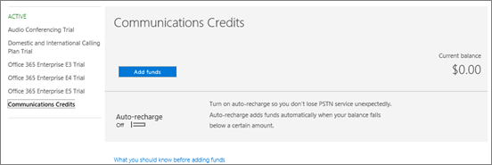

# Skype for Business と Microsoft Teams のアドオン ライセンス

他のすべてのアドオン ・ オプションについて説明する必要がありますか。[ビジネス製品 - 管理者ヘルプのサポートに問い合わせてください](http://support.office.com/article/32a17ca7-6fa0-4870-8a8d-e25ba4ccfd4b)。
  
Skype ビジネスとマイクロソフト チームのライセンスは、最大限の柔軟性を提供する設計されています。 たとえば、基本的な Skype for Business の機能をしばらく使った後で、電話会議や Office 365 での電話システムなどの追加の機能を使用する状況になったときに、アドオン ライセンスを購入できます。
  
 **価格を検索してください。** [価格を表示し、アドオンのライセンスを購入する方法](skype-for-business-and-microsoft-teams-add-on-licensing.md#bkmk_how)や、次のいずれかを参照してください。
  
- [電話会議の料金](https://products.office.com/en-us/skype-for-business/audio-conferencing#requirements)
    
- [電話システムの料金](https://products.office.com/en-us/skype-for-business/phone-system#requirements)
    
- [通話プランの価格設定](https://products.office.com/en-us/skype-for-business/calling-plans#requirements)
    
## アドオン ライセンスとは何ですか。

アドオン ライセンスは特定の Skype for Business の機能および Microsoft Teams の機能のライセンスです。 企業によっては、特定の機能を状況に応じて手頃な価格で購入しようという場合があります。 機能を追加するには、それを使用するユーザーごとに 1 つのアドオン ライセンスを購入します。
  
 **アドオン ライセンスによる費用への影響** 多くの企業では、エンタープライズ プランでソフトウェアをバンドル購入することで、全体の費用が下がります。プランの一部としてではなく、いくつかのアドオン ライセンスを別個に購入すると、それらの合算した費用が通常は高くなる可能性があります。
  
## アドオン ライセンスで入手できる機能は何ですか。

すでにお持ちのプランに応じて、次の Skype for Business の機能および Microsoft Teams の機能のアドオン ライセンスを購入できます。
  
|||
|:-----|:-----|
|**機能**   |**説明**   |
|**電話会議**   |組織内のユーザーは、自分のコンピューターを使用する代わりに、ビジネスまたはマイクロソフトのチームの会議のため、Skype へのコールに電話を使用する必要があります。 このような状況で、電話会議機能を使用します。    オーディオ会議は、国または地域で利用可能なかどうかを調べるには、[オーディオ会議や予定を呼び出すための国および地域の可用性](../country-and-region-availability-for-audio-conferencing-and-calling-plans/country-and-region-availability-for-audio-conferencing-and-calling-plans.md)を参照してください。   を検索する方法をはるかにコストがある場合は、[オーディオ会議のための要件](https://products.office.com/en-us/skype-for-business/audio-conferencing#requirements)を参照してください。    |
|**会議へのダイヤルイン アクセスのための無料電話番号や、世界中の電話番号に発信して誰かを追加するために会議からダイヤルアウトする機能**   |オーディオ会議を追加する場合をお勧めする[通信のクレジットを設定](skype-for-business-and-microsoft-teams-add-on-licensing.md#bkmk_billing)します。   |
|**電話システム**   |PBX は会社内の電話システムです。Office 365 での電話システムは、Office 365 のホスト型の電話サービスです。従来式と革新的な PBX 機能の両方を備えていますが、複雑で高価な機器は必要ありません。[Office 365 での電話システムで利用できる機能](../what-is-phone-system-in-office-365/here-s-what-you-get-with-phone-system.md)。  を検索する方法をはるかにコストがある場合は、[電話システムの要件](https://products.office.com/en-us/skype-for-business/cloud-pbx#requirements)を参照してください。    |
|**通話プラン**   |ビジネス ユーザー向けの他の Skype への呼び出しを自由がする場合は、お客様のビジネスの電話番号を呼び出すことができることをユーザー[を呼び出すことを計画](calling-plans-for-office-365.md)します。 国内を呼び出すことを計画し、国内および国際は、Office 365 のプランを呼び出すことがあります。    を検索する方法をはるかにコストがある場合は、[計画を呼び出すための要件](https://products.office.com/en-us/skype-for-business/pstn-calling-plans#requirements)を参照してください。    |
|**Skype Room Systems v2**   |これはアドオンではありませんが、会議室にビデオ、音声、コンテンツの共有をもたらす機能です。「[Skype Room Systems v2 のライセンス](skype-for-business-and-microsoft-teams-add-on-licensing.md#bkmk_srs)」をご覧ください。  |
   
## Office 365 Business Premium プランのユーザー向けのガイダンス

[Office 365 Business Premium](https://products.office.com/en-us/business/office-365-business-premium) をお持ちの場合は、Skype for Business を使用して、該当のサブスクリプションが適用される会社内の他のユーザーに通話を発信することができます。たとえば、会社に 10 人の社員がいる場合は、Skype for Business を使用してお互いに通話したりインスタント メッセージを送ることができます。
  
 **社外のユーザーとの通話を発着信するには、次の 2 つのオプションがあります** 。
  
- **オプション 1。無料の [Skype アプリ](https://www.skype.com/)** を使用します。 非常に小規模なビジネスでは、(1-2 のユーザーなど) がある場合は、Skype のアプリケーションを使用してが移動する場合に適してします。 国内通話と国際通話で利用する場合は、より安価な手段となります。 まだ会議通話を押しながら、ビデオ通話は、してプレゼンテーション用にデスクトップを共有できます。 [レートと支払オプションをチェック アウト](https://secure.skype.com/en/calling-rates?wt.mc_id=legacy&amp;expo365=bundled)します。
    
    Skype アプリは Office 365 スイートの一部ではないため、Skype for Business のように Outlook 2016 に統合されることはありません。このため、Outlook 2016 の連絡先は Skype に表示されませんので、Skype に連絡先を追加する必要があります。
    
    最初は Skype アプリをご使用いただいて、お客様のニーズに合うものかご確認いただくことをお勧めします。ニーズに合わない場合は、次のオプションでご利用のプランをアップグレードすることをご検討ください。
    
    **重要**: 従業員が Skype for Business を使用して Skype ユーザーを検索できるようにトグルを設定する必要があります。 [ビジネス ユーザー向けの Skype は、Skype 連絡先を追加する](../set-up-skype-for-business-online/let-skype-for-business-users-add-skype-contacts.md)を参照してください。
    
- **オプション 2 です。計画をアップグレードし、電話システムと国内または国内および国際呼び出しのプランを購入する**です。

    > [!Important]
    > Skype のビジネス オンライン計画 2 では、Office ビジネス プレミアム サブスクリプションの場合、**クラウドの音声機能の呼び出しを追加することはできません**が含まれています。 そのためよりコスト効率の高いかどうかをエンタープライズ E5 (またはエンタープライズ E3) の計画を評価することをお勧めします。
    
1. [別の一般法人向け Office 365 プランに切り替える](http://support.office.com/article/73318661-8f33-478b-bcc7-fb8d69dbb22a)。 コスト効率の高いかどうかをエンタープライズの E5 の計画を評価することをお勧めします。
    
2. **電話システム** アドオンを購入します。
    
3. [Office 365 のプランを呼び出すこと](calling-plans-for-office-365.md)を購入: のみを購入できるこの**電話システム**のアドオンを購入した後です。
    
    この 2 番目のオプションは、外部との通話の発着信を行うユーザーを何人か抱えている会社に適しています。
    
## 追加の機能を入手するために購入する必要があるアドオン ライセンスは何ですか。

アドオン ライセンスでは数多くのオプションがあるため、混乱する可能性があります。各オプションについてのご説明が必要な場合は、[一般法人向け Office 365 のサポートへのお問い合わせ - 管理者向けヘルプ](http://support.office.com/article/32a17ca7-6fa0-4870-8a8d-e25ba4ccfd4b)
  
以下で使用しているプランを選択して、追加の Skype for Business および Microsoft Teams の機能を入手するために購入できるアドオン ライセンスをご確認ください。
  
### Office 365 Premium、Office 365 ProPlus、Skype for Business Online Plan 2

すでに [Office 365 Business Premium](https://products.office.com/en-us/business/office-365-business-premium)、[Office 365 ProPlus](https://products.office.com/en-us/business/office-365-proplus-business-software)、[Skype for Business Online Plan 2](https://products.office.com/en-us/skype-for-business/online) などのプランを購入済みの場合に、Skype for Business のその他の機能を利用するために購入する必要があるアドオン ライセンスは次のとおりです。

> [!IMPORTANT] 
> オーディオ会議、電話システムおよび計画を呼び出すことは、Skype 音声の機能の呼び出しを有効にするのにはプラン 2 のオンライン ビジネスを購入できよりコスト効率の高いかどうかをエンタープライズの E5 の計画を評価することお勧めします。

|||
|:-----|:-----|
|**この機能を追加するには**   |**購入する必要のあるもの**   |
|**電話会議**   スケジュールまたはダイヤルイン会議をホストする各ユーザーに対して 1 つ**のオーディオ会議**のライセンスを購入します。 Attendees do not need licenses.   |**オーディオ会議**のアドオン  ライセンスを購入すると、Microsoft が電話会議プロバイダーになります。 |
|**世界中の任意の電話番号を呼び出すことによって他のユーザーを追加するのには、会議、および会議から発信する機能には、ダイヤルイン アクセスのフリー ダイヤルの番号**   |[通信のクレジット](skype-for-business-and-microsoft-teams-add-on-licensing.md#bkmk_billing)|
|**電話システム**   |1。[ビジネス計画の別の Office 365 に切り替える](http://support.office.com/article/73318661-8f33-478b-bcc7-fb8d69dbb22a)。 プラン 2 のオンライン ビジネスの Office 365 用リソース、または Skype がある場合は、クラウドに音声機能を利用するエンタープライズ E5 プランに、計画のアップグレードをお勧めします。 エンタープライズ E1 または E3 プランにアップグレードする場合は、**電話システム**のアドオンを購入するためのオプションが表示されます。   2**電話システム**のアドオン。    3. 通話プラン: の購入から Office 365[を呼び出すことを計画](calling-plans-for-office-365.md)します。    または、[既存のプロバイダーからの電話サービス](skype-for-business-and-microsoft-teams-add-on-licensing.md#bkmk_existing)を使用します。    |
|**通話プラン**   |1。[ビジネス計画の別の Office 365 に切り替える](http://support.office.com/article/73318661-8f33-478b-bcc7-fb8d69dbb22a)。    2**電話システム**のアドオン。   3。[通話プラン](calling-plans-for-office-365.md): のみを購入できるこの**電話システム**のアドオンを購入した後です。   |
   
> [!NOTE]
> Skype for Business Online プラン 2 またはエンタープライズ プランをご利用の場合は、 **電話会議**アドオンを購入する代わりに、サードパーティーの電話会議プロバイダーを使うことを選べます。このプロバイダーでも、お客様の電話会議ブリッジを開催できます。
  
### Office 365 Enterprise E1、E3、E4

すでに [Office 365 Enterprise E1](https://products.office.com/en-us/business/office-365-enterprise-e1-business-software)、[E3](https://products.office.com/en-us/business/office-365-enterprise-e3-business-software)、または E4 プランを購入済みの場合、Skype for Business および Microsoft Teams のその他の機能を利用するために購入する必要があるアドオン ライセンスは次のとおりです。
  
|||
|:-----|:-----|
|**この機能を追加するには**   |**購入する必要のあるもの**   |
|**電話会議**   スケジュールまたはダイヤルイン会議をホストする各ユーザーに対して 1 つ**のオーディオ会議**のライセンスを購入します。 Attendees do not need licenses.   |**オーディオ会議**のアドオン  ライセンスを購入すると、Microsoft が電話会議プロバイダーになります。 |
|**世界中の任意の電話番号を呼び出すことによって他のユーザーを追加するのには、会議、および会議から発信する機能には、ダイヤルインのアクセスのフリー ダイヤルの番号**   |[通信のクレジット](skype-for-business-and-microsoft-teams-add-on-licensing.md#bkmk_billing)|
|**電話システム**   |1 **office 365 の電話システム**のアドオン。   2. 通話プラン: の購入から Office 365[を呼び出すことを計画](calling-plans-for-office-365.md)します。    または、[既存のプロバイダーからの電話サービス](skype-for-business-and-microsoft-teams-add-on-licensing.md#bkmk_existing)を使用します。    |
|**電話システム ボイスメール**   |E1 と E4 プランの場合は、Exchange Online Plan 2 を購入します。  または、Office 365 E3 などの Exchange Online Plan 2 に同梱されてくる Office Suite に切り替えます。 |
|**通話プラン**   |1**電話システム**のアドオン。   2。[通話プラン](calling-plans-for-office-365.md): のみを購入できるこの**電話システム**のアドオンを購入した後です。   |
   
> [!NOTE]
> Skype for Business Online プラン 2 を含んでいるエンタープライズ プランの場合は、 **電話会議**アドオンを購入する代わりに、サードパーティの電話会議プロバイダーを使うことを選択できます。このプロバイダーでも、お客様の会議ブリッジを開催できます。
  
### Office 365 Enterprise E5 (電話会議なし)

すでに Office 365 Enterprise E5 (電話会議なし) プランを購入済みの場合、その他の機能を利用するために購入する必要がある Skype for Business および Microsoft Teams のアドオン ライセンスは次のとおりです。
  
|||
|:-----|:-----|
|**この機能を追加するには**   |**購入する必要のあるもの**   |
|**電話会議**   | このアドオンを取得するには、次を実行します。    1. 場合は、E5 の計画を既に購入した場合、音声会議機能が使用できない、国や地域では、サード ・ パーティ製のオーディオ会議プロバイダーを使用する必要があります。 サードパーティーの電話会議プロバイダーは、[Microsoft PinPoint](https://go.microsoft.com/fwlink/?LinkId=797530) で見つけてください。      オーディオ会議を国や地域で利用できるかどうかをこの資料の確認:[オーディオ会議や予定を呼び出すための国および地域の可用性](../country-and-region-availability-for-audio-conferencing-and-calling-plans/country-and-region-availability-for-audio-conferencing-and-calling-plans.md)    2. 利用可能である場合は、それを含む Office 365 エンタープライズ E5 に移動する[スイッチ プランのボタン](http://support.office.com/article/73318661-8f33-478b-bcc7-fb8d69dbb22a)を使用します。 その他に多数の機能もご利用いただけます。   |
|**電話会議は含まれています。**   | 通話プラン: の購入から Office 365[を呼び出すことを計画](calling-plans-for-office-365.md)します。    または、[既存のプロバイダーからの電話サービス](skype-for-business-and-microsoft-teams-add-on-licensing.md#bkmk_existing)を使用します。    |
|**電話システム ボイスメールは含まれています。**   |他に必要なものはありません。    |
   
### Office 365 Enterprise E5

[Office 365 Enterprise E5](https://products.office.com/en-us/business/office-365-enterprise-e5-business-software) プランには、Skype for Business および Microsoft Teams のほとんどの機能が含まれています。追加のオプションがいくつか用意されています。
  
|||
|:-----|:-----|
|**この機能を追加するには**   |**購入する必要のあるもの**   |
|**電話会議は含まれています。**   |ライセンスを購入すると、Microsoft が電話会議プロバイダーになります。    |
|**世界中の任意の電話番号を呼び出すことによって他のユーザーを追加するのには、会議、および会議から発信する機能には、ダイヤルインのアクセスのフリー ダイヤル番号です。**   |[通信のクレジット](skype-for-business-and-microsoft-teams-add-on-licensing.md#bkmk_billing)|
|**電話システムおよびボイスメールは含まれています。**   |通話プラン: の購入から Office 365[を呼び出すことを計画](calling-plans-for-office-365.md)します。    または、[既存のプロバイダーからの電話サービス](skype-for-business-and-microsoft-teams-add-on-licensing.md#bkmk_existing)を使用します。 |
   
## 価格の確認とアドオン ライセンスの購入方法

 **Office 365 プランの購入後に、価格とアドオンが Office 365 管理センター** に表示されます。
  
必要なアドオンに応じて、該当する機能をすでに含んでいるプランに切り替えることで[コスト効率が高いかどうかを比較する](https://go.microsoft.com/fwlink/?linkid=844053)ことをお勧めします。
  
以下のセクションを展開すると、価格およびご利用のプランのアドオンを入手する方法を確認できます。
  
### Office 365 Business Premium のお客様: 価格の表示方法と購入方法

 **電話会議と通信クレジットを取得するには:**
  
1. Office 365 管理センターにサインインします。
    
2. Go to **Billing** > **Subscriptions** > **Add-ons** > **Buy add-ons**.
    
    
  
3. 電話会議を購入して通信クレジットをセットアップするための価格とオプションが表示されるようになります。
    
**電話システムと通話プランを取得するには:**
  
1. E1 か E3 プランに切り替えます。
    
2. Go to Office 365 admin center > **Billing** > **Subscriptions**.
    
3. [ **アドオン**] を選択します。これで、電話システムの価格と、それを購入するためのオプションが表示されます。
    
4. **電話システム** ライセンスを購入すると、通話プランを購入するオプションと価格が表示されます。
    
### E1 と E3 のお客様: 価格の表示方法と購入方法

1. Office 365 管理センターにサインインします。
    
2. Go to **Billing** > **Subscriptions** > **Add-ons** > **Buy add-ons**.
    
    
  
3. **電話システム** ライセンスを購入すると、通話プランを購入するオプションと価格が表示されます。
    
### パートナー: 価格の表示方法と購入方法

E3 プランはお持ちの Action Pack に含まれています。 **電話システム**と **電話会議**のアドオンを購入するには、次を実行します。
  
1. [マーケティング用 web サイト](https://go.microsoft.com/fwlink/?LinkId=24393)から E3 の 1 つの座席を購入してください。 既存のテナントにシートに追加するためのオプションを選択します。
    
2. Sign in to the Office 365 admin center and go to **Billing** > **Subscriptions** > **Add-ons**.
    
    これにより、 **電話システム**と **電話会議**のアドオンを購入するためのオプションと価格が表示されます。
    
## アドオンを購入するオプションが表示されないのはどうしてですか?

特定の状況において、Skype for Business および Microsoft Teams のアドオンを購入するオプションが Office 365 管理センター に表示されません。
  
- **Office 365 Business Premium を GoDaddy** から購入されています。 この場合は、Skype for Business および Microsoft Teams のアドオンはご購入いただけません。 (これは、GoDaddy を販売しません)、E3 計画に切り替えるには必要し、し、それらを購入できます。 [ビジネス製品 - 管理者ヘルプのサポートに問い合わせてください](http://support.office.com/article/32a17ca7-6fa0-4870-8a8d-e25ba4ccfd4b)。
    
- **年間契約ではなく月単位の契約を結んでいます** 。 場合によっては、月単位の契約のユーザーはアドオンを購入いただけません (支払方法が月単位の場合は該当しません)。 これは、既知の問題を修正しています。 [ビジネス製品 - 管理者ヘルプのサポートに問い合わせてください](http://support.office.com/article/32a17ca7-6fa0-4870-8a8d-e25ba4ccfd4b)。
    
    
  
## 通信クレジットをセットアップする方法

通信クレジットにサインアップする前に、次のアドオンが最小要件として必要です。
  
- 電話システムと通話プラン
    
- または、電話会議
    
これらがある場合のサインアップ方法は次のとおりです。
  
1. Office 365 管理センターにサインインします。
    
2. Go to **Billing** > **Subscriptions** > **Communications Credits**.
    
    
  
3. [ **預金**] を選びます。[ **自動請求**] を設定して残高がなくなることがないようにすることを推奨します。残高がなくなると、ユーザーによる通話の実行が禁止されます。
    
4. 通信クレジットにサインアップした後、通信クレジットのライセンスを、会社内の通話を行う各ユーザーに割り当てる必要があります。利用できるライセンスの数に制限はありません。
    
    
  
## Skype Room Systems v2 のライセンス

次の表に、[Skype Room Systems バージョン 2 のヘルプ](https://support.office.com/article/e667f40e-5aab-40c1-bd68-611fe0002ba2) で利用できる機能と、それらを取得するためにどのライセンスを購入する必要があるかを示します。
  
> [!NOTE]
> セットアップされている会議室はユーザー オブジェクトであり、該当するライセンスが割り当てられている必要があります。 
  
|||||
|:-----|:-----|:-----|:-----|
|**Skype Room System のシナリオ**   |**ビジネス プラン 2 のスタンドアロン Office 365 のプレミアム、Office 365 の ProPlus0、または Skype がある現在です。**   **購入する必要のあるもの:**   |**現在、Enterprise ベースのプランをご利用の場合。**   **購入する必要のあるもの:**   |**Skype for Business Server 2015 (オンプレミスまたはハイブリッド) をご利用の場合。**   **購入する必要のあるもの:**   |
|スケジュールされたミーティングに参加します。    |Skype for Business スタンドアロン プラン 1    |E1、3、4、または 5    |Skype for Business Server Standard CAL    |
|臨時の会議を開始します。    |Skype for Business スタンドアロン プラン 2    |E1、3、4、または 5    |Skype for Business Server Standard CAL    Skype for Business Server Enterprise CAL    |
|臨時の会議を開始し、会議の電話番号にダイヤルします。    |電話会議付きの Skype for Business スタンドアロン プラン 2    **注:**通信のクレジットは、省略可能です。           |電話会議付きの E1 または E3    または    E5    |Skype for Business Standard CAL    Skype for Business Server Enterprise CAL    |
|会議室に電話番号を設定して、その会議室からの通話を受けたり、その電話番号を使って電話会議に参加したりします。    |スタンドアロンのビジネス ・ プランと Office 365 の電話システムの 2 と通話プランの Skype    **注:**通信のクレジットは、省略可能です。           |Office 365 の電話システムおよび Office 365 の通話プラン付きの E1 または E3    または    E5    |Skype for Business Server Standard CAL    Skype for Business Server Plus CAL    |
   
 **使用して適切なバージョンの Windows 10**: お客様は、デバイスに 10 の Windows イメージを展開する、Windows の 10 の特定のバージョンが必要と、このバージョンは、ボリューム ライセンスのお客様に利用可能なだけです。 Skype Room System v2.0 デバイスのイメージングには、 **Windows 10 バージョン 1607 以降** を使用する必要があります。 [ボリューム ライセンス サービス センター](https://www.microsoft.com/Licensing/servicecenter/)からコピーを取得することができます。
  
## 各プランの価格と通信クレジットの料金

- [Office 365 Enterprise プランの価格](https://go.microsoft.com/fwlink/?LinkId=716844)
    
- [通話プランの価格](https://go.microsoft.com/fwlink/?LinkId=799761)。この情報はページの下部にあります。
    
- [電話会議の追加機能プランの料金](https://go.microsoft.com/fwlink/?LinkId=799762)。この情報はページの下部にあります。
    
- [機能の詳細を提供する電話システムのマーケティング サイト](https://go.microsoft.com/fwlink/?LinkId=799763)
    
## 既存の通信プランと Skype for Business を組み合わせて使用する方法

既存の通話プランを使用する場合は、 **電話システム**のアドオンを購入して、 **[無料のクラウド コネクタ](https://technet.microsoft.com/en-us/library/mt605227.aspx)** と組み合わせてご使用ください。
  
ハイブリッド ユーザー向けにオンプレミス PSTN 接続を使用している場合は、 *電話システム*  のライセンス **のみ**をユーザーに割り当てる必要があります。同時に PSTN 通話プランも割り当て **ないでください** 。
  
電話システムを設置した PSTN 接続を含め、展開の計画に関する詳細なドキュメントは、 [Office 365 (クラウド PBX) ソリューションの電話システムの計画](https://technet.microsoft.com/en-us/library/mt612869.aspx)を参照してください。
  
## プランの詳細

各 Skype for Business プランの機能の詳細な一覧については、「[Skype for Business Online サービスの説明](https://go.microsoft.com/fwlink/?LinkId=730729)」をご覧ください。
  
## GOV、EDU、および非営利組織にどのような機能を利用しますか。

|**Skype for Business の機能**|**政府機関 (GCC) で使用可能**|**政府機関 (非 GCC) で使用可能**|**教育機関で使用可能**|**非営利団体で使用可能**|
|:-----|:-----|:-----|:-----|:-----|
|Skype 会議ブロードキャスト    |はい    |あり    |なし    |はい    |
|Skype for Business 電話会議    |はい    |あり    |あり    |はい    |
|Office 365 電話システム    |はい    |あり    |あり    |はい    |
|Office 365 国内通話プラン    |はい    |あり    |あり    |はい    |
   
ブログの投稿記事「[Advanced Office 365 capabilities now available to U.S. Government Community Cloud customers](https://blogs.office.com/2017/01/17/advanced-office-365-capabilities-now-available-to-u-s-government-community-customers/)」をご覧ください。
  
## 21Vianet が運用している Office 365 で使用可能な機能は何ですか

中国の 21Vianet が運用している Office 365 を使用するお客様は、すべての Skype for Business 機能ではなく一部の機能をご使用いただけます。 使用できないもののリストは、 [21Vianet によって運営されて Office 365 について](http://support.office.com/article/A8AB5061-3346-4DA0-BB7C-5260822B53AE)を参照してください。
  

[!INCLUDE [LinkedIn Learning Info](../../common/office/linkedin-learning-info.md)]
   
## このモジュールは、64 ビットのコンピューターでのみサポートされ、Microsoft ダウンロード センターの「Skype for Business Online 用 Windows PowerShell モジュール」からダウンロードできます。

- [Skype for Business Online のセットアップ](../set-up-skype-for-business-online/set-up-skype-for-business-online.md)
    
- [Skype for Business および Microsoft Teams の電話会議のセットアップ](../audio-conferencing-in-office-365/set-up-audio-conferencing.md)
    
- [電話システム ボイスメールのセットアップ - 管理者ヘルプ](../what-is-phone-system-in-office-365/phone-system-voicemail/set-up-phone-system-voicemail.md)
    
- [プランの呼び出しを設定](../what-are-calling-plans-in-office-365/set-up-calling-plans.md)し、 [Office 365 のプランを呼び出す](calling-plans-for-office-365.md)
    
- [利用可能残高を追加してコミュニケーション クレジットを管理する](add-funds-and-manage-communications-credits.md)
    
- [クラウド コネクタを構成して](https://technet.microsoft.com/en-us/library/mt605228.aspx)、[クラウドのコネクタをダウンロード](https://aka.ms/CloudConnectorInstaller)
    
## フィードバックですか。
製品に関するフィードバックを提供するには、かをお知らせいただいて、取り組み方は、 [Skype](https://www.skypefeedback.com)を参照してください。