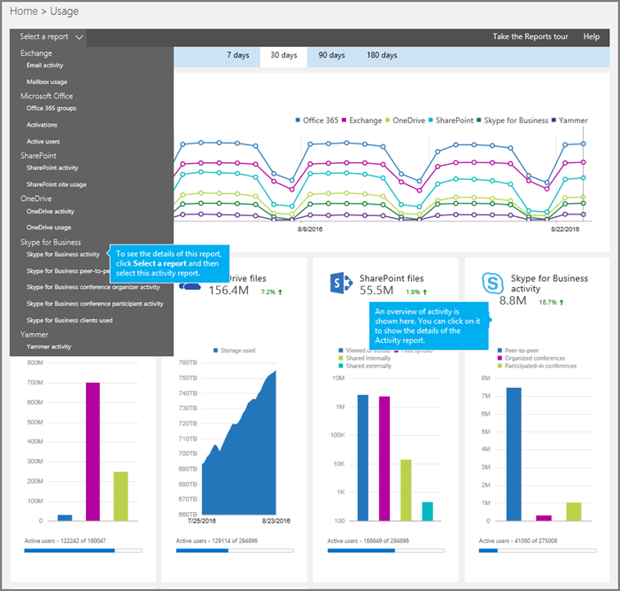

# アクティビティ レポート

[] 新しい Office 365 の [ **レポート**] ダッシュボードには、組織内の Office 365 製品全体にわたるアクティビティの概要が表示されます。 個々の製品レベルレポートにドリルインして、各製品内のアクティビティについて、より詳細な洞察を得ることができます。 たとえば、 **Skype For business アクティビティ**レポートを使用して、ユーザーがどの程度ピアツーピアまたは開催された会議セッションを使用しているか、または会議セッションに参加しているかどうかを確認できます。 

詳細については、 [「レポートの概要」](https://support.office.com/article/0d6dfb17-8582-4172-a9a9-aed798150263)をご覧ください。
  
このレポートと他の Skype for Business レポートを使用すると、組織全体のアクティビティについて詳しく知ることができます。 これらの詳細は、組織でその他のビジネス上の決定を調査、計画、実行しているときに役立ちます。
  
> [!NOTE]
> Microsoft 365 管理センターで、管理者としてログオンすると、すべての Skype for Business レポートを表示できます。 
  
## Skype for Business アクティビティレポートを取得する方法

1. [管理センター >**レポート** > の**利用状況]** に移動します。
    
2. [**利用状況**] ページで、左側の [レポートの**選択] リスト**の [ **skype for business アクティビティ**] をクリックするか、[ **skype for business アクティビティ**] ウィジェットをクリックします。
    
     
  
    > [!IMPORTANT]
    > 使用している Office 365 サブスクリプションによっては、ここに表示される製品やレポートの一部が表示されない場合があります。 
  
## Skype for Business アクティビティレポートを解釈する

[**アクティビティ**] と [**ユーザー** ] のグラフを見ると、ユーザーの Skype for business アクティビティを把握できます。
  

  
***
 
**Skype For Business アクティビティ**のメールアクティビティレポートでは、過去7日間、30日間、90日間、または180日間の傾向を確認できます。 ただし、レポート内の特定の日をクリックした場合、テーブル (「数値7」を参照) では、現在の日付 (レポートが生成された日付ではなく) に最大28日間のデータが表示されます。

> [!NOTE]
> 特定の日の詳細をクリックすると、レポートが生成された日付までの30日間のデータのみが表示されます。

***
 
各レポートには、このレポートが生成された日付が表示されます。 通常、レポートには、アクティビティの時刻からの 24 ~ 48 時間の遅延時間が反映されます。 
***
 
**アクティビティ**グラフ上の対話型グラフデータを使用して、利用状況の傾向を把握し、組織内で保留中の会議活動の数を確認します。 組織全体の会議セッションに**開催**され、**参加**している**ピアツーピアセッション**の合計数と種類が表示されます。 
***
 
[**ユーザー** ] グラフの対話型グラフデータを使用して、利用状況の傾向を把握し、組織内で開催されている会議アクティビティに参加している一意のユーザーの数を確認します。 ユーザーの合計数と、会議セッションの**開催**、**参加**した**ピアツーピアセッション**の種類と共に表示されます。
***
 
凡例の項目をクリックして、グラフに表示する系列をフィルター処理できます。 たとえば、[**アクティビティ**] グラフで、**ピアツーピアセッション**、**整理**、または**参加**をクリックまたはタップして、それぞれに関連する情報のみを表示します。 この選択を変更しても、グリッド テーブルの情報は変更されません。 
***
 
各グラフには、「X」軸（水平）と「Y」軸（垂直）があります。
*    [**アクティビティ**] グラフの Y 軸は、開催された会議セッションのピアツーピア、開催、参加の合計数です。
*    [**ユーザー** ] アクティビティグラフの Y 軸は、各種類のピアツーピア、開催、会議に参加した個別ユーザーの数です。

どちらのグラフも、X 軸はこの特定のレポートで選択した日付範囲です。 
***
 
この表には、ユーザーごとのすべての会議活動の内訳が表示されています。 これにより、Skype for Business が割り当てられているすべてのユーザーと、その会議活動が表示されます。 表には、列を追加することができます。
* **Username**はユーザーの名前です。
* [ **削除済み**] はユーザーのライセンスが削除されたことを示します。  
  > [!NOTE]
  > 削除されたユーザーのアクティビティは、選んだ期間中にライセンスが付与されている限り、レポートに表示されたままになります。 [ **削除済み** ] 列は、アクティブではない状態になったユーザーが引き続きレポート内のデータに影響している可能性に注意するのに役立ちます。
     
* [ **削除日**] は、ユーザーのライセンスが削除された日付です。
* [**最後のアクティビティの日付 (UTC)** ] は、ユーザーがピアツーピアセッションに関わったか、または電話会議を開催したか、会議に参加した最新の時刻です。
* **ピア**ツーピア: ユーザーが使用したピアツーピア電話セッションの合計数を示します。
* **開催**された会議には、そのユーザーが開催した電話会議の合計数が表示されます。
* **[参加した会議:** このユーザーが参加した電話会議の合計数を表示します。
* [**割り当て製品**"は、このユーザーに割り当てられている Office 365 製品です。 

組織のポリシーにより、ユーザー情報が特定できるレポートを表示できない場合は、これらのすべてのレポートのプライバシー設定を変更することができます。 [管理センターのアクティビティレポート](https://support.office.com/article/0d6dfb17-8582-4172-a9a9-aed798150263)の [レポート] セクションで、[**ユーザーの詳細を非表示に**する] を確認します。
***
 
任意の列の**列**アイコンをクリックまたはタップして、レポートに列を追加または削除します。             
***
 
また、[ **エクスポート**] をクリックまたはタップして、レポート データを Excel の .csv ファイルにエクスポートすることもできます。             ![Skype for Business レポートの [エクスポート] ボタン。](../images/de7e2ab7-d70c-422f-a0ec-178b10f7dd51.png)  これにより、すべてのユーザーのデータがエクスポートされ、単純な並べ替えとフィルター処理を行ってさらに分析することができます。 ユーザー数が2000より少ない場合は、レポート内のテーブル内で並べ替えとフィルター処理を行うことができます。 ユーザー数が 2000 を超える場合は、フィルター処理と並べ替えを行うために、データをエクスポートする必要があります。 
   
## Skype for Business のその他のレポートを表示しますか?

- [Skype For business デバイスの使用状況レポート](device-usage-report.md)Skype for Business アプリがインストールされていて、それを IM および会議に使用している Windows ベースのオペレーティングシステムやモバイルデバイスなどのデバイスを表示することができます。
    
- [Skype for Business 電話会議開催者アクティビティ レポート](conference-organizer-activity-report.md) - ユーザーがどの程度 IM、音声/ビデオ、アプリケーション共有、Web、ダイヤルイン/アウト - サード パーティ、ダイヤルイン/アウト - Microsoft を使用した電話会議を開催しているかを確認できます。
    
- [Skype For business ピアツーピアアクティビティレポート](peer-to-peer-activity-report.md)ユーザーがどの程度 IM、音声/ビデオ、アプリケーション共有、ファイル転送を使用しているかを確認できます。
    
- [Skype For business ユーザーがブロック](users-blocked-report.md)されたレポートPSTN 通話の発信をブロックされている組織内のユーザーを確認できます。
    
- [Skype For BUSINESS PSTN 使用状況レポート](pstn-usage-report.md)通話の着信/発信に費やした時間 (分) を確認することができます。

- [Skype For BUSINESS PSTN 分単位のプールレポート](pstn-minute-pools-report.md)には、組織内の現在の月に消費された分数が表示されます。

- [Skype For business セッションの詳細レポート](session-details-report.md)個々のユーザの通話エクスペリエンスについての詳細を見ることができます。

    
## 関連トピック
[管理センターでのアクティビティレポート](https://support.office.com/article/0d6dfb17-8582-4172-a9a9-aed798150263)

  
 
