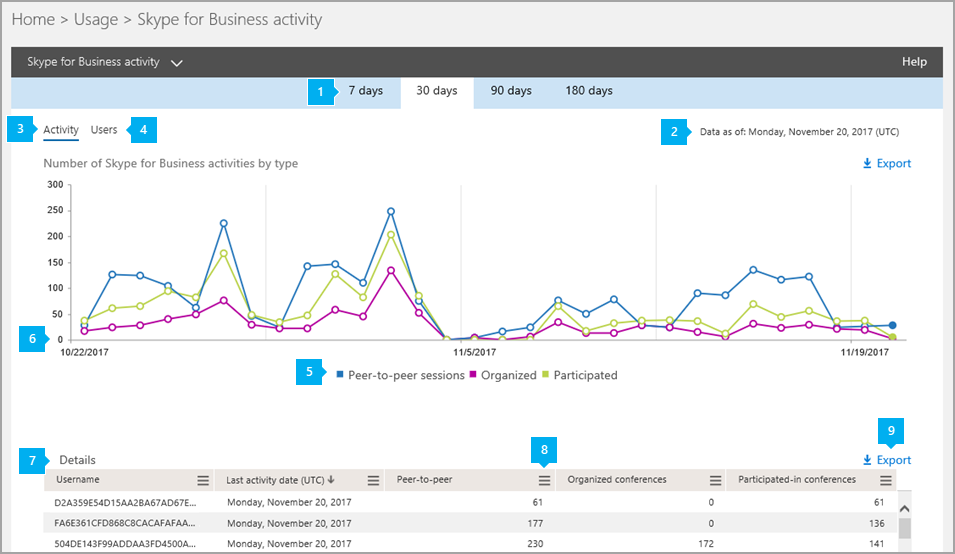

# アクティビティ レポート

[!INCLUDE [sfbo-retirement](../../Hub/includes/sfbo-retirement.md)]

[**レポート]** ダッシュボードには、組織内の製品のMicrosoft 365またはOffice 365アクティビティの概要が表示されます。 これにより、個々の製品レベルのレポートにドリルダウンして、各製品内のアクティビティに関するより詳細な分析情報を提供できます。 たとえば **、Skype for Business** アクティビティ レポートを使用して、ユーザーがピアツーピアまたは組織会議セッションを使用している量や、ユーザーが会議セッションに参加している量を確認できます。 

詳細については、「 [レポートの概要](https://support.office.com/article/0d6dfb17-8582-4172-a9a9-aed798150263) 」を参照してください。
  
このレポートは、他のレポートとSkype for Business、組織全体のアクティビティに関する詳細を示します。 これらの詳細は、組織でその他のビジネス上の決定を調査、計画、実行しているときに役立ちます。
  
> [!NOTE]
> 管理センターで管理者Skype for Businessログオンすると、すべてのレポートをMicrosoft 365できます。 
  
## アクティビティ レポートにアクセスSkype for Business方法

1. [レポートの使用状況] の管理>**に**  >  **移動します**。
    
2. [使用状況 **] ページ** で、左側 **Skype for Business** レポートの選択] リストで [アクティビティの選択] を選択するか、アクティビティ ウィジェットSkype for Business  >  **クリック** します。 

  
## アクティビティ レポートSkype for Business解釈する

[アクティビティ] グラフと [ユーザー] グラフをSkype for Business、ユーザーのアクティビティ **を****確認** できます。
  

  
***
 
[Skype for Business **アクティビティ** の電子メール アクティビティ レポートでは、過去 7 日間、30 日間、90 日間、または 180 日間の傾向を確認できます。 ただし、レポート内の特定の日をクリックすると、テーブル (数値 7 を参照) には、(レポートが生成された日付ではなく) 現在の日付から最大 28 日間のデータが表示されます。

> [!NOTE]
> 特定の日の詳細をクリックすると、レポートが生成された日付までの 30 日間のデータだけがテーブルに表示されます。

***
 
各レポートには、このレポートが生成された日付が表示されます。 レポートには、通常、アクティビティの時刻から 24 ~ 48 時間の待機時間が反映されます。 
***
 
[アクティビティ] グラフの対話型グラフ データを使用して、使用状況の傾向を把握し、組織内で開催されている会議アクティビティの数を確認します。 組織全体の電話会議セッションのピアツーピア **セッション、開催** セッション、参加セッションの総数と種類が表示されます。 
***
 
[ユーザー] グラフの対話型グラフ データを使用して、使用状況の傾向を把握し、組織内で開催されている会議アクティビティに参加している一意のユーザーの数を確認します。 ピアツーピア セッション、開催、および参加会議セッションの種類と共に、**ユーザーの** 総数が表示されます。
***
 
凡例の項目をクリックして、グラフに表示する系列をフィルター処理できます。 たとえば、[アクティビティ]グラフで[ピア **ツー** ピア セッション]、[**開催**]、または [参加] をクリックまたはタップすると、それぞれに関連する情報だけが表示されます。 この選択を変更しても、グリッド テーブルの情報は変更されません。 
***
 
各グラフには、「X」軸（水平）と「Y」軸（垂直）があります。
*    [ **アクティビティ]** グラフの Y 軸は、開催された会議セッションのピアツーピア、開催、および参加の総数です。
*    [ **ユーザー]** アクティビティ グラフの Y 軸は、ピアツーピア、開催、および会議に参加する各種類の一意のユーザーの数です。

どちらのグラフも、X 軸はこの特定のレポートで選択した日付範囲です。 
***
 
次の表は、ユーザーごとのすべての会議アクティビティの内訳を示しています。 これにより、ユーザーに割り当てられているSkype for Businessユーザーとその会議アクティビティが表示されます。 表には、列を追加することができます。
* **[ユーザー** 名] はユーザーの名前です。
* [ **削除済み**] はユーザーのライセンスが削除されたことを示します。  
  > [!NOTE]
  > 削除されたユーザーのアクティビティは、選択した期間中、ある時点でライセンスを取得した限り、レポートに表示されます。 [ **削除済み** ] 列は、アクティブではない状態になったユーザーが引き続きレポート内のデータに影響している可能性に注意するのに役立ちます。
     
* [ **削除日**] は、ユーザーのライセンスが削除された日付です。
* **最後のアクティビティの日付 (UTC)** は、ユーザーがピアツーピア セッションに参加した、または会議を開催した、または会議に参加した最新の時刻です。
* **ピアツーピアは、** ユーザーが使用したピアツーピア会議セッションの総数を示します。
* **[開催された電話** 会議] には、そのユーザーが開催した電話会議の総数が表示されます。
* **[参加した電話会議] には** 、このユーザーが参加した電話会議の総数が表示されます。
* **割り当** てられた製品はMicrosoft 365またはOffice 365に割り当てられている製品の一覧です。 

組織のポリシーでユーザー情報を特定できるレポートを表示できない場合は、これらのすべてのレポートのプライバシー設定を変更できます。 管理センターの **[アクティビティ レポート] の [レポート** でユーザーの詳細を非表示 [にする] セクションを確認します](https://support.office.com/article/0d6dfb17-8582-4172-a9a9-aed798150263)。
***
 
レポートの列を **追加** または削除するには、任意の列の [列] アイコンをクリックまたはタップします。             
***
 
また、[ **エクスポート**] をクリックまたはタップして、レポート データを Excel の .csv ファイルにエクスポートすることもできます。             ![Skype for Business[レポートのエクスポート] ボタン。](../images/de7e2ab7-d70c-422f-a0ec-178b10f7dd51.png)  これにより、すべてのユーザーのデータがエクスポートされ、単純な並べ替えとフィルター処理を行ってさらに分析することができます。 ユーザー数が 2,000 人未満の場合は、レポート自体のテーブル内で並べ替えとフィルター処理を行います。 ユーザー数が 2000 を超える場合は、フィルター処理と並べ替えを行うために、データをエクスポートする必要があります。 
   
## Skype for Business のその他のレポートを表示しますか?

- [Skype for Businessの使用状況レポート](device-usage-report.md)Skype for Business アプリがインストールされ、IM や会議に使用されている Windows ベースのオペレーティング システムやモバイル デバイスを含むデバイスを確認できます。
    
- [Skype for Business 電話会議開催者アクティビティ レポート](conference-organizer-activity-report.md) - ユーザーがどの程度 IM、音声/ビデオ、アプリケーション共有、Web、ダイヤルイン/アウト - サード パーティ、ダイヤルイン/アウト - Microsoft を使用した電話会議を開催しているかを確認できます。
    
- [Skype for Business ピアツーピア アクティビティ レポートの作成](peer-to-peer-activity-report.md)ユーザーが IM、音声/ビデオ、アプリケーション共有、ファイルの転送を使用している量を確認できます。
    
- [Skype for Businessブロックレポート](users-blocked-report.md)PSTN 通話がブロックされている組織内のユーザーを確認できます。
    
- [Skype for Business PSTN 使用状況レポート](pstn-usage-report.md)受信/送信呼び出しに費やされた分数と、これらの呼び出しのコストを確認できます。

- [Skype for Business PSTN 分](pstn-minute-pools-report.md)プール レポートでは、組織内の当月に消費された分数を確認できます。

- [Skype for Business詳細レポート](session-details-report.md)個々のユーザーの通話エクスペリエンスに関する詳細を確認できます。

    
## 関連トピック
[管理センターのアクティビティ レポート](https://support.office.com/article/0d6dfb17-8582-4172-a9a9-aed798150263)

  
 
