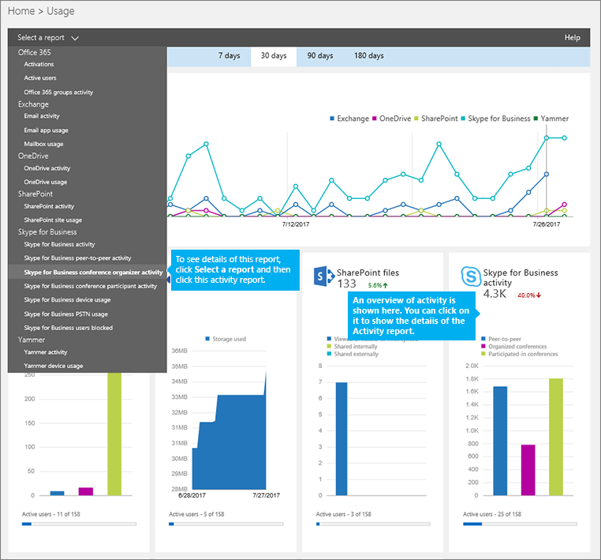
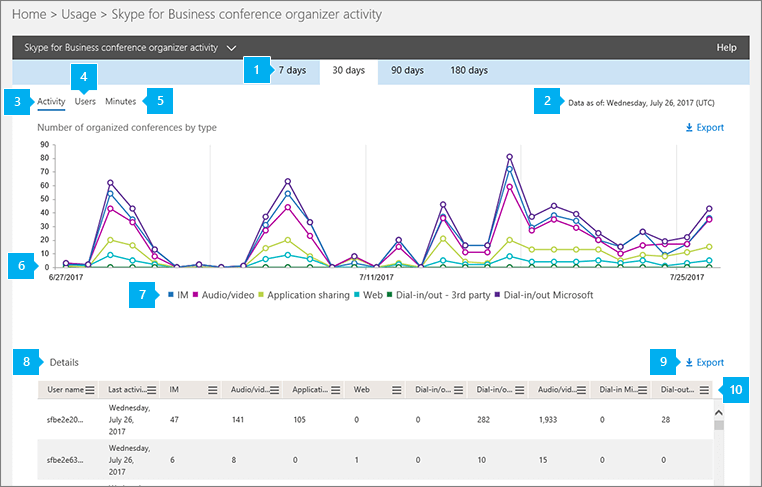

# 会議の開催者の活動レポート

[] 新しい Office 365 の [ **レポート**] ダッシュボードには、組織内の Office 365 製品全体にわたるアクティビティの概要が表示されます。 このダッシュボードでは、個々の製品レベルのレポートまで掘り下げ、各製品内のアクティビティについてより細かい洞察を得ることができます。 たとえば、[ **Skype for Business 電話会議開催者アクティビティ**] レポートを使用して、ユーザーが IM、音声/ビデオ、アプリケーション共有、Web、ダイヤルイン/アウト - サードパーティ、およびダイヤルイン/アウト - Microsoft を使用する電話会議をどれだけ開催しているかを確認できます。 

詳細については、[レポートの概要](https://support.office.com/article/0d6dfb17-8582-4172-a9a9-aed798150263)をご覧ください。
  
このレポートとは、ビジネス レポートの場合は、他の Skype 詳細を確認できます整理された会議の活動を組織全体にわたって。 これらの詳細は、組織でその他のビジネス上の決定を調査、計画、実行しているときに役立ちます。 
  
> [!NOTE]
> 管理者として Office 365 管理センターにログオンすると、すべての Skype for Business レポートを見ることができます。 
  
## Skype for Business 電話会議開催者レポートを取得する方法

1. **Office 365 管理センター**を参照して > **レポート** > **の使用率**です。
    
2. [**使用状況**] ページで、**レポートの一覧を選択して**左上に**Skype ビジネス会議の主催者活動**をクリックします。 または、 **Skype**ビジネス アクティビティのウィジェットをクリック**Skype** **ビジネス会議の主催者活動の Skype**ビジネス アクティビティの一覧にします。
    
     
  
    > [!IMPORTANT]
    > Office 365 のサブスクリプションによっては、ここで説明する製品やアクティビティ レポートの一部が表示されないことがあります。 
  
## Skype for Business 電話会議開催者レポートを解析する

**活動**、**ユーザー**、および**分**のグラフを見ていたから構成されているビジネス会議、Skype にビューを取得することができます。
  

  
***
 **Skype for Business 電話会議開催者アクティビティ** レポートでは、過去 7 日間、30 日間、90 日間、または 180 日間の傾向を確認できます。 ただし、クリックした場合、レポート内の特定の日に、テーブル (7 を参照してください) データが表示されます日までの 30 日間 (番号 2 を参照) のレポートが生成されました。

> [!NOTE]
> 特定の日の詳細をクリックすると、テーブルはレポートが生成された日付までの 30 日間のデータを表示のみです。

***
 各レポートには、このレポートが生成された日付が表示されます。 レポートは、通常、活動の時間から 24-48 時間の遅延時間を反映します。 
***
 [ **アクティビティ**] グラフの対話型グラフとリアルタイム データを使用して、使用状況の傾向を把握し、開催された電話会議の合計数と、組織で開催された電話会議のタイプを確認します。このグラフには、組織全体で開催された [ **IM**]、[ **音声/ビデオ**]、[ **アプリケーション共有**]、[ **Web**]、[ **ダイヤルイン/アウト - サード パーティ**]、[ **ダイヤルイン/アウト Microsoft**] の電話会議の合計数とタイプが表示されます。 
***
 [ **ユーザー**] グラフの対話型グラフとリアルタイム データを使用して、使用状況の傾向を把握し、組織で開催された電話会議の一意のユーザー数を確認します。このグラフには、開催された電話会議の [ **IM**]、[ **音声/ビデオ**]、[ **アプリケーション共有**]、[ **Web**]、[ **ダイヤルイン/アウト - サード パーティ**]、[ **ダイヤルイン/アウト Microsoft**] のタイプともに合計ユーザー数が表示されます。 
***
 [ **分**] グラフの対話型グラフとリアルタイム データを使用して、使用状況の傾向を把握し、Microsoft を電話会議プロバイダーとして音声/ビデオ、ダイヤルインとダイヤルアウトを使用した電話会議を開催した場合の、ユーザーが使用した分単位の通話時間を確認します。このグラフは、開催された電話会議中に使用された [ **音声/ビデオ**]、[ **ダイヤルイン Microsoft (分)**]、[ **ダイヤルアウト Microsoft (分)**] の合計通話時間が分単位で表示されます。
***
 
各グラフには、「X」軸（水平）と「Y」軸（垂直）があります。
*    [ **アクティビティ**] アクティビティ グラフの Y 軸は、組織内でユーザーが開催した電話会議の IM、音声/ビデオ、アプリケーション共有、Web、ダイヤルイン/アウト - サードパーティ、ダイヤルイン/アウト Microsoft の合計数です。 
*    [ **ユーザー**] アクティビティ グラフの Y 軸は、組織内でユーザーが開催した電話会議の IM、音声/ビデオ、アプリケーション共有、Web、ダイヤルイン/アウト - サードパーティ、ダイヤルイン/アウト Microsoft を行ったユーザーの合計数です。
*    **分**アクティビティ グラフで、Y 軸は分のオーディオ/ビデオ、ダイヤルイン マイクロソフト分、および、組織内のユーザーが構成されている会議のダイアル アウト マイクロソフトの分の合計数です。  

どちらのグラフも、X 軸はこの特定のレポートで選択した日付範囲です。 
***
 凡例の項目をクリックして、グラフに表示する系列をフィルター処理できます。たとえば、[ **アクティビティ**] グラフで [ **IM]**、[ **音声/ビデオ**]、[ **アプリケーション共有**]、[ **Web**]、[ **ダイヤルイン/アウト - サード パーティ**]、[ **ダイヤルイン/アウト - Microsoft**] をクリックまたはタップすると、それぞれに関連した情報のみが表示されます。この選択を変更しても、グリッド テーブルの情報は変更されません。
***
 この表は、ユーザーごとの、開催した電話会議アクティビティの内訳を示しています。また、Skype for Business が割り当てられているすべてのユーザーと、ユーザーが開催した電話会議を示しています。表に新しい列を追加することができます。 
*    [ **ユーザー名**] はユーザーの名前です。 
*    [ **削除済み**] はユーザーのライセンスが削除されたことを示します。  
    > [!NOTE]
    > 削除されたユーザーのアクティビティは表示されたままレポートに限り、彼または彼女は選択した期間中にいくつかの時にライセンス供与されていました。 [ **削除済み** ] 列は、アクティブではない状態になったユーザーが引き続きレポート内のデータに影響している可能性に注意するのに役立ちます。
     
*    [ **削除日**] は、ユーザーのライセンスが削除された日付です。 
*    [ **前回のアクティビティの日付 (UTC)**] は、ユーザーが前回アクティビティを行った日付 (UTC) です。 
*    [ **IM**] は、開催された IM 会議の合計数を示します。 
*    [ **音声/ビデオ**] は、開催された音声/ビデオ会議の合計数を示します。
*    [ **アプリケーション共有**] は、開催されたアプリケーション共有会議の合計数を示します。 
*    [ **Web**] は、開催された Web 会議の合計数を示します。 
*    **ダイヤル イン/アウト - サード ・ パーティ製**では、ダイアル ・ イン/アウト オーディオ会議の開催されたサード パーティ製のオーディオ会議プロバイダーを使用する合計数を表示します。 
*    **ダイアル ・ イン/アウトの Microsoft**は、整理されているダイアル ・ イン/アウト オーディオ会議の合計数を示しています。 
*    [ **音声/ビデオ通話分数**] は、音声/ビデオを使用した電話会議を開催したときに使用した合計時間を分単位で示します。 
*    **マイクロソフトでは、ダイヤルインの分**は、Microsoft を使用して、オーディオ会議プロバイダーとして構成された会議で使用される、ダイヤルインの分の合計数を示しています。 
*    **ダイヤルアウト用の Microsoft の分**は、Microsoft を使用して、オーディオ会議プロバイダーとして構成された会議で使用されるダイヤル ・ アウト分の合計数を示しています。 

組織のポリシーにより、ユーザー情報を特定できるレポートを表示できない場合は、これらすべてのレポートのプライバシー設定を変更できます。 チェック アウト、**ユーザー レベルの詳細を非表示にする方法ですか?** [Office 365 の管理センターでの活動レポート](https://support.office.com/article/0d6dfb17-8582-4172-a9a9-aed798150263)のセクション。
***
 また、[ **エクスポート**] をクリックまたはタップして、レポート データを Excel の .csv ファイルにエクスポートすることもできます。              これにより、すべてのユーザーのデータがエクスポートされ、単純な並べ替えとフィルター処理を行ってさらに分析することができます。ユーザー数が 2000 未満である場合は、レポート自体のテーブル内で並べ替えとフィルター処理を行うことができます。ユーザー数が 2000 を超える場合は、フィルター処理と並べ替えを行うために、データをエクスポートする必要があります。
***
 追加またはレポートから列を削除する列のいずれかの**列**のアイコンをタップまたはクリックします。             
   
## Skype for Business のその他のレポートを表示しますか?

- [Skype for Business アクティビティ レポート](activity-report.md) - ユーザーがどの程度ピアツーピア、開催、参加で電話会議セッションを使用しているかを確認できます。
    
- [Skype for Business クライアントの使用レポート](device-usage-report.md) - Windows ベースのオペレーティング システムとモバイル デバイスを含む、Skype for Business アプリがインストールされていて IM と会議に使用されるデバイスを確認できます。
    
- [Skype for Business 電話会議参加者アクティビティ レポート](conference-participant-activity-report.md) - 参加者がいる IM、音声/ビデオ、アプリケーション共有、Web 会議、ダイヤルイン/ダイヤルアウト会議の数を確認できます。
    
- [ピア ツー ピア アクティビティのレポートをビジネス用の Skype](peer-to-peer-activity-report.md)ユーザーに IM でのオーディオ/ビデオ、アプリケーション共有、およびファイルを転送するを使用している量を確認できます。
    
- [Skype ビジネス ユーザー向けには、レポートがブロックされています。](users-blocked-report.md)PSTN の呼び出しからブロックされている、組織内のユーザーを表示できます。
    
- [Skype ビジネス PSTN の使用状況レポート](pstn-usage-report.md)送信/受信の呼び出しに費やされ、これらの呼び出しのコストの数分の数を表示できます。
    
- [Skype](pstn-minute-pools-report.md)ビジネス PSTN 分プール レポートの現在の月に、組織内で消費される時間を分単位を表示できます。

- [Skype ビジネス セッション詳細レポート](session-details-report.md)個々 のユーザーの呼び出しの経験についての詳細を表示できます。

## このモジュールは、64 ビットのコンピューターでのみサポートされ、Microsoft ダウンロード センターの「Skype for Business Online 用 Windows PowerShell モジュール」からダウンロードできます。
[Office 365 管理センターのアクティビティ レポート](https://support.office.com/article/0d6dfb17-8582-4172-a9a9-aed798150263)

  
 
