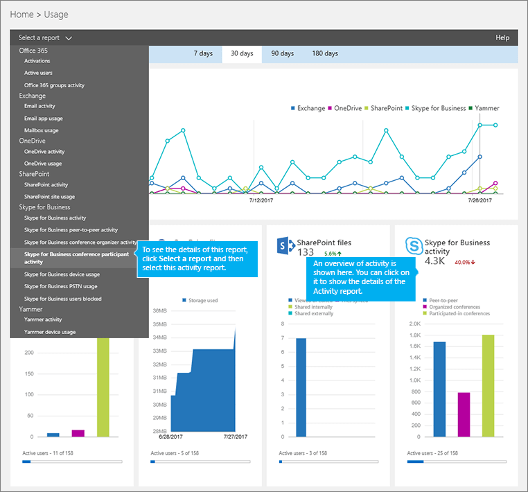
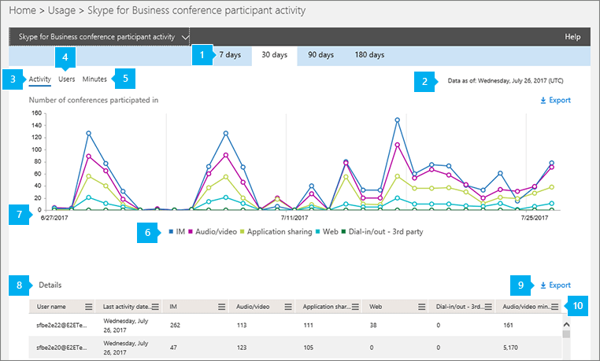

# 会議参加者の活動のレポートConference participant activity report

Office 365 管理者として新しい**レポート**のダッシュ ボード データを表示する、組織内で Office 365 製品の使用法にします。As an Office 365 admin, the new **Reports** dashboard shows you data on the usage of the Office 365 products within your organization. **Skype**ビジネス会議参加者の設定アクティビティのレポートを表示してどのように多くの IM、オーディオとビデオ、アプリケーション共有、Web を使用することができ、組織内のユーザーがダイアル ・ イン/アウトの会議に参加されているが。You can use the **Skype for Business conference participant activity** report to see how many IM, audio/video, application sharing, Web and and dial-in/out conferences are being participated in by users in your organization.

詳細については、[レポートの概要](https://support.office.com/article/0d6dfb17-8582-4172-a9a9-aed798150263)をご覧ください。Check out the [Reports overview](https://support.office.com/article/0d6dfb17-8582-4172-a9a9-aed798150263) to learn more.
  
このレポートとは、ビジネス レポートの場合は、他の Skype 詳細を確認できます会議の活動を組織全体にわたって。This report, along with the other Skype for Business reports, gives you details on conferencing activity across your organization. これらの詳細は、組織でその他のビジネス上の決定を調査、計画、実行しているときに役立ちます。These details are very helpful when you are investigating, planning, and making other business decisions for your organization.
  
> [!NOTE]
> 管理者として Office 365 管理センターにログオンすると、すべての Skype for Business レポートを見ることができます。You can see all of the Skype for Business reports when you log on as an administrator to the Office 365 admin center. 
  
## Skype for Business 電話会議参加者レポートを取得する方法How to get to the Skype for Business conference participant report

1. **Office 365 管理センター**を参照して > **レポート** > **の使用率**です。Go to the **Office 365 admin center** > **Reports** > **Usage**.
    
2. [**使用状況**] ページで、**レポートの一覧を選択して**左上に**Skype ビジネス会議参加者の設定アクティビティ**をクリックします。On the **Usage** page, click **Skype for Business conference participant activity** on the **Select a report list** on the left. または、 **Skype**ビジネス アクティビティのウィジェットをクリック**Skype** **ビジネス会議参加者の設定アクティビティの Skype**ビジネス アクティビティの一覧にします。Or, click the **Skype for Business activity** widget and then click **Skype for Business conference participant activity** on the **Skype for Business activity** list.
    
     
  
    > [!IMPORTANT]
    > Office 365 のサブスクリプションによっては、ここで説明する製品やアクティビティ レポートの一部が表示されないことがあります。Depending on the Office 365 subscription you have, you might not see all the products and activity reports shown here. 
  
## Skype for Business 電話会議参加者アクティビティ レポートを解析するInterpret the Skype for Business conference participant activity report

  
***
 **Skype for Business 電話会議参加者アクティビティ** レポートでは、過去 7 日間、30 日間、90 日間、または 180 日間の傾向を確認できます。The **Skype for Business Conference Participant Activity** report can be viewed for trends over the last 7 days, 30 days, 90 days, or 180 days. ただし、クリックした場合、レポート内の特定の日に、テーブル (7 を参照してください) データが表示されます日までの 30 日間 (番号 2 を参照) のレポートが生成されました。However, if you click into a particular day in the report, the table (see number 7) will show data for 30 days, up to the date (see number 2) for when the report was generated.
> [!NOTE]
> 特定の日の詳細をクリックすると、テーブルはレポートが生成された日付までの 30 日間のデータを表示のみです。If you click into the details of a specific day, the table will only show data for the 30 days up to the date when the report was generated.
     
***
 各レポートには、このレポートが生成された日付が表示されます。Each report has a date for when this report was generated. レポートは、通常、活動の時間から 24-48 時間の遅延時間を反映します。The reports usually reflect a 24- to 48-hour latency from time of activity. 
***
 [ **アクティビティ**] グラフの対話型グラフ データを使用して、使用状況の傾向を把握し、参加者がいた電話会議の合計数と、組織で開催された電話会議のタイプを確認します。 このチャートには、組織全体にわたる **IM**、 **音声/ビデオ**、 **アプリケーション共有**、 **Web**、 **ダイヤルイン/アウト - サード パーティ**の電話会議の合計数とタイプが表示されます。Use the interactive chart data on the **Activity** chart to understand usage trends and to see the total number of conferences that were participated in and the type of conferences that are being held in your organization. It will show you the total number and types of **IM**, **Audio/video**, **Application sharing**, **Web**, and **Dial-in/out - 3rd party** conferences that were participated in across your organization.
***
 [ **ユーザー**] グラフの対話型チャート データを使用して、使用状況の傾向を把握し、組織で開催された電話会議の一意のユーザー数を確認します。 このグラフには、合計ユーザー数と、開催された電話会議の、 **IM**、 **音声/ビデオ**、 **アプリケーション共有**、 **Web**、 **ダイヤルイン/アウト - サード パーティ**のタイプが表示されます。Use the interactive chart data on the **Users** chart to understand usage trends and to see the number of unique users that have participated in conferences that are being held in your organization. It will show you the total number of users along with the types of **IM**, **Audio/video**, **Application sharing**, **Web**, and **Dial-in/out - 3rd party** of conferences that were organized.
***
 **分**のグラフの利用状況の傾向を理解して、オーディオ/ビデオ、およびダイヤルインとダイヤルアウト用の電話会議のために Microsoft を使用してください。 会議を整理するときに、ユーザーが使用する分の数を確認するのには対話型のグラフのデータを使用してください。プロバイダーです。Use the interactive chart data on the **Minutes** chart to understand usage trends and to see the number of minutes that are used by users when they organize a conference using audio/video, and dial-in and dial-out - Microsoft as their audio conferencing provider. このグラフには、参加者がいた電話会議中に使用された **音声/ビデオ**の合計通話分数が表示されます。It will show you the total number of minutes of **Audio/video** that are used during conferences that were participated in.
***
 凡例の項目をクリックして、グラフに表示する系列をフィルター処理できます。たとえば、[ **アクティビティ**] グラフで [ **IM]**、[ **音声/ビデオ**]、[ **アプリケーション共有**]、[ **Web**]、または [ **ダイヤルイン/アウト - サード パーティ**] をクリックまたはタップすると、それぞれに関連した情報のみが表示されます。この選択を変更しても、グリッド テーブルの情報は変更されません。You can filter the series you see on the chart by clicking on an item in the legend. For example, on the **Activity** chart, click or tap **IM**, **Audio/video**, **Application sharing**, **Web**, and **Dial-in/out - 3rd party** to see only the info related to each one. Changing this selection doesn't change the info in the grid table. 
***
 各グラフには、「X」軸（水平）と「Y」軸（垂直）があります。Each chart has an 'X' (horizontal) and 'Y' (vertical) axis.  
*    [ **アクティビティ**] アクティビティ グラフの Y 軸は、組織内のユーザーが参加した IM、音声/ビデオ、アプリケーション共有、Web、ダイヤルイン/ダイヤルアウト サード パーティ電話会議の合計数です。On the **Activity** activity chart, the Y axis is the total number of IM, audio/video, application sharing, Web, and dial-in/out 3rd party conferences your users in your organization participated in. 
*    [ **ユーザー**] アクティビティ グラフの Y 軸は、組織内のユーザーが参加した IM、音声/ビデオ、アプリケーション共有、Web、ダイヤルイン/アウト - サード パーティ電話会議の合計ユーザー数です。On the **Users** activity chart, the Y axis is the total number users that held IM, audio/video, application sharing, Web, and dial-in/out 3rd party conferences your users in your organization participated in.
*    [ **分**] アクティビティ グラフの Y 軸は、組織内のユーザーが参加した電話会議で音声/ビデオが使用された合計通話分数です。On the **Minutes** activity chart, the Y axis is the total number of minutes that audio/video was used for conferences that your users in your organization participated in.

どちらのグラフも、X 軸はこの特定のレポートで選択した日付範囲です。The X axis on both charts is the selected date range for this specific report.
***
 この表は、ユーザーごとの、参加した電話会議アクティビティのブレークダウンを示しています。 また、Skype for Business が割り当てられているすべてのユーザーと、ユーザーが参加した電話会議を示しています。表には、追加の列を追加することができます。The table shows you a breakdown of the participated in conference activities per user. This shows all users that have Skype for Business assigned to them and conferences that they participated in. You can add additional columns to the table.
*    [ **ユーザー名**] はユーザーの名前です。**User name** is the name of the user. 
*    [ **削除済み**] はユーザーのライセンスが削除されたことを示します。**Deleted** indicates that the user's license was removed.     **注:** 削除されたユーザーのアクティビティは表示されたままレポートに限り、彼または彼女は選択した期間中にいくつかの時にライセンス供与されていました。**Note:**  Activity for a deleted user will still display in a report as long as he or she was licensed at some time during the selected time period. [ **削除済み** ] 列は、アクティブではない状態になったユーザーが引き続きレポート内のデータに影響している可能性に注意するのに役立ちます。The **Deleted** column helps you to note that the user may no longer be active, but contributed to the data in the report.      
*    [ **削除日**] は、ユーザーのライセンスが削除された日付です。**Deleted date** is the date on which the user's license was removed. 
*    [ **前回のアクティビティの日付 (UTC)**] は、ユーザーが前回アクティビティを行った日付 (UTC) です。**Last activity date (UTC)** is the last activity date (UTC) for that user.
*    [ **IM**] は、参加した IM 会議の合計数を示します。**IM** shows the total number of IM conferences that were participated in. 
*    [ **音声/ビデオ**] は、参加した音声/ビデオ会議の合計数を示します。**Audio/video** shows the total number of audio/video conferences that were participated in.
*    [ **アプリケーション共有**] は、参加したアプリケーション共有会議の合計数を示します。**Application sharing** shows the total number of application sharing conferences that were participated in.
*    [ **Web**] は、参加した Web 会議の合計数を示します。**Web** shows the total number of Web conferences that were participated in. 
*    [ **ダイヤルイン/アウト - サード パーティ**] は、サード パーティの電話会議プロバイダーを使用して開催されたダイヤルイン/アウト電話会議の合計数を示します。**Dial-in/out - 3rd party** shows the total number of dial-in/out conferences that were organized that use a 3rd party audio conferencing provider. 
*    [ **音声/ビデオ通話分数**] は、音声/ビデオを使用した電話会議に参加したときに使用した合計通話分数を示します。**Audio/video minutes** shows the total number of minutes used when used participated in conferences that used audio/video. 

組織のポリシーにより、ユーザー情報を特定できるレポートを表示できない場合は、これらすべてのレポートのプライバシー設定を変更できます。If your organization's policies prevents you from viewing reports where user information is identifiable, you can change the privacy setting for all these reports. チェック アウト、**ユーザー レベルの詳細を非表示にする方法ですか?** [Office 365 の管理センターでの活動レポート](https://support.office.com/article/0d6dfb17-8582-4172-a9a9-aed798150263)のセクション。Check out the **How do I hide user level details?** section in the [Activity Reports in the Office 365 admin center](https://support.office.com/article/0d6dfb17-8582-4172-a9a9-aed798150263).
***
 また、[ **エクスポート**] をクリックまたはタップして、レポート データを Excel の .csv ファイルにエクスポートすることもできます。You can also export the report data into an Excel .csv file, by clicking or tapping **Export**.              これにより、すべてのユーザーのデータがエクスポートされ、単純な並べ替えとフィルター処理を行ってさらに分析することができます。ユーザー数が 2000 未満である場合は、レポート自体のテーブル内で並べ替えとフィルター処理を行うことができます。ユーザー数が 2000 を超える場合は、フィルター処理と並べ替えを行うために、データをエクスポートする必要があります。This exports data of all users and enables you to do simple sorting and filtering for further analysis. If you have less than 2000 users, you can sort and filter within the table in the report itself. If you have more than 2000 users, in order to filter and sort, you will need to export the data.
***
 レポートに列を追加またはレポートから列を削除するには、[ **列**] をクリックまたはタップします。Click or tap **Columns** to add or remove columns from the report.             
   
## Skype for Business のその他のレポートを表示しますか?Want to see other Skype for Business reports?

- [Skype for Business アクティビティ レポート](activity-report.md) - ユーザーがどの程度ピアツーピア、開催、参加で電話会議セッションを使用しているかを確認できます。[Skype for Business activity report](activity-report.md) You can see how much your users are using peer-to-peer, organized, and participated in conferencing sessions.
    
- [Skype for Business クライアントの使用レポート](device-usage-report.md) - Windows ベースのオペレーティング システムとモバイル デバイスを含む、Skype for Business アプリがインストールされていて IM と会議に使用されるデバイスを確認できます。[Skype for Business device usage report](device-usage-report.md) You can to see the devices including Windows-based operating systems and mobile devices that have the Skype for Business app installed and are using it for IM and meetings.
    
- [Skype for Business 電話会議開催者アクティビティ レポート](conference-organizer-activity-report.md) - ユーザーがどの程度 IM、音声/ビデオ、アプリケーション共有、Web、ダイヤルイン/アウト - サード パーティ、ダイヤルイン/アウト - Microsoft を使用した電話会議を開催しているかを確認できます。[Skype for Business conference organizer activity report](conference-organizer-activity-report.md) You can see how much your users are organizing conferences that use IM, audio/video, application sharing, Web, dial-in/out - 3rd party, and dial-in/out - Microsoft.
    
- [Skype for Business ピアツーピア アクティビティ レポート](peer-to-peer-activity-report.md) - ユーザーがどの程度 IM、音声/ビデオ、アプリケーション共有、ファイル転送を使用しているかを確認できます。[Skype for Business peer-to-peer activity report](peer-to-peer-activity-report.md) You can see how much your users are using IM, audio/video, application sharing and transferring files.
    
- [Skype ビジネス ユーザー向けには、レポートがブロックされています。](users-blocked-report.md)PSTN の呼び出しからブロックされている、組織内のユーザーを表示できます。[Skype for Business users blocked report](users-blocked-report.md) You can see the users in your organization that have been blocked from making PSTN calls.
    
- [Skype ビジネス PSTN の使用状況レポート](pstn-usage-report.md)送信/受信の呼び出しに費やされ、これらの呼び出しのコストの数分の数を表示できます。[Skype for Business PSTN usage report](pstn-usage-report.md) You can see the number of minutes spent in inbound/outbound calls and cost for these calls.
    
- [Skype](pstn-minute-pools-report.md)ビジネス PSTN 分プール レポートの現在の月に、組織内で消費される時間を分単位を表示できます。[Skype for Business PSTN minute pools report](pstn-minute-pools-report.md) you can see the number of minutes consumed during the current month within your organization.

- [Skype ビジネス セッション詳細レポート](session-details-report.md)個々 のユーザーの呼び出しの経験についての詳細を表示できます。[Skype for Business session details report](session-details-report.md) You can see details about individual user's call experiences.
    
## このモジュールは、64 ビットのコンピューターでのみサポートされ、Microsoft ダウンロード センターの「Skype for Business Online 用 Windows PowerShell モジュール」からダウンロードできます。Related topics
[Office 365 管理センターのアクティビティ レポートActivity Reports in the Office 365 admin center](https://support.office.com/article/0d6dfb17-8582-4172-a9a9-aed798150263)

  
 