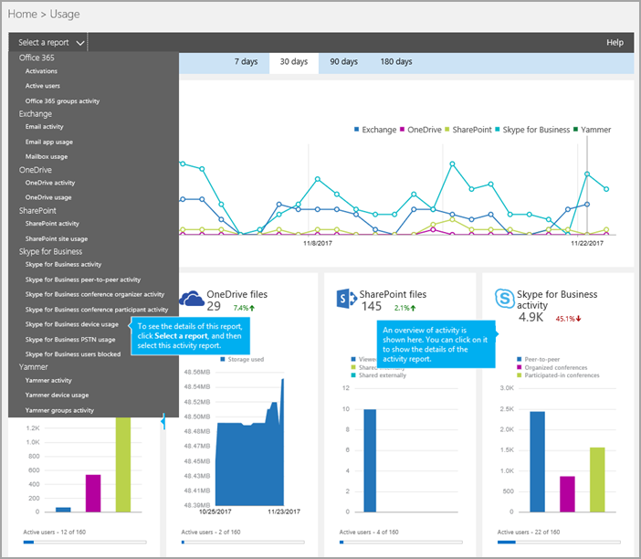

# デバイスの使用状況のレポート

[] 新しい Office 365 の [ **レポート**] ダッシュボードには、組織内の Office 365 製品全体にわたるアクティビティの概要が表示されます。 このダッシュボードでは、個々の製品レベルのレポートまで掘り下げ、各製品内のアクティビティについてより細かい洞察を得ることができます。 たとえば、 **Skype**ビジネス デバイスの使用状況のレポートを使用するには、Windows ベースのオペレーティング システムを含む、デバイスに、モバイル デバイスをビジネス アプリケーションの Skype がインストールされ、IM および会議のためのそれを使用しています。 

詳細については、[レポートの概要](https://support.office.com/article/0d6dfb17-8582-4172-a9a9-aed798150263)をご覧ください。
  
このレポートとは、ビジネス レポートの場合は、他の Skype によって、組織全体で使用されているクライアントとデバイスの種類の詳細情報が表示します。 これらの詳細は、組織でその他のビジネス上の決定を調査、計画、実行しているときに役立ちます。
  
> [!NOTE]
> 管理者として Office 365 管理センターにログオンすると、すべての Skype for Business レポートを見ることができます。 
  
## デバイスの使用状況レポートをビジネス用の Skype を取得する方法

1. **Office 365 管理センター**を参照して > **レポート** > **の使用率**です。
    
2. [**使用状況**] ページで、**レポートの一覧を選択して**左側の [**デバイスの使用状況をビジネス用の Skype**をクリックします。 または、 **Skype**ビジネス アクティビティのウィジェットをクリック**Skype** **ビジネス デバイスの使用状況の Skype**ビジネス アクティビティの一覧にします。
    
     
  
    Office 365 のサブスクリプションによっては、ここで説明する製品やアクティビティ レポートの一部が表示されないことがあります。
    
## デバイスの使用状況レポートをビジネスの Skype を解釈します。

使用している、Skype ビジネス アプリケーションの**ユーザー**と**配布**のグラフを参照しているデバイスには、ビューを取得できます。
  

  
***
 **Skype**ビジネス デバイスの使用状況のレポートは、傾向の過去 7 日間、30 日、90 日または 180 日間に表示できます。 ただし、クリックした場合、レポート内の特定の日に、テーブル (7 を参照してください) データが表示されます日までの 30 日間 (番号 2 を参照) のレポートが生成されました。

> [!NOTE]
> 特定の日の詳細をクリックすると、テーブルはレポートが生成された日付までの 30 日間のデータを表示のみです。
    
***
 
各レポートには、このレポートが生成された日付が表示されます。 レポートは、通常、活動の時間から 24-48 時間の遅延時間を反映します。 
***
 **ユーザー**グラフの対話型のグラフのデータを使用して、利用状況の傾向を理解して、組織で使用されているビジネス アプリケーションに、Skype を使用して接続されているユーザーの数を表示します。 ユーザーの合計数と、Skype のビジネス アプリケーションがインストールされている**Windows**、 **Windows Phone**、 **Android の電話**、 **iPhone**、および**iPad**のデバイスの種類を表示し、組織全体で使用されています。
***
 **配布**横棒グラフに対話型のグラフのデータを使用すると、固有のデバイスを使用して、組織内のユーザー数を表示するのに使用状況を把握できます。 表示されます、 **Windows**、 **Windows Phone**、 **Android の電話**、 **iPhone**、および**iPad**のユーザーの合計数を使用しているデバイス。 
***
 凡例の項目をクリックして、グラフに表示する系列をフィルター処理できます。 **ユーザー**グラフのクリックしてなど、 **Windows**、 **Windows Phone**、 **Android の電話**、 **iPhone**、または**iPad**それぞれに関連する情報のみを表示する] をタップします。 この選択を変更しても、グリッド テーブルの情報は変更されません。 
***
 各グラフには、「X」軸（水平）と「Y」軸（垂直）があります。
*    **ユーザー**グラフの Y 軸は、Skype のビジネス アプリケーションがインストールされているデバイスを接続しているユーザーの合計数
*    **配布**アクティビティ グラフは、Y 軸は、特定の種類のビジネス アプリケーションがインストールされているため、Skype でのデバイスと接続されているユーザーの数です。 

どちらのグラフも、X 軸はこの特定のレポートで選択した日付範囲です。
***
 表では、ユーザーごとのすべての会議活動の内訳を示します。 Skype との会議のアクティビティに割り当てられているビジネスのためのすべてのユーザーが表示されます。 表には、列を追加することができます。
*    [ **ユーザー名**] はユーザーの名前です。 
*    **最後のアクティビティの日付 (UTC)** は、ユーザーがピア ツー ピア セッションに参加または会議を開催または会議に参加した最後の時刻です。
*    ユーザーが Windows ベースのオペレーティング システムにインストールされているビジネスのクライアント アプリケーションの Skype があり、使用されている場合は、**ウィンドウ**をオフにします。 
*    ユーザーは、Windows Phone デバイスにインストールされているビジネスのクライアント アプリケーションの Skype に、使用されている場合、 **Windows Phone**を選択します。
*    ユーザーが Android 携帯電話にインストールされているビジネスのクライアント アプリケーションの Skype があり、使用されている場合は、 **android の電話**をオンにします。
*    ユーザーが iPhone にインストールされているビジネスのクライアント アプリケーションの Skype があり、使用されている場合、 **iPhone**を選択します。 
*    ユーザーが iPad 上でインストールされているビジネスのクライアント アプリケーションの Skype があり、使用されている場合は、 **iPad**をオンにします。 

組織のポリシーにより、ユーザー情報を特定できるレポートを表示できない場合は、これらすべてのレポートのプライバシー設定を変更できます。 チェック アウト、**ユーザー レベルの詳細を非表示にする方法ですか?** [Office 365 の管理センターでの活動レポート](https://support.office.com/article/0d6dfb17-8582-4172-a9a9-aed798150263)のセクション。 
***
 追加またはレポートから列を削除する列のいずれかの**列**のアイコンをタップまたはクリックします。             
***
 また、[ **エクスポート**] をクリックまたはタップして、レポート データを Excel の .csv ファイルにエクスポートすることもできます。              これにより、すべてのユーザーのデータがエクスポートされ、単純な並べ替えとフィルター処理を行ってさらに分析することができます。ユーザー数が 2000 未満である場合は、レポート自体のテーブル内で並べ替えとフィルター処理を行うことができます。ユーザー数が 2000 を超える場合は、フィルター処理と並べ替えを行うために、データをエクスポートする必要があります。 
   
## Skype for Business のその他のレポートを表示しますか?

- [Skype for Business アクティビティ レポート](activity-report.md) - ユーザーがどの程度ピアツーピア、開催、参加で電話会議セッションを使用しているかを確認できます。
    
- [Skype for Business 電話会議開催者アクティビティ レポート](conference-organizer-activity-report.md) - ユーザーがどの程度 IM、音声/ビデオ、アプリケーション共有、Web、ダイヤルイン/アウト - サード パーティ、ダイヤルイン/アウト - Microsoft を使用した電話会議を開催しているかを確認できます。
    
- [Skype for Business 電話会議参加者アクティビティ レポート](conference-participant-activity-report.md) - 参加者がいる IM、音声/ビデオ、アプリケーション共有、Web 会議、ダイヤルイン/ダイヤルアウト会議の数を確認できます。
    
- [Skype for Business ピアツーピア アクティビティ レポート](peer-to-peer-activity-report.md) - ユーザーがどの程度 IM、音声/ビデオ、アプリケーション共有、ファイル転送を使用しているかを確認できます。
    
- [Skype ビジネス ユーザー向けには、レポートがブロックされています。](users-blocked-report.md)PSTN の呼び出しからブロックされている、組織内のユーザーを表示できます。
    
- [Skype ビジネス PSTN の使用状況レポート](pstn-usage-report.md)送信/受信の呼び出しに費やされ、これらの呼び出しのコストの数分の数を表示できます。

- [Skype](pstn-minute-pools-report.md)ビジネス PSTN 分プール レポートの現在の月に、組織内で消費される時間を分単位を表示できます。

- [Skype ビジネス セッション詳細レポート](session-details-report.md)個々 のユーザーの呼び出しの経験についての詳細を表示できます。
    
## 関連トピック
[Office 365 管理センターのアクティビティ レポート](https://support.office.com/article/0d6dfb17-8582-4172-a9a9-aed798150263)

  
 