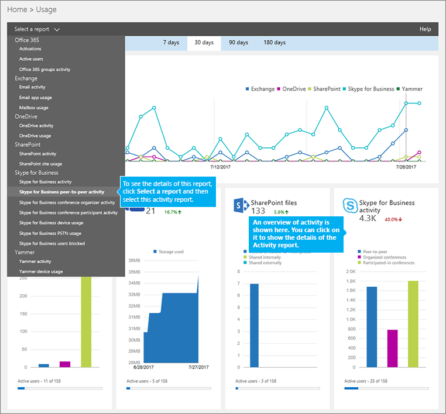

# Peer-to-peer activity report

[] 新しい Office 365 の [ **レポート**] ダッシュボードには、組織内の Office 365 製品全体にわたるアクティビティの概要が表示されます。 このダッシュボードでは、個々の製品レベルのレポートまで掘り下げ、各製品内のアクティビティについてより細かい洞察を得ることができます。 For example, you can use the **Skype for Business peer-to-peer activity** report to see how much your users are using IM, audio, video, application sharing, and transferring files. 

Check out the [Reports overview](https://support.office.com/article/0d6dfb17-8582-4172-a9a9-aed798150263)
  
This report, along with the other Skype for Business reports, gives you details on activity across your organization. これらの詳細は、組織でその他のビジネス上の決定を調査、計画、実行しているときに役立ちます。 
  
> [!NOTE]
> 管理者として Office 365 管理センターにログオンすると、すべての Skype for Business レポートを見ることができます。 
  
## Skype for Business ピアツーピア アクティビティ レポートを取得する方法

1. Go to the **Office 365 admin center** > **Reports** > **Usage**.
    
2. On the **Usage** page, click **Skype for Business peer-to-peer activity** on the **Select a report list** on the left. Or, click the **Skype for Business activity** widget and then click **Skype for Business peer-to-peer activity** on the **Skype for Business activity** list.
    
     
  
    > [!IMPORTANT]
    > Office 365 のサブスクリプションによっては、ここで説明する製品やアクティビティ レポートの一部が表示されないことがあります。 
  
## Skype for Business ピアツーピア アクティビティ レポートを解析する

[ **アクティビティ**]、[ **ユーザー**]、[ **分**] のグラフを見ることで、Skype for Business ピアツーピア アクティビティの状況を確認できます。
  

  
***
 **Skype for Business ピアツーピア アクティビティ** レポートでは、過去 7 日間、30 日間、90 日間、または 180 日間の傾向を確認できます。

    > [!Note]
    > If you click into the details of a specific day, the table will only show data for the 30 days up to the date when the report was generated.
***
 各レポートには、このレポートが生成された日付が表示されます。 The reports usually reflect a 24- to 48-hour latency from time of activity. 
***
 [ **アクティビティ**] グラフの対話型グラフ データを使用して、使用状況の傾向を把握し、参加者がいた電話会議の合計数と、組織で開催された電話会議の種類を確認します。 It will show you the total number and types of **IM**, **Audio**, **Video**, **Application sharing**, and **File transfers** sessions across your organization. 
***
 [ **ユーザー**] グラフの対話型チャート データを使用して、使用状況の傾向を把握し、組織で開催されたピアツーピア アクティビティに参加している重複しないユーザー数を確認します。 It will show you the total number of users along with the types of **IM**, **Audio**, **Video**, **Application sharing**, and **File transfers** in peer-to-peer sessions.
***
 [ **分**] グラフの対話型グラフ データを使用して、使用状況の傾向を把握し、音声とビデオによるピアツーピア アクティビティを行っているユーザーが使用した分単位の時間を確認します。このグラフは、ピアツーピア セッションで使用された **音声**と **ビデオ**の分単位の合計時間を示します。
***
 各グラフには、「X」軸（水平）と「Y」軸（垂直）があります。 
*    [ **アクティビティ**] アクティビティ グラフの Y 軸は、組織でユーザーが実施した IM、音声、ビデオ、アプリケーション共有、ファイル転送のセッションの合計数です。
*    On the **Users** activity chart, the Y axis is the total number users that held IM, audio, video, application sharing, and transferring files sessions. 
*    [ **分**] アクティビティ グラフの Y 軸は、組織全体でユーザーが音声とビデオのピアツーピア セッションを使って消費した分単位の合計時間です。 

どちらのグラフも、X 軸はこの特定のレポートで選択した日付範囲です。
***
 凡例の項目をクリックして、グラフに表示する系列をフィルター処理できます。 For example, on the **Activity** chart, click or tap **IM**, **Audio**, **Video**, **Application sharing**, and **File transfers** to see only the info related to each one. この選択を変更しても、グリッド テーブルの情報は変更されません。 
***
 この表は、ユーザーごとの、ピアツーピア アクティビティのブレークダウンを示しています。また、Skype for Business が割り当てられているすべてのユーザーと、ユーザーのピアツーピア アクティビティを示しています。表には、列を追加することができます。
*    [ **ユーザー名**] はユーザーの名前です。
*    [ **削除済み**] はユーザーのライセンスが削除されたことを示します。     **Note:**  Activity for a deleted user will still display in a report as long as he or she was licensed at some time during the selected time period. [ **削除済み** ] 列は、アクティブではない状態になったユーザーが引き続きレポート内のデータに影響している可能性に注意するのに役立ちます。    
*    [ **削除日**] は、ユーザーのライセンスが削除された日付です。 
*    [ **前回のアクティビティの日付 (UTC)**] は、ユーザーが前回アクティビティを行った日付 (UTC) です。
*    [ **IM**] は、ユーザーが使用したピアツーピア セッションの合計数を示します。
*    [ **音声**] は、音声を使用したピアツーピア セッションの合計数を示します。
*    [ **ビデオ**] は、ビデオを使用したピアツーピア セッションの合計数を示します。
*    [ **アプリケーション共有**] は、ピアツーピアのアプリケーション共有セッションの合計数を示します。
*    [ **ファイル転送**] は、ピアツーピアのファイル転送セッションの合計数を示します。
*    [ **音声 (分)**] は、組織全体で使用された音声の分単位の時間の合計数を示します。 
*    [ **ビデオ (分)**] は、組織全体で使用されたビデオの分単位の時間の合計数を示します。 

組織のポリシーにより、ユーザー情報を特定できるレポートを表示できない場合は、これらすべてのレポートのプライバシー設定を変更できます。 Check out the **How do I hide user level details?** section in the [Activity Reports in the Office 365 admin center](https://support.office.com/article/0d6dfb17-8582-4172-a9a9-aed798150263). 
***
 また、[ **エクスポート**] をクリックまたはタップして、レポート データを Excel の .csv ファイルにエクスポートすることもできます。              これにより、すべてのユーザーのデータがエクスポートされ、単純な並べ替えとフィルター処理を行ってさらに分析することができます。ユーザー数が 2000 未満である場合は、レポート自体のテーブル内で並べ替えとフィルター処理を行うことができます。ユーザー数が 2000 を超える場合は、フィルター処理と並べ替えを行うために、データをエクスポートする必要があります。
***
  Click or tap the **Columns** icon in any of the columns to add or remove columns from the report.         
   
## Skype for Business のその他のレポートを表示しますか?

- [Skype for Business アクティビティ レポート](activity-report.md) - ユーザーがどの程度ピアツーピア、開催、参加で電話会議セッションを使用しているかを確認できます。
    
- [Skype for Business クライアントの使用レポート](device-usage-report.md) - Windows ベースのオペレーティング システムとモバイル デバイスを含む、Skype for Business アプリがインストールされていて IM と会議に使用されるデバイスを確認できます。
    
- [Skype for Business 電話会議開催者アクティビティ レポート](conference-organizer-activity-report.md) - ユーザーがどの程度 IM、音声/ビデオ、アプリケーション共有、Web、ダイヤルイン/アウト - サード パーティ、ダイヤルイン/アウト - Microsoft を使用した電話会議を開催しているかを確認できます。
    
- [Skype for Business 電話会議参加者アクティビティ レポート](conference-participant-activity-report.md) - 参加者がいる IM、音声/ビデオ、アプリケーション共有、Web 会議、ダイヤルイン/ダイヤルアウト会議の数を確認できます。
    
- [Skype for Business users blocked report](users-blocked-report.md) You can see the users in your organization that have been blocked from making PSTN calls.
    
- [Skype for Business PSTN usage report](pstn-usage-report.md) You can see the number of minutes spent in inbound/outbound calls and cost for these calls.
    
- [Skype for Business PSTN minute pools report](pstn-minute-pools-report.md) you can see the number of minutes consumed during the current month within your organization.

- [Skype for Business session details report](session-details-report.md) You can see details about individual user's call experiences.
    
## このモジュールは、64 ビットのコンピューターでのみサポートされ、Microsoft ダウンロード センターの「Skype for Business Online 用 Windows PowerShell モジュール」からダウンロードできます。
[Office 365 管理センターのアクティビティ レポート](https://support.office.com/article/0d6dfb17-8582-4172-a9a9-aed798150263)

  
 