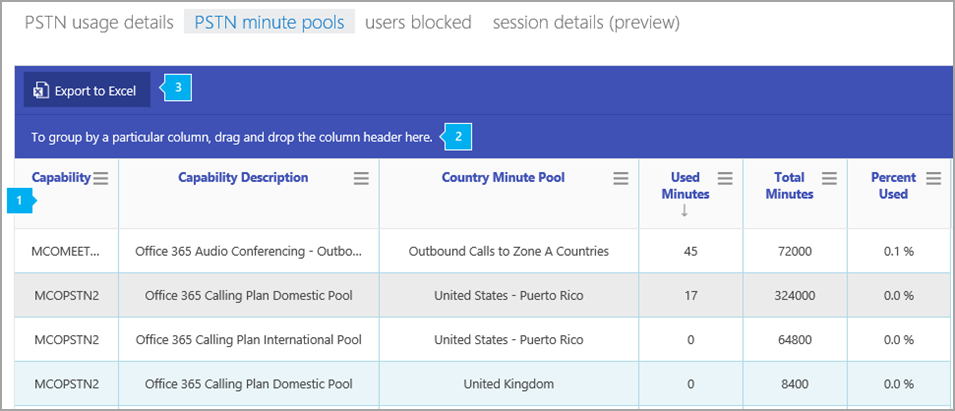

# PSTN の利用分数プール レポートPSTN minute pools report

>[!NOTE]
>このレポートは、プレビュー版のお客様のみご利用いただけます。This report is only available to preview customers.

[新しい Skype for Business 管理センターの**レポート**] 領域には、組織内の電話会議アクティビティと電話会議のアクティビティが表示されます。The new Skype for Business Admin Center **Reports** area shows you calling and audio conferencing activity in your organization. ここでは、レポートを掘り下げて、各ユーザーのアクティビティについてより細かい洞察を得ることができます。It enables you to drill into reports to give you more granular insight about the activities of each user. たとえば、 **Skype For BUSINESS PSTN 分プール**レポートを使用して、組織内の現在の月に消費された分数を確認することができます。For example, you can use the **Skype for Business PSTN minute pools** report to see the number of minutes consumed during the current month within your organization.
  
利用可能なその他のレポートについては、 [「レポートの概要」](https://support.office.com/article/0d6dfb17-8582-4172-a9a9-aed798150263)をご覧ください。Check out the [Reports overview](https://support.office.com/article/0d6dfb17-8582-4172-a9a9-aed798150263) for more reports that are available.
  
このレポートと他の Skype for Business レポートを使用すると、組織全体のアクティビティについて詳しく知ることができます。This report, along with the other Skype for Business reports, gives you details on activity across your organization. これらの情報は、組織のビジネスに関する調査、計画、その他の意思決定の際に非常に役立ちます。また、[通信クレジット](/microsoftteams/what-are-communications-credits)を設定することも可能です。These details are very helpful when investigating, planning, and making other business decisions for your organization and for setting up [Communications Credits](/microsoftteams/what-are-communications-credits)
  
> [!NOTE]
> Microsoft 365 管理センターに管理者としてログオンすると、すべての Skype for Business レポートを表示できます。You can see all of the Skype for Business reports when you log on as an administrator to the Microsoft 365 admin center. 
  
## Skype for Business PSTN 分プールレポートを取得する方法How to get to the Skype for Business PSTN minute pools report

 **Skype for Business 管理センターの使用** **Using the Skype for Business admin center**

- 管理センターに移動して >**管理** > **センター Skype for business 管理センター** > **レポート** > **PSTN 分のプール**をレポートします。Go to the admin center > **Admin centers** > **Skype for Business admin center** > **Reports** > **PSTN minute pools**.
    
> [!NOTE]
> Microsoft 365 または Office 365 のサブスクリプションによっては、ここに示されているすべての詳細が表示されない場合があります。Depending on the Microsoft 365 or Office 365 subscription you have, you might not see all the same details shown here. 
  
## Skype for Business PSTN 分のプールレポートを解釈するInterpret the Skype for Business PSTN minute pools report

表示されている各列を見ると、ユーザーの Skype for Business の分数プールを確認できます。You can get a view into your user's Skype for Business minute pools by looking at each of the columns that are displayed.
  
レポートは、このように表示されます。This is what the report looks like.
  
## 

  
***
 この表には、ライセンス (機能) と使用状況の場所によって、分単位のプールの内訳が表示されています。The table shows you a breakdown of minute pools by license (capability) and usage location. 
*    **機能**は、通話に使用されるライセンス/サービスプランです。**Capability** is the license/service plan used for the call. このレポートには、次のようなライセンス/サービスプランが表示されます。The license/service plans you may see in this report include:
     * MCOPSTN1-国内通話プラン (3000-US/1200 分の EU プラン)MCOPSTN1 - Domestic Calling Plan (3000-minute US/1200-minute EU plans
     * MCOPSTN2-国内 & 国際通話プラン (3000-米国/カナダ/PR、1200年のヨーロッパ諸国)、および国際プール (600-分) が表示されます。MCOPSTN2 - Domestic & International Calling Plan from which you will see a domestic pool (3000-minute US/Canada/PR, 1200-minute European countries) and an international pool (600-minutes). 予定表の月内で国内または国際通話の上限に達したときに、分数の上限に達しました。Minute cap is reached whenever the domestic -OR- international cap is reached within the calendar month. 
     * MCOPSTN5-国内通話プラン (120 分通話プラン)MCOPSTN5 - Domestic Calling Plan (120-minute calling plan)
     * MCOPSTN6-国内通話プラン (240 分通話プラン)MCOPSTN6 - Domestic Calling Plan (240-minute calling plan)
     * MCOMEETADD-電話会議MCOMEETADD - Audio Conferencing
*    **機能の説明**は、通話に使用されるライセンスの種類の説明です。**Capability Description** is a description of the license type utilized for the call.
*    [**国の分数プール**] は、分数プールを共有するユーザーのライセンス使用場所です。**Country Minute Pool** is the license usage location of the user(s) who share the minute pool. 
*    [**使用時間 (分)** は、毎月使用される分数 (分) です。**Used Minutes** is the number of minutes used each month.
*    "**合計分数**" は、その月で利用可能な分数の合計数です。**Total Minutes** is the total number of minutes available for the month. 
*    [**使用率 (%)** は、月に使用される分数のパーセントです。**Percent Used** is the percent of minutes used for the month. 
***
 1 つ以上の列の全データをまとめたビューを作成したい場合は、列を [ **特定の列を基準にグループ化するには、ここに列ヘッダーをドラッグ アンド ドロップします**] にクリック アンド ドラッグします。Click to drag a column to **To group by a particular column, drag and drop the column header here** if you want to create a view that groups all of the data in one or more columns. 
***
 また、[ **Excel にエクスポート**] をクリックまたはタップして、レポート データを Excel の .csv ファイルにエクスポートすることもできます。You can also export the report data into an Excel .csv file, by clicking or tapping the **Export to Excel** button.    これにより、すべてのユーザーのデータがエクスポートされ、単純な並べ替えとフィルター処理を行ってさらに分析することができます。This exports data of all users and enables you to do simple sorting and filtering for further analysis. ユーザー数が2000より少ない場合は、レポート内のテーブル内で並べ替えとフィルター処理を行うことができます。If you have fewer than 2000 users, you can sort and filter within the table in the report itself. ユーザー数が 2000 を超える場合は、フィルター処理と並べ替えを行うために、データをエクスポートする必要があります。If you have more than 2000 users, in order to filter and sort, you will need to export the data.
   
## Skype for Business のその他のレポートを表示しますか?Want to see other Skype for Business reports?

- [Skype for Business アクティビティ レポート](activity-report.md) - ユーザーがどの程度ピアツーピア、開催、参加で電話会議セッションを使用しているかを確認できます。[Skype for Business activity report](activity-report.md) You can see how much your users are using peer-to-peer, organized, and participated in conferencing sessions.
    
- [Skype for Business クライアントの使用レポート](device-usage-report.md) - Windows ベースのオペレーティング システムとモバイル デバイスを含む、Skype for Business アプリがインストールされていて IM と会議に使用されるデバイスを確認できます。[Skype for Business device usage report](device-usage-report.md) You can to see the devices including Windows-based operating systems and mobile devices that have the Skype for Business app installed and are using it for IM and meetings.
    
- [Skype For business 電話会議開催者アクティビティレポート](conference-organizer-activity-report.md)IM、音声/ビデオ、アプリケーション共有、Web、/ダイヤルアウト-サードパーティ、およびダイヤルアウト-Microsoft を使用して、ユーザーが会議をどの程度管理しているかを確認できます。[Skype for Business conference organizer activity report](conference-organizer-activity-report.md) You can see how much your users are organizing conferences that use IM, audio/video, application sharing, Web, /dial out - 3rd party, and /dial out - Microsoft.
    
- [Skype For business 電話会議参加者アクティビティレポート](conference-participant-activity-report.md)IM、音声/ビデオ、アプリケーション共有、Web 会議、ダイヤルアウト音声会議の数を確認できます。[Skype for Business conference participant activity report](conference-participant-activity-report.md) You can see how many IM, audio/video, application sharing, Web and dial out audio conferences are being participated in.
    
- [Skype for Business ピアツーピア アクティビティ レポート](peer-to-peer-activity-report.md) - ユーザーがどの程度 IM、音声/ビデオ、アプリケーション共有、ファイル転送を使用しているかを確認できます。[Skype for Business peer-to-peer activity report](peer-to-peer-activity-report.md) You can see how much your users are using IM, audio/video, application sharing and transferring files.
    
- [Skype For business ユーザーがブロック](users-blocked-report.md)されたレポートPSTN 通話の発信をブロックされている組織内のユーザーを確認できます。[Skype for Business users blocked report](users-blocked-report.md) You can see the users in your organization that have been blocked from making PSTN calls.

- [Skype For business セッションの詳細レポート](session-details-report.md)個々のユーザの通話エクスペリエンスについての詳細を見ることができます。[Skype for Business session details report](session-details-report.md) You can see details about individual user's call experiences.
    
## 関連トピックRelated topics
[管理センターでのアクティビティレポートActivity Reports in the admin center](https://support.office.com/article/0d6dfb17-8582-4172-a9a9-aed798150263)

  
   
