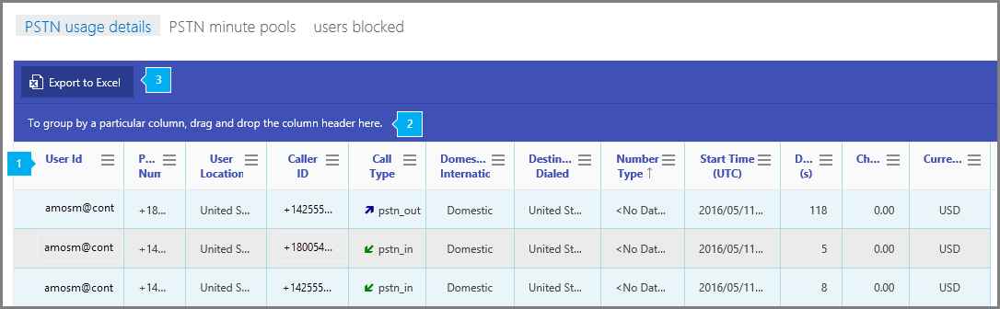

# PSTN の使用状況のレポートPSTN usage report

[新しい Skype for Business 管理センターの**レポート**] 領域には、組織内の電話会議アクティビティと電話会議のアクティビティが表示されます。The new Skype for Business Admin Center **Reports** area shows you calling and audio conferencing activity in your organization. ここでは、レポートを掘り下げて、各ユーザーのアクティビティについてより細かい洞察を得ることができます。It enables you to drill into reports to give you more granular insight about the activities of each user. たとえば、 **Skype for Business での PSTN 使用状況の詳細**レポートを使用して、通話の着信/発信に費やした分数とそれらの通話の料金を確認できます。For example, you can use the **Skype for Business PSTN usage details** report to see the number of minutes spent in inbound/outbound calls and cost for these calls. 通話のコストなど、電話会議の PSTN 利用状況の詳細を表示して、組織内での使用状況を特定するために、使用状況を理解し、請求の詳細を呼び出すことができます。You can view Audio Conferencing PSTN usage details including the cost of the call so that you can understand your usage and call billing details to determine usage within your organization.
  
利用可能なその他のレポートについては、 [「レポートの概要」](https://support.office.com/article/0d6dfb17-8582-4172-a9a9-aed798150263)をご覧ください。Check out the [Reports overview](https://support.office.com/article/0d6dfb17-8582-4172-a9a9-aed798150263) for more reports that are available.
  
このレポートとその他の Skype for Business レポートを使用すると、組織全体での利用状況などのアクティビティについて詳しく知ることができます。This report, along with the other Skype for Business reports, gives you details on activity including calling usage across your organization. これらの情報は、組織のビジネスに関する調査、計画、その他の意思決定を行ったり、[通信クレジット](/microsoftteams/what-are-communications-credits)を設定したりする際に非常に役立ちます。These details are very helpful when you investigating, planning, and making other business decisions for your organization and for setting up [Communications Credits](/microsoftteams/what-are-communications-credits)
  
> [!NOTE]
> Office 365 管理センターに管理者としてログオンすると、すべての Skype for Business レポートを表示できます。You can see all of the Skype for Business reports when you log on as an administrator to the Office 365 admin center. 
  
## Skype for Business の PSTN 使用状況詳細レポートを取得する方法How to get to the Skype for Business PSTN usage details report

 **Skype for Business 管理センターを使用する** **Using the Skype for Business admin center**

- **Office 365 管理センター** > **管理** > **の Skype for business 管理** > センターの**レポート** > **PSTN 使用状況の詳細**を表示します。Go to **Office 365 admin center** > **Admin centers** > **Skype for Business admin center** > **Reports** > **PSTN usage details**.
    
    > [!NOTE]
    > Office 365 のサブスクリプションによっては、ここに表示される製品やレポートの一部が表示されないことがあります。Depending on the Office 365 subscription you have, you might not see all the products and reports that are shown here. 
  
## Skype for Business PSTN 使用状況レポートを解析するInterpret the Skype for Business PSTN usage report

表示されている各列を見ると、ユーザーの Skype for Business PSTN 使用状況を確認できます。You can get a view into your user's Skype for Business PSTN usage by looking at each of the columns that are displayed.
  
レポートは、このように表示されます。This is what the report looks like.
  

***
 この表は、ユーザーごとの、すべての PSTN 使用状況の詳細を示しています。また、Skype for Business が割り当てられているすべてのユーザーと、ユーザーの PSTN 使用状況を示しています。表では、列を追加したり、削除したりすることができます。The table shows you a breakdown of the all PSTN usage per user. This shows all users that have Skype for Business assigned to them and their PSTN usage. You can add/remove columns to the table.
*    **通話 ID** は通話の識別番号です。Microsoft サービス サポートへの通話で使用される固有の識別子です。**Call ID** is the call ID for a call. It is a unique identifier for the call that is used when calling Microsoft service support.
*    [ **ユーザー ID**] は、ユーザーのサインイン名です。**User ID** is the user's sign in name.
*    **電話番号**は着信通話を受けた Skype for Business の電話番号、または発信通話でダイヤルされた番号です。**Phone number** is the Skype for Business phone number that received the call for inbound calls or the number dialed for outbound calls.
*    [**ユーザーの所在地**] は、ユーザーが所在する国/地域です。**User location** is the country/region where the user is located.
*    **発信者 ID** は着信通話の発信者電話番号 (発信者 ID) であるか、通話の発信元の番号であるか、発信通話に対して通話の発信元となった Skype for Business 番号です。**Caller ID** is caller's telephone number (Caller ID) for inbound calls, the number from which the call originated or the Skype for Business number from which the call originated for outbound calls.
*    [**通話の種類**] は、通話が PSTN の発信または着信であるか、ユーザーまたは電話会議による通話などの通話の種類であるかを示します。**Call type** is whether the call was a PSTN outgoing or incoming call and the type of call such as a call placed by a user or an audio conference. 表示される可能性のある通話の種類は次のとおりです。The call types you may see are: 

     **通話プランの通話の種類****Calling Plan Call Types** 
     *    **user_in** (着信 PSTN 通話を受信したユーザー)**user_in** (the user received an inbound PSTN call) 
     *    **user_out** (発信 PSTN 通話をかけたユーザー)**user_out** (the user placed an outbound PSTN call) 
     *    **user_out_conf** (2 つ以上の PSTN 参加者を 3 方向の電話会議などに追加したユーザー)**user_out_conf** (the user added 2 or more PSTN participants to the call such as a 3-way conference call) 
     *    **user_out_transfer** (PSTN 番号に通話を転送したユーザー)**user_out_transfer** (the user transferred the call to a PSTN number) 
     *    **user_out_forwarding** (PSTN 番号に通話を転送したユーザー)**user_out_forwarding** (the user forwarded the call to a PSTN number)

     **電話会議の通話の種類****Audio Conferencing Call Types**
     *    **conf_in**(電話会議ブリッジへの着信通話)**conf_in** (an inbound call to the Audio Conferencing bridge) 
     *    **conf_out** (通常は電話会議に PSTN 番号を追加するための電話会議ブリッジからの発信通話)**conf_out** (an outbound call from the Audio Conferencing bridge usually to add a PSTN number to the conference)

     **統合コミュニケーション アプリケーション (UCAP)****Unified Communication Applications (UCAP)** 
     *    **ucap_in**(自動応答や通話キューなどの UC アプリケーションへの着信 PSTN 通話)**ucap_in** (an inbound PSTN call to the UC application such as auto attendant or call queue) 
     *    **ucap_out**(自動応答や通話キューなどの UC アプリケーションからの送信 PSTN 通話)**ucap_out** (an outbound PSTN call from the UC application such as auto attendant or call queue)
     *    **注:** 自動応答や通話キューなどの UC アプリケーションからユーザーに転送された通話は、ピアツーピア (P2P) の音声通話であるため、PSTN 使用状況レポートには表示されません。**Note:** Calls that were transferred to a user from the UC application such as an auto attendant or call queue will not appear in the PSTN usage report as these call legs are peer to peer (P2P) audio calls. Skype for Business 管理センターの P2P 通話にアクセスするには、"Tools > Skype for Business Call Analytics" のようにし、ユーザー名または SIP アドレスを指定して、日付/時刻/発信元の CLID (発信者の ID) を使って通話を関連付けます。You may access the P2P calls in the Skype for Business Admin Center under "Tools > Skype for Business Call Analytics" and search by User Name or SIP address correlating the call by date/time and/or originating CLID (calling line ID). 
*     
     [ **国内/国際**] は、ユーザーの場所に基づいて通話が国内 (国/地域内) または国際 (国/地域外) のどちらと見なされるかを示します。**Domestic/International** tells you whether the call that was placed was considered domestic (within a country/region) or international (outside of a country/region) based on the user's location. 
*    [**宛先ダイヤル**] は、フランス、ドイツ、または米国 (米国) などのダイヤル先の国/地域の名前です。**Destination dialed** is the name of the country/region destination that is dialed such as France, Germany, or the United States (U.S.). 
*    [**番号の種類**] は、ユーザーの電話番号、サービス、またはフリーダイヤル番号からの電話番号の種類です。**Number type** is the type of phone number that is from a user's phone number, a service or toll-free number.  
*    [ **開始時刻 (UTC)**] は、通話が開始または実行された時刻です。**Start Time (UTC)** is the time that the call was started or placed. 
*    [ **通話時間**] は、通話が接続されていた時間です。**Duration** is how long the call was connected.  
*    **ConfID** は電話会議の電話会議 ID です。**ConfID** is the conference ID of the audio conference. 
*    [ **料金**] は、アカウントに課金される金額または通話の料金です。**Charge** is the amount of money or cost of the call that is being charged to your account. 
*    [ **通貨**] は、通話の料金を計算するために使用される通貨の種類です。**Currency** is the type of currency that is used to calculate the cost of the call. 
*    [ **機能** ] は通話のために使用されるライセンスです。表示されるライセンスの種類は次のとおりです。**Capability** is the license used for the call. The license types you may see are: 
     *    **Mcopstnpp** -通信クレジット**MCOPSTNPP** - Communications Credits   **MCOPSTN1** -国内通話プラン (3000 分間/1200 分の EU プラン)**MCOPSTN1** - Domestic Calling Plan (3000 min US / 1200 min EU plans) 
     *    **MCOPSTN2** -国際通話プラン**MCOPSTN2** - International Calling Plan 
     *    **MCOPSTN5** -国内通話プラン (120 分の通話プラン)**MCOPSTN5** - Domestic Calling Plan (120 min calling plan) 
     *    **MCOPSTN6** -国内通話プラン (240 分間通話プラン) 注: 利用制限**MCOPSTN6** - Domestic Calling Plan (240 min calling plan) Note: Limited Availability
     *    **MCOMEETADD** -電話会議**MCOMEETADD** - Audio Conferencing
     *    **MCOMEETACPEA** -1 分あたりの通話料金電話会議**MCOMEETACPEA** - Pay Per Minute Audio Conferencing
> [!NOTE]
> 通話または会議サブスクリプションに含まれていない1分あたりの通話のみを含めるレポートを実行する場合は、機能 "MCOPSTNPP" を使用してレポートをフィルター処理します。If you would like to run a report to include only pay per minute calls that are not included in your calling or conferencing subscription, filter the report with capability "MCOPSTNPP". これにより、1分あたりの通話料金の明細が提供されます。Doing so will provide an itemization of all pay per minute calls.  1分あたりの通話料金の場合は、"MCOPSTNPP" の代わりに "MCOMEETACPEA" でフィルター処理します。For pay per minute audio conferencing, filter by "MCOMEETACPEA" instead of "MCOPSTNPP".  
***
> [!NOTE]
> 一部のフィールドに "データなし" と表示されることもあります。You may also see "no data" in some fields. "データなし" は、このフィールドが通話の種類または機能に適用されないことを意味します。"No data" means the field is not applicable to the call type or capability. 
***
> [!NOTE]
> Telstra 通話プランをお持ちの場合は、PSTN 使用状況レポートに通話の詳細レコードは表示されません。If you have a Telstra calling plan, you will not see any call detail records in the PSTN usage report. レポートのニーズについては、Telstra にお問い合わせください。Please contact Telstra for your reporting needs. 
***
 1 つ以上の列の全データをまとめたビューを作成したい場合は、列を [ **特定の列を基準にグループ化するには、ここに列ヘッダーをドラッグ アンド ドロップします**] にクリック アンド ドラッグします。Click to drag a column to **To group by a particular column, drag and drop the column header here** if you want to create a view that groups all of the data in one or more columns.
 ***
 また、[ **excel にエクスポート**] ボタンをクリックまたはタップして、レポートデータをタブ区切りの excel ファイルにエクスポートすることもできます。You can also export the report data into a TAB delimited Excel file, by clicking or tapping the **Export to Excel** button.    これにより、すべてのユーザーのデータがエクスポートされ、単純な並べ替えとフィルター処理を行ってさらに分析することができます。This exports data of all users and enables you to do simple sorting and filtering for further analysis. ユーザー数が 2000 未満である場合は、レポート自体のテーブル内で並べ替えとフィルター処理を行うことができます。If you have less than 2000 users, you can sort and filter within the table in the report itself. 
    > [!Note] 
    > Despite the export file named as .CSV (which implies a comma delimited export), as there may be commas in the data set, the file is actually delimited with **TABS** and not **COMMAS**.

## Skype for Business のその他のレポートを表示しますか?Want to see other Skype for Business reports?

- [Skype for Business アクティビティ レポート](activity-report.md) - ユーザーがどの程度ピアツーピア、開催、参加で電話会議セッションを使用しているかを確認できます。[Skype for Business activity report](activity-report.md) You can see how much your users are using peer-to-peer, organized, and participated in conferencing sessions.
    
- [Skype for Business クライアントの使用レポート](device-usage-report.md) - Windows ベースのオペレーティング システムとモバイル デバイスを含む、Skype for Business アプリがインストールされていて IM と会議に使用されるデバイスを確認できます。[Skype for Business device usage report](device-usage-report.md) You can to see the devices including Windows-based operating systems and mobile devices that have the Skype for Business app installed and are using it for IM and meetings.
    
- [Skype For business 電話会議開催者アクティビティレポート](conference-organizer-activity-report.md)IM、音声/ビデオ、アプリケーション共有、Web、/ダイヤルアウト-サードパーティ、およびダイヤルアウト-Microsoft を使用して、ユーザーが会議をどの程度管理しているかを確認できます。[Skype for Business conference organizer activity report](conference-organizer-activity-report.md) You can see how much your users are organizing conferences that use IM, audio/video, application sharing, Web, /dial out - 3rd party, and /dial out - Microsoft.
    
- [Skype For business 電話会議参加者アクティビティレポート](conference-participant-activity-report.md)IM、音声/ビデオ、アプリケーション共有、Web 会議、ダイヤルアウト音声会議の数を確認できます。[Skype for Business conference participant activity report](conference-participant-activity-report.md) You can see how many IM, audio/video, application sharing, Web and dial out audio conferences are being participated in.
    
- [Skype for Business ピアツーピア アクティビティ レポート](peer-to-peer-activity-report.md) - ユーザーがどの程度 IM、音声/ビデオ、アプリケーション共有、ファイル転送を使用しているかを確認できます。[Skype for Business peer-to-peer activity report](peer-to-peer-activity-report.md) You can see how much your users are using IM, audio/video, application sharing and transferring files.
    
- [Skype For business ユーザーがブロック](users-blocked-report.md)されたレポートPSTN 通話の発信をブロックされている組織内のユーザーを確認できます。[Skype for Business users blocked report](users-blocked-report.md) You can see the users in your organization that have been blocked from making PSTN calls.

- [Skype For BUSINESS PSTN 分単位のプールレポート](pstn-minute-pools-report.md)には、組織内の現在の月に消費された分数が表示されます。[Skype for Business PSTN minute pools report](pstn-minute-pools-report.md) you can see the number of minutes consumed during the current month within your organization.

- [Skype For business セッションの詳細レポート](session-details-report.md)個々のユーザの通話エクスペリエンスについての詳細を見ることができます。[Skype for Business session details report](session-details-report.md) You can see details about individual user's call experiences.
    
## 関連トピックRelated topics
[Office 365 管理センターのアクティビティ レポートActivity Reports in the Office 365 admin center](https://support.office.com/article/0d6dfb17-8582-4172-a9a9-aed798150263)
  
  
 
