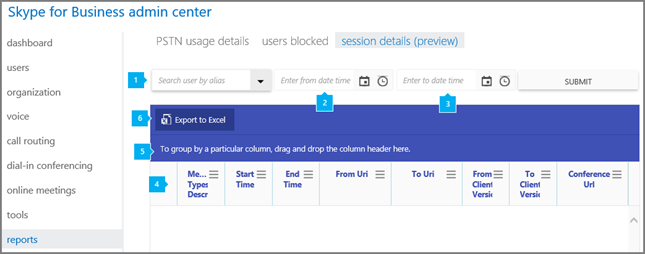

# セッション詳細レポートSession details report

[] 新しい Office 365 の [ **レポート**] ダッシュボードには、組織内の Office 365 製品全体にわたるアクティビティの概要が表示されます。The new Office 365 **Reports** dashboard shows you the activity overview across the Office 365 products in your organization. このダッシュボードでは、個々の製品レベルのレポートまで掘り下げ、各製品内のアクティビティについてより細かい洞察を得ることができます。It enables you to drill in to individual product level reports to give you more granular insight about the activities within each product. たとえば、 **Skype**ビジネス セッションの詳細のレポートを使用すると、個々 のユーザーの呼び出しの経験についての詳細を参照してください。For example, you can use the **Skype for Business Session details** report to see details about individual user's call experiences.
  
利用可能な他のレポートの[レポートの概要](https://support.office.com/article/0d6dfb17-8582-4172-a9a9-aed798150263)を確認してください。Check out [Reports overview](https://support.office.com/article/0d6dfb17-8582-4172-a9a9-aed798150263) for more reports that are available.
  
このレポートとは、ビジネス レポートの他の Skype を使用すれば詳細セッションの詳細を含む、組織全体での活動です。This report, along with the other Skype for Business reports give you details on activity including session details across your organization. これらの詳細については、調査する計画、およびその他のビジネスの決定、組織と[の通信のクレジット](../skype-for-business-and-microsoft-teams-add-on-licensing/what-are-communications-credits.md)を設定するために非常に役に立つ。These details are very helpful when you investigating, planning, and making other business decisions for your organization and for setting up [Communications Credits](../skype-for-business-and-microsoft-teams-add-on-licensing/what-are-communications-credits.md).
  
> [!NOTE]
> 管理者として Office 365 管理センターにログオンすると、すべての Skype for Business レポートを見ることができます。You can see all of the Skype for Business reports when you log on as an administrator to the Office 365 admin center. 
  
## ビジネス セッションの詳細レポートの Skype を取得する方法How to get to the Skype for Business Session details report

1. **Office 365 管理センター**を参照して > **レポート**Go to the **Office 365 admin center** > **Reports**
    
2. 左側のメニューから**レポート**を選択し、[**使用状況**] をクリックします。Select **Reports** from the left menu, and then click **Usage**.
    
3. [**レポートの選択]**ボックスの一覧で、 **Skype**をクリックします。In the list under **Select a report**, click **Skype for Business Session details**.
    
    > [!TIP]
    > このレポートの一覧が表示されない場合に、**ビジネス管理センターの Skype** > **レポート** > **セッションの詳細**です。If you don't see this report listed, go to **Skype for Business admin center** > **Reports** > **Session details**. 
  
    > [!IMPORTANT]
    > Office 365 のサブスクリプションによっては、ここに表示される製品やレポートの一部が表示されないことがあります。Depending on the Office 365 subscription you have, you might not see all the products and reports that are shown here. 
  
## ビジネス セッションの詳細レポートの Skype を解釈します。Interpret the Skype for Business Session details report

ビジネス セッションについては、ユーザーの Skype にビューを取得するには、各列に表示されるを見てします。You can get a view into your user's Skype for Business session details by looking at each of the columns that are displayed.
  
レポートは、このように表示されます。This is what the report looks like.
  

  
***
 **エイリアスで検索ユーザー**は 1 人のユーザーを検索することができ、次の表のすべてのユーザーのセッションの詳細が表示されます。**Search user by alias** lets you search for a single user and displays all of the user's session details in the table below. 
***
 **日付時刻の入力**開始日に配置することができます。**Enter from date time** lets you put in the start date. 日付を選択するか、手動で日付を入力するのには、カレンダーを使用できます。You can use the calendar to select the date or enter the date manually. このフィールドを設定する必要があります。This field must be populated.
***
 終了日を入力する**日付時刻を入力**できます。**Enter to date time** lets you put in the end date. 日付を選択するか、手動で日付を入力するのには、カレンダーを使用できます。You can use the calendar to select the date or enter the date manually. 終了日が設定されていない場合既定では開始日から 30 日間です。If no end date is set, the default is 30 days from the start date.
***
 表では、すべてのユーザーごとのセッション詳細の内訳を示します。The table shows you a breakdown of the all session details per user. 割り当てられてセッションについては、ビジネスの Skype のすべてのユーザーが表示されます。This shows all users that have Skype for Business assigned to them and their session information. 表では、列を追加したり、削除したりすることができます。You can add/remove columns to the table.   テーブルでは、セッションごとに次の列があります。The table has the following columns for each session:
*    **ダイアログ ID**は、SIP セッションの一意の識別子の ID です。**Dialog ID** is the ID for unique identifier of the SIP session.
*    **メディアの種類の説明**では、セッションは、電話会議や P2P セッション (オーディオ、ビデオ、またはアプリケーションの共有) に使用されるメディアの種類かどうかについて説明します。**Media types description** describes whether the session is a conference call or a P2P session and the type of media used (Audio/Video/Application Sharing).
*    **開始時刻**は、セッションが開始された時刻です。**Start time** is the time when the session started.
*    **終了時刻**は、セッションが終了した時刻です。**End time** is  the time when the session ended.
*    **URI から**は、ユーザーまたはセッションを開始するサービスの URI です。**From URI** is the URI of the user or service that initiated the session. ユーザーは、PSTN 電話からのセッションを開始する場合は空白があります。May be blank if the user initiated the session from a PSTN phone.
*    **URI**には、ユーザーまたはセッションの開始の標的になったサービスの URI です。**To URI** is the URI of the user or service that was the target of the session initiation. 会議の場合は、開催者の URI です。In the case of the conference, this is the organizer's URI. セッションのターゲットは、PSTN の電話番号をされた場合は、空白があります。May be blank if the target of the session was a PSTN phone number.
*    **クライアントのバージョン**がわかります、ユーザー エージェントとユーザーまたはセッションを開始するサービスによって使用されるクライアントのバージョン。**From client version** tells you the User Agent and version of the client used by the user or service that initiated the session.
*    **クライアントのバージョンを**示しますユーザー エージェントとユーザーまたはサービスは、セッションの開始のターゲットで使用されるクライアントのバージョン。**To client version** tells you the User Agent and version of the client used by the user or service that was the target of the session initiation.
*    **会議 URL**は、セッションが電話会議をした場合に、会議の SIP URL です。**Conference URL** is the SIP URL for the conference, if the session was a conference call. 同じ電話会議のすべてのユーザーは、同じ会議 URL があります。All users in the same conference call will have the same Conference URL. 
*    **電話番号**は、該当する場合、セッションのターゲットを電話番号です。**From Tel number** is the telephone number that was the target of the session, if applicable. 電話番号の最後の桁は、ユーザーのプライバシーを保護するために 'x' に置き換えられます可能性があります。The last digits of the phone number may be replaced with 'x' to protect user privacy.
*    **電話番号**は、該当する場合、セッションのターゲットを電話番号です。**To Tel number** is the telephone number that was the target of the session, if applicable. 電話番号の最後の桁は、ユーザーのプライバシーを保護するために 'x' に置き換えられます可能性があります。The last digits of the phone number may be replaced with 'x' to protect user privacy.
*    **エンドポイント Id から**は、元のユーザーによって使用されるエンドポイントの一意の GUID です。**From Endpoint Id** is a unique GUID of the endpoint used by the From user. ユーザーに複数のセッション同じエンドポイントからが通信しているかどうかを識別するために使用。Used to identify whether user is communicating multiple sessions from same endpoint. ユーザーが PSTN 電話を使用する場合、またはサービスからセッションを開始した場合は空白になります。May be blank if user is using a PSTN phone or if the session was initiated from a service.
*    **エンドポイント Id**には、宛先のユーザーによって使用されるエンドポイントの一意の GUID です。**To Endpoint Id** is a unique GUID of the endpoint used by the To user. ユーザーに複数のセッション同じエンドポイントからが通信しているかどうかを識別するために使用。Used to identify whether user is communicating multiple sessions from same endpoint. 空白の場合は、サービスから開始されたセッションまたはセッションを確立できませんでした、ユーザーは PSTN の電話番号を使用している場合があります。May be blank if user is using a PSTN phone, if the session was initiated from a service, or a session failed to establish.
*    **Conf のインスタンス**は、会議 URL を使用して会議のインスタンスの一意の GUID です。**Conf Instance** is a unique GUID for the instance of the conference using the Conference URL. 定期的な会議には、同じ会議 URL がありますが、会議の各インスタンス Conf のインスタンスが異なる。Recurring meetings will have the same Conference URL, but each instance of the meeting will have a difference Conf Instance.
*    **代わりに URI**は、代理人が代わりに、セッションが確立されるの URI です。**On Behalf Of URI** is the URI of the delegator on whose behalf the session is being established.   **URI の参照で**は、セッションの確立を参照しているユーザーの URI です。**Referred By URI** is the URI of the user who referred the establishment of a session.
*    **応答コード**は、セッションが正常に確立されたかどうかであることを示すセッションの確立の SIP 応答コードです。**Response Code** is the SIP response code for the establishment of the session that indicates if the session was successfully established.

セッションごとに、テーブルがある sub 別のデータと、シナリオによっては使用です。For each session, there is a sub table with different data available depending on the scenario. 次のとおりサブ テーブルで利用可能なタブからのユーザーまたはサービスにします。The following lists the tabs available in the sub table for the From and To user or services.
*    セッション] タブでは、コンピューターとオペレーティング システムに関するデータが表示されます。SESSION tab shows data about the machines and operating systems.
*    MEDIALINES タブでは、ネットワーク接続の情報とデバイス情報を表示します。MEDIALINES tab shows network connectivity information and device information.
*    AUDIOSTREAMS タブに表示ネットワークのパフォーマンス データ、オーディオ ストリームのセッションに関与します。AUDIOSTREAMS tab shows network performance data about the audio streams involved in session.
*    AUDIOCLIENTEVENTS タブには、オーディオの操作性の影響を与えることが検出されたクライアントの問題についてのデータが表示されます。AUDIOCLIENTEVENTS tab shows data about client detected issues impacting the audio experience.
*    AUDIOSIGNALS タブには、オーディオ信号のセッションの処理に関するデータが表示されます。AUDIOSIGNALS tab shows data about the audio signal processing for the session.
*    APPSHARINGSTREAMS] タブは、セッションに関連するネットワークのパフォーマンス データについては、アプリケーション共有またはデスクトップの共有のストリームを示しています。APPSHARINGSTREAMS tab shows network performance data about the application sharing or desktop sharing streams involved in session.
*    VIDEOCLIENTEVENTS タブには、ビデオの操作性の影響を与えることが検出されたクライアントの問題に関するデータが表示されます。VIDEOCLIENTEVENTS tab shows data about client detected issues impacting the video experience.
*    VIDEOSTREAMS タブに表示ネットワークのパフォーマンス データ、ビデオ ストリームのセッションに関与します。VIDEOSTREAMS tab shows network performance data about the video streams involved in session.
*    TRACEROUTES] タブは、セッション中に、traceroute を使用して収集したネットワーク ホップの数を示しています。TRACEROUTES tab shows the network hops collected via traceroute during the session. セッションに使用する実際のメディアのパスが異なる場合があり、このデータは、セッションでオーディオがある場合にのみ使用します。The actual media path used for the session may vary and this data is only available when there is audio in the session.
*    FEEDBACKREPORTS] タブは、セッションで、ユーザーによって提供される呼び出しの調査データの任意の終了を示しています。FEEDBACKREPORTS tab shows any end of call survey data provided by the users in the session.
***
 1 つ以上の列の全データをまとめたビューを作成したい場合は、列を [ **特定の列を基準にグループ化するには、ここに列ヘッダーをドラッグ アンド ドロップします**] にクリック アンド ドラッグします。Click to drag a column to **To group by a particular column, drag and drop the column header here** if you want to create a view that groups all of the data in one or more columns. 
***
 また、[ **Excel にエクスポート**] をクリックまたはタップして、レポート データを Excel の .csv ファイルにエクスポートすることもできます。You can also export the report data into an Excel .csv file, by clicking or tapping the **Export to Excel** button.    これにより、すべてのユーザーのデータがエクスポートされ、単純な並べ替えとフィルター処理を行ってさらに分析することができます。ユーザー数が 2000 未満である場合は、レポート自体のテーブル内で並べ替えとフィルター処理を行うことができます。ユーザー数が 2000 を超える場合は、フィルター処理と並べ替えを行うために、データをエクスポートする必要があります。This exports data of all users and enables you to do simple sorting and filtering for further analysis. If you have less than 2000 users, you can sort and filter within the table in the report itself. If you have more than 2000 users, in order to filter and sort, you will need to export the data.  
   
## Skype for Business のその他のレポートを表示しますか?Want to see other Skype for Business reports?

- [Skype for Business アクティビティ レポート](activity-report.md) - ユーザーがどの程度ピアツーピア、開催、参加で電話会議セッションを使用しているかを確認できます。[Skype for Business activity report](activity-report.md) You can see how much your users are using peer-to-peer, organized, and participated in conferencing sessions.
    
- [Skype for Business クライアントの使用レポート](device-usage-report.md) - Windows ベースのオペレーティング システムとモバイル デバイスを含む、Skype for Business アプリがインストールされていて IM と会議に使用されるデバイスを確認できます。[Skype for Business device usage report](device-usage-report.md) You can to see the devices including Windows-based operating systems and mobile devices that have the Skype for Business app installed and are using it for IM and meetings.
    
- [Skype for Business 電話会議開催者アクティビティ レポート](conference-organizer-activity-report.md) - ユーザーがどの程度 IM、音声/ビデオ、アプリケーション共有、Web、ダイヤルイン/アウト - サード パーティ、ダイヤルイン/アウト - Microsoft を使用した電話会議を開催しているかを確認できます。[Skype for Business conference organizer activity report](conference-organizer-activity-report.md) You can see how much your users are organizing conferences that use IM, audio/video, application sharing, Web, dial-in/out - 3rd party, and dial-in/out - Microsoft.
    
- [Skype for Business 電話会議参加者アクティビティ レポート](conference-participant-activity-report.md) - 参加者がいる IM、音声/ビデオ、アプリケーション共有、Web 会議、ダイヤルイン/ダイヤルアウト会議の数を確認できます。[Skype for Business conference participant activity report](conference-participant-activity-report.md) You can see how many IM, audio/video, application sharing, Web and and dial-in/out conferencing conferences are being participated in.
    
- [Skype for Business ピアツーピア アクティビティ レポート](peer-to-peer-activity-report.md) - ユーザーがどの程度 IM、音声/ビデオ、アプリケーション共有、ファイル転送を使用しているかを確認できます。[Skype for Business peer-to-peer activity report](peer-to-peer-activity-report.md) You can see how much your users are using IM, audio/video, application sharing and transferring files.
    
- [Skype ビジネス PSTN の使用状況レポート](pstn-usage-report.md)送信/受信の呼び出しに費やされ、これらの呼び出しのコストの数分の数を表示できます。[Skype for Business PSTN usage report](pstn-usage-report.md) You can see the number of minutes spent in inbound/outbound calls and cost for these calls.

- [Skype ビジネス ユーザー向けには、レポートがブロックされています。](users-blocked-report.md)PSTN の呼び出しからブロックされている、組織内のユーザーを表示できます。[Skype for Business users blocked report](users-blocked-report.md) You can see the users in your organization that have been blocked from making PSTN calls.

- [Skype](pstn-minute-pools-report.md)ビジネス PSTN 分プール レポートの現在の月に、組織内で消費される時間を分単位を表示できます。[Skype for Business PSTN minute pools report](pstn-minute-pools-report.md) you can see the number of minutes consumed during the current month within your organization.
    
## このモジュールは、64 ビットのコンピューターでのみサポートされ、Microsoft ダウンロード センターの「Skype for Business Online 用 Windows PowerShell モジュール」からダウンロードできます。Related topics
[Office 365 管理センターのアクティビティ レポートActivity Reports in the Office 365 admin center](https://support.office.com/article/0d6dfb17-8582-4172-a9a9-aed798150263)

  
 